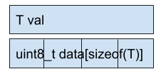
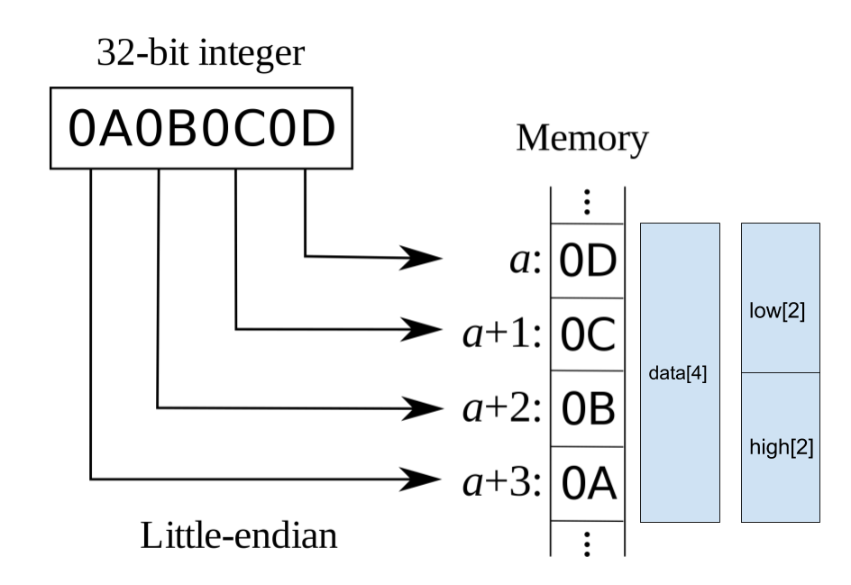
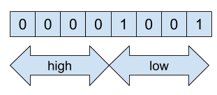

## 개요

이전에 [나머지 연산자 없이 x % 256 계산하기][blog-mod-256]과 [나머지 연산자 없이 x % (2의 거듭제곱) 계산하기][blog-mod-pot]라는 글을 썻다.
색다른 기법을 다루는 글인척 하지만 컴파일러가 이미 그렇게 동작하기때문에 니가 하는 최적화는 뻘짓이라는걸 보여주는 목적의 글이었다.
여기에서 글이 끝나면 재미없다. 위의 글을 통해 배운 기법을 이용해서 조금 더 쓸모있어 보이는 (하지만 실제로는 쓸모없는) 코드를 짜보자.

## 최상위 비트의 위치 찾기


```
1 -> 0001 -> 0
2 -> 0010 -> 1
3 -> 0011 -> 1
4 -> 0100 -> 2
...
8 -> 1000 -> 3
9 -> 1001 -> 3
...
```

양의 정수가 주어졌을때 이것의 최상위 비트를 찾아보자.
부호 문제를 신경쓰기 귀찮으니 양수 범위로만 한정하자.

쉽게 풀려면 쉽게 풀수도 있는 문제다. 그냥 반복문을 돌려서 풀수도 있다.
루프를 돌리기때문에 O(N)인것처럼 보이지만 N의 범위는 뻔하기 때문에 O(1)이나 마찬가지다.
64비트, 128비트 정수를 쓸일은 있어도 1048576비트 정수를 볼일이 얼마나 있을까?

하지만 나는 그럴싸한 뻘짓을 위해서 O(logN)으로 구현해보았다.
1048576비트 정수가 있어도 돌아갈거다. (아마도?)

## code

https://ideone.com/LdQ3qu

```cpp
#include <cassert>
#include <cstdio>
#include <cstring>
#include <cstdint>

template <int N>
int find_high_bits_in_byte_r(uint8_t x, int base_idx)
{
    uint8_t high = x >> N;
    uint8_t low = ((1 << N) - 1) & x;
    if (high > 0)
    {
        return find_high_bits_in_byte_r<N / 2>(high, base_idx + N);
    }
    else
    {
        return find_high_bits_in_byte_r<N / 2>(low, base_idx);
    }
}

template <>
int find_high_bits_in_byte_r<0>(uint8_t x, int base_idx)
{
    return base_idx;
}

int find_high_bits_in_byte(uint8_t x)
{
    return find_high_bits_in_byte_r<4>(x, 0);
}

template <int N>
bool is_greater_than_zero(uint8_t data[N])
{
    uint8_t zerofill[N] = { 0 };
    auto retval = std::memcmp(data, zerofill, N);
    return (retval != 0);
}

template <int N>
int find_high_bit_r(uint8_t data[N], int base_idx)
{
    union container_t {
        uint8_t data[N];
        struct
        {
            uint8_t low[N / 2];
            uint8_t high[N / 2];
        };
    } c;
    std::memcpy(c.data, data, N);

    if (is_greater_than_zero<N / 2>(c.high))
    {
        return find_high_bit_r<N / 2>(c.high, base_idx + N / 2);
    }
    else
    {
        return find_high_bit_r<N / 2>(c.low, base_idx);
    }
}

template <>
int find_high_bit_r<1>(uint8_t data[1], int base_idx)
{
    auto bit_idx = find_high_bits_in_byte(data[0]);
    return bit_idx + base_idx * 8;
}

template <typename T>
int find_high_bit(T x)
{
    if (x == 0)
    {
        return -1;
    }

    union container_t {
        T val;
        uint8_t data[sizeof(T)];
    };
    container_t c;
    c.val = x;
    return find_high_bit_r<sizeof(T)>(c.data, 0);
}

int main()
{
    for (int i = 0; i < 8; i++)
    {
        assert(i == find_high_bits_in_byte(1 << i));
    }

    for (int i = 0; i < 32; i++)
    {
        assert(i == find_high_bit<uint32_t>(1 << i));
    }

    assert(3 == find_high_bit<uint32_t>(0b1011));
    assert(27 == find_high_bit<uint32_t>(0b00001000'00000100'00000010'00000001));

    return 0;
}
```

x86에서 돌아가는 코드다.

## 해설

코드는 길지만 그냥 길기만 할 뿐이다.
풀어써서 길 뿐이다.

### integer -> byte array

```cpp
template <typename T>
int find_high_bit(T x)
{
    ...
    union container_t {
        T val;
        uint8_t data[sizeof(T)];
    };
    ...
```



union을 쓰면 데이터를 다른 형식으로 해석할 수 있다.
이걸 이용하면 정수를 바이트 배열로 바꿀 수 있다.
요새 회사에서 union이 없는 언어를 쓰고있는데 이런짓을 못해서 심심하더라.

### endian

```cpp
template <int N>
int find_high_bit_r(uint8_t data[N], int base_idx)
{
    union container_t {
        uint8_t data[N];
        struct
        {
            uint8_t low[N / 2];
            uint8_t high[N / 2];
        };
    } c;
    std::memcpy(c.data, data, N);
    ...
```



union을 쓰면 데이터를 다른 형식으로 해석할 수 있다.
이걸 이용하면 배열을 다른 크기의 배열로 해석할수도 있다.
union을 쓰면 특별한 작업 없이 크기가 N인 배열을 크기가 N/2인 배열 2개로 해석하는게 가능하다.

union을 보면 data를 배열 2개로 자르는데 low가 high보다 먼저 나온다.
x86이 little endian을 사용하기때문이다. 그림을 보면 이해할수 있을것이다.

### byte

```cpp
template <int N>
int find_high_bits_in_byte_r(uint8_t x, int base_idx)
{
    uint8_t high = x >> N;
    uint8_t low = ((1 << N) - 1) & x;
    ...
```



C의 기본 타입중에서는 비트를 다루는게 없다.
하지만 비트를 다루는게 불가능한건 아니다.
[C 비트 필드][msdn-c-bit-fields]를 이용하면 비트 단위에서 타입의 크기를 지정할 수 있다.

새로운 기법을 설명하기는 귀찮은 관계로 이전에 사용한 기법을 재사용하자.
[나머지 연산자 없이 x % (2의 거듭제곱) 계산하기][blog-mod-pot]의 코드를 이용하면 low를 구할수 있다.


### 전체 구조

1. 0은 걸러내기. 0을 제외하면 최상위비트가 항상 존재한다.
2. 정수를 바이트 배열로 바꾼다.
3. 바이트 배열을 반으로 잘라가면서 최상위비트가 있을 구역을 찾는다.
4. 바이트 배열을 반으로 자르다 1바이트에 도달. 비트 단위로 계산의 시작점
5. N비트를 2개의 N/2비트로 잘라서 최상위 비트가 있을 자리를 찾는다.
6. 최상위 비트를 찾았다.

## 이 코드는 쓸모있는가?

C에서 정수를 다루는 방법을 이해할때는 도움이 될거다.
그 이상의 가치는 없다.

[Find the highest order bit in C][stackoverflow-1]는 흔한 떡밥이다보니까 다양한 구현이 있고 더 효율적인 구현도 있다.
최상위 비트를 찾아내는게 성능상 중요하지 않은 프로젝트라면 더 간단한 방법으로 구현해도 된다.
최상위 비트를 찾아내는게 성능상 중요한 프로젝트라면 더 효율적인 방법을 쓰면 된다.

## 연습문제

[C 비트 필드][msdn-c-bit-fields]를 이용해서 구현하시오.


[stackoverflow-1]: https://stackoverflow.com/questions/53161/find-the-highest-order-bit-in-c
[blog-mod-256]: 
[blog-mod-pot]: 
[msdn-c-bit-fields]: https://docs.microsoft.com/ko-kr/cpp/c-language/c-bit-fields
