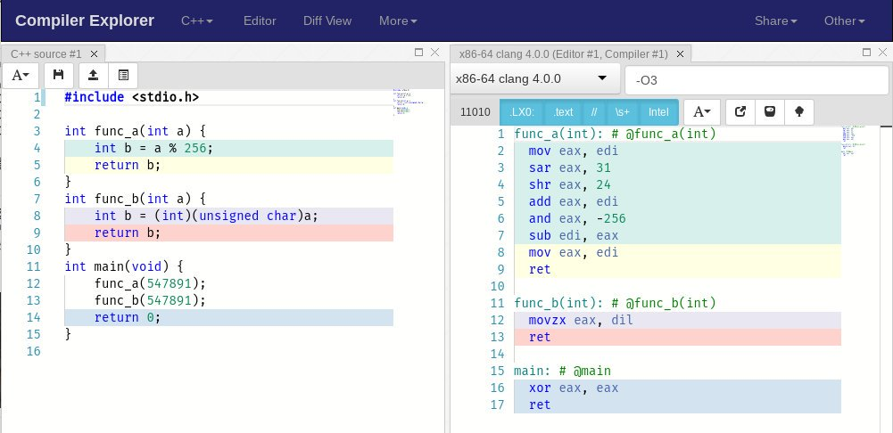

1년전, 2017년 8월 16일에 재밌는 생각이 나서 트윗을 쓴게 있다.

```
a%256 최적화 하기 : (int)(unsigned char)a
clang 기준 -O3 옵션 주면 어셈 한줄
https://twitter.com/if1live/status/897752172040929280
```



C에서 타입 캐스팅을 캐스팅 연산자라고 부르니까 이걸 다른 연산자로 쓰는게 가능하지 않을까?
그런 생각이 들어서 짜본 코드다.

그럴싸하게 정리해보려다가 귀찮아서 미룬걸 1년만에 해본다.

## 구현
https://ideone.com/ZvMaRZ

```c
#include <assert.h>

int mod_256(int x)
{
  return (int)(unsigned char)x;
}

int main()
{
  assert(mod_256(257) == 257 % 256);
  return 0;
}
```

아이디어는 간단하다.
int는 4바이트[^1]이고 unsigned char는 1바이트이다.
unsigned char의 표현 범위인 0~255이다.
int에서 0~255에 들어갈수 있는 부분만 남기고 나머지를 버린다면 그것이 나머지 연산자 아닌가?

```c
#include <assert.h>

int mod_256(int x)
{
  return (int)(unsigned char)x;
}

int mod_256_union(int x)
{
  union container_t {
    int a;
    unsigned char b[4];
  };
  union container_t c;
  c.a = x;
  return (int)c.b[0];
}

int main()
{
  assert(mod_256(257) == 257 % 256);
  assert(mod_256_union(257) == 257 % 256);
  return 0;
}
```

캐스팅을 풀어서 쓰면 위의 코드와 동일하다.
내가 필요한건 int에서 하위 1바이트이다.
x86이 little endian이라서 배열의 3번째 요소가 아니라 0번째 요소를 사용했다.


https://godbolt.org/g/TqYCTC

```c
mod_256(int):                            # @mod_256(int)
        movzx   eax, dil
        ret
mod_256_union(int):                     # @mod_256_union(int)
        movzx   eax, dil
        ret
main:                                   # @main
        xor     eax, eax
        ret
```

x86-64 clang 6.0.0 에서 `-O3` 옵션을 붙이면 두 함수는 똑같은 어셈으로 컴파일된다.
컴파일러님은 대단하시다.

## 음수

C에서 int는 2의 보수를 사용한다.
부호 정보는 최상위 1비트를 사용하며 나머지 부분은 양수일때와 음수일때 생긴게 완전히 다르다.
그래서 제대로 돌아가지 않는다.

https://ideone.com/JUX2ax

```c
#include <stdio.h>

int mod_256(int x)
{
  return (int)(unsigned char)x;
}

int main()
{
  printf("expected : %d\n", -1 % 256);
  printf("actual : %d\n", mod_256(-1));
  return 0;
}
```

```
expected : -1
actual : 255
```

`-1`은 `11111111 11111111 11111111 11111111`이다.
하위 1바이트를 뽑으면 `0xFF`이다. 그래서 255가 나온다.

나는 [음수와 나머지 연산자를 섞어쓰는 것을 싫어하지만][blog-sign-of-mod-operator] 아무튼 돌아가게 만들어보자.
C에서 나머지 연산자 계산 결과의 부호는 다음과 같다.[^2]

* C (ISO 1999) : Dividend
* C++ (ISO 2011) : Dividend

Dividend(피제수)의 부호를 따라간다고 하니까 음수일때 음수가 나오면 된다.
Dividend를 양수로 바꿔서 계산한 다음에 부호만 뒤집어주면 된다.

https://ideone.com/BVVHWy

```c
#include <assert.h>

int mod_256(int x)
{
  if (x >= 0) { return (int)(unsigned char)x; }
  else { return -(int)(unsigned char)-x; }
}

int main()
{
  assert(mod_256(257) == 257 % 256);
  assert(mod_256(-257) == -257 % 256);
  return 0;
}
```

## unsigned

음수인 경우를 생각하기 귀찮을땐 전부 양수로 만들면 된다.
int 대신 unsigned int를 쓴다면 캐스팅을 이용해서 `% 256`을 계산했을때 항상 올바른 값이 나올것이다.

```c
#include <assert.h>

unsigned int mod_256(unsigned int x)
{
  return (int)(unsigned char)x;
}

unsigned int mod_256_simple(unsigned int x)
{
  return x % 256;
}

int main()
{
  assert(mod_256(257) == mod_256_simple(257));
  return 0;
}
```

https://godbolt.org/g/E19nM6

```asm
mod_256(unsigned int):                            # @mod_256(unsigned int)
        movzx   eax, dil
        ret
mod_256_simple(unsigned int):                    # @mod_256_simple(unsigned int)
        movzx   eax, dil
        ret
main:                                   # @main
        xor     eax, eax
        ret
```

이러한 사실은 위대한 컴파일러님도 이미 알고 계신다.
캐스팅을 이용해서 `% 256`을 구현한 것과 `% 256`의 어셈이 똑같다.

## summary

괜히 이상한 코드 최적화 하지 말자.
그런건 위대한 컴파일러님이 다 해주실거다.


[^1]: 타입의 크기는 플랫폼에 따라서 다를 수 있다.
[^2]: C 표준 명세 찾기 귀찮아서 [wikipedia Modulo operation][wiki-mod] 참고
[wiki-mod]: https://en.wikipedia.org/wiki/Modulo_operation
[blog-sign-of-mod-operator]: 
