2013년 9월 25일 Oculus Rift 하나 믿고 휴가지르고 KGC에 구경갔었다. 구경한 세션/키노트는 다른것도 있지만 그런건 내가 알바 아니다. 오큘러스 관련된 내용만 정리했다.

오큘러스 관련 세션과 키노트를 각각 구경갔다. 상세 내용은 다음과 같다.

Oculus Rift를 활용한 가상현실 게임제작의 유의점
-----------------------------------------------

* 이름
    * 안주형
* 소속
    * 오큘러스VR Korea
* 강연 목차
    * Oculus Rift와 가상현실
    * Oculus Rift를 활용한 게임 개발 사례
    * 기존의 개발 방식과는 어떻게 달라야 하는가
    * 유저들에게 어떤 경험을 전달해야 하는가
* 상제 정보
    * [KGC 2013 강연정보](http://www.kgconf.com/kor/html/conference_view.html?idx=1811)
    * [this is game 참고 자료](http://www.thisisgame.com/webzine/news/nboard/4/?page=3&n=49701)

가상현실과 게임의 미래
----------------------

* 이름
    * Brendan Iribe
* 소속
    * Oculus VR Inc
* 강연 목차
    * 가상현실이란 무엇인가?
    * 어떻게 VR게임이 우리의 게임 방식을 바꿀것인가?
    * 게임시장에서 VR의 의미
    * VR은 정말로 어려운가?
    * 최근 VR의 발전 및 돌파구
    * 가상현실의 미래와 변화될 미래
* 상세 정보
    * [KGC 2013 keynote](http://www.kgconf.com/kor/html/conference_view.html?idx=1747)

내용 정리
---------

강연과 키노트를 둘다 들었는데 같은 ppt자료를 공유한 부분이 많더라. 게다가 중복된 이야기를 많이 했다. 또한 강연 난이도가 생각보다 내가 이미 알고있는 내용이 많더라. 오큘러스 개발자 킷 가지고 2달 가지고 놀면 몸으로 익힐수밖에 없는 내용이 꽤 많았다. 그래서 강연 내용 정리한거에 내가 이미 알고있는 정보를 섞어써놧다.

오큘러스 대응 게임을 개발할때는 3가지 요소를 다른 게임에 비해서 신경써야한다. UI/Simulation sickness(멀미)/latency 이다.

일반적인 FPS의 경우는 화면 구석에 UI를 배치한다. 오큘러스에서는 이 부분을 볼수없다. 이부분은 렌더링이 된다고 하더라도 오큘러스로 처다볼때 안보이는 영역이다.

이를 해결하기 위한 방법이 여러가지가 있겠지만, 팀포트리스2의 경우는 그냥 UI를 가운데로 집어넣었다.

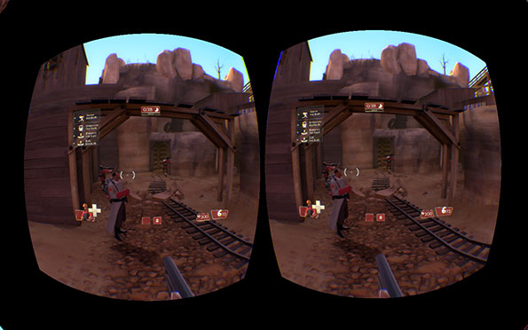

**추가사항** UI에서 그래프라든가를 표현하기 위해서 직선을 사용할떄가 있다(예를 들면 스카이림의 체력) 일반 모니터로는 깔끔하게 렌더링된다. 하지만 오큘러스에서는 직선을 꺠끗하게 렌더링하는것이 불가능하다(barrel distortion) 스카이림의 체력바는 저해상도+깨끗하지 않은 직선덕분에 은근히 신경쓰이다.

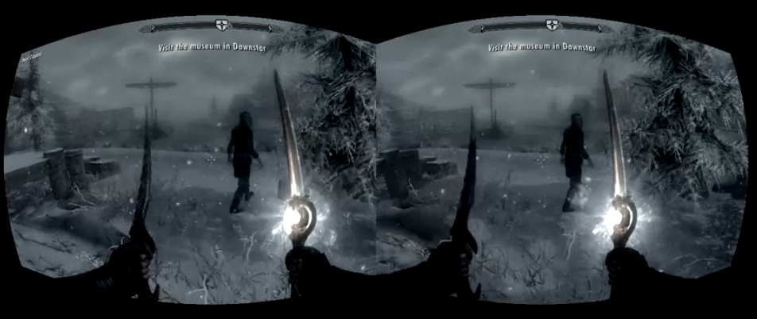

일반적인 UI를 사용하면 화면이 고정되서 머리를 움직이는데 UI가 따라 움직인다. 이경우 멀미를 발생시킬수 있다. (발표에서 예시로 사용한건 스팀의 Shift+Tab 같은거) UI에서 왼쪽위의 내용을 보기 위해서 고개를 움직이면 화면도 같이 움직여서 볼수가 없다. 고개움직이는것과 UI가 따로 움직이록 하는것이 좋을것이다.

**추가 사항** 하하하! 머리랑 UI는 따로 움직여야된다는건 이미 몸으로 당해봐서 알고있었지! 그래서 [참참참 with ouclus rift + leap motion 의 점수판](http://www.youtube.com/watch?v=MnjRdiOq26Q) 은 그걸 고려하고 만들었었지.

UI 자체에 깊이감이 존재하는 덕분에 게임의 요소를 바꿔야 될수 있다. 기존의 FPS게임의 경우는 화면 가운데 점 하나 찍고 크로스 헤어로 사용했다. 하지만 오큘러스에서는 크로스헤어조차 깊이를 가진다. 크로스헤어는 가까이에 있는데 플레이어가 멀리있는 객체를 바라보면 크로스헤어의 초점이 안맞는다. 반대로 크로스헤어에 초점을 맞추면 멀리있는것이 초점이 안맞는다(눈앞에 손가락 두면 배경이 잘 안보이는거같은 느낌) 크로스헤어가 ray-casting을 해서 크로스헤어의 깊이와 해당 방향의 깊이를 일치 시키면 해결할수 있다.

**추가사항** [irrlicht 3d engine 의 tutorial 7: collision](http://irrlicht.sourceforge.net/docu/example007.html) 같은 느낌으로 구현하면 될듯? 참고로 serious sam 1편의 경우 깊이에 따라서 크로스 헤어의 크기/위치 달라진다. 대충 이런 느낌으로 하면 될듯?

**추가사항** 크로스 헤어를 전방 2m에 그리도록 했다. 그리고 벽 바로앞에 선다. 크소르헤어 렌더링할떄 깊이 체크를 하지 않으면 크로스 헤어가 벽 2m 안쪽에 렌더링된다. 덕분에 말로 표현하기 애매한 기분을 맛볼 수 있다.

이상적인 UI의 예제로 등장한거는 다음과 같은거다

call of duty : black ops 메인메뉴. 의자에 앉은 상태로 고개를 움직이면 둘러볼수 있고 UI는 TV를 통해서 보여준다.

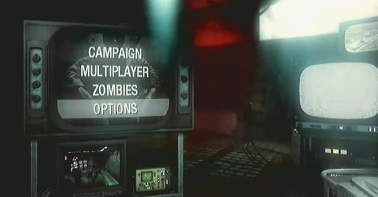

dead space. 등짝에 기본 UI가 표시되고 조준성이 레이저 같은 느낌으로 표시된다. HUD를 안넣은게 적절

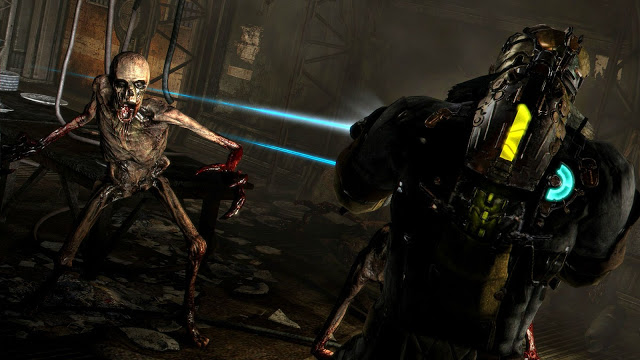

dead-space의 상점 UI. MMORPG 처럼 별도의 UI를 띄우는것보다 게임안에서 전부 처리할수 있다면 그쪽이 더 낫다.

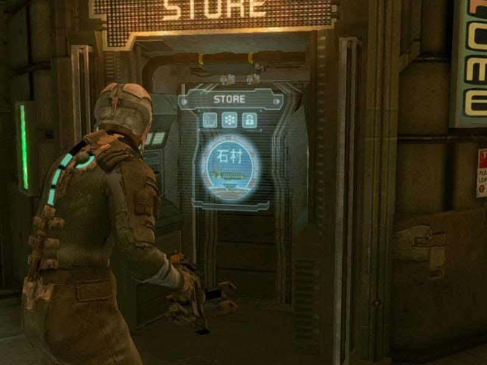

**추가사항** doom 3 : 개인적으로는 04년작주제에 UI 관련 연출은 08년작 데스스페이스보다 잘 만들었다고 생각하는 게임. 게임내부에 UI만으로 여러가지 조작이 된다. 스위치 앞에 가서 E만 누르면 문이 열리는게 아니라 스위치에서 버튼을 직접 클릭해야한다. 얼마나 미친 물건이냐 하면 [Arkanoid](https://www.youtube.com/watch?feature=player_detailpage&v=IcnUkMGstNc#t=213) 를 게임안에 구현해놨다(시간 이동 안되면 3분 30초 참고) 이 좋은 UI시스템이 퀘이크4로 가면 줄더니 RAGE로 가면서 완전히 사라진게 아쉽다. 이것과 관련해서는 [Fully Interactive Surfaces In DOOM3](http://www.battleteam.net/tech/fis/docs/) 를 읽어보자.

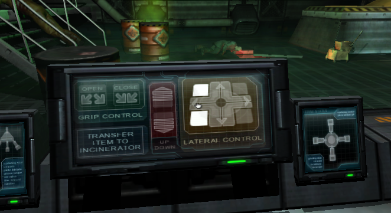

the division : UI로 표시할 내용을 게임안에서 layer 로 표기하는것도 괜찮은 방법일듯?

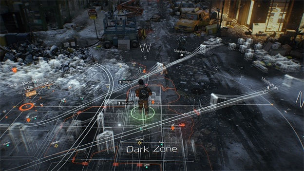

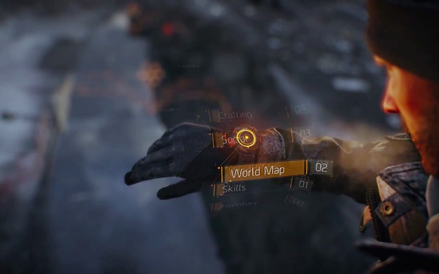

H.A.W.K.E.N : 탑승물 기반의 게임이면 HUD도 적절할거다. 단, 이 경우 조준점과 물체 사이의 초첨조절이 어색할수 있으니 HUD를 반투명으로 하는것도 고려하기

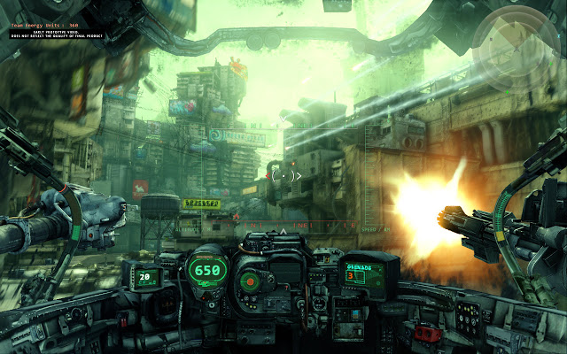

**추가사항** wing commander의 경우 탑승자 시점의 HUD를 제공했엇다. 요즘세상에 와서 저 UI를 다시 보면 중요한 내용(실제 게임화면)이 스크린의 절반만 차지하고 나머지 절반이 그다지 중요하지 않은 HUD이다. Dirt3 운전자 시점을 보자. 이것 역시 탑승자 시점이다. 중요하지 않은 내용(차체)를 렌더링하는라고 중요한 부분(게임 화면)이 매우 줄어들었다. Dirt3 3인칭 시점에 비해서 게임에 중요한 내용(시야)이 많이 보이질 않는다.

탑승자 시점+HUD의 도입으로 현실감을 줄수있지만 그 대가로 사용가능한 게임 화면이 줄어드는것도 생각해 봐야할거다.

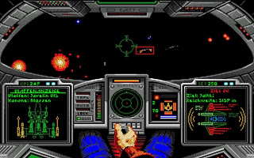

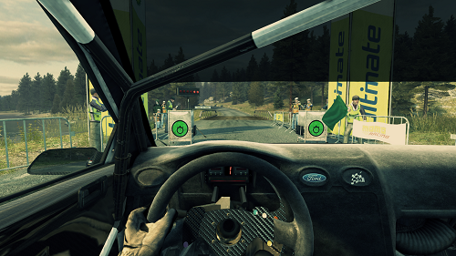

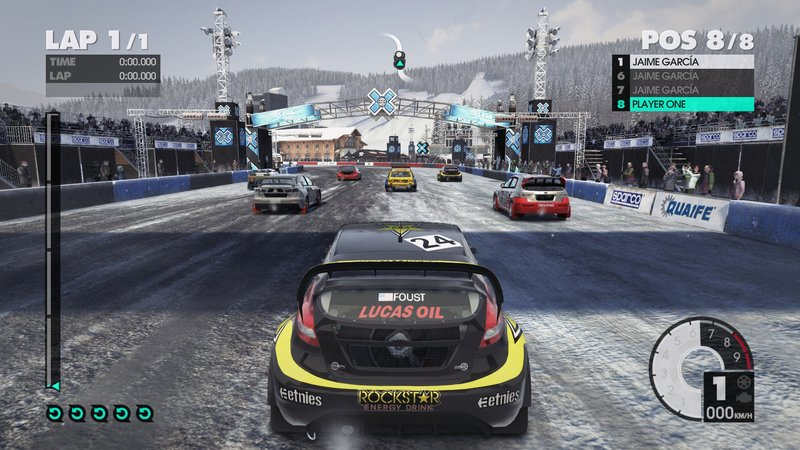

iron man : HUD 시점. 깊이를 잘못 조절하면 유저는 멀리있는곳(게임)을 보다가 가까운곳(HUD)를 보는 일을 반복해서 눈이 쉽게 피곤해질수 있다.

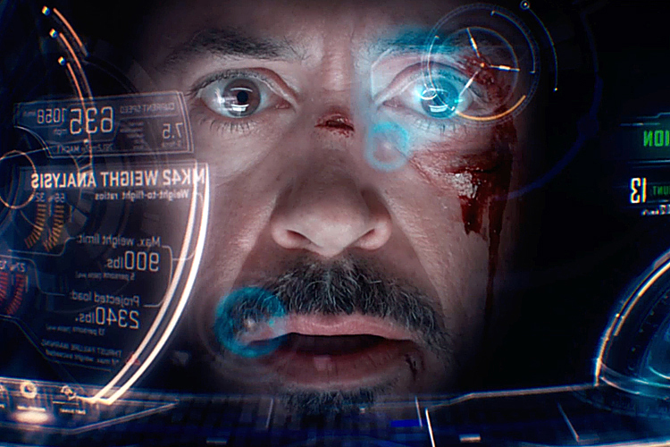

현재 oculus rift의 해상도가 그렇게 높지 않기 떄문에 많은 UI요소가 들어가면 망하는 지름길이다. 글자만 하더라도 많이 집어넣으면 폰트크기가 작아질텐데 이 경우 해상도 문제로 읽을수가 없다.

다음으로 멀미와 관련된 사항을 정리하자.

멀이와 가장크게 관련된 요소는 **head tracker의 정밀도/latency** 이다. 머리가 움직인것보다 느리게 눈이 움직이면 당연히 문제가 생기겠지.

또한 개인차가 심하다(나만 해도 오큘러스 처음 삿을때는 둠3 5분만헤도 토할거같은 기분이었지만 이제는 그런거 못느낀다)

멀미를 줄이기 위해서는 게임디자인 자체도 신경써야될거다. 측면 움직임을 줄여야한다(wsad중에서 ad) 앞뒤로 움직이는것보다 멀미를 일으킬 가능성이 높다.

걷거나 뛸때 머리 높이/움직이는 속도 자체가 등속도+동일높이가 되지 않고(사람은 등속도로 못걸어간다. 뛰어가면 머리 위치가 위아래로 움직이다) 자연스럽게 하면 조금더 나을거다 (fps에서 어깨춤이 심하면 멀미나는거랑 비슷한 느낌)

계단을 올라가는것보다 그냥 경사를 집어넣자. 계단을 올라가면서 높이 증가하는게 Discrete하면 멀미 느낄 가능성이 높다. 경사를 집어넣을 경우 기울기를 낮추자. 머리가 위아래로 심하게 움직이면 멀미하기 쉽다.

FPS시점의 카메라가 아닌 제3의 카메라가 등장하는 컷씬은 넣지 말자. 몰입감 떨어지고 멀히하게 쉽다(유체이탈도 아니고....)

플레이어가 고개를 움직이면 자신의 몸통이 보이게 한다. (일단 FPS의 경우는 안보이는 영역을 렌더링하니까 전혀 신경 안쓰지만 오큘러스로 가면 나==플레이어의 느낌을 심어줄수 있다. TF2의 경우 구현되어있다) 또는 cockpit 시점도 적절할거다(의자에 앉아서 게임을 한다==cockpit에 앉아있다 라는 느낌)

Latency 관련으로 신경쓸거는 다음과 같다(여기의 내용은 oculus sdk의 문서랑 중복되는 내용. 그쪽을 참고하는게 더 좋을거다)

latency의 목표는 7~20ms이하로 유지하는거다. 이정도면 뇌가 인식하지 못한다고 한다.

게임은 최소한 60fps로 작동하게. 90~120fps면 더 좋다.

super-sampling은 반드시 써라. oculus rift 자체의 해상도가 낮다보니까 이거없으면 많이 티난다. (Oculus rift demo를 몸으로 직접 체엄해보면 안다 -_-)

vertical sync는 켜라. tearing은 막아야한다 (일부 유니티 기반의 데모가 vsync를 신경쓰지 않아서 tearing 발생하더라.. 일루젼의 데모라던가 일루젼의 데모라던가...)

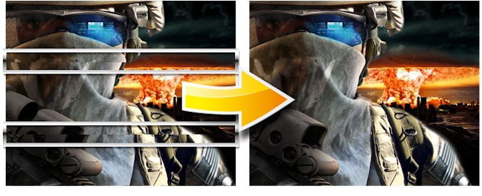

렌더링/로직 쓰레드 분리하기. 렌더링 성능 올릴떄는 역시 이게 낫겟지. (근데 난 아직 안해봣잖아? 삽질 하겟네...)

또 다른 게임 만들떄 신경 쓸 사항은 현장감이다.

플레이어의 높이(height)를 생각해야한다. 게임할때 나는 앉아있지만 캐릭터는 서서 돌아다닌다. 창문, 문등의 크기는 현실적으로 만들어야 현실감이 느껴진다(**추가사항** FPS 레벨디자인 책을 보면 길막을 한다거나 문을 쉽게 지나가기 위해서 현실의 문보다 크게 설정한다고 이야기한다. 실제 게임 개발할때는 이 부분도 신경써야될 듯)

거리감(Distance)도 중요한 요소이다. 허공에 물체가 있으면 대체 이게 얼마나 멀리 떨어져있는지, 얼마나 거대한 물체인지 감이 잘 오지 않는다. 비교대상이 중요하다.

크기(scale)도 중요한 요소이다. 큰 공간보다 작은 공간에서 입체감이 더 느껴진다. 거대한 적의 경우는 일반 FPS보다 더 크게 느껴진다(시리어스샘 같은거 만들면 쩔겟네)
