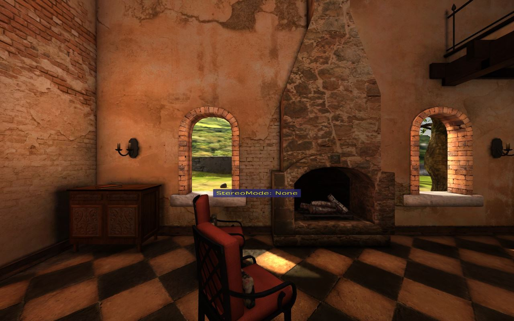
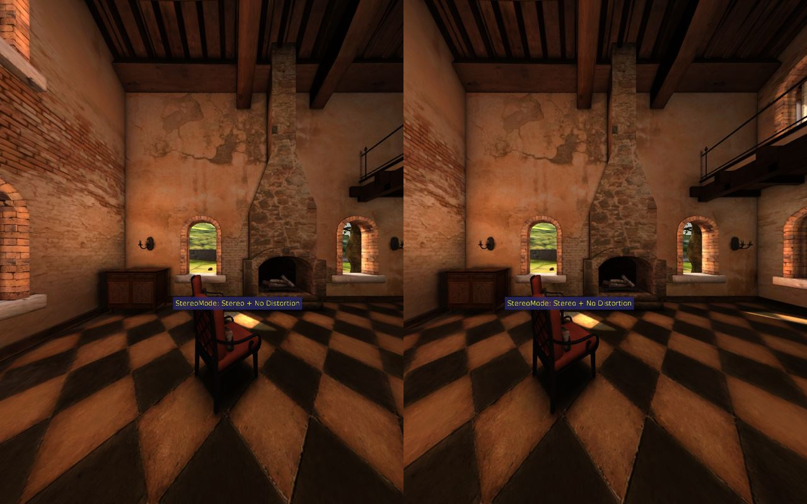
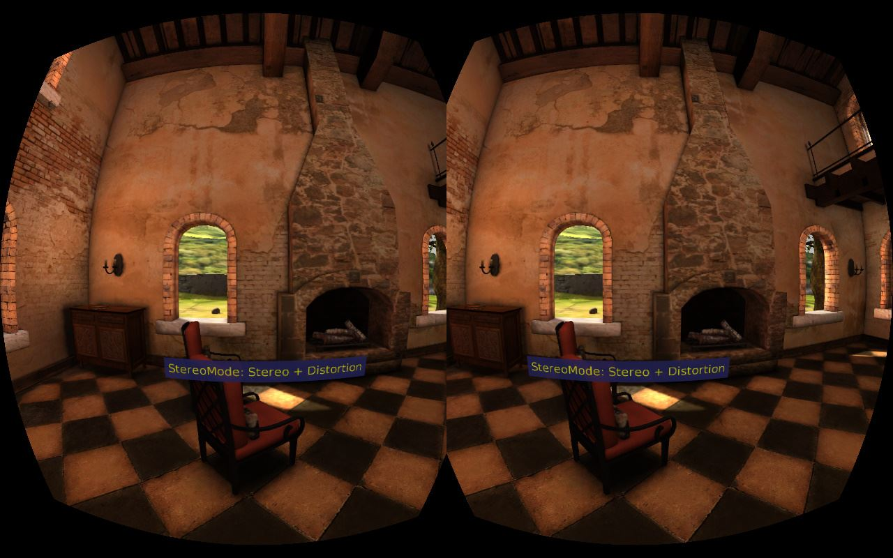

## 개요

오큘러스 대응해서 뭔가를 계속 개발하고 있는데 내가 가고 있는 길이 맞는
길인지 나도 확신을 못해서 정리해볼겸 써봤다. 제목은 거창하게 2014년
예측이지만 내가 게임 개발로 먹고사는 사람도 아니고 VR 관련 업종 사람도
아니고 그냥 취미로 오큘러스를 만지는거다보니까 얼마나 최근 트렌드를
따라가는지는 모르겠다.

2014년을 예측한 방법은 간단하다.

1.  현재의 제약조건이 무엇인지 정리한다. 가능한것과 불가능한것을
    명확해야 예측도 조금은 정확한 질테니까...
2.  남들은 뭐 만들고 있는지 찾아본다. 어차피 사람 생각하는게 다
    비슷할테니까 내가 생각하는 방향이랑 남들이 생각하는 방향이랑 그렇게
    크게 차이나진 않을것이다.
3.  위의 조건을 조합해서 내년에 나올 게임(또는 내가 앞으로 만들 게임)의
    범위를 잡아봤다. 내가 만들려고 생각한 게임이라면 아마도 남들도
    비슷한 생각하고 있겟지?

## 컴퓨터 사양

일단 내 컴퓨터 사양부터 간단히 적는다. (다른 컴퓨터로는 테스트해보지
않았기때문에 FPS가 얼마나 나오는지는 나도 모른다)

-   CPU : AMD A8-3850
-   RAM : DDR3 10600 8G
-   VGA : 6550D + HD6750 dual graphics (거창하게 썻지만 HD6750보다 조금
    좋은 수준으로 생각하면된다)

참고로 OculusSDK 개발문서를 보면 개발할때 사양이 이정도면 되겠다라는
이야기를 한다.

> If you are looking for a portable VR workstation, we’ve found that the
> **Nvidia 650M** inside of a MacBook Pro Retina provides enough
> graphics power for our demo development.

[High End Video Card Chart](http://www.videocardbenchmark.net/high_end_gpus.html)
을 보면 HD6750(1,322)과 650M(1,297)의 점수가 그렇게 차이 안난다. 아무래도 내
컴퓨터가 오큘러스 개발하기에 그렇게 나쁜 기계는 아닌거같다. 니컴이
후져서 이상한 결론이 나온거라는걸 피하려고 명시한다.

OculusRift에 맞게 렌더링하기 위해서는 일반적인 렌더링보다 계산을 많이
해야한다. 대략 **3가지 계산** 이 추가적으로 들어간다고 보면된다.
첫번쨰는 **왼쪽눈, 오른쪽눈으로 각각 렌더링** 해야 된다는거다. 두번째는
**Barrel Distortion** 을 적용해야한다는 점이다. 현재는 Pixel Shader를
이용해서 구현하는데 Pixel Shader는 원래 성능 많이 까먹는다. 세번째는
**Anti-Aliasing(이하 AA)** 이다. 오큘러스는 저해상도이기 때문에
계단현상이 심하게보인다. 이를 숨기기위한 AA가 선택이 아니라 필수다.
각각의 추가 계산이 들어감에 따라서 FPS가 어떻게 변하는지 알아보자.

**No Stereo** 일반적인 게임에서 사용하는 카메라

**Stereo without barrel distortion** 양쪽눈을 각각 렌더링. GPU 성능을
한쪽눈일 때보다 2배는 사용한다. 아래의 표에서는 **Stereo** 라고 썻다.

**Stereo with barrel distortion** 이렇게 렌더링을 해야 오큘러스 뒤집어
쓰고 적절히 보인다. 아래의 표에서는 **Oculus** 라고 썻다.

내 컴퓨터에서 OculusSDK 0.2.5 안에 포함된 샘플인 OculusWorldDemo를
실행하면 나온는 위치에서의 FPS를 정리한 표이다. 적절히 1980x1080으로도
돌려서 실행시의 FPS도 얻었다. 표 안의 FPS수치는 **No MSAA FPS(MSAA FPS)** 로 쓴 것이다.

|Resolution  | No Stereo | Stereo   | Oculus |
|------------|-----------|----------|--------|
| 1280x800   | 201(156)  | 160(126) | 97(41) |
| 1920x1080  | 160(124)  | 138(108) | 68(24) |

FPS변화의 자료를 보면 No Stereo -&gt; Stereo -&gt; Oculus 로 가면서 점점
프레임이 떨어진다. 위에서도 말했듯이 계산과정이 하나씩 늘어나는거니까
당연한거다.

일반렌더링이 가장 빠른건 당연한거다. 추가 계산이 없으니까 당연한거다.

Stereo Rendering은 No Stereo Rendering보다 대략 83%(1280x800=79.6%,
1920x1080=86.25%) 수준의 프레임이 나온다. 2번 렌더링한다고 성능이
반토막 나는건 아니지만 내가 처음 생각했던것보다는 프레임이 많이 떨어지지
않더라.

Stereo Rendering에서 Oculus Rift Rendering(Barrel Distortion)으로
넘어가면 프레임이 눈에 띄게 떨어진다. Stereo 대비 55%(1280x800=60.6%,
1920x1080=49.2%) 정도의 프레임이 나온다. Pixel Shader를 이용해서 Barrel
Distortion을 구현한것이 성능을 많이 까먹는거같다.

하지만 MSAA가 적용되면 경향이 달라진다. No Stereo와 Stereo를 비교하면
83%(1280x800=80.7%, 1920x1080=87.0%) 정도로 FPS가 떨어진다. 이것은
MSAA가 없을떄와 동일하다. 하지만 Stereo에서 Oculus를 비교하면
25%(1280x800=32.5%, 1920x1080=22.2%) 정도로 MSAA가 없을때에 비해서
FPS가 폭락한다.

정확힌 이유는 내가 그래픽스 전문이 아니라서 모르겠지만 자료를 봣을떄는
MSAA와 복잡한 계산이 있는 Pixel Shader는 상성이 안좋은거같다. 이 문제의
해결책은 현재 2개정도인거같다.

하나는 Barrel Distortion을 Pixel Shader가 아닌 다른 방법으로 구현하는
것이다. [Optimizing the barrel distortion](https://developer.oculusvr.com/forums/viewtopic.php?f=17&t=1341&p=15201#p15201)
에서는 vertex shader를 이용해서서 구현하는 삽질을 한거같더라. (테스트는
해보지 않았다) 다만, Barrel Distortion을 구현하는 방법을 바꾸는것은
C++로 오큘러스 개발하는 경우에만 사용 가능하다. Unity3D용 OculusSDK를
쓰면 오큘러스에서 적절히 구현해주기 전까지는 손댈수가 없다.

다른 하나는 시간이다. 평균 PC사양이 올라갈때까지 기다리는거다. 시간이
지나면 지날수록 평균 PC사양은 올라간다. 과거의 고사양게임을 현재는
보급형컴퓨터로 할 수 있는것과 같은 이치이다.

멀미
----

OculusRift에서 멀미는 피랄수 없는 문제이다. 멀미의 원인은 3D멀미와
latency이다.

3D멀미는 멀미가 덜 나는 게임을 만들어서 피할 수 있다. 기획을 적절히
해야한다. 여담으로 [Share Oculus](https://share.oculusvr.com/) 에서 게임
정보를 보면 **Comfort Level** 라고 얼마나 VR환경에서 편하게 할수있는지
적는 항목이 있다. 게임 기획에 따라서 편차가 크다 보니까 이런 항목을
넣은거겠지.... 3D멀미 덜나는 게임에 대해서는 더 이상의 자세한 설명을
생략한다.

Latency는 크게 3가지 문제로 발생한다.

첫번째는 HeadTrakcer의 반응속도가 사람보다 느리기때문이다. 아무리 빨리
인식해봤자 HeadTracker가 인식-&gt;로직처리-&gt;렌더링을 거치면 1프레임은
걸릴테니까 16ms의 딜레이는 피할 수 없다. 이를 떔빵하고자 OculusSDK에는
**Predictive Tracking** 이 들어가있다. 현재까지의 head tracker의 입력을
기반으로 미래의 값을 예측하는거다. OculusSDK 문서에 따르면 50ms까지
예측이 가능하다고 한다. 이 문제는 SDK에서 제공하는 기능을 잘 이용하면
해결할 수 있을 것이다.

두번쨰 문제는 낮은 FPS이다. **컴퓨터사양** 항목에서도 언급했듯이
오큘러스로 게임을 하려면 고사양컴퓨터가 필요하다. 없으면? 게임이 끊겨서
멀미나 날수밖에 없다. 문서에서는 60FPS로 안정적으로 돌아가야할것이라고
되어있다.

세번째 문제는 OculusRift 비디오 출력에서 밀리는거다. 지금은 Development
Kit라서 그런지 모르겠지만 모니터/오큘러스를 디스플레이 복제로 해놓고
게임을 하면 모니터에서는 아무 문제도 없는데 오큘러스에서는 출력이 좀
느려서 motion blur처럼 보이는 느낌도 들고 tearing도 발생하는 기분이
들더라. 아마도 소비자용이 나오면 해결될테니까 큰 문제는 아닐거다.

엔진
----

[share-oculus-vr](https://share.oculusvr.com/) 에서 남들이 만든 예제를
찾아서 돌려봤다. 기조에 존재하는 게임에 오큘러스 지원을 붙인
경우(half-life2, Team Fortress2, minecraft...)를 제외하면 사실상
유니티가 대세다. UDK, 자작엔진, 기타엔진은 거의 안보이다. 아마도 다음과
같은 이유로 유니티 대세가 되지 않았을까 하고 생각한다.

1.  오큘러스 개발자키트에 유니티 프로 4개월 이용권이 끼어있다.
2.  유니티를 쓰면 자작엔진보다 개발속도가 빠르다. 오큘러스 나온지 얼마
    안됬으니 자작엔진으로 삽질하던 애들은 아직 공개할만한 퀄리티에
    도달하지 않은거같다. (나도 그랬고...)
3.  UDK의 경우 오큘러스 공식지원이지만 버전 올라가는 속도가 느리다.
    OculusSDK 최신버전이 0.2.4일떄 혼자 0.1.X까지만 공개되어있었다. 현재
    OculusSDK는 0.2.5인데 UDK 지원버전은 0.2.4까지만 공개되어있다.
    (그래도 지금은 웹에 공개라도 되어있지, OculusRift 초창기때는 메일로
    연락해야 UDK지원버전 준다고 했엇다)
4.  [Other Engine
    Integrations](https://developer.oculusvr.com/forums/viewforum.php?f=39&sid=ee6dc94fe9d9df2d00f2e6e7a97e63f8)
    에서 다른 엔진 지원관련해서 사람들이 삽질하긴하는데 애당초 다른
    잡탕엔진 사용자가 유니티에 비하면 그렇게 많지 않은거같다.

유니티가 대세인건 2014년에도 바뀔 이유가 없으니까 그대로 유지될 것이다.

결론
----

-   사양문제로 인해서 그래픽이 캐쥬얼한 느낌(혹은 단순한 느낌)으로 많이
    나올것이다
-   멀미 문제로 이래서 기존의 FPS는 잘 안나올것이다. (기존의 FPS는
    머리흔들일이 많아서 오큘러스 뒤집어 쓰고 하면 멀미하기에
    적절하다 -_-) FPS라고 해서 나와도 게임의 흐름이 느린 게임이
    나올것이다
-   게임의 흐름이 느린 어드벤쳐, RPG가 흥할것이다. 특히 Adventure는 기존
    PC플랫폼에서 사실상 죽은 장르인데 오큘러스를 통해서 다시
    살아날지 모르겠다.
-   유니티 기반으로 계속 나올것이다

[Share Oculus](https://share.oculusvr.com/) 에서 남들이 뭐 만들지는 계속
감시하고 있어야한다. 남들이 실험하는거 보고 있으면 참고할것도 있고 내가
생각했던거랑 비슷한거 만드는거보면 재밌더라.

p.s : 다른 측면(체감형게임, 분위기,...)도 생각은 해봤는데 글로 쓸 정도로
머리속에서 정리되어있지 않아서 생략한다.
