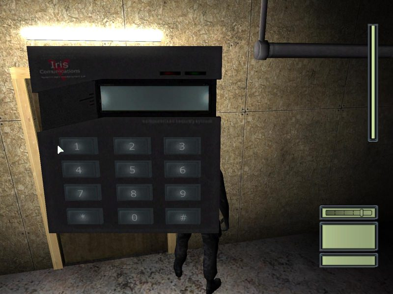
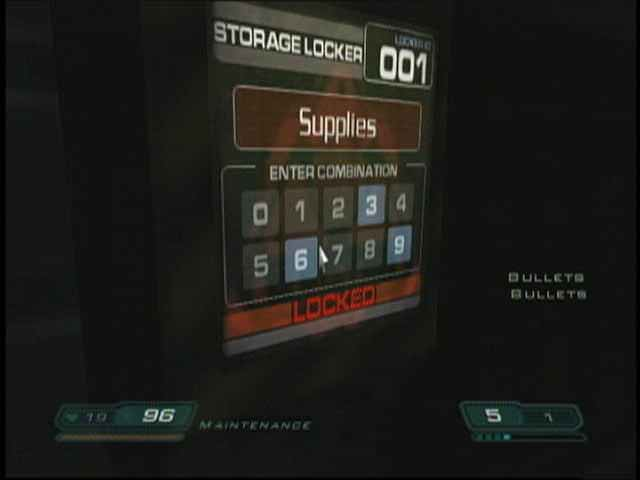
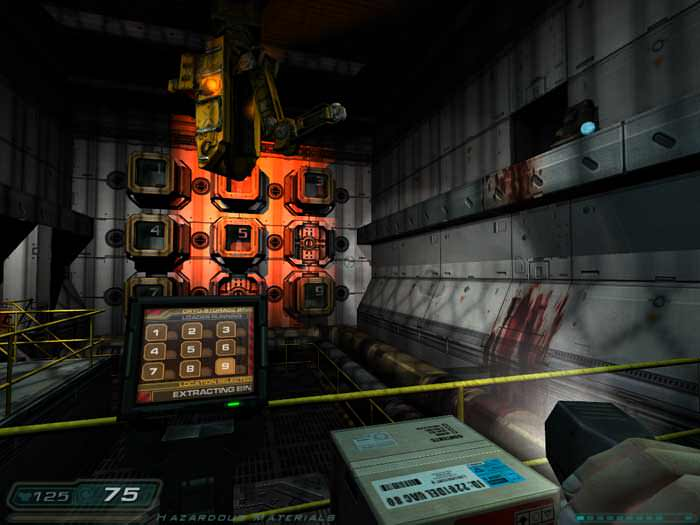
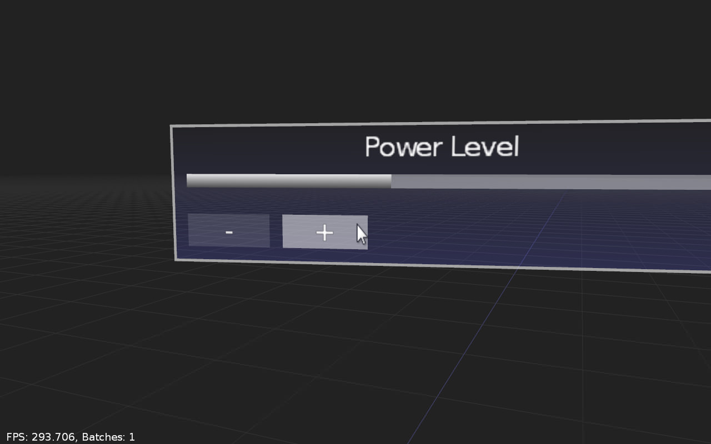
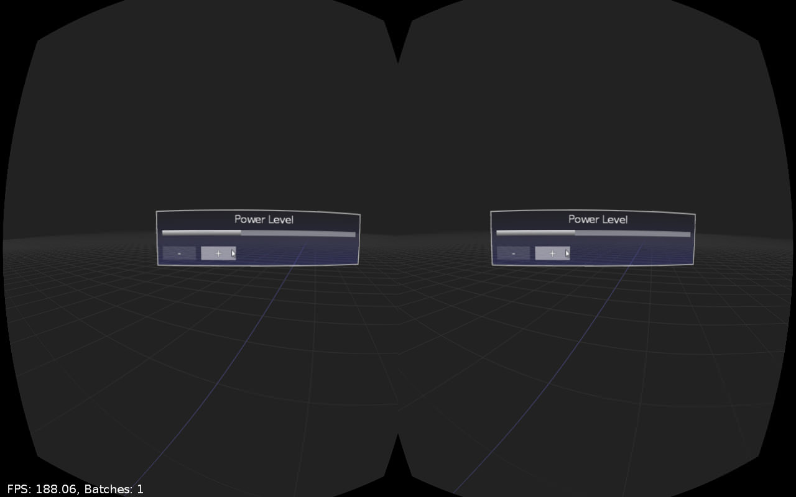
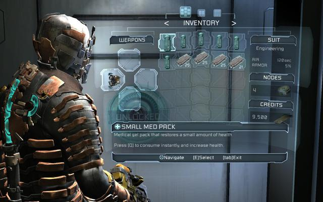
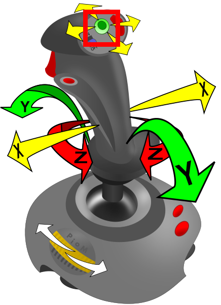
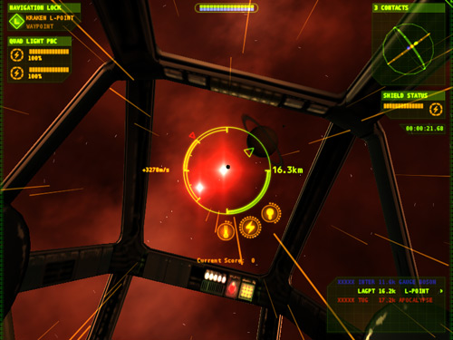

이전부터 계속 만들어보고 싶었던 Doom3 같은 느낌의 3D GUI 데모를 만들어봣다

목표
----

Oculus SDK와 적절히 결합시키기. 다른 엔진에서 오큘러스를 지원하도록 만든 코드를 보면 렌더링만 오큘러스 대응하거나 최초에 실행될떄만 HeadTracker를 인식하도록 되어있는거 같더라(적어도 내가 본 ogre, irrlicht 구현체는 그랬다) 얼마전에 Oculus SDK를 뜯어본김에 Oculus SDK랑 제대로 붙여보기로 했다. 제대로 붙이면 런타임 중에 HeadTracker를 뻇다꼇다해도 정상적으로 작동한다.

3D GUI 를 적절히 돌려보자. 목표는 DOOM3 같은 느낌의 UI 만드는거다. 왜 자꾸 DOOM3 같이 만들고 싶어하는가?

다음은 스플린터 셀에서 문 비밀번호를 찍는 UI이다. 뒤에 게임화면이 있고 새로운 HUD로 비밀번호를 찍는게 나온다.

다음은 DOOM3에 등장하는 키패드이다. 화면안에 마우스가 뜨고 잘 움직여서 숫자를 누르면 된다.

어느쪽 UI가 더 몰입감 있을까? 또한 오큘러스에 더 잘 어울릴까?

개발과정
--------

1.  Ogre, LibOVR, [gorilla](http://www.ogre3d.org/tikiwiki/Gorilla) 를 준비한다.
2.  ????
3.  PROFIT!

[gorilla](http://www.ogre3d.org/tikiwiki/Gorilla) 를 3d gui를 만드는 도구로 선택한 이유는 그럴싸한 샘플이 이미 있기 때문이다.

<iframe width="420" height="315" src="https://www.youtube.com/embed/e78Hfo5rIyU" frameborder="0" allowfullscreen></iframe>

샘플를 적절히 손봐서 만들어봤다.

<iframe width="420" height="315" src="https://www.youtube.com/embed/-8AOYWkNz1Y" frameborder="0" allowfullscreen></iframe>

사용법
------

[release](https://docs.google.com/file/d/0BxRfWUmEuMJxYnI0WTVsUHR1cEU/edit?usp=sharing) 를 받아서 실행하면 아마 될거다. 안되면 [release](https://docs.google.com/file/d/0BxRfWUmEuMJxYnI0WTVsUHR1cEU/edit?usp=sharing) 의 리소스와 [repo](https://github.com/shipduck/kuuko/tree/79bb2957d2923571e51a8ef198937828b8f0a365) 의 소스를 적절히 조합해서 컴파일하면 된다.

-   F5 : 일반 렌더링
-   F6 : Stereo Rendering without Barrel distortion
-   F7 : Stereo Rendering with Barrel distortion. 오큘러스 지원하는 렌더링이다.
-   wasd : 이동
-   마우스 좌클릭/엑박패드 기준 A버튼 : GUI에서 버튼 클릭

남들은 일반/오큘러스 렌더링을 런타임에서 갈아끼울수 있는건 별로 신경 안 쓰는거같던데(신경을 썻으면 남들이 짠 코드에 기능이 있으니 내가 따로 손볼 필요가 없겠지...) 있으면 개발할때 유용하다. quake like console을 달 수 있고(oculus 렌더링에서는 해상도가 딸려서 달아봐야 좋은거 없다) 더 높은 해상도이고, 어차피 3D 개발할떄는 오큘러스가 항시 필요한거는 아니니까...

소감
----

2가지 측면(입력/출력)을 나눠서 봐야한다. 사용해본 느낌은 각각이 극단적이다.

### 출력

해상도가 낮다는것 이외에는 아무런 문제가 없다. 매우 적절하다. 내꺼가 DK1이라서 1280x800 이라서 해상도 낮은게 많이 티나는거고 나중에 HD뜨면 별 문제 없을거같다. 앞으로 개발할때 자주 이용해야겠다.

### 입력

DOOM3의 방식(게임안에 모니터가 있고 모니터안의 커서를 잘 움직여서 버튼을 조작한다)은 오큘러스 대응으로는 쓰기 어렵다. 고개를 상하좌우로 잘 움직여서 커서를 모니터의 버튼안에 배치하는게 귀찮고 어렵다. GUI안에서 머리로 커서를 조정하는것보다는 게임패드를 이용해서 GUI를 조작하는게 훨씬 쉽겠다. **어쨋든 커서를 넣으면 망한다**. 아무런 생각없이 둠3의 GUI를 그대로 옮겨오면 문제가 생기겠다.

대안으로 다음에 테스트 해보려고 하는건 **입력 상태를 2개(FPS/GUI)** 로 나누는거다. 목표는 DOOM3의 방식에서 커서를 완전히 제거하는거다. FPS모드는 일반적인 FPS이다. 고개 움직이는거로 적절히 처다보고 게임패드를 이용해서 시야/이동을 통제한다. GUI모드에서는 고개를 움직이면 처다보는 시야만 움직이다. GUI 내부 조작과는 무관한다. 게임패드를 이용해서 GUI를 조작한다. 이 상태에서는 게임패드로 캐릭터를 움직일 수 없다. 그리고 USE키를 이용해서 입력GUI앞에서 FPS모드&lt;-&gt;GUI모드를 바꿀수있다. **생각해보니 DeadSpace GUI..?**

또 다른 대안은 커서를 없애고 **USE키를 여러개** 쓰는거다. GUI를 조작할수 있는 범위(GUI 콘솔 앞)으로 이동하면 Hat Switch(POV Hat라고도 부른다. 아날로그 방향키)의 역할을 GUI조작용으로 바꾸는거다. 내부 GUI를 4방향키로 조작할수 있을정도로 간단하게 만들고 평소에 Hat를 잘 안쓰도록 하면 큰 문제가 없을거같다. 이렇게 하면 고개를 움직이는게 GUI를 보기 위한 용도로만 쓸 수 있고 FPS모드/GUI모드를 분리할 필요가 없으니 GUI조작중에 뒤에서 공격받아도 빨리 대응할수 있을것이다. (데드스페이스 할때 GUI처다보고 있는데 공격받으면 빡쳤음...)

Hat Switch란?

[Independence War 2: Edfe of Chaos](http://en.wikipedia.org/wiki/Independence_War_2:_Edge_of_Chaos) 의 경우 Hat Switch로 게임내부 GUI를 조작할수 있도록 했다. 그래서 키보드로 손이 갈 일이 없어서 매우 편하다.

p.s. 이미 DOOM3:BFG Edition이 있어서 둠3를 오큘러스로 해봤었지... 안만들고 그거 다시 플레이 해봤어도 소감은 썻겠다. -_-
