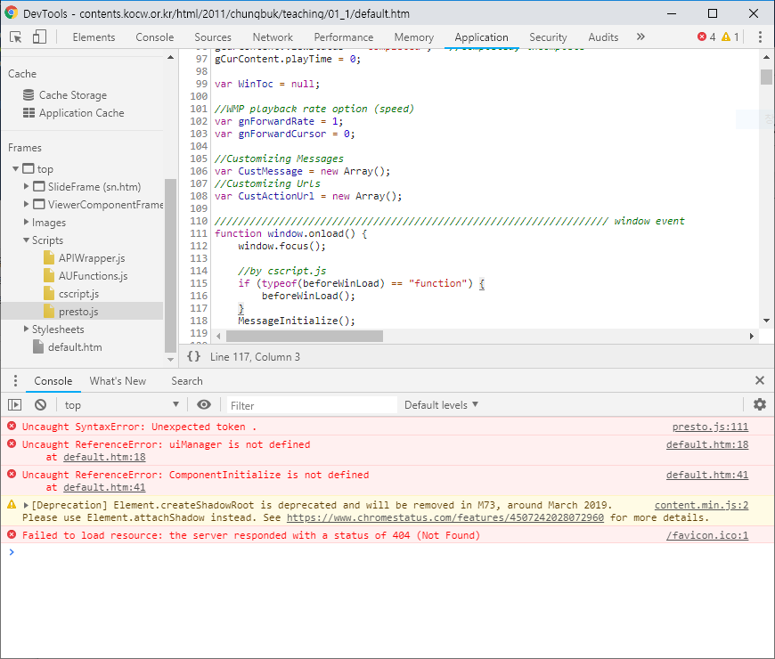
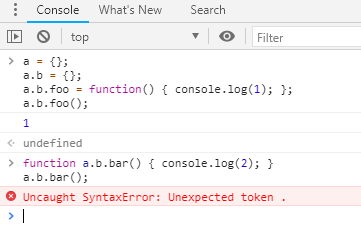
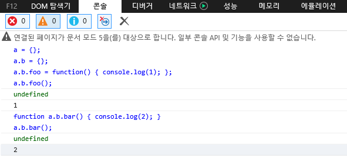

## 개요

[KOCW][kocw-index]를 통해서 [집합론][kocw-set]을 공부하기 시작했다.
동영상 강의 보기를 눌렀더니 크롬에서는 안돌아가더라.
액티브엑스 기반 강의라고 붙어있더니 역시나 크롬에서 안되는거같더라.
그래서 익스플로러를 켜고 인강을 들어갔다.
IE로도 동영상 강의가 나오지 않더라.
왜 안돌아가나 확인해가 위해서 크롬 개발자 도구를 켰더니 이런 코드가 있더라.



```javascript
function window.onload() {
    ....
}
```

잉? 함수 이름에 `.` 들어가는게 가능했어?
이런 코드는 처음봤다.
처음보는 황당한 코드, 한때는 잘 돌아갔던 프로그램, 답은 뻔하다.
**IE 구버전**.
IE 호환성 모드를 켜고 인강을 켜니까 잘 돌아갔다.

IE 구버전에서만 해당되는 문제니까 이제와서는 아무짝에도 쓸모없지만 재밌는 현상이길래 글을 써봤다.

## 문제가 발생하는 코드

브라우저 개발자 도구를 켜고 아래의 코드를 넣으면 잘 돌아간다

```javascript
a = {};
a.b = {};
a.b.foo = function() { console.log(1); };
a.b.foo();
```

하지만 아래의 코드는 아마 안돌아갈거다.

```javascript
function a.b.bar() { console.log(2); }
a.b.bar();
```

크롬의 경우 `Uncaught SyntaxError: Unexpected token .` 라는 에러가 발생한다.
함수이름에 `.`이 들어가는게 문법적으로 올바르지 않나보다.



하지만 IE 호환성 모드를 활성화하면 잘 돌아간다.



## 원인

IE 구버전은 옛날 물건이다.
요새 자바스크립트 스펙으로 IE 구버전을 공격하는건 너무하잖아?
1997년에 작성된 [ECMA-262 1판][ECMA-262]을 보자.

`13. Function Definition` 에 함수의 문법 정의가 있다.

```
FunctionDeclaration :
    function Identifier ( FormalParameterListopt ) Block
```

함수 이름은 identifier만 가능하다.
그렇다면 identifier의 문법은 무엇인가?
`7.5 Identifiers` 를 보면 된다.

```
Identifier ::
    IdentifierName but not ReservedWord
IdentifierName ::
    IdentifierLetter
    IdentifierName IdentifierLetter
    IdentifierName DecimalDigit
IdentifierLetter :: one of
    a b c d e f g h i j k l m n o p q r s t u v w x y z
    A B C D E F G H I J K L M N O P Q R S T U V W X Y Z  
    $ _
DecimalDigit :: one of
    0 1 2 3 4 5 6 7 8 9
```

최초의 자바스크립트 문법을 보면 identifier에 `.`가 들어가는걸 허용하지 않는다.
`.`는 다른 목적으로 써야하니까 이걸 identifer로 허용하는건 제정신이 아닐거다.
IE 구버전이 ECMA-262 스펙을 지키지 않은게 원인이다.

## 개발 의도?

내가 익스플로러를 구현한게 아니니까 익스플로러 개발자가 무슨 생각으로 저런 결정을 했나 정확히 알지는 못한다.
하지만 상상은 할 수 있겠다.

```javascript
a.b.c = function() { ... };
function a.b.c() { ... }
```

위의 두 코드를 똑같이 취급하게 만들고 싶었나보다.
비슷한 느낌의 코드가 자바스크립트가 또 있다.
자바스크립트에서 `foo['bar']`와 `foo.bar`를 똑같이 취급한다.

IE의 자바스크립트는 JavaScript 아니라 JScript이다.
그래서 표준을 적당히 무시하고 구현했을지 모른다.

IE 구버전에서 허용한 의도는 이해하겠는데 좀 우주로 가는 코드같다.
표준을 지키지 않고 적당히 짠 코드는 세월이 지나면 무너진다.
세상에는 미개한 개발자가 많고 황당한 코드를 많이 짜니까.
표준은 미개한 개발자를 이상한 짓을 못하게 막을때 쓸 수 있는 좋은 도구다.

[kocw-index]: http://www.kocw.net/home/index.do
[kocw-set]: http://www.kocw.net/home/search/kemView.do?kemId=332498
[ecma-262]: https://www.ecma-international.org/publications/files/ECMA-ST-ARCH/ECMA-262,%201st%20edition,%20June%201997.pdf
