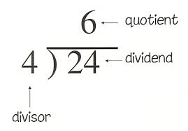

## `-3%3` 과 `3%3`은 같은가?

얼마전에 코딩하다 밟은 버그에 대해서 이야기를 해본다.

자바스크립트로 미디어 플레이어의 플레이리스트를 구현하고 있었다.
플레이리스트는 간단히 배열로 구현했다.

```js
const item = playlistItems[cursor];
```

만약 플레이리스트의 크기가 3이고, cursor가 2인 경우 다음곡을 누르는 경우를 생각하자.
2에 1을 더한 후 3을 cursor로 배열에 그대로 접근하면 out of index 에러가 발생할것이다.
(배열의 크기가 3이면 가능한 인덱스는 0~2이니까)

cursor를 index로 바꿔주는 적절한 함수가 있다고 치자.
이것이 음수, 양수 범위에서 동작할거라고 가정하자.
cursor를 대충 건드려도 적당히 굴러갈것이다.

```js
const item = playlistItems[convertToIndex(cursor)];
```

`convertToIndex()`를 구현했는데 기능은 적당히 돌아가는데 테스트는 실패하더라.
이것이 테스트가 실패하는 jest 코드이다.
아래의 코드가 왜 실패하는지에 대해서 알아보자.

```js
expect(-3 % 3).toEqual(3 % 3);
```

## -4 % 3 = 2 vs -1

자바스크립트에서 `-4 % 3`의 값은 2일까 -1일까?
만약 자바스크립트에서의 답이 2라면 % 연산의 결과를 배열 인덱스로 그대로 꽂아도 된다.
하지만 -1이 답이라면 %의 값을 그대로 쓸 수 없다.

예전에 글을 쓴 적이 있으니 답만 공개한다.
자바스크립트에서 나눗셈의 결과는 Dividend(피제수)의 부호를 따라간다.
`-4 % 3`의 답은 `-1` 이다.



자세한 것은 이전에 작성한 [-4 % 3 = ?][blog-sign-of-mod-operator]를 읽어보자.


## -0

jest 로 아래의 유닛테스트를 작성하고 돌리면 아래와 같은 로그가 뜬다.

```js
expect(-3 % 3).toEqual(3 % 3);
```

```
Expected value to equal:
    0
Received:
    -0
```

-0과 0이 다르기 때문이 실패한댄다.
왜 둘이 다른지는 나중에 생각하고 -0이 왜 튀어나왔는지를 먼저 생각해보자.

자바스크립트는 흔한 언어와 다르게 정수 타입이 없다.
number type 하나로 숫자를 다룬다.
number type은 IEEE 754 부동소수점이다.
IEEE 754 부동소수점에는 -0, +0이 있다.


1. 자바스크립트에는 +0, -0이 있다.
2. modulo 연산 결과는 Dividend(피제수)를 따라간다.

둘의 조합 덕분에 `-3 % 3`은 `0`이 아니라 `-0`이다.


## jest matcher

+0과 -0을 비교하는 jest 테스트 코드를 간단히 짜봤다.

```js
const a = -3 % 3;
const b = 3 % 3;

test('==', () => expect(a == b).toBeTruthy());
test('===', () => expect(a === b).toBeTruthy());
test('toEqual', () => expect(a).toEqual(b));
test('toBe', () => expect(a).toBe(b));
test('Object.is', () => expect(Object.is(a, b)).toBeTruthy());
test('toBeCloseTo', () => expect(a).toBeCloseTo(b));
```

output
```
  √ == (3ms)
  √ ===
  × toEqual (11ms)
  × toBe (1ms)
  × Object.is
  √ toBeCloseTo (1ms)
...
```

`==`, `===`로는 성공하지만 `toEqual`, `toBe`는 실패한다.
jest의 [Using Matchers][jest-matcher] 문서를 보면 이유를 알 수 있다.

> toBe uses Object.is to test exact equality. If you want to check the value of an object, use toEqual instead:
> toEqual recursively checks every field of an object or array.

jest의 toEqual, toBe는 `Object.is`를 사용하니까 테스트가 실패한다.


**jest 22.0.0 이후부터는**
(22.0.0는 18 Dec 2017에 릴리즈 되었다)

[jest CHANGELOG][jest-changelog]를 뒤지면 jest 22.0.0의 변경 사항으로 이런게 있다.

* [expect] [BREAKING] Replace identity equality with Object.is in toBe matcher (#4917)
* https://github.com/facebook/jest/pull/4917

jest 22.0.0 직전 버전인 jest 21.2.1의 [Usng Matchers][jest-matcher-21] 내용은 지금과 다르다.
옛날 옛적에는 toBe가 `===`를 사용했다.

> toBe uses === to test exact equality. If you want to check the value of an object, use toEqual instead:
> toEqual recursively checks every field of an object or array.

내 경우 jasmine을 쓰다가 jest로 넘어갔다.
jest는 jasmine과 비슷하게 생겼고 jest안에 [jasmine_utils.js][jasmine-utils]라는 파일도 있길래 jasmine의 호환성을 유지하는줄 알았다.
게다가 인터넷에 굴러다니는 글 중에는 toBe가 `===`라고 설명한게 꽤 있다.
[jasmine에서의 toBe][jasmine-matcher]가 `===` 였고 남들도 `===`라고 문서도 `===`라고 하니 당연히 그런줄 알았다.

설마 스펙이 바뀌었을줄이야...

jest의 toBe가 `===`라고 한건 전부 옛날 글이니 걸러야한다.

## summary

별것도 아닌 코드 한 줄 때문에 jest 코드 뒤져보니 재밌더라.
이럴떄 아니면 jest 문서를 보지 코드를 뒤져볼 일이 언제 있겠냐.

jest의 toBe의 동작이 `===`에서 `Object.is`로 바뀐건 글 쓰다 알게 되었다.
일반적인 경우에서는 둘의 값이 달라지지 않으니 생각도 안했는데...


[wiki-mod-op]: https://en.wikipedia.org/wiki/Modulo_operation
[wiki-signed-zero]: https://en.wikipedia.org/wiki/Signed_zero
[jasmine-matcher]: https://jasmine.github.io/api/2.7/matchers.html
[jest-matcher]: https://jestjs.io/docs/en/using-matchers
[blog-sign-of-mod-operator]: 
[jest-changelog]: https://github.com/facebook/jest/blob/master/CHANGELOG.md
[jest-matcher-21]: https://github.com/facebook/jest/blob/v21.2.1/docs/en/UsingMatchers.md
[jasmine-utils]: https://github.com/facebook/jest/blob/v23.6.0/packages/expect/src/jasmine_utils.js
