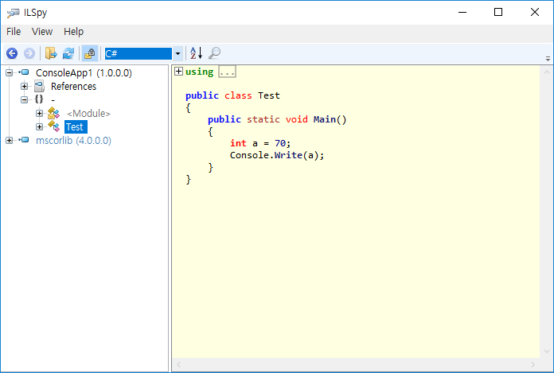
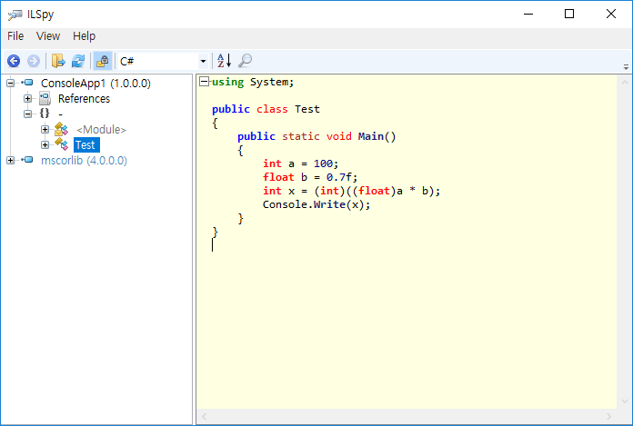
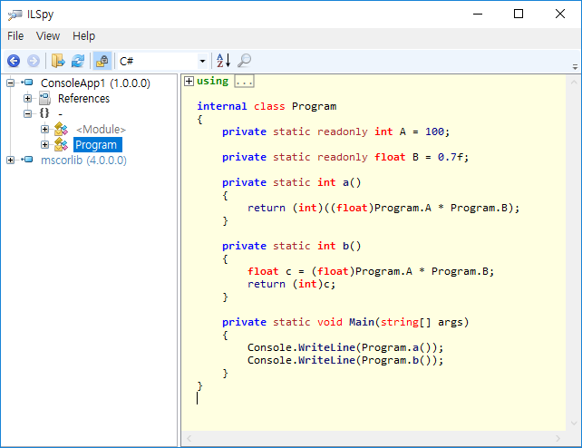
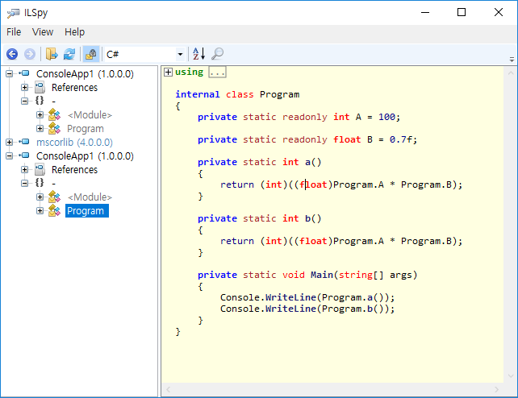
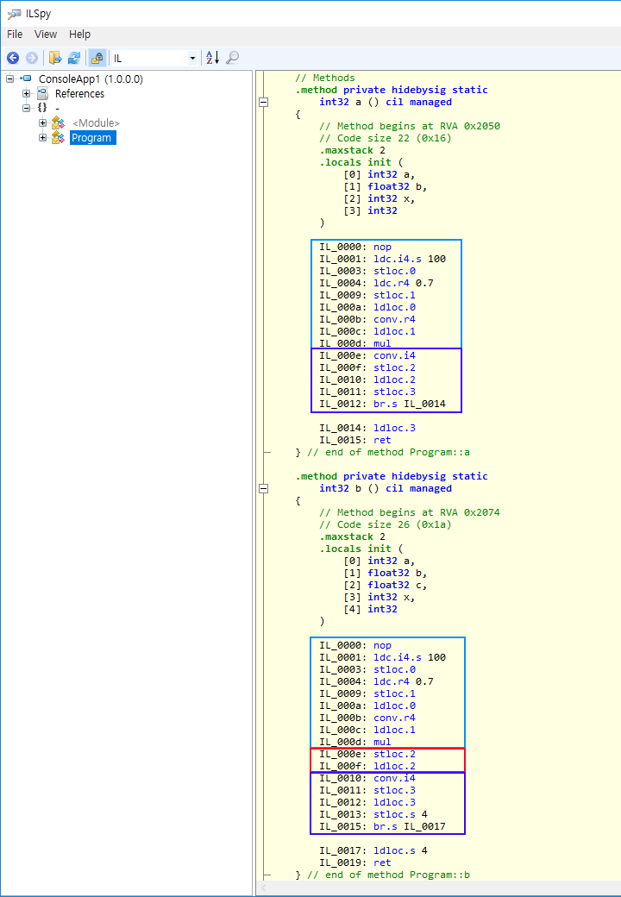
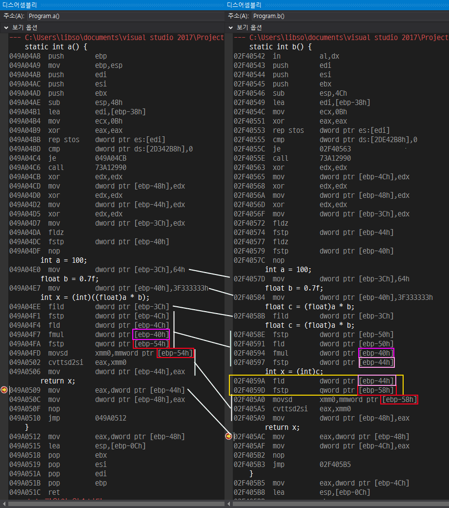

## 100 * 0.7 = 69

[Toy Clash][toyclash]는 10단계로 조절할 수 있는 막대 그래프를 이용해서 BGM 조절을 구현했다.


옵션을 저장하는 방식으로는 디버깅이 편한 XML을 사용했다.

```xml
<volume-bgm>70</volume-bgm>
```

30%라는 값을 표현할때 `<volume-bgm>0.30000000000000004</volume-bgm>`이라고 표현되는 것보다 `<volume-bgm>30</volume-bgm>`이라고 표현되는게 깔끔하니 정수로 볼륨값을 표현했다.
볼륨의 최대값은 100으로 설정하고 기본값으로 70%로 설정했다.
설정파일에서는 볼륨이 70이라고 기록되고 옵션 메뉴에서는 막대가 7개면 올바르게 구현되었다고 말할수 있을것이다.

그런데 실제로 구현하고나니 BGM 볼륨 막대가 6개더라.
옵션 파일을 열어보니 볼륨값이 69로 기록되어 있엇다.
 `100 * 0.7f`를 계산하다 `69.99999…`가 나오고 이것이 int로 캐스팅되어서 69로 계산되었을 것이라고 생각했다.
 `100 * 0.7f` 대신 `70`으로 하드코딩해서 버그는 고쳐놨다.


참고로 `0.7f`를 IEEE-754 표기법으로 쓰면 실제로 표현되는 값은 0.699999988 쯤 된다.
IEEE-754 변환기에 0.7을 넣어보거나 `100 * 0.7` 을 계산하는 C코드의 어셈을 뜯어보면 확인할수 있다. 
https://godbolt.org/g/4m8F4S

100 * 0.7이 100 * 0.699999988 로 계산되면 69.9999988 일테니 int로 캐스팅되어 69가 나올 수 있을 것이다.
100 * 0.7의 계산결과가 69라는건 적어도 컴퓨터 세계에서는 개소리가 아니다.   

## 100 * 0.7 = 69? 70?

게임 출시 이후 한참이 지난 어느날, 심심풀이로 트위터에 투표 떡밥을 던졌다.
100 * 0.7은 69일까? 70일까? 
나는 당해봐서 몸으로 69를 기억하고 있었는데 70이 맞다는 사람이 있더라.
왜 70이 나올수 있을까? 그리고 이를 뜯어보기로 했다.


## 시작하며


0.1 + 0.2 같은 부동소수점 문제에 대해서는 정리가 잘 된 글이 많다. 
나보다 글도 잘 쓰는 사람들이 정리도 잘해놨는데 내가 이제와서 글 써봐야 의미가 있을까?
그래서 나는 IEEE-754 부동소수점 표기법에 대해서는 언급하지 않을 것이다.
IEEE-754를 제외한 영역에서 부동소수점으로 사람을 엿먹이는 방법에 대해서만 이야기할 것이다.

0.1 + 0.2 != 0.3 에 대해서 알고싶다면 다른 글을 찾아보라.

http://floating-point-gui.de/


## Mono vs Visual C#

`100 * 0.7f` 를 계산하는 간단한 코드이다.
이를 C# 구현체인 Mono와 Visual C#에서 실행하면 서로 다른 결과가 나온다.

```csharp
public class Test {
    public static void Main() {
        int a = (int)(100 * 0.7f);
        System.Console.Write(a);
    }
}

// C# (gmcs 4.6.2)
// 69
// https://ideone.com/578vHi
```

```csharp
public class Test {
    public static void Main() {
        int a = (int)(100 * 0.7f);
        System.Console.Write(a);
    }
}

// Visual Studio 2017, .Net Framework 4.6.1
// 70
```

Mono에서는 69가 나오지만 Visual C# 에서는 70이 나온다.
유니티의 경우는 Mono를 사용하기떄문에 내가 처음 본 계산결과가 69 였나보다.
같은 코드임에도 계산 결과가 다른걸 보니 C# 컴파일러 구현체에 의존하나보다.


## 상수 vs 변수

Visual C# 에서 100 * 0.7f 의 결과를 69로 얻는 방법이 있을까? 가능하다.
100,  0.7f 를 상수로 만드는 대신 변수로 만든다. 그리로 계산을 하면 69가 나온다.

```csharp
public class Test {
    public static void Main() {
        int a = 100;
        float b = 0.7f;
        int x = (int)(a * b);
        System.Console.Write(x);
    }
}

// Visual Studio 2017, .Net Framework 4.6.1
// 69
```

ILSpy를 이용해서 코드를 뜯어보면 왜 계산 결과가 다른지 알수있다.

상수를 사용한 코드를 뜯으면 다음과 같다.



곱셈은 사라지고 `70`만 남아있다. 컴파일러가 `100 * 0.7f`를 적절히 최적화해서 상수로 바꿔놨나보다.
세상에는 [GNU Multiple Precision Arithmetic Library (GMP)][wiki-gmp]와 같이 무한한 정밀도로 부동소수점을 계산하는 라이브러리가 있다.
Visual C#은 이런 라이브러리를 사용했나보다.

한편 변수를 사용한 코드를 뜯으면 다음과 같다.



곱셈이 바이너리에 그대로 남아있다.
런타임 중에 FPU를 이용해서 부동소수점을 계산할것이다.

## 최적화 옵션

`readonly static`을 이용하는 방식으로 코드를 고쳐봤다.

```csharp
class Program {
    static readonly int A = 100;
    static readonly float B = 0.7f;

    static int a() {
        int x = (int)((float)A * B);
        return x;
    }
    static int b() {
        float c = (float)A * B;
        int x = (int)c;
        return x;
    }

    static void Main(string[] args) {
        System.Console.WriteLine(a());
        System.Console.WriteLine(b());
    }
}

// Visual Studio 2017, .Net Framework 4.6.1
// Debug
// 69
// 70
// Debug
// 69
// 69
```

이 코드를 Visual C#으로 컴파일하면 어떤 결과가 나올까?
최적화 옵션에 따라서 결과가 달라진다.

디버그 빌드를 하면 69, 70이 나온다.
생성된 함수 a(), b()가 다르니 결과가 다른것도 이해는 된다.



릴리즈 빌드를 하면 69, 69가 나온다.
컴파일러가 재주껏 최적화한 결과 생성된 함수 a(), b()가 똑같다.



## 임시변수

아래의 코드를 보자. 
100 * 0.7f의 계산 결과는 float인데 함수의 리턴 타입은 int이다.
그래서 int로의 캐스팅을 했다.
하지만 두 함수의 구현은 약간 다르다.
함수 b에서는 임시변수를 거치지 않고 바로 캐스팅해서 리턴했다. 
함수 a에서는 임시변수에 대입 후 int로 캐스팅해서 리턴했다.

Visual C# 에서는 두 함수는 같은 결과를 리턴한다.

```csharp
public class Test {
    static int a() {
        return (int)((float)100 * 0.7f);
    }

    static int b() {
        float c = (float)100 * 0.7f;
        return (int)c;
    }

    public static void Main() {
        System.Console.WriteLine(a());
        System.Console.WriteLine(b());
    }
}

// Visual Studio 2017, .Net Framework 4.6.1
// 70
// 70
```


하지만 Mono에서는 두 함수의 계산 결과가 다르다.

```csharp
public class Test {
    static int a() {
        return (int)((float)100 * 0.7f);
    }

    static int b() {
        float c = (float)100 * 0.7f;
        return (int)c;
    }

    public static void Main() {
        System.Console.WriteLine(a());
        System.Console.WriteLine(b());
    }
}

// C# (gmcs 4.6.2)
// 69
// 70
// https://ideone.com/doh4W0
```

“Mono와 Visual C# 은 서로 다른 구현체니 계산 결과가 다르나보구나"로 끝나면 재미없다.
Visual C# 에서 상수대신 변수를 쓰면 69를 얻을수 있다는걸 위에서 확인했다.
그렇다면 코드를 약간 고쳐서 Visual C# 에서는 임시변수 사용 여부에 따라서 계산 결과가 달라지도록 만드는게 가능할 것이다. 


```csharp
class Program {
    static int a() {
        int a = 100;
        float b = 0.7f;
        int x = (int)((float)a * b);
        return x;
    }
    static int b() {
        int a = 100;
        float b = 0.7f;
        float c = (float)a * b;
        int x = (int)c;
        return x;
    }

    static void Main(string[] args) {
        System.Console.WriteLine(a());
        System.Console.WriteLine(b());
    }
}

// Visual Studio 2017, .Net Framework 4.6.1
// 69
// 70
```

Visual C#에서도 임시 변수를 사용했는가에 따라서 계산 결과가 다르게 만드는게 가능하다.
그렇다면 이건 왜 그럴까? IL을 뜯으면 답을 찾을 수 있다.



생성된 함수 a(), b()의 IL이 다르다.
함수 b()에는 `stloc.2`, `ldloc.2`가 있지만 함수 a()에는 없다.
해당 IL이 임시 변수에 값을 할당하는 역할을 하고 이로 인해 함수 a(), b()의 결과가 달라지나보다.

이번 테스트는 특별히 디스어셈블리도 확인해봤다.
함수 b()의 경우 `fld`, `fstp`를 한번 더 사용한다.
임시변수를 쓰면서 추가된 어셈블리로 보인다.



내가 조사한 부분은 여기까지다.
여기부터는 [@summerlight00][twitter-summerlight00]님의 해설을 들어보자.

> 그렇다면 정밀도 문제 맞는 듯? 스택에서만 계산하면 32비트의 낮은 정밀도로 간 뒤 69.9999~에서 그냥 truncate 해버리고 임시 변수 쓰면 xmm 레지스터 들어가서 80비트 정밀도로 계산한 뒤 정수 캐스팅 이런 것도 가능한 시나리오
>
> https://twitter.com/summerlight00/status/896238176313921537

그리고 자료를 구걸해서 [The pitfalls of verifying floating-point computations](https://hal.archives-ouvertes.fr/hal-00128124/document) 라는 문서를 받았다.
조금 더 자세하게 알고 싶은 사람은 문서를 읽어보자.


## summary

* C# 컴파일러 구현체 따라 부동소수점 계산 결과는 바뀔 수 있다.
* 상수를 썻는지 변수를 썻는지에 따라 부동소수점 계산 결과는 바뀔 수 있다.
* 최적화 옵션에 따라 부동소수점 계산 결과는 바뀔 수 있다.
* 임시변수의 사용 여부에 따라 부동소수점 계산 결과는 바뀔 수 있다.
* **모든 것은 컴파일러의 마음에 달려있다. 컴파일러님께서 하시는 작업의 결과를 예측할 생각은 하지마라.**
* C#같은 고급 언어 써도 Low-Level 에 대한 이해가 없으면 동작을 이해할 수 없는 경우가 발생한다. 고급 언어 쓴다고 로우 레벨을 무시하지 말자.
* 위에서 배운 부동소수점 계산 기법을 이용해서 철밥통을 구현하자.


[toyclash]: http://store.steampowered.com/app/620360/Toy_Clash/
[twitter-summerlight00]: https://twitter.com/summerlight00
[wiki-gmp]: https://en.wikipedia.org/wiki/GNU_Multiple_Precision_Arithmetic_Library
