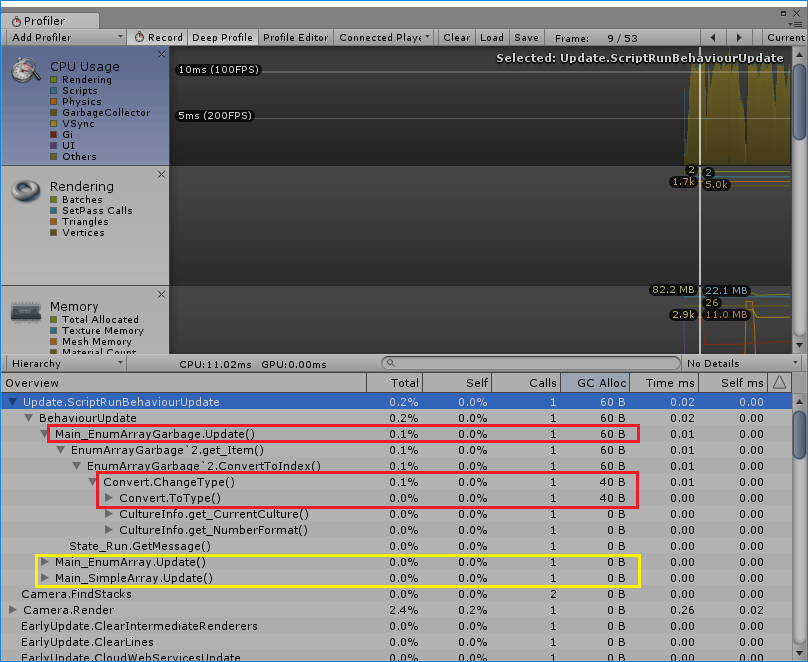

## 시나리오: enum으로 상태 관리

간단한 예제를 생각해보자.
`IState`를 구현한 클래스가 있다고 가정하자.
그리고 클래스를 enum으로 관리하려고한다.
`IState`를 구현한 클래스가 몇개로 늘어날지 모르니 배열을 사용했다.

```csharp
interface IState {
    string GetMessage();
}

class State_Wait : IState {
    public string GetMessage() {
        return "wait";
    }
}

class State_Run : IState {
    public string GetMessage() {
        return "run";
    }
}

enum States {
    Wait,
    Run,
}
```

```csharp
using UnityEngine;

class Main_SimpleArray : MonoBehaviour {
    IState[] states;
    private void Start() {
        states = new IState[2];
        states[(int)States.Wait] = new State_Wait();
        states[(int)States.Run] = new State_Run();
    }

    private void Update() {
        var msg = states[(int)States.Run].GetMessage();
    }
}
```

배열에 접근하기 위해서는 enum을 int로 바꿔야한다.
매번 `states[(int)States.Run]`과 같이 `(int)`를 붙여서 캐스팅하는게 생각보다 귀찮더라. 
그래서 새로운 클래스를 만들어서 배열을 추상화시켜봤다.
제네릭을 이용해서 여러종류의 enum에 대해서도 작동할수 있도록 구현했다.

```csharp
class EnumArrayGarbage<TEnum, TValue> {
    TValue[] data;

    public EnumArrayGarbage(int count) {
        data = new TValue[count];
    }

    public TValue this[TEnum key]
    {
        get { return data[ConvertToIndex(key)]; }
        set { data[ConvertToIndex(key)] = value; }
    }

    int ConvertToIndex(TEnum key) {
        var i = Convert.ChangeType(key, typeof(int));
        return (int)i;
    }
}
```


```csharp
class Main_EnumArrayGarbage : MonoBehaviour {
    EnumArrayGarbage<States, IState> states;
    void Start() {
        states = new EnumArrayGarbage<States, IState>(2);
        states[States.Wait] = new State_Wait();
        states[States.Run] = new State_Run();
    }

    private void Update() {
        var msg = states[States.Run].GetMessage();
    }
}
```


`EnumArrayGarbage`를 사용하면 캐스팅 없이 쓸 수 있으니까 좋다.


로 끝날거면 이런 글은 안쓴다.
유니티 프로파일러를 띄워보자.



`Main_EnumArrayGarbage.Update()`에서 60Byte씩 GC Alloc가 발생하고 있다.
`Main_SimpleArray.Update()`에서는 GC Alloc가 없었는데 고작 int 캐스팅 없애겠다고 고친 코드에서 GC가 발생하니 쓰고싶지 않더라. int 캐스팅도 없으면서 GC Alloc도 없었으면 좋겠다.

GC Alloc가 발생하는 지점을 따라가보면 문제를 찾을수 있다.
`ConvertToInt()`에서 사용한 `Convert.ChangeType()`에서 GC Alloc가 발생하고있다.
`Convert.ChangeType()`의 첫번째 인자의 타입이 Object라서 boxing때문에 GC Alloc가 발생한다.

C++ 같았으면 무식하게 캐스팅 붙여서 enum을 int로 바꿀수 있었을 것이다.

```csharp
int ConvertToIndex<TEnum>(TEnum key) {
    var i = (int)key;
    return i;
}
```

하지만 C#의 제네릭은 C++의 템플릿과 다르다.
그래서 C#에서의 위의 코드가 컴파일되지 않는다.
다른 방법을 써야한다.

인터넷을 뒤지면 이런 문제는 누군가 해결해놨으니 갖다쓰면 된다.
[C# non-boxing conversion of generic enum to int?][sb]을 참고해서 `EnumArray`를 다시 구현했다. 이렇게하면 GC Alloc가 발생하지 않는다.

```csharp
class EnumArray<TEnum, TValue> {
    TValue[] data;

    public EnumArray(int count) {
        data = new TValue[count];
    }

    public TValue this[TEnum key]
    {
        get { return data[ConvertToIndex(key)]; }
        set { data[ConvertToIndex(key)] = value; }
    }

    int ConvertToIndex(TEnum key) {
        return CastTo<int>.From(key);
    }
}

// https://stackoverflow.com/questions/1189144/c-sharp-non-boxing-conversion-of-generic-enum-to-int
/// <summary>
/// Class to cast to type <see cref="T"/>
/// </summary>
/// <typeparam name="T">Target type</typeparam>
public static class CastTo<T> {
    /// <summary>
    /// Casts <see cref="S"/> to <see cref="T"/>.
    /// This does not cause boxing for value types.
    /// Useful in generic methods.
    /// </summary>
    /// <typeparam name="S">Source type to cast from. Usually a generic type.</typeparam>
    public static T From<S>(S s) {
        return Cache<S>.caster(s);
    }

    private static class Cache<S> {
        public static readonly Func<S, T> caster = Get();

        private static Func<S, T> Get() {
            var p = Expression.Parameter(typeof(S), "s");
            var c = Expression.ConvertChecked(p, typeof(T));
            return Expression.Lambda<Func<S, T>>(c, p).Compile();
        }
    }
}
```

```csharp
class Main_EnumArray : MonoBehaviour {
    EnumArray<States, IState> states;
    void Start() {
        states = new EnumArray<States, IState>(2);
        states[States.Wait] = new State_Wait();
        states[States.Run] = new State_Run();
    }

    private void Update() {
        var msg = states[States.Run].GetMessage();
    }
}
```

## IL2CPP

유니티에서 모바일 개발을 하면 IL2CPP는 피할수 없다.
iOS 11 부터는 64비트 어플리케이션만 굴러간다.
그리고 유니티에서 64비트 지원을 할수 있는 방법은 아직까지는 IL2CPP뿐이다.


IL2CPP 옵션을 켜고 빌드한후 실행하면 에러가 난다.

```txt
NotSupportedException: C:\Program Files\Unity-2017.1.0f3\Editor\Data\il2cpp\libil2cpp\icalls\mscorlib\System.Reflection.Emit\DynamicMethod.cpp(19) : Unsupported internal call for IL2CPP:DynamicMethod::create_dynamic_method - System.Reflection.Emit is not supported.: so.libsora.enumarray
  at System.Reflection.Emit.DynamicMethod.CreateDynMethod () [0x00000] in <filename unknown>:0 : so.libsora.enumarray
  at System.Reflection.Emit.DynamicMethod.CreateDelegate (System.Type delegateType, System.Object target) [0x00000] in <filename unknown>:0 : so.libsora.enumarray
  at System.Linq.Expressions.Expression`1[TDelegate].Compile () [0x00000] in <filename unknown>:0 : so.libsora.enumarray
  at CastTo`1+Cache`1[T,S]..cctor () [0x00000] in <filename unknown>:0 : so.libsora.enumarray
  at CastTo`1[T].From[S] (.S s) [0x00000] in <filename unknown>:0 : so.libsora.enumarray
  at EnumArray`2[TEnum,TValue].set_Item (.TEnum key, .TValue value) [0x00000] in <filename unknown>:0 : so.libsora.enumarray
  at Main_EnumArray.Start () [0x00000] in <filename unknown>:0 : so.libsora.enumarray
Rethrow as TypeInitializationException: The type initializer for 'CastTo.Cache<System.Int32,States>' threw an excep: so.libsora.enumarray
```

`CastTo<T>`를 구현하는 과정에서 create dynamic method가 사용되었다.
말 그대로 런타임에 함수를 생성하는 것이다.
하지만 iOS에서는 런타임에 함수 생성하는게 금지되어 있다.
그래서 IL2CPP에서도 관련 기능은 구현한거같지 않더라.

즉, IL2CPP를 쓰면 답이 없다. 캐스팅 노가다를 하자.

## Updated: 더 좋은 방법

나는 iOS 개발을 주력으로 하지 않아서 여기까지 만지고 삽질을 관뒀다.
나중에 iOS까지 대응하는 더 좋은 방법이 있다고 들어서 링크를 남겨둔다.

[NDC 이놈의 enum의 박싱을 어찌할꼬](https://www.youtube.com/watch?v=pP9R58fQo_k)

[sb]: https://stackoverflow.com/questions/1189144/c-sharp-non-boxing-conversion-of-generic-enum-to-int
