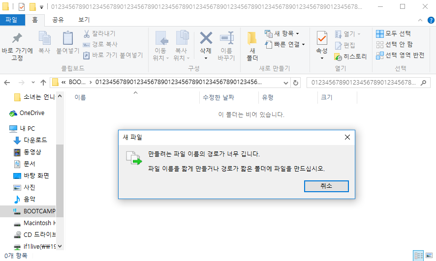
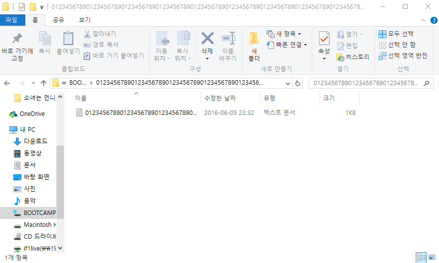

## MAX_PATH

윈도우는 경로 최대길이가 제한되어 있다. `MAX_PATH`라는 상수로 260이다.
그래서 매우 긴 디렉토리를 만든 다음에 안에서 파일을 만들라고하면 다음과 같은 문제가 발생한다.



지금이 90년대 컴퓨터도 아니고 고작 260글자까지밖에 지원하지 않는다고?
MAX_PATH가 260라니 윈도우에 실망했습니다. 윈도우 팬 그만둡니다.

로 끝내면 재미없다. MSDN을 읽어보자.


### MSDN

> Maximum Path Length Limitation
>
> In the Windows API (with some exceptions discussed in the following paragraphs),
> the maximum length for a path is MAX_PATH, which is defined as 260 characters.
> A local path is structured in the following order:
> drive letter, colon, backslash, name components separated by backslashes, and a terminating null character.
> For example, the maximum path on drive D is "D:\some 256-character path string<NUL>"
> where "<NUL>" represents the invisible terminating null character for the current system codepage.
> (The characters < > are used here for visual clarity and cannot be part of a valid path string.)
>
> The Windows API has many functions that also have Unicode versions to permit an extended-length path
> for a maximum total path length of 32,767 characters.
> This type of path is composed of components separated by backslashes,
> each up to the value returned in the lpMaximumComponentLength parameter of the GetVolumeInformation function
> (this value is commonly 255 characters).
> To specify an extended-length path, use the "\\?\" prefix.
> For example, "\\?\D:\very long path".
>
> [Naming Files, Paths, and Namespaces][msdn_path]

* `C:\short path` : 기존 방식으로 작동. MAX_PATH 의 제약을 벗어나지 못한다.
* `\\?\D:\very long path` : `\\?\` prefix를 사용하면 32767글자까지 사용 가능하다.

### Example

MSDN에 있는 내용을 참고해서 간단한 예제를 짯다.

1. C드라이브에 들어간다
2. 새로운 디렉토리를 만든다. 디렉토리 이름은 다음과 같다.
0123456789012345678901234567890123456789012345678901234567890123456789012345678901234567890123456789012345678901234567890123456789012345678901234567890123456789012345678901234567890123456789012345678901234567890123456789012345678901234567890123
3. 소스를 컴파일하고 돌려본다.

```cpp
#define USE_EXTENDED_LENGTH 1

#include <stdio.h>
#include <stdlib.h>
#include <string>
#include <vector>

const std::string dirname  = "0123456789012345678901234567890123456789012345678901234567890123456789012345678901234567890123456789012345678901234567890123456789012345678901234567890123456789012345678901234567890123456789012345678901234567890123456789012345678901234567890123";
const std::string filename = "0123456789012345678901234567890123456789012345678901234567890123456789.txt";

int main()
{
  std::string filepath = R"(c:\)" + dirname + R"(\)" + filename;
#if USE_EXTENDED_LENGTH
  filepath = std::string(R"(\\?\)") + filepath;
#endif

  FILE *f = nullptr;
  errno_t err = fopen_s(&f, filepath.data(), "wb");
  if(err == 0) {
    fprintf_s(f, "hello world\n");
    fclose(f);
  } else {
    fprintf(stderr, "error code : %d\n", err);
  }
  return 0;
}
```

`USE_EXTENDED_LENGTH`가 비활성화 되어있으면 `\\?\`를 붙이지 않는다.
활성화 되어있으면 `\\?\`를 붙여준다.


`\\?\`가 없으면 기존 방식으로 동작하고 에러가 발생한다.


`\\?\`가 있으면 새로운 방식을 사용한다. 그래서 매우긴 경로의 파일명도 문제없이 만들 수 있다.


### Why?

마이크로소프트는 하위호환성을 극단적으로 중요시하는 회사이다.
애플처럼 OS 새로 업그레이드했다고 옛날에 돌아가던 프로그램이 안돌아가는 경우는 자주 일어나지 않는다.
이런 회사에서 `MAX_PATH`를 고치게 가능할까?
다른 개발자들이 `MAX_PATH`를 이용해서 어떤 기괴한 짓을 했을줄 알고?
그렇지만 260글자 제한을 계속 유지하는건 말이 안된다.

마소는 prefix를 이용해서 이 문제를 해결한 것으로 보인다.
생긴게 뻔하면 기존 방식(MAX_PATH)를 이용한다.
절대로 사용할거같지 않은 prefix인 `\\?\`를 붙이면 새로운 방식을 이용한다.
이렇게 하면 하위호환성을 유지하면서 새로운 기능을 지원할수 있다.


## 응용 예제 : UTF-8

prefix에 따라서 처리하는 방식이 바뀌는 다른 예제는 UTF-8이다.
어떤 식으로 작동하는지는 표만 봐도 감을 잡을수 있을거다.

| Bytes in sequence | Byte 1 | Byte 2 | Byte 3 | Byte 4 |
|-------------------|--------|--------|--------|--------|
| 1 | `0xxxxxxx` |            |            |            |
| 2 | `110xxxxx` | `10xxxxxx` |            |            |
| 3 | `1110xxxx` | `10xxxxxx` | `10xxxxxx` |            |
| 4 | `11110xxx` | `10xxxxxx` | `10xxxxxx` | `10xxxxxx` |

## 흑마법으로 응용

좋은 기법을 배웠으니 흑마법으로 응용해보자.
아래는 이전에 prefix 기법을 이용한 사례이다.


1. `int do_something(const char *s)` 같이 생긴 함수가 있다.
2. 함수 안에서는 `strlen()`을 사용하고 있다.
3. 함수 인자로 적절한 문자열을 넣고 결과값을 받는다.

위와 같은 함수가 있다. 겉보기에는 별 문제가 없어보인다.
그런데 개발을 하다보니 새로운 요구사항이 추가되었다.

* `\0`이 문자열 중간에 들어갈 수 있다. (예: `abc\0def`는 7글자로 인식해야 한다)
* 함수가 사용하는 곳은 매우 많은데 한군데에서만 `\0`을 지원해도 문제없다.

현재의 함수로는 위의 요구사항을 대응하기 어렵다.

1. 문자열의 끝을 알수 없다. `strlen()`는 `\0`가 문자열 중간에 섞여있으면 제대로 동작하지 않는다.
2. 함수 인터페이스를 고치기에는 수정할 코드가 많다. 새로운 요구사항이 필요한 곳은 한군데인데 이를 위해서 매우 많은 코드를 고쳐야한다. 인터페이스 하위호환성을 깨고싶진 않다.

그래서 야매로 코드를 수정했다.

일반적인 문자열 `abc`는 평소에 쓰던대로 인자에 넣어서 함수를 호출한다. 동작도 기존 그대로 유지한다.

`\0`이 중간에 들어간 경우 base64 인코딩한 다음에 prefix를 붙인 값을 인자로 사용했다.
인자로 `prefix(0x01) + base64_encode("abc\0def")` 같은 값을 이용했다.
일반적인 문자열에서는 쓸거같지 않은 값을 첫번째 글자에 넣고 이를 읽어서 분기했다.


```cpp
// 원래 있던 코드를 새로운 함수로 분리
static int original_logic(const char *s, int length) {.....}

int do_something(const char *s) {
  if(s == nullptr) {
    return original_logic(s, 0);
  }

  if(s[0] == 0x01) {
    const char *base64_str = s[1];
    int length = 0;
    const char *str = base64_decode(base64_str, &length);
    return original_logic(str, length);

  } else {
    return original_logic(s, strlen(s));
  }
}


int main()
{
  // 기존 인터페이스 유지
  do_something("hello world");

  // \0 이 있을때도 동작
  char buffer[512];
  buffer[0] = 0x01;
  base64_encode("hello\0world", buffer[1]);
  do_something(buffer);
}
```

[wiki_utf8]: https://en.wikipedia.org/wiki/UTF-8
[msdn_path]: https://msdn.microsoft.com/en-us/library/windows/desktop/aa365247(v=vs.85).aspx
