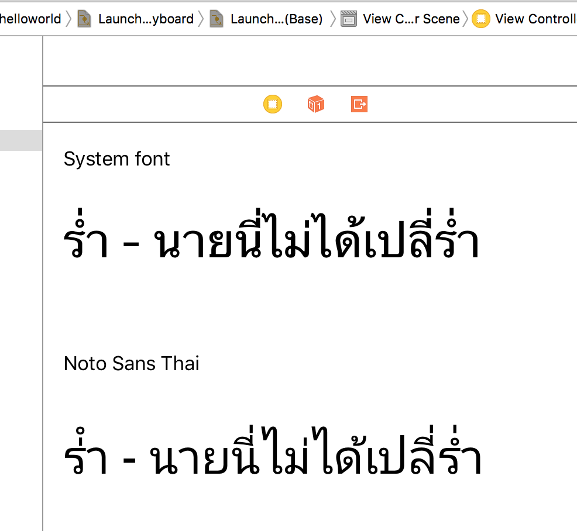
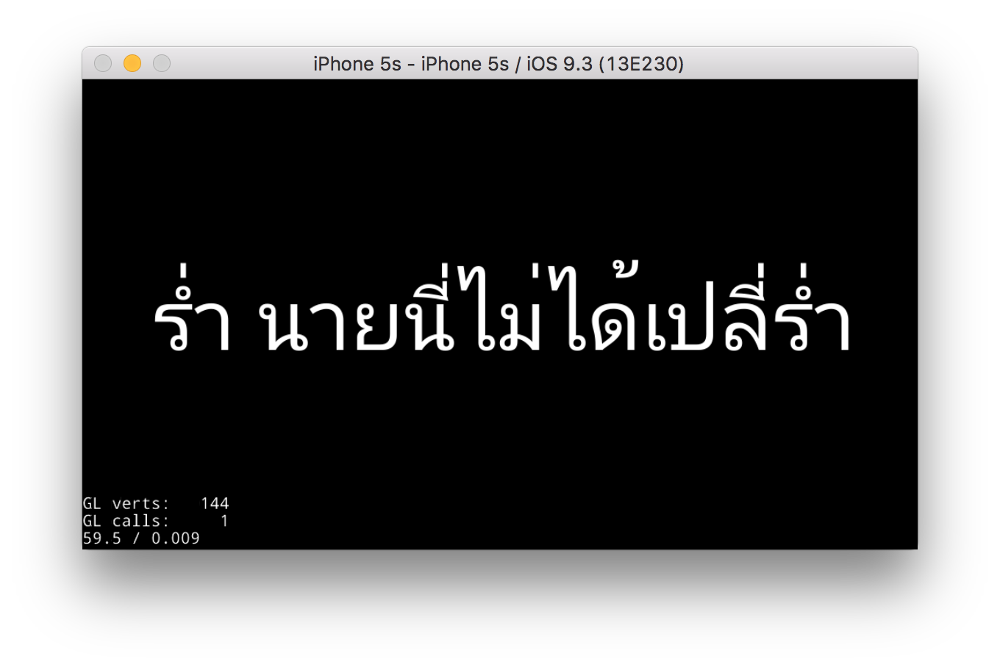
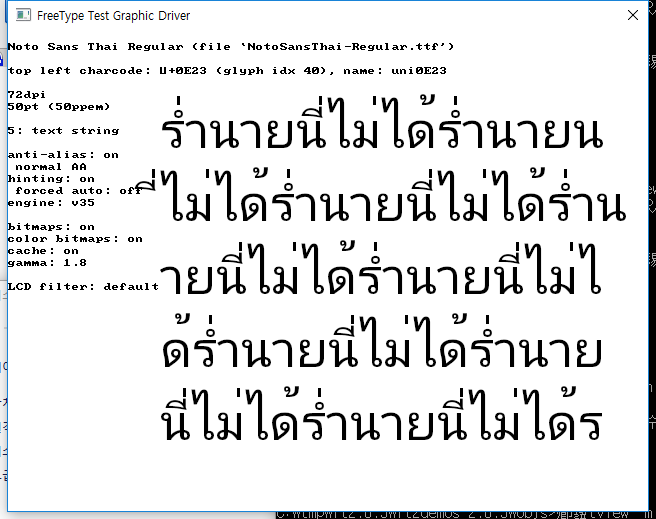
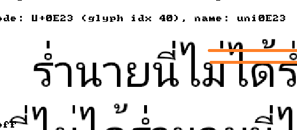
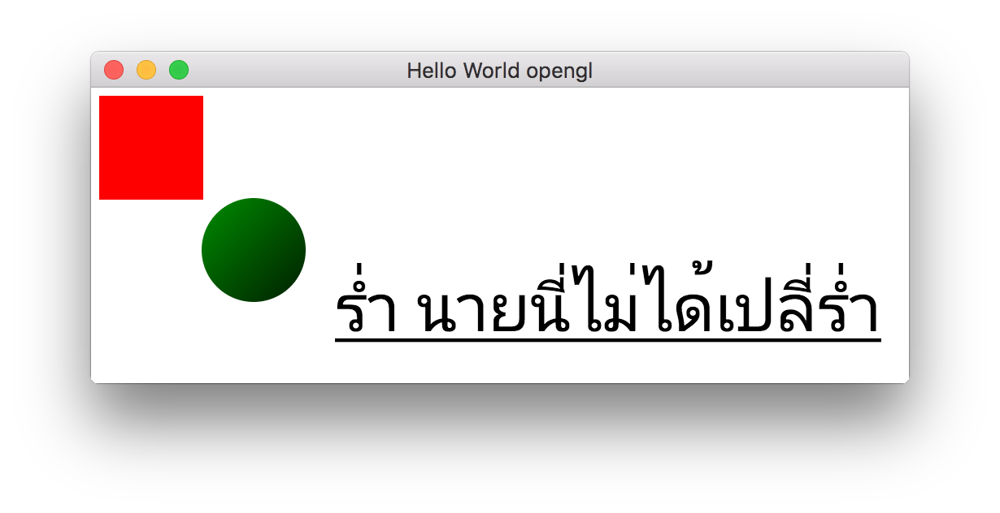
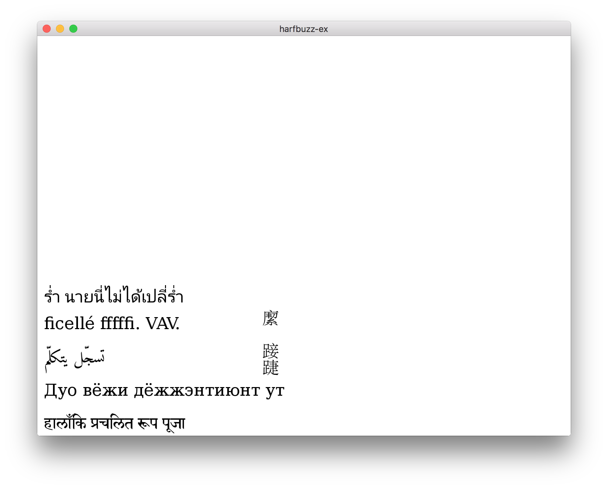

## 개요

cocos2d-x 2.x 기반으로 개발된 모바일 게임을 태국에서 서비스하는 일을 예전에 했었다.
(게임의 기본 폰트는 Noto Sans Thai였다)
개발하면서 크고 작은 태국어 렌더링 버그를 겪었고 대부분의 문제는 어떻게든 해결했다.
하지만 어떤 편법을 써도 제대로 렌더링하지 못했던 문자열이 있었다.

> ร่ำ นายนี่ไม่ได้เปลี่รํ่า

(뜻도 모른다. 렌더링 제대로 안되는 글자를 모아문 문자열이다)

이 문자열을 크롬하고 똑같이 보이게 하기 위해서 삽질했던 기록을 정리했다.


### 주의
* 태국어 폰트에 대한 설명은 다루지 않는다. 나도 태국어 폰트 구조를 모른다
* Noto Sans Thai만 취급한다. 다른 폰트에서는 문제가 없을 수 있다.
* 왜 그렇게 렌더링되는지에 대한 상세한 분석은 하지 않는다. 나는 문제 해결에만 관심있다.
* 2015/05/16 이후에는 다른 방법이 생겼을지 모른다. 새로운 버전에서는 버그가 해결되었는지 테스트하기 쉽도록 버그를 발생시키는 방법을 기록해두었다.

## iOS/OSX

cocos2d-x 2.x는 시스템 내장 폰트 렌더러를 이용한다.
iOS에서는 iOS의 내장 함수를, 안드로이드에서는 안드로이드 내장 함수를 이용한다.
iOS 시스템 폰트 렌더러에 어떤 문제가 있는지부터 보자.



Xcode에서 찍은 스크린샷이다. 아이폰에서 별 차이없다.
위은 시스템 폰트를 사용했고 아래는 Noto Sans Thai를 사용했다.
겉보기에는 비슷해보이지만 잘 보면 다른 곳이 있다.


Noto Sans Thai를 제대로 렌더링하는 삽질을 시작하게 된 계기가 이것이다.
noto-fonts에 [이슈][github_thai_issue]가 등록되어있지만 아직 진행된 것은 없다.

시스템 폰트를 사용할때는 제대로 나오는데 Noto Sans Thai를 사용할때는 문제가 생긴다.
아무래도 폰트 자체에 문제가 있는거같다.
근데 크롬에서는 잘 보인단 말이지?
그렇다면 폰트 렌더러를 바꿔서 문제를 해결하는게 가능하지 않을까?

## Cocos2d-X 3.11

cocos2d-x 2.x에서는 시스템 폰트 렌더러를 사용했지만
cocos2d-x 3.x부터는 freetype2를 사용한다.
폰트 렌더링 방식이 바뀌었으니까 출력 결과도 다를거다.
만약 cocos2d-x 3.x에서 제대로 렌더링된다면 엔진을 업그레이드해서 문제를 해결할수 있을거다.

### Demo
1. cocos2d-x 3.11 을 받아서 HelloWorld를 돌린다.
2. HelloWorld 프로젝트에 폰트 파일을 추가한다. 위치는 `/fonts/NotoSansThai-Regular.ttf`.
2. HelloWorld 를 고친 다음에 다시 실행한다.

```cpp
bool HelloWorld::init()
{
    if ( !Layer::init() )
    {
        return false;
    }

    auto visibleSize = Director::getInstance()->getVisibleSize();
    Vec2 origin = Director::getInstance()->getVisibleOrigin();

    auto msg = "ร่ำ นายนี่ไม่ได้เปลี่รํ่า";
    auto font = "fonts/NotoSansThai-Regular.ttf";
    auto label = Label::createWithTTF(msg, font, 48);
    label->setPosition(Vec2(origin.x + visibleSize.width/2, origin.y + visibleSize.height/2));
    this->addChild(label, 1);

    return true;
}
```

### Rendering Result



시스템 내장 렌더러를 쓰던게 freetype2로 바뀌니 렌더링 결과도 달라졌다.
어떻게 달라졌냐하면 있던 버그가 사라진 대신 새로운 버그가 생겼다.
없던 여백이 생겼다.
한글로 치면 `가`로 렌더링되던게 `ㄱㅏ`로 렌더링 되는 느낌이라고 하더라.


## Freetype 2.6.3

cocos2d-x 3.x에서 사용하는 freetype2 버전이 낮아서 문제가 생긴걸지 모른다.
최신버전 freetype2 를 받아서 테스트해보자.
만약 최신버전 freetype2로 테스트를 해도 똑같으면 freetype2에는 답이 없는거다.

### Demo

Freetype 2.6.3의 ftview가 OSX에서 잘 안돌아가서 윈도우에서 테스트했다.

1. freetype 소스와 데모를 받는다. (2016/05/15 최신버전 2.6.3)
    * http://download.savannah.gnu.org/releases/freetype/
    * freetype-2.6.3.tar.bz2
    * ft2demos-2.6.3.tar.bz2
2. freetype-2.6.3.tar.bz2 압축을 푼다.
3. 폴더을 바꾼다. `freetype-2.6.3` -> `freetype2`
4. `freetype2\builds\windows\vc2010` 을 컴파일
5. 윈도우에서 ft2demos 빌드할때는 jam이 필요한다.
   * https://sourceforge.net/projects/freetype/files/
   * `ftjam/2.5.2/ftjam-2.5.2-win32.zip`
6. VS2015 x86 Native Tools Command Prompt 를 실행해서 ft2demos로 이동
7. `set JAM_TOOLSET=VISUALC && jam`
8. `objs/sample.bat` 파일을 새로 만든다. 커맨드라인에서 태국어를 칠수 없어서 bat를 이용한다.
   * `ftview -m "ร่ำนายนี่ไม่ได้เปลี่รํ่า" 50 NotoSansThai-Regular.ttf`
* sample.bat 실행

### Rendering Result




cocos2d-x 3.11과 똑같은 문제가 생긴다.
Noto Sans Thai는 freetype2 위에서는 제대로 안굴러간다.

## Skia (2016/05/15 기준)

크롬과 똑같이 렌더링하고 싶으면 크롬에서 사용한 렌더러를 갖다 쓰면될거다.
구글에서는 [skia][skia] 라는걸 쓴다고 하더라. skia에서는 어떻게 렌더링되나 테스트해보자.

> Graphics and Skia
>
> Chrome uses Skia for nearly all graphics operations, including text rendering.
> GDI is for the most part only used for native theme rendering; new code should use Skia.
> [link](https://www.chromium.org/developers/design-documents/graphics-and-skia)

### Demo
1. skia 소스를 받는다.
2. 예제를 컴파일하고 `out/Debug/HelloWorld`가 잘 실행되는지 확인한다.
3. `NotoSansThai-Regular.ttf` 를 `/tmp/NotoSansThai-Regular.ttf` 에 배치한다.
3  `example/HelloWorld.cpp`를 고치고 다시 예제를 실행시켜본다.

```cpp
#include "SkTypeface.h"
#include "SkStream.h"
#include "SkOSFile.h"

...

SkString GetResourcePath(const char* resource) {
    return SkOSPath::Join("/tmp/", resource);
}

SkStreamAsset* GetResourceAsStream(const char* resource) {
    SkString resourcePath = GetResourcePath(resource);
    SkAutoTDelete<SkFILEStream> stream(new SkFILEStream(resourcePath.c_str()));
    if (stream->isValid()) {
        return stream.release();
    } else {
        SkDebugf("Resource %s not found.\n", resource);
        return nullptr;
    }
}

sk_sp<SkTypeface> MakeResourceAsTypeface(const char* resource) {
      SkAutoTDelete<SkStreamAsset> stream(GetResourceAsStream(resource));
    if (!stream) {
        return nullptr;
    }
    return SkTypeface::MakeFromStream(stream.release());
}

...

-    paint.setTextSize(20);
+    paint.setTextSize(80);

-    static const char message[] = "Hello World";
+    paint.setTypeface(MakeResourceAsTypeface("/NotoSansThai-Regular.ttf"));
+    static const char message[] = "ร่ำ นายนี่ไม่ได้เปลี่รํ่า";

-    canvas->rotate(fRotationAngle);
+    // canvas->rotate(fRotationAngle);
```

### Rendering Result



skia도 제대로 렌더링하지 못한다.
skia의 렌더링 결과는 freetype과 똑같다.
skia 내부에서 freetype를 쓰나보다.

## HarfBuzz

남이 쓴 문서따위를 어떻게 믿을수 있겠는가?
믿을수 있는건 소스뿐이다.
크롬 소스를 뒤지면 `HarfBuzz`, `This is part of HarfBuzz, a text shaping library.` 같은 내용을 발견할 수 있다.
게다가 [Complex text layout][wiki_complex_text_layout]에서도 HarfBuzz를 언급한다.
[HarfBuzz][harfbuzz]도 테스트해보자


### Demo

[tangrams/harfbuzz-example](https://github.com/tangrams/harfbuzz-example)를 이용했다.
harfbuzz와 glfw를 이용해서 harfbuzz를 쓰면 어떻게 렌더링되는지 확인할수 있는 간단한 예제이다.

1. https://github.com/if1live/harfbuzz-example
2. README.md 를 읽고 따라하기

### Rendering Result



HarfBuzz를 사용하니까 OSX, freetype에 있던 버그가 사라졌다.
HarfBuzz가 정답이었나보다.

### HarfBuzz를 어떻게 쓰지?

방법을 찾아내는 것과 해결하는 것은 다르다.
HarfBuzz를 쓰면 된다는걸 알았으니 이걸 게임에 집어넣고 돌려봐야 문제를 해결할 수 있다.
cocos2d-x 3.x의 Label이 HarfBuzz를 사용하도록 고치려고 했으나 만만한 작업이 아니더라.

의존성이 문제다.

`harfbuzz-icu-freetype/harfbuzz/src/hb-glib.h:34:#include <glib.h>`

안에 glib 의존성이 숨겨져있었다.
의존성 문제 일일히 해결하면서 cocos2d-x와 HarfBuzz를 붙이긴 귀찮더라.
그래서 여기까지만 삽질했다.

나중에 누군가 cocos2d-x에 HarfBuzz를 붙여줄지도 모른다.
cocos2d-x 포럼에 [떡밥][github_thai_issue]이 올라왔던 적도 있다.
(하지만 구현체 소스는 올라오지 않았다)


[skia]: https://skia.org/
[harfbuzz]: https://www.freedesktop.org/wiki/Software/HarfBuzz/
[github_thai_issue]: https://github.com/googlei18n/noto-fonts/issues/598
[wiki_complex_text_layout]: https://en.wikipedia.org/wiki/Complex_text_layout
[cc_forum_harfbuzz]: http://discuss.cocos2d-x.org/t/what-should-we-do-to-improve-label-in-cocos2d-x/22437/31
