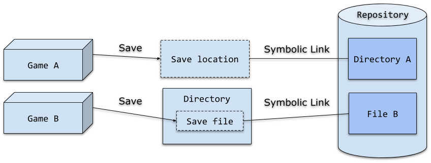
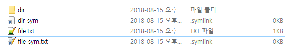
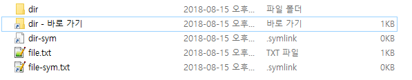
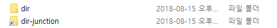

## 왜 윈도우에서 심볼릭 링크를 만드나?
옛날 옛적에는 컴퓨터를 하다가 상태가 안좋아진거 같으면 포맷을 했다. 
파티션을 C, D 드라이브로 분리하고 포맷을 해도 유지되어야 하는 데이터는 D 드라이브에 넣었다.
그리고 C 드라이브를 포맷하고 윈도우를 재설치했다.
겉보기에는 간단한 작업이지만 백업하는걸 잊어버리고 잃어버리는 일이 자주 생겼다.
대표적인 예가 게임 세이브 파일이었다.
그래서 게임 세이브 파일을 안전하게 백업할수 있는 방법을 옛날부터 생각해봤다.

2014년쯤, 답을 찾았다.
게임 세이브 파일을 github에 통째로 올리면 되겠더라.
당시에도 [스팀 클라우드][steam-cloud]로 세이브 파일을 저장하는 기능이 있긴했다.
하지만 스팀 클라우드는 내가 내용물을 직접 볼수 있는것도 아니고 모든 게임이 지원하는 것도 아니었다.
그래서 git으로 세이브 파일을 관리한다는 개념이 뻘짓같진 않더라.

저장소에 폴더를 만들고 이것을 세이브 파일이 저장되는 위치로 심볼릭 링크로 걸어둔다.
세이브 파일이 생성되면 이것을 git에서도 볼수있고 이를 그대로 커밋하면 되겠더라.



게임마다 세이브 데이터의 구현이 다를 것이다.

하나의 세이브 슬롯이 여러개의 파일로 구성되는 경우도 있을 것이다.
(스크린샷용 이미지 파일과 세이브 데이터가 하나의 세이브 슬롯을 구성하는 경우가 있다)
이런 경우는 게임 세이브 폴더에 대한 심볼릭 링크를 쓰는 것이 좋다.

세이브 파일이 저장되는 폴더가 분리되지 않고 게임 데이터 파일에 섞이는 경우도 있을것이다.
이런 경우는 세이브 파일 하나에 대해서만 심볼릭 링크를 쓰는 것이 좋다.

디렉토리에 대한 심볼릭 링크, 파일에 대한 심볼릭 링크를 만들수 있다면 게임 세이브 파일을 git으로 관리하는게 가능해질거다.
방향은 잡았으니 삽질을 해보자.

## NTFS symbolic link
윈도우 비스타 이후부터는 NTFS 파일 시스템에서 심볼릭 링크를 지원한다.
하지만 심볼릭 링크를 만들기 위해서는 administrator 권한이 필요하다.
권한을 요구한다는게 마음에 안들지만 아무튼 사용해보자.

1. `dir`이라는 폴더와 `file.txt`이라는 파일을 만든다.
1. `dir`의 심볼릭 링크인 `dir-sym`을 만든다
3. `file.txt`의 심볼릭 링크인 `file-sym.txt`를 만든다.

`mklink`를 사용하면 심볼릭 링크를 만들 수 있다.

```
C:\Users\libso\Downloads\foo>dir
 C 드라이브의 볼륨에는 이름이 없습니다.
 볼륨 일련 번호: D6A1-3323

 C:\Users\libso\Downloads\foo 디렉터리

2018-08-15  오후 11:34    <DIR>          .
2018-08-15  오후 11:34    <DIR>          ..
2018-08-15  오후 11:30    <DIR>          dir
2018-08-15  오후 11:33                 0 file.txt
               1개 파일                   0 바이트
               3개 디렉터리  40,191,881,216 바이트 남음

C:\Users\libso\Downloads\foo>mklink file-sym.txt file.txt
file-sym.txt <<===>> file.txt에 대한 기호화된 링크를 만들었습니다.

C:\Users\libso\Downloads\foo>mklink dir-sym dir
dir-sym <<===>> dir에 대한 기호화된 링크를 만들었습니다.

C:\Users\libso\Downloads\foo>dir
 C 드라이브의 볼륨에는 이름이 없습니다.
 볼륨 일련 번호: D6A1-3323

 C:\Users\libso\Downloads\foo 디렉터리

2018-08-15  오후 11:45    <DIR>          .
2018-08-15  오후 11:45    <DIR>          ..
2018-08-15  오후 11:30    <DIR>          dir
2018-08-15  오후 11:45    <SYMLINK>      dir-sym [dir]
2018-08-15  오후 11:45    <SYMLINK>      file-sym.txt [file.txt]
2018-08-15  오후 11:44                 0 file.txt
               3개 파일                   0 바이트
               3개 디렉터리  40,185,454,592 바이트 남음
```



파일의 심볼릭링크는 상상한대로 생겼지만 폴더의 심볼릭 링크는 생긴게 이상하다.
아이콘이 폴더 모양이 아니다. 바로가기가 오히려 심볼릭 링크처럼 생겼다.
그리고 `dir-sym`을 더블클릭하면 파일 열기가 뜬다. 반면 바로가기를 더블클릭하면 `dir`로 들어가진다.



폴더의 심볼릭 링크를 만들 목적으로 NTFS에서 지원하는 심볼릭 링크는 못 쓰겠다. 
다른 무언가가 있어야한다.

### windows 10 에서의 변경사항

[윈도우 10 build 14972부터는 administrator 권한 없이도 가능][blog-symlink-win10]하게 바뀌었다.
하지만 내가 NTFS 파일 시스템 붙잡고 삽질하던 2014년에는 윈도우 10도 없었다.
2014년에 썻어야할 글을 게을러서 미루다 2018년에 쓰게 되어서 꼬였다.

## NTFS junction point

윈도우 95부터는 바로 가기 라는 개념이 있다. 
다른 폴더나 파일을 가리키는 확장자가 `.lnk`인 파일이다.
일반 유저가 사용할때는 심볼릭 링크랑 유사한 개념이다.

하지만 실제 구현은 심볼릭 링크과 완전히 다르다!
윈도우 95는 FAT32 파일시스템을 사용한다.
FAT는 심볼릭 링크를 지원하지 않는다.
그래서 윈도우 95는 `.lnk` 파일을 만들어서 심볼릭 링크를 흉내냈다.

바로가기는 일종의 파일이기 때문에 열 수 있다.
`origin` 이라는 폴더를 만들고 이것의 바로가기인 `link.lnk`를 만들자.
그리고 파이썬을 통해서 각각을 열어보자.

```
>>> f = open('origin', 'rb')
Traceback (most recent call last):
  File "<stdin>", line 1, in <module>
PermissionError: [Errno 13] Permission denied: 'origin'
```

```
>>> f = open('link.lnk', 'rb')
>>> len(f.read())
927
```

폴더는 파일이 아니기때문에 열 수 없다.
그래서 PermissionError가 발생한다.
하지만 바로가기는 파일이라서 열 수 있다.

마이크로소프트 사람들은 똑똑하니까 FAT32를 버리고 NTFS를 만들때 FAT32의 문제를 해결하려고 노력했을거다.
해결하고자 노력한 문제중에는 심볼릭 링크도 있었을것이다.
그래서 [NTFS junction point][wiki-junction]라는게 만들어졌다.
NTFS junction은 디렉토리에 대해서 동작하는 심볼릭 링크라고 생각하면 된다.

`mklink /j` 를 이용하면 junction을 만들 수 있다.

```
C:\Users\libso\Downloads\foo>dir
 C 드라이브의 볼륨에는 이름이 없습니다.
 볼륨 일련 번호: D6A1-3323

 C:\Users\libso\Downloads\foo 디렉터리

2018-08-15  오후 11:42    <DIR>          .
2018-08-15  오후 11:42    <DIR>          ..
2018-08-15  오후 11:30    <DIR>          dir
               0개 파일                   0 바이트
               3개 디렉터리  40,189,546,496 바이트 남음

C:\Users\libso\Downloads\foo>mklink /j dir-junction dir
dir-junction <<===>> dir에 대한 교차점을 만들었습니다.

C:\Users\libso\Downloads\foo>dir
 C 드라이브의 볼륨에는 이름이 없습니다.
 볼륨 일련 번호: D6A1-3323

 C:\Users\libso\Downloads\foo 디렉터리

2018-08-15  오후 11:42    <DIR>          .
2018-08-15  오후 11:42    <DIR>          ..
2018-08-15  오후 11:30    <DIR>          dir
2018-08-15  오후 11:42    <JUNCTION>     dir-junction [C:\Users\libso\Downloads\foo\dir]
               0개 파일                   0 바이트
               4개 디렉터리  40,187,174,912 바이트 남음
```



파이썬으로 junction을 열려고 하면 열 수 없다.
바로가기를 사용했을때와는 결과가 바뀌었다.

```
>>> f = open('dir-junction')
Traceback (most recent call last):
  File "<stdin>", line 1, in <module>
PermissionError: [Errno 13] Permission denied: 'dir-junction'
```

## summary
윈도우에서 심볼릭 링크를 쓸라면 폴더, 파일을 구분해야한다.
파일일때는 심볼릭 링크를 쓰면 된다.
폴더일때는 NTFS junction을 쓰면 된다.


[steam-cloud]: https://partner.steamgames.com/doc/features/cloud?l=koreana
[blog-symlink-win10]: https://blogs.windows.com/buildingapps/2016/12/02/symlinks-windows-10/#Ko51LFQ8bjGcBSq1.97
[wiki-junction]: https://en.wikipedia.org/wiki/NTFS_junction_point
