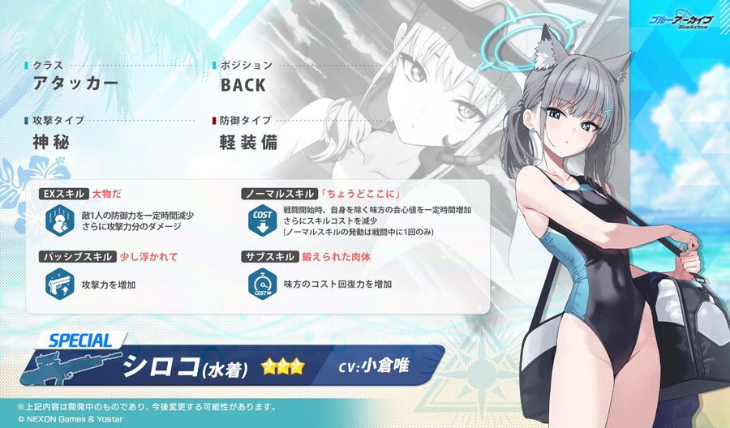
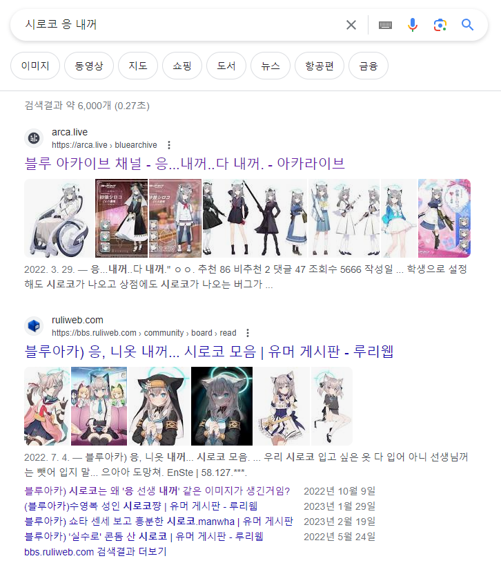
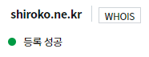

## serverless x AWS Lambda

나는 AWS Lambda를 매우 좋아한다.

하나, 서비스에 장애가 났을때 할 수 있는게 아무 것도 없다.
AWS Health Dashboard 들어가서 람다가 죽은게 장애의 원인으로 파악된 후에 발 뻗고 자면 된다.
어차피 내가 할수 있는게 아무것도 없거든.

나는 개발을 좋아하는거지 운영을 좋아하는게 아니다.
책임지고 대응해야 되는 지점이 적은걸 좋아한다.
책임과 관리는 없을수록 좋다.

둘, AWS Lambda는 웬만한 런타임은 통째로 돌릴 수 있다.
GAE(Google App Engine)의 경우 GAE에서 만든 런타임만 쓸 수 있었다.
내가 GAE를 처음 쓸떄만 해도 파이썬밖에 없었다 (지금은 어떻게 바뀌었나 모르겠다)
AWS Lambda는 express.js로 웹서비스 만들어서 통으로 올려도 잘 돌아간다.

셋, AWS Lambda의 런타임 제약은 꽤 관대하다.
cloudflare worker [limits](https://developers.cloudflare.com/workers/platform/limits/)를 보면 AWS Lambda에 비해서 빡빡한 항목이 많다.
cold start를 줄이기 위해서 V8 isolates을 써서 런타임이 제한되는건 이해할 수 있다.
근데 워커 크기 제한, 실행시간 제한, ... 같은거 생각하면 뇌 떼고 코딩할 수 없다.
일반적인 Node.js 쓰듯이 짜면 cloudflare worker에서는 안돌아갈것이다.

AWS Lambda 다 좋은데... HTTP API 목적으로 쓰기에는 치명적인 문제가 있다.
공짜로 쓰면 원하는 도메인을 붙일 수 없다는 점이다.
(거지 근성에 찌든 나같은 사람한테나 약점인거지, 부르주아와는 관계없다)

[Vercel](https://vercel.com/)을 쓰면 https://sample.vercel.app 같은 도메인을 얻을 수 있다.
[Deno Deploy](https://deno.com/deploy)를 쓰면 https://sample.deno.dev 같은 도메인을 얻을 수 있다.
[Fly.io](https://fly.io/)를 쓰면 https://sample.fly.dev 같은 도메인을 얻을 수 있다.

근데 람다로 HTTP API를 띄우면 https://api-id.execute-api.region.amazonaws.com/stage 같은 형태가 된다.
api-id는 뭐가 될지 모른다.
이건 사람이 외울수 있는 URL이 아니다.
[REST API에 대한 사용자 지정 도메인 이름 설정][aws-how-to-custom-domains]을 하면 멀쩡한 도메인을 붙일 수 있다.
일단 도메인이 있어야 한다. 그리고 나는 사이버-홈리스 라서 도메인이 없다.

으... 도메인 하나 구해야 람다를 편하게 쓸 수 있을거같은데...

## [시로코(수영복)](https://www.pixiv.net/artworks/99383312)

며칠전에 [수영복 시로코](https://namu.wiki/w/%EC%8A%A4%EB%82%98%EC%98%A4%EC%98%A4%EC%B9%B4%EB%AF%B8%20%EC%8B%9C%EB%A1%9C%EC%BD%94/%EC%88%98%EC%98%81%EB%B3%B5)가 실장되었더라.



시로코 좋아

## 어떤 TLD를 골라야하나?

도메인은 10년전에 libsora.so 살때 샀었던 [hosting.kr](https://www.hosting.kr/)에서 뒤졌다.
libsora.so 도메인 구입하고 인생을 실전으로 배웠다.
소말리아 ccTLD인 `.so` 도메인 처음 나올때는 "SNS에 적합한 도메인"으로 약팔면서 싸게 팔더라. (16,500원 x 3년 = 49,500원)
나는 `libxxx.so` 형태가 생각나서 구입했었다.
그리고 몇년 뒤에 소말리아가 도메인 장사를 본격적으로 시작했는지 hosting.kr 기준으로 1년에 8만원으로 올리더라.
도메인 값으로 8만원은 비싸서 버렸다.
libsora.so 도메인으로 외부 링크 걸린게 많을텐데 뭐 어쩔수 없고...
도메인 값이 땅파서 나오는 것도 아니고.

같은 실수를 반복하지 않으려고 TLD 선택에 제약을 걸었다

* hosting.kr 기준으로 이벤트 도메인은 거른다.
    * 이벤트 가격은 처음 1년에만 해당된다.
    * 도메인을 오래 쓸 생각하면 이벤트로 아낀건 그다지 큰 금액이 아니다.
    * (도메인 값이 비싸니까 이벤트를 하는거지)
* 해외 ccTLD 가급적 거른다.
    * 소말리아 같은 나라 선택하면 .so 시즌2 되어버린다.
    * 해외 ccTLD는 한국 도메인에 비하면 비싼 편이다. 그정도까지 지불할 생각은 없다.
* 웬만하면 오래된 TLD를 선택한다.
    * 오래된 도메인은 .so 같은 황당한 통수가 적겠지?
    * .com, .org, .co.kr, 같은 뻔한건 도메인 운영 자체가 안정적이겠지?

도메인 사는 김에 닉네임도 바꿔볼까... 좋은 이름 뭐 할까...
하고 스크롤하다가 xxx.ne.kr 를 발견했다.

com.ne.kr! 컴내꺼!

[대덕밸리 '컴내꺼' 회원 수 100만 넘어](http://m.joongdo.co.kr/view.php?key=20010813000000021#ref)
20년만에 생각난 개인 홈페이지 서비스. 당시 기준으로 저장 용량을 꽤 많이 주는게 인상적이었다.

.ne.kr... 내꺼...

응...내꺼... 시로코?

## 도메인 구입

그래서 shiroko.ne.kr 샀다.

의식의 흐름으로 충동구매 했다.
이제 이거로 뭐하지?
도메인을 샀으니 도메인 주고 개발을 하면 되겠네.

[aws-how-to-custom-domains]: https://docs.aws.amazon.com/ko_kr/apigateway/latest/developerguide/how-to-custom-domains.html
