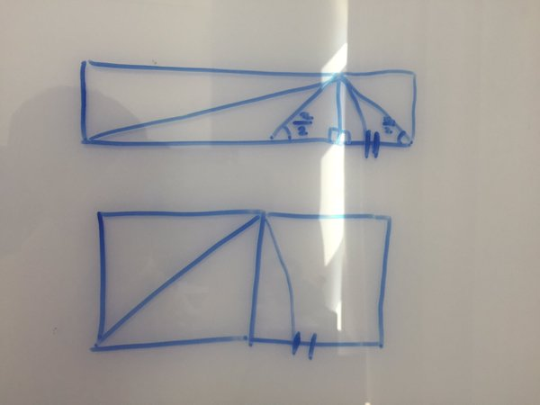

## 개요

게임을 만들면 벡터를 쓰게 된다. 그리고 벡터 클래스에서 2가지 기능은 끝도 없이 사용하게 된다.
하나는 정규화된 벡터(Normalized vector)를 구하는 것이고 다른 하나는 벡터의 길이이다.

DOOM을 만든 아저씨는 `sqrt()`가 느리다고 [Fast inverse square root][wiki_fast_invsqrt]를 만들어낸 존 카멕 아저씨다.
DOOM보다 훨씬 나중에 나온 Quake3에도 `sqrt()` 대신 흑마법을 사용했는데 DOOM에도 비슷한거 있지 않겠어?
고정소수점에서 어떻게 벡터의 정규화, 벡터의 길이를 구현했나 코드로 알아보자.

이 글을 읽기 전에 다음 글을 읽는것을 권장한다.

* [DOOM에서 배우는 각도 표현하는 방법과 sin, cos 구현법]()
* [DOOM에서 배우는 atan2(y, x) 구현]()

DOOM의 렌더리은 3차원이지만 내부 로직은 대부분 2차원 기준으로 굴러간다. 여기에서는 2차원 벡터에 대해서만 이야기한다.

## vector.length()

벡터의 길이를 구하는 가장 간단한 방법은 `sqrt()`를 이용하는거다. `c = sqrt(a*a + b*b)`
이 방법은 DOOM에서 쓰기에는 두가지 문제가 있다.

첫번째 문제는 sqrt를 쓴다는거다.
보통 `sqrt()`는 [Newton's method][wiki_newton_method_sqrt]를 이용해서 구현한다.
아래는 몇가지 sqrt 구현체이다. 둘다 주석에서 newton's method를 언급한다.

* https://opensource.apple.com/source/Libm/Libm-92/ppc.subproj/sqrt.c
* https://github.com/AronDavis/FInt/blob/master/fInt.cs#L440-L462

newton's method를 사용하면 `sqrt()` 내부에는 루프가 하나 들어간다.
게다가 루프 안에서 곱셈, 덧셈 같은걸 수행한다.
덕분에 `sqrt()`는 그렇게 빠른 함수가 아니다.
요즘은 컴퓨터가 좋으니까 심각한 문제 없지만 386, 486이면 이야기가 다를거다.

두번째 문제는 고정소수점의 정밀도이다.
Q16.16을 사용하면 정수부는 2바이트뿐이다.
a가 큰 값이면 `a*a + b*b`를 계산하다 고정소수점의 표현범위를 벗어날수 있다.

그래서 DOOM은 다른 방법으로 구현했다.

https://github.com/id-Software/DOOM/blob/master/linuxdoom-1.10/r_main.c#L391-L418

```c
fixed_t
R_PointToDist
( fixed_t	x,
  fixed_t	y )
{
    int angle;
    fixed_t dx;
    fixed_t dy;
    fixed_t temp;
    fixed_t dist;

    dx = abs(x - viewx);
    dy = abs(y - viewy);

    if (dy>dx)
    {
        temp = dx;
        dx = dy;
        dy = temp;
    }

    angle = (tantoangle[ FixedDiv(dy,dx)>>DBITS ]+ANG90) >> ANGLETOFINESHIFT;

    // use as cosine
    dist = FixedDiv (dx, finesine[angle] );

    return dist;
}
```

1. `angle = atan2(y, x)`
2. `distance = x / sin(angle)`

벡터의 크기를 직접 구하는게 아니라 벡터에서 X축 성분만 이용했다.
충분히 빠르고 안에 루프문이 없는 `atan2(y, x)`, `sin()`를 구현했으니까 이것을 이용한 함수도 충분히 빠르지 않겠어?

### divied by zero?
vector.length() 구현에는 다음 코드에 들어있다.
```c
dist = FixedDiv (dx, finesine[angle] );
```

각도가 0이면 `sin(0) = 0`, divided by zero 버그가 발생할수 있다.
DOOM에서는 이를 어떻게 피했는가? `sin(0) != 0`으로 만들었다.
DOOM의 sine lookup table에서는 0, -1, 1에 대응하는 값은 없다.
`sin(90deg)=1 `처럼 sine은 0이 아니더라도 `cos(90deg)=0` 이 될 수 있기 때문에 일부러 피한것으로 보인다.

```
// finesine[0] != 0
int finesine[10240] = { 25,75,125,175,226,276,326,376, ...}
```

## fast vector.length()

요즘 세상에서는 벡터의 길이를 구하는 함수는 하나면 충분하다.
하지만 DOOM은 486 시대에 만들어서 그런지 벡터의 길이를 구하는 방법을 하나 더 만들었다.
정확한 값을 포기하고 벡터의 길이의 근사값을 구하는 매우 빠른 함수가 따로있다.

https://github.com/id-Software/DOOM/blob/77735c3ff0772609e9c8d29e3ce2ab42ff54d20b/linuxdoom-1.10/p_maputl.c#L43-L58

```c
fixed_t
P_AproxDistance
( fixed_t	dx,
  fixed_t	dy )
{
    dx = abs(dx);
    dy = abs(dy);
    if (dx < dy)
        return dx+dy-(dx>>1);
    return dx+dy-(dy>>1);
}
```

벡터의 길이를 대충 계산하는지는 방법은 매우 간단하다. `length = a + b/2` (단, a >= b).
그림으로 보면 간단하게 이해할 수 있다.
구현체에는 곱셈, 나눗셈도 없이 덧셈, 뺄셈, left shift정도만 사용했다. 빠르긴 진짜 빠르겠지.




> 와...ㅁㅊ, id 소프트웨어는 무슨 어둠의 의회 같은덴가....
> [@debuggerD](https://twitter.com/debuggerD/status/727748272945762305)

## vector.normalize()

Normalized Vector를 구하는 방법은 `normalized_vector = vector / vector.length` 이다.
위에서 벡터의 길이를 구하는 함수를 만들어냈으니 이것을 이용하면 normalized vector를 구할수 있을거다.
하지만 DOOM은 그런 방법을 선택하지 않았다.


https://github.com/id-Software/DOOM/blob/77735c3ff0772609e9c8d29e3ce2ab42ff54d20b/linuxdoom-1.10/p_enemy.c#L1050-L1074

```c
exact = R_PointToAngle2 (actor->x, actor->y, dest->x, dest->y);

if (exact != actor->angle)
{
    if (exact - actor->angle > 0x80000000)
    {
        actor->angle -= TRACEANGLE;
        if (exact - actor->angle < 0x80000000)
            actor->angle = exact;
    }
    else
    {
        actor->angle += TRACEANGLE;
        if (exact - actor->angle > 0x80000000)
            actor->angle = exact;
    }
}

exact = actor->angle>>ANGLETOFINESHIFT;
actor->momx = FixedMul (actor->info->speed, finecosine[exact]);
actor->momy = FixedMul (actor->info->speed, finesine[exact]);
```

1. `angle = atan2(y, x)`
2. `vector_x = sin(angle)`
3. `vector_y = cos(angle)`

충분히 빠르게 동작하는 atan2, sin, cos가 있으니까 그걸 썼다.
벡터의 정규화는 결국 방향이 원래 벡터와 같은 크기 1짜리 벡터를 만들어내는 과정이잖아?
벡터의 각도 알아내고 sin, cos로 x, y 성분 만들면 그게 곧 정규화된 벡터 아니겠는가?


[wiki_fast_invsqrt]: https://en.wikipedia.org/wiki/Fast_inverse_square_root
[wiki_newton_method_sqrt]: https://en.wikipedia.org/wiki/Newton's_method#Square_root_of_a_number
