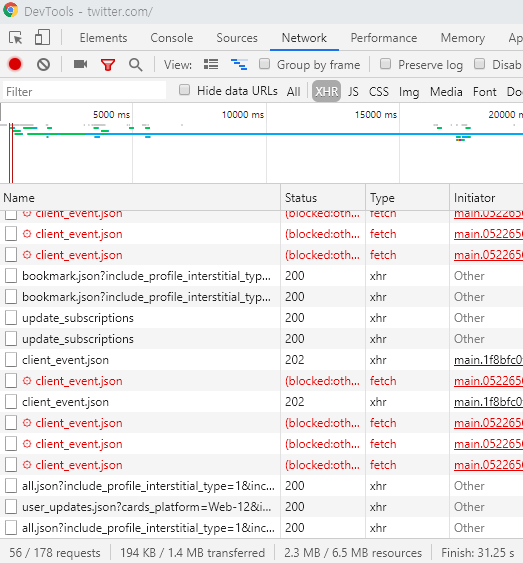

## 아무도 관심갖지 않는 GraphQL 이야기

나는 2015년에 GraphQL이 무것인지에 처음 들었다.
2016년에 기어VR 앱스토어를 뜯으면서 페이스북이 구현한 GrapQL API를 구경해봤다.
내가 직접 쿼리짜서 요청도 보내봤으니 기술적으로 GraphQL 만져봤다고 할수있는건 이 때가 처음이었다. 
실제로 GraphQL을 사용해본건 2018년 4분기였다. 
그리고 지금은 RESTful API로 작업하고 있다.

GraphQL에 대해서 잊어버리기 전에 경험했던걸 기록해두려고 한다.
GraphQL의 장점, 사용법 같은 것은 나보다 더 잘하는 사람들이 열심히 떠들테니 나는 그런 사람들이 주목하지 않는 영역만 취급할거다.

## HTTP status code

웹을 만져본 사람중에서 HTTP status code를 모르는 사람을 없을 것이다.
200 OK, 304 Not Modified, 404 Not Found, 502 Bad Gateway...
RESTful API를 만져본 사람이라면 여러가지 HTTP 상태코드를 만져보고 각각의 미묘한 차이도 알고있을 것이다.

그렇다면 GraphQL 세계에서의 HTTP 상태 코드는 어떨까?

## query language

GraphQL이 무엇인가? GraphQL 스펙 문서는 GraphQL이 무엇인지 정의했을 것이다

https://graphql.github.io/graphql-spec/June2018/

> GraphQL is a query language designed to build client applications by providing an intuitive and flexible syntax and system for describing their data requirements and interactions.

GraphQL은 쿼리 언어일뿐이다.
HTTP status code 같은건 다루지 않는다.
스펙문서를 뒤져도 status code 이야기는 나오지 않는다.
GraphQL 서버 구현체가 알아서 대응한다. 

## 200 OK

https://www.graph.cool/docs/faq/api-eep0ugh1wa/#how-does-error-handling-work-with-graphcool

> Notice that HTTP status codes are not relevant when using GraphQL!
> A GraphQL server will always respond with code 200
> (unless an internal server occured, then it might be code 500).
> Any further information needs to be parsed from the JSON payload of the response.

대부분의 GraphQL 서버 구현체는 200 OK 을 사용한다. 
(500 Internal Server Error은 다른 상태 코드와는 성격이 다르니 무시하자)

왜 이런 선택을 할 수 밖에 없는지 답을 알고 있는 상태에서 따라가보자.

GraphQL은 HTTP 상태 코드를 이용해서 에러 처리를 하지 않는다.
Response JSON에 에러 관련 내용을 넣어서 전달한다.

https://graphql.github.io/graphql-spec/June2018/#sec-Errors

```json
{
  "errors": [
    {
      "message": "Name for character with ID 1002 could not be fetched.",
      "locations": [ { "line": 6, "column": 7 } ],
      "path": [ "hero", "heroFriends", 1, "name" ]
    }
  ],
  ...
}
```

API 기반으로 굴러가는 게시판이 있다고 가정하자.
게시글 Article과 작성자 User 를 API를 통해서 얻을수 있다고 치자.

REST 였으면 이런식으로 설계했을 것이다.

* GET /articles/:id : 성공시 200, Article이 없으면 404
* GET /users/:id: 성공시 200, User가 없으면 404

GraphQL이면 Article과 User를 동시에 조회할수 있다.
만약 User는 찾았는데 Article을 못찾았다면 HTTP 상태 코드는 무엇이 되어야하는가?
`(200 + 404) / 2 = 302` 를 쓰면 될거같은데 302 Found 니까 Article을 못 찾았다는것과 모순이 발생한다. 

HTTP 상태 코드는 하나밖에 고를수 없으니 200 OK를 사용한다.
쿼리 한번에 여러개의 에러가 발생할 수 있으니 errors 배열을 사용한다.
이것이 GraphQL에서의 일반적인 선택같더라.

## side effect

RESTful API 서버를 통합 테스트(integration testing) 할때는 HTTP 상태 코드를 쓰기도 한다.
내 경우는 [supertest][github-supertest]를 이용해서 테스트코드를 작성한다.

```js
describe('GET /user', function() {
  it('responds with json', function(done) {
    request(app)
      .get('/user')
      .set('Accept', 'application/json')
      .expect('Content-Type', /json/)
      .expect(200, done);
  });
});
```

GraphQL 서버는 이런 식으로 테스트 코드 짜면 아무 의미가 없다.
모든 요청이 200 OK이니 확인할 이유가 없다.
통합 테스트를 짜고 싶다면 HTTP 상태 코드말고 response json을 검증해야 된다.

순정 상태의 브라우저 개발자 도구가 불편해진다.
예를 들어 크롬 개발자 도구를 쓰면 URL, HTTP 상태 코드가 한눈에 보인다.
REST는 클라이언트가 서버로 어떤 요청을 보냈고 실패가 발생했는지 보인다.
GraphQL은 endpoint가 하나뿐이다. 게다가 200 OK만 사용한다.
각각의 요청을 눌러보지 않으면 의미있는 내용이 보이지 않는다.
(확장 프로그램을 뒤져보면 쓸만한게 있을거같은데 직접 찾아보진 않아서 모르겠다)



[github-supertest]: https://github.com/visionmedia/supertest
