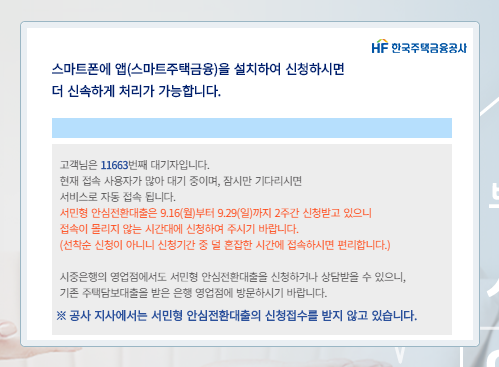
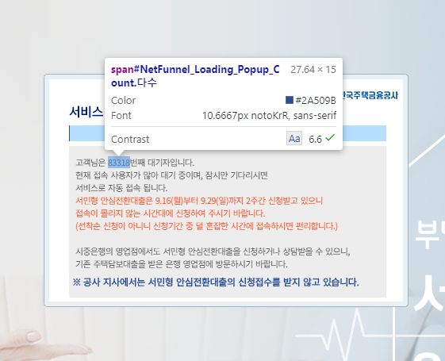
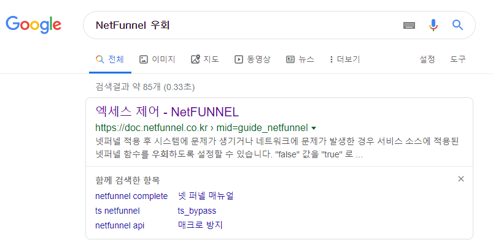

## 개요

[서민형 안심전환대출](https://www.hf.go.kr/) 신청하게 되었다.
신청하러 들어갔더니 대기 페이지가 뜨더라.



기다리는 것보다 뜯어서 우회하는게 빠를거같더라.
나는 인내심이 없는 인간이라서 뜯어봤다.
(얼마나 인내심이 없냐하면 신청이 끝나는 29일에 글을 쓰려고 했으나 참지 못하고 지금 쓴다)

## 방법 1

팝업에서 대기자 수가 계속 바뀐다.
이것에 대응되는 코드를 찾고 하나씩 따라가면 될거같다.



`NetFunnel_Loading_Popup_Count`로 검색하면 하나만 걸린다.

```js
NetFunnel.countdown = function() {
    if (NetFunnel.gLastData && NetFunnel.gLastData.time_left >= 0) {
        if (NetFunnel.gPop) {
            var tTime = NetFunnel.gPop.getObj("NetFunnel_Loading_Popup_TimeLeft");
            var tCount = NetFunnel.gPop.getObj("NetFunnel_Loading_Popup_Count");
            var tNext = NetFunnel.gPop.getObj("NetFunnel_Loading_Popup_NextCnt");
```

[netfunnel.js][netfunnel-src]의 `countdown()`이다.
js 파일명을 보니 `netfunnel`이라는 솔루션이 있나보다.

제정신을 갖고 만든 솔루션이라면 클라이언트에서 카운트다운을 세지 않을 것이다.
서버에서 결과를 클라로 보내고 클라는 이를 적절히 처리할 것이다.


네트워크를 뜯어보면 주기적으로 클라가 서버로 요청보내는게 보인다.
폴링 방식으로 구현했나보다. 주고받는 response의 내용도 읽어보자.

```js
NetFunnel.gRtype=5002;NetFunnel.gControl.result='5002:201:key=2D02981FDB2DDE611B1D8C81B900312B5B57188B66DC8029EB79317DDAB32C7CE54D1E713188A821AF52E5B2FF09F2981050587F7A9D0A06787D50CF33ECA6929CDFAE73A86DC8BF1EA234386BFC00E442165990BD55429602E0DFCDFA16BA59672C302C392C312C38323132392C30&nwait=82129&nnext=675&tps=0.599689&ttl=3&ip=netfunnel.hf.go.kr&port=443'; NetFunnel.gControl._showResult();
```

`NetFunnel.gRtype=5002`가 매우 거슬린다.
`5002`에는 특별한 의미가 있을 것이다.
검색하면 아래의 코드가 튀어나온다.

```js
NetFunnel.RTYPE_NONE = 0;
NetFunnel.RTYPE_CHK_ENTER = 5002;
NetFunnel.RTYPE_ALIVE_NOTICE = 5003;
NetFunnel.RTYPE_SET_COMPLETE = 5004;
NetFunnel.RTYPE_GET_TID_CHK_ENTER = 5101;
```

여기까지 보니까 NetFUNNEL의 동작이 상상되더라.
나라면 이렇게 구현했을거다.

1. 클라가 서버한테 요청을 보낸다.
2. 서버는 니 차례는 아직이니 대기하라는 응답을 보낸다.
4. 폴링 반복
5. 떄가 되면 서버에서 완료했다는 응답을 보낸다.
6. 클라는 기다릴 필요가 없어졌다는걸 확인하고 적절한 함수를 호출한다.

로직에 개입할거같이 생긴 상수 몇개 찾았다.
검색 결과에 브레이크 포인트 찍어보니까 의심되는 곳에서 멈추더라.

```js
NetFunnel.TsClient.prototype._showResult = function() {
    this._resetAlarm();
    if (NetFunnel.gAlreadyProc == 1 && NetFunnel.gRtype == NetFunnel.RTYPE_GET_TID_CHK_ENTER) {
        return
    }
    NetFunnel.gAlreadyProc = 1;
    NetFunnel.PopupUtil.hideWaitPopup();
    this.retval = new NetFunnel.RetVal(this.result);
    if (this.retval.getReqType() == NetFunnel.RTYPE_GET_TID_CHK_ENTER) {
        this.retval.setReqType(NetFunnel.RTYPE_CHK_ENTER)
    }
    if (NetFunnel.TS_DEBUG_MODE) {
        NetFunnel.printDebugMsg("recv", this.result)
    }
```

```js
this.retval = new NetFunnel.RetVal(this.result);
if (this.retval.getReqType() == NetFunnel.RTYPE_GET_TID_CHK_ENTER) {
    this.retval.setReqType(NetFunnel.RTYPE_CHK_ENTER)
}
```

`result`를 채운후 `getReqType()`로 비교하네?
`getReqType()`의 리턴값이 5002가 아니라 5004가 되도록 바꿔두면 이후의 대기가 끝난거처럼 동작하지 않을까?

해보면 잘 된다.

이 방법을 통해 기다리지 않고 우회해서 신청을 넣었다.

## 방법 2

방법1로 일단 NetFUNNEL 우회는 성공했다.

하지만 이게 최선의 방법이었을까?
NetFUNNEL을 한두군데에만 팔아먹었을리 없다.
다른 사람들은 어떻게 우회했나 찾아보려고 했다.
"NetFunnel 우회"를 입력하니까 첫 페이지에 개발 문서가 뜨더라.



???

[문서][doc-netfunnel]를 읽어봤다.

> 넷퍼넬 우회 기능 (Client Side Bypass)
> 
> 넷퍼넬 적용 후 시스템에 문제가 생기거나 네트워크에 문제가 발생한 경우
> 서비스 소스에 적용된 넷퍼넬 함수를 우회하도록 설정할 수 있습니다.
> "false" 값을 "true" 로 변경해주면 넷퍼넬 서버로 요청하지 않고 우회합니다.
> 
> NetFunnel.TS_BYPASS = false; // NetFUNNEL Routine Bypass [true|false]

`NetFunnel.TS_BYPASS`가 사용되는 곳에 전부 브레이크 포인트 잡았다.
그리고 처음으로 쓰이게 되는 지점에서 `NetFunnel.TS_BYPASS = true`로 설정해주면 될거같더라.

```js
NetFunnel.TsClient.prototype.getTidChkEnter = function(a, c, e, d) {
    NetFunnel.gPrevWaitTime = -1;
    if (NetFunnel.TS_BYPASS == true) {
        this.fireEvent(null, this, "onSuccess", {
            rtype: this._mReqType,
```

쉽게 우회할 수 있다.

## 오늘의 교훈

* RTFM: Read The Fucking Manual (빌어먹을 안내서를 읽으시오)
* 문서를 잘 읽자
* 공개해도 되는 문서인지 아닌지 한번쯤 생각하자
* 코드를 뜯기고 싶지 않다면 난독화는 선택이 아닌 필수
    * 하지만 [뚫고자하는 의지가 있다면 난독화는 문제가 되지 않는다][issue-translate-shell]

[netfunnel-src]: https://www.hf.go.kr/_common/js/netfunnel.js
[doc-netfunnel]: https://doc.netfunnel.co.kr/index.php?mid=guide_netfunnel&category=405
[issue-translate-shell]: https://github.com/soimort/translate-shell/issues/94
