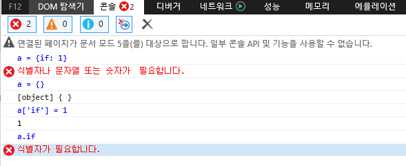

얼마전에 구버전 IE에서만 돌아가는 코드를 밟아서 [글]()을 썼다.
글을 쓰다가가 옛날에 밟은 IE 구버전과 관련된 재밌는 코드가 생각났다.
그래서 옛날 이야기를 하나 더 써봤다.

자바스크립트를 쓰다보면 다른 언어에서는 생각도 못한 코드를 가끔본다.
객체의 프로퍼티로 if, for, while 같은 키워드를 쓸 수 있다.
다른 언어였으면 문법에러로 처리했을지 모른다.

```javascript
a = {if: 1}
> {if: 1}
a.if
> 1
a['if']
> 1
```

재밌게도 위의 문법은 IE 구버전에서는 안돌아간다. 



IE 구버전에서는 키워드를 프로퍼티로 쓸 수 없다. 객체에 `a['if']` 로 접근할순 있지만 `a.if` 로 접근할 순 없다.
황당해서 찾아본 적이 있는데 자바스크립트 스펙이 변했더라.
옛날 표준 자바스크립트에서는 키워드를 프로퍼티로 쓸수 없었지만 요새 자바스크립트에서는 키워드를 프로퍼티로 쓸 수 있다. 

1997년 자바스크립트 스펙을 뒤져보자. [ECMA-262 1판][js-1]이다.
11.2 Left-Hand-Side Expressions 에 프로퍼티 문법이 있다.

```
MemberExpression :
    PrimaryExpression
    MemberExpression [ Expression ]
    MemberExpression . Identifier
    new MemberExpression Arguments
```

프로퍼티에 접근시 expression 또는 identifier를 쓸 수 있다.
그렇다면 identifier란 무엇인가? 7.5 Identifiers 에 나와있다.

```
Identifier ::
    IdentifierName but not ReservedWord
```

1997년 스펙에 의해 IE 구버전에서는 reserved word는 프로퍼티에 쓸 수 없다.
그래서 `a['if']` 는 가능하지만 `a.if` 는 불가능하다.


이번에는 2018년 자바스크립트 스펙을 뒤져보자. [ECMA-262 9판][js-9]이다.
12.3.2 Property Accessors 에 프로퍼티 문법이 있다

```
Properties are accessed by name, using either the dot notation:

MemberExpression . IdentifierName
CallExpression . IdentifierName

or the bracket notation:

MemberExpression [ Expression ]
CallExpression [ Expression ]
```

프로퍼티 접근시 expression 또는 identifier name을 쓸 수 있다. 
1997년 스펙에서는 identifier 였지만 2018년에는 identifier name으로 바뀌었다.

예약어과 관련된 내용도 찾아보자.  11.6.2 Reserved Words 에 예약어가 정의되어있다.

```
A reserved word is an IdentifierName that cannot be used as an Identifier.
```

reservered word는 identifer로는 쓸 수 없지만 identifier name으로는 쓸 수 있다. 1997년 스펙과는 다르다.

2018년 스펙에 의해 요새 자바스크립트에서는 reserved word는 프로퍼티에 쓸 수 있다.
그래서 `a['if']` 도 가능하고 `a.if` 도 가능하다.

10년이면 강산도 변한다. 자바스크립트 표준도 변한다.

[js-1]: https://www.ecma-international.org/publications/files/ECMA-ST-ARCH/ECMA-262,%201st%20edition,%20June%201997.pdf
[js-9]: https://www.ecma-international.org/publications/files/ECMA-ST/Ecma-262.pdf

