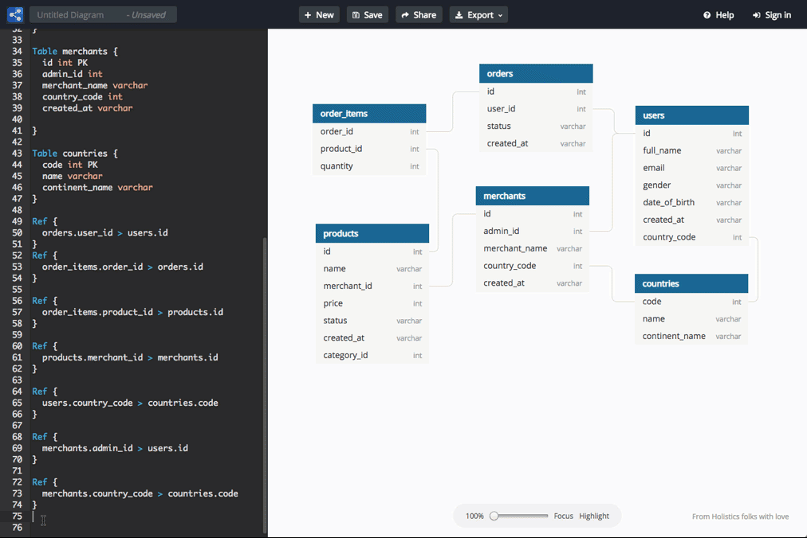

## 개요

IaC (Infrastructure as Code) 뽕을 맞은 이후로는 될 수 있는한 많은 것을 코드로 표현하려고 노력했다.
ERD (Entity-relation diagram)도 코드로 표현하고 싶었던 물건이다.
마우스로 ERD 그리는 것은 고통스러워서 될 수 있는한 하고 싶지 않았다.
여기에서 도망치려고 잔머리 굴리다 찾은 좋은 물건이 [DBML][dbml-home]이다.

내가 말하는 DBML은 [마이크로소프트의 DBML](https://docs.microsoft.com/ko-kr/dotnet/framework/data/adonet/sql/linq/code-generation-in-linq-to-sql#xml-schema-definition-file)과는 다른 것이다.
DBML로 검색했을때 문서에 visual studio, LINQ, XML이 같이 보이면 마이크로소프트 DBML일 확률이 높다.

## 내가 생각하는 장점

DBML은 코드로 ERD를 그릴 수 있다.
기존에도 ERD를 그릴수 있는 도구는 많이 있었다.
[AQueryTool][aquerytool]도 있고 [diagrams.net][diagrams]도 있고 찾으면 많이 나온다.
하지만 대부분의 도구는 GUI 기반이다. 마우스로 그려야하고 버전 관리도 쉽진 않다.
DBML을 쓰면 git에 버전 관리를 떠넘길 수 있다.

DBML은  [오픈소스][dbml-repo]이다.
자바스크립트로 구현된 파서가 제공되니 이를 사용해서 툴을 만들 수 있다.
다만 typescript declaration file은 제공되지 않아서 직접 작성해야 한다.

DBML은 온라인 GUI 툴이 있다.
ERD 자체가 필요할때는 [dbdiagram.io][dbdiagram]에 코드를 복사해넣고 이미지를 뽑으면 된다.

## 응용: ORM -> Entity-relation diagram

typeorm을 사용해서 entity를 정의했다.
typeorm은 쓸만한 ORM이라서 entity만 정의하면 DB 생성이니 마이그레이션이니 전부 알아서 해준다.
이 상태로만 프로젝트가 굴러가면 참 편했을텐데 세상은 그렇게 굴러가지 않는다.

외부에서 ERD를 뽑아달라고 하더라?
typeorm entity로 DB 정의한거 냅두고 ERD를 그리라고?
나중에 새로운 테이블, 컬럼이 추가되면 ERD에도 반영되어야하는데 그짓을 수동으로 하라고?

멀쩡한 ORM을 쓰면 런타임에 entity 메타데이터에 접근할 수 있다.
정의된 entity 목록, entity에 연결된 테이블 이름, 컬럼 목록, ... 전부 가져올 수 있다.
typeorm entity로부터 DBML을 생성하고 DBML로 ERD를 생성하면 문제를 해결할 수 있다.

## 응용: 스키마 정의

게임DB는 캐릭터 능력치 테이블, 레벨업 테이블, 아이템 목록, 퀘스트 정의, ... 다양한 테이블을 다룬다.
남들은 이걸 뭐라고 부르는지 모르겠는데 여기에서는 마스터데이터(masterdata)라고 부르겠다.
마스터데이터의 포맷은 회사, 팀마다 다를텐데 csv, xlsx을 쓰는 경우가 있더라.
csv 파일 1개가 테이블 1개, xlsx 시트 1개가 테이블 1개로 연결된다고 상상하면 된다.

캐릭터는 `Charater`에 정의되어있고 캐릭터의 스킬은 `CharacterSkill`에 있다고 치자.
`CharacterSkill.character_id`와 `Character.id`은 서로 연결될 것이다. 
둘이 제대로 연결되지 않은 게임에서는 버그로 보일 것이다.
현실 세계에서는 수많은 많은 테이블, 레코드가 연결된다.
그리고 관계를 제대로 관리하지 못하면 버그로 이어진다.
엑셀은 테이블간의 관계를 추적하기에 뛰어난 도구가 아니고 데이터 검증하는데도 뛰어난 도구는 아니다.

DBML을 응용하면 엑셀보다는 나은 도구를 만들 수 있다.
마스터데이터를 DBML로 정의하고 [dbdiagram.io][dbdiagram]에 넣으면 테이블 간의 관계가 시각화된다.
DBML 파서를 사용하면 엑셀파일이 정의한 DBML에 맞는지 검증하는 툴을 만들 수 있다.

[aquerytool]: https://aquerytool.com/?demo=y
[diagrams]: https://app.diagrams.net/
[dbml-home]: https://www.dbml.org/
[dbml-repo]: https://github.com/holistics/dbml/
[dbdiagram]: https://dbdiagram.io/home
