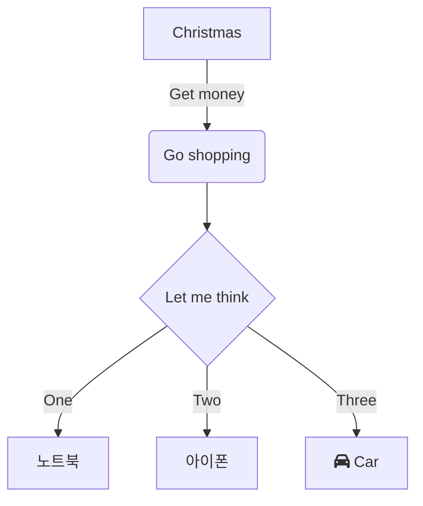
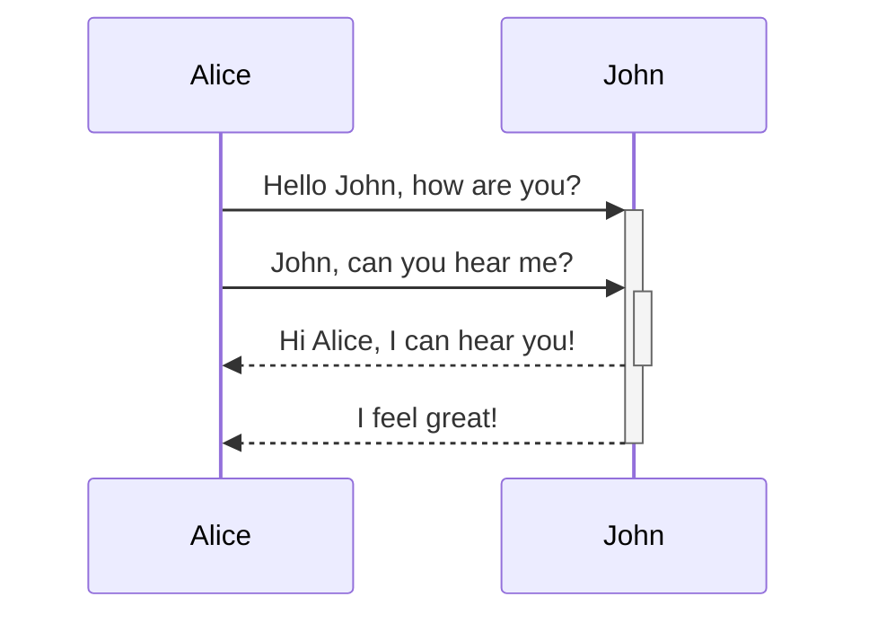

[markdown syntax](http://daringfireball.net/projects/markdown/syntax)

# h1 heading
## h2 heading
### h3 heading
#### h4 heading
##### h5 heading
###### h6 heading

## normal
Lorem Ipsum is simply dummy text of the printing and typesetting industry. Lorem Ipsum has been the industry's standard dummy text ever since the 1500s, when an unknown printer took a galley of type and scrambled it to make a type specimen book. It has survived not only five centuries, but also the leap into electronic typesetting, remaining essentially unchanged. It was popularised in the 1960s with the release of Letraset sheets containing Lorem Ipsum passages, and more recently with desktop publishing software like Aldus PageMaker including versions of Lorem Ipsum.

Lorem Ipsum is simply dummy text of the printing and typesetting industry. Lorem Ipsum has been the industry's standard dummy text ever since the 1500s, when an unknown printer took a galley of type and scrambled it to make a type specimen book. It has survived not only five centuries, but also the leap into electronic typesetting, remaining essentially unchanged. It was popularised in the 1960s with the release of Letraset sheets containing Lorem Ipsum passages, and more recently with desktop publishing software like Aldus PageMaker including versions of Lorem Ipsum.

## Footnote

this is footnote[^1]
and this is footnote[^2]


## code block

```c
// c
#include<stdio.h>
int main(int argc, char * argv[])
{
    printf("Hello World!\n");
    return 0;
}
```

```cpp
// cpp
#include<stdio.h>
int main(int argc, char * argv[])
{
    printf("Hello World!\n");
    return 0;
}
```

```ts
// ts
console.log('hello');
```

```js
// js
console.log('hello');
```

```python
# python
print([1,'2'])
```

```csharp
// csharp
using System;
namespace HelloWorld
{
    class Hello 
    {
        static void Main() 
        {
            Console.WriteLine("Hello World!");
        }
    }
}
```


```bash
# bash
if [ $var -eq 0 ];then
  echo "\$var is 0";
else
  echo "\$var is not 0";
fi
```

```ruby
# ruby
puts "hello"
```

```html
<!-- html -->
<p>sample</p>
```

```xml
<!-- xml -->
<volume-bgm>70</volume-bgm>
```

```go
// go
func main() {
    fmt.Println("hello");
}
```

```lisp
; lisp
(prefer-coding-system 'utf-8)
```

```java
// java
credential = GoogleAccountCredential.usingOAuth2(activity)
```

```scss
/* scss */
@mixin border-radius($radius) {
  border-radius: $radius;
}
```

```less
/* less */
.border-radius(@radius) {
  border-radius: @radius;
}
```

```json
{
    "key": "json"
}
```

```batch
rem batch
C:\program files\Unity\Editor\Unity.exe -quit -batchmode -executeMethod BuildScript.BuildGame
```

```yaml
MonoBehaviour:
  m_ObjectHideFlags: 1
```

```css
/* css */
.container .grid_1 {width: 57px;}
```

## mermaid





## inline test
this is ```code elem```.
this is **bold elem**.
this is *italic elem*.
this is [link elem](/).

## emphasis

Emphasis, aka italics, with *asterisks* or _underscores_.

Strong emphasis, aka bold, with **asterisks** or __underscores__.

Combined emphasis with **asterisks and _underscores_**.

Strikethrough uses two tildes. ~~Scratch this.~~

## links

[this is google](https://google.com)

[this is google][google]

## image test


![sample png][sora-png]


## unordered list
* unordered list 1
* unordered list 2
    * unordered list 1
    * unordered list 2
* unordered list 3

## ordered list
1.  ordered list 1
1.  ordered list 2
    1.  ordered list 1
    1.  ordered list 2
1.  ordered list 3

## blockquotes
> This is a blockquote with two paragraphs. Lorem ipsum dolor sit amet,
consectetuer adipiscing elit. Aliquam hendrerit mi posuere lectus.
Vestibulum enim wisi, viverra nec, fringilla in, laoreet vitae, risus.

> Donec sit amet nisl. Aliquam semper ipsum sit amet velit. Suspendisse
id sem consectetuer libero luctus adipiscing.

## indent

    hello
    world
    foo
    bar
    spam

## Table

style 1

|  A  |  B    | A or B |
|-----|-------|--------|
|False| False | False  |
|True | False | True   |
|False| True  | True   |
|True | True  | True   |

style 2

  A  |  B    | A or B 
-----|-------|--------
False| False | False
True | False | True
False| True  | True
True | True  | True


## horizontal bar

foo

---

bar

## LaTeX

expression, $e^{i\pi} + 1 = 0$ is here.

this is block.

$$e^x=\sum_{i=0}^\infty \frac{1}{i!}x^i$$

multi line LaTeX

$\begin{bmatrix}
  1 & 1. & 1. \\
  1 & 1. & 1. \\
\end{bmatrix} +
\begin{bmatrix}
  1 & 2. & 3. \\
  4 & 5. & 6. \\
\end{bmatrix} =
\begin{bmatrix}
  2 & 3. & 4. \\
  5 & 6. & 7. \\
\end{bmatrix}$

`1.` 같은 형태로 들어가지 않도록 주의한다.
markdown 문법으로 인식되면 제대로 작동하지 않는다.

## todo

- [ ] first
- [x] second

[^1]: foo
[^2]: bar

[sora-png]: sora-kasugano.png
[google]: https://google.com
