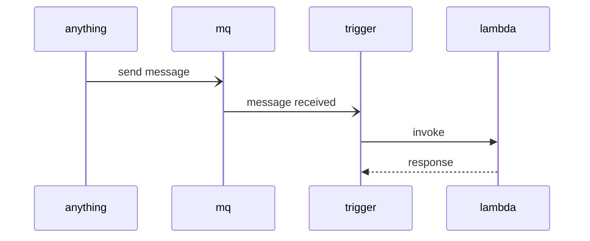
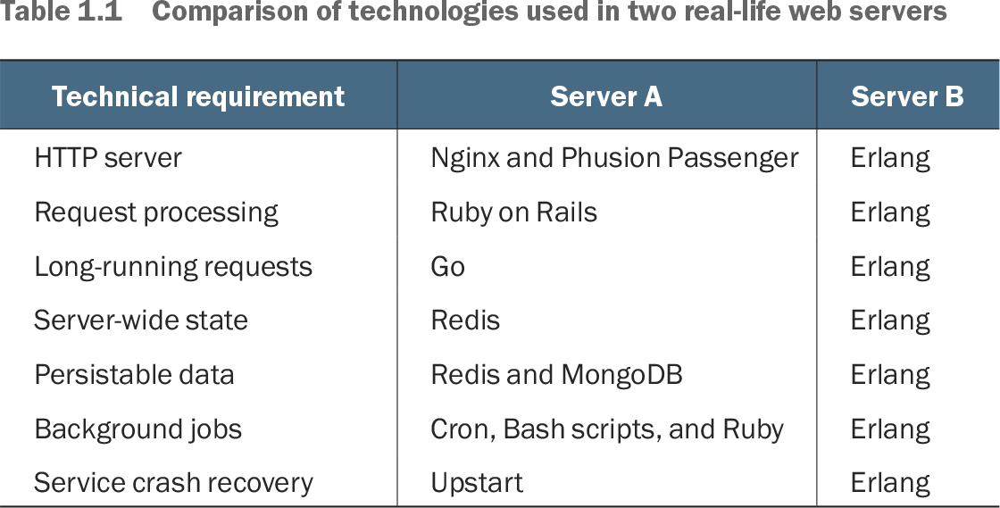
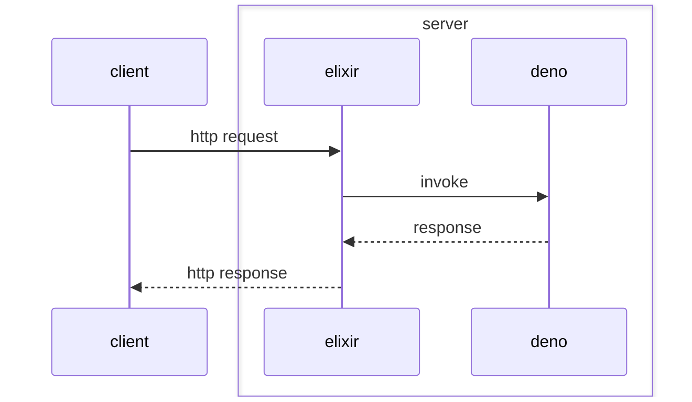
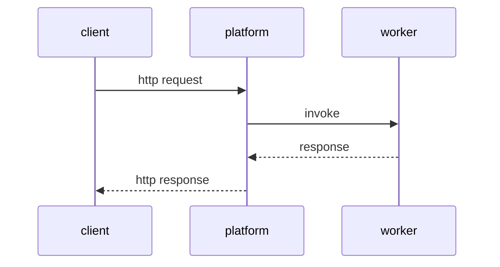
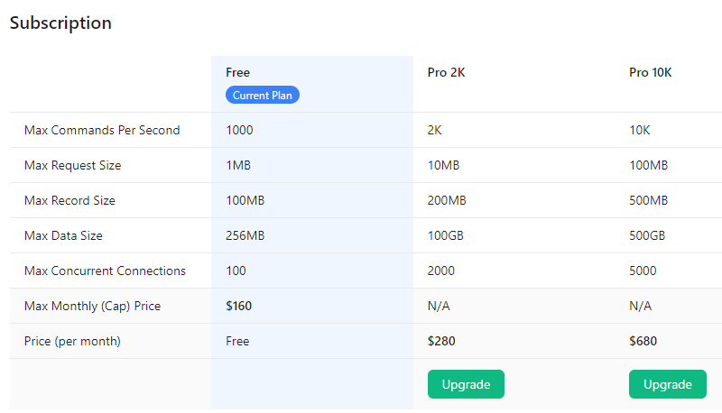
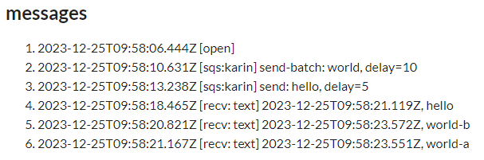

* 저장소
    * [karin](https://github.com/if1live/karin)
* 추상적 목표
    * 특정 이벤트 소스(event source)를 polling, 또는 스스로가 이벤트 소스로 작동
    * 이벤트가 발생했을때 대응되는 AWS Lambda 함수를 호출
    * 더 요약하면 custom aws lambda trigger?
* 구체적 목표
    * SQS 호환 인터페이스를 가진 Queue를 구현
    * Queue의 메세지를 소비해서 적절한 AWS Lambda 핸들러를 호출

## 동기

### AWS Lambda와 Amazon SQS의 Free-tier

[AWS 프리 티어](https://aws.amazon.com/free)

* AWS Lambda
    * 1백만 월별 무료 요청
    * 언제나 무료
* Amazon SQS
    * 1백만 요청
    * 언제나 무료

EC2, RDS, S3 같은건 12개월 무료인데 Lambda, SQS는 기간 제약이 없이 무료다.

> [Amazon SQS에서 Lambda 사용][aws-sqs]
>
> Lambda 함수를 사용하여 Amazon Simple Queue Service(Amazon SQS) 대기열의 메시지를 처리할 수 있습니다.
> Lambda 이벤트 소스 매핑은 표준 대기열 및 선입선출(FIFO) 대기열을 지원합니다.
> Amazon SQS를 사용하면 작업을 대기열로 전송하고 비동기식으로 처리하여 애플리케이션의 구성 요소 중 하나에서 작업을 오프로드할 수 있습니다.

이렇게 좋은 서비스 둘을 합치면 재밌는걸 할 수 있겠다.

### 숨겨진 비용

[serverless framework](https://www.serverless.com/framework/docs/providers/aws/events/sqs)를 사용하면 SQS 대기열에 메세지를 넣었을때 람다 함수가 호출되는걸 쉽게 구현할수 있다.
직접 배포하고 free-tier 사용량을 보면 메세지를 하나도 보내지 않았음에도 SQS 사용량이 존재한다.

> [Amazon SQS에서 Lambda 사용][aws-sqs]
>
> 표준 대개열의 경우 Lambda는 긴 폴링을 사용하여 대기열이 활성화될 때까지 대기열을 폴링합니다.
> 메시지를 사용할 수 있는 경우 Lambda는 함수를 동시에 5번 호출하여 한 번에 5개의 배치를 처리하기 시작합니다.
> 메시지를 계속 사용할 수 있는 경우 Lambda는 배치를 읽는 프로세스의 수를 분당 최대 300개의 추가 인스턴스까지 증가시킵니다.
> 이벤트 소스 매핑으로 동시에 처리할 수 있는 최대 배치 수는 1,000개입니다.

> [Amazon SQS 짧은 폴링 및 긴 폴링](https://docs.aws.amazon.com/ko_kr/AWSSimpleQueueService/latest/SQSDeveloperGuide/sqs-short-and-long-polling.html)
> 
> When the wait time for the ReceiveMessage API action is greater than 0, long polling is in effect. The maximum long polling wait time is 20 seconds.

> [Amazon SQS 요금](https://aws.amazon.com/ko/sqs/pricing/)
>
> 처음 1백만 개 요청/월: 무료
>
> Amazon SQS 요금은 어떻게 측정됩니까?
>
> API 작업: 모든 Amazon SQS 작업은 요청으로 간주됩니다.

문서에서 찾은 정보를 기준으로 SQS와 Lambda를 붙여놨을때의 비용을 계산해보자.

* 1분 (60초) = 3 * 5 = 15
    * 롱폴링 최대 대기 시간이 20초
    * 20초 후에 ReceiveMessage API는 비어있는 응답받고 다시 ReceiveMessage API를 호출하고, (이하 반복)
* 1일 (24 * 60분) = 4,320
* 1개월 (30일) = 129,600 = 대략 13만
* 5개 인스턴스 = 129,600 * 5 = 648,000 = 대략 65만
    * "메시지를 사용할 수 있는 경우 Lambda는 함수를 동시에 5번 호출하여 한 번에 5개의 배치를 처리"
* ReceiveMessage API 과금 대상
    * 모든 Amazon SQS 작업은 요청으로 간주
    * SQS는 요청 횟수가 비용 측정 기준

진짜 메세지는 하나도 SQS에 넣지 않았는데 SQS 프리티어를 절반 넘게 써버렸다!

이것과 관련된 문서는 AWS에도 있다.
[Why are my Amazon SQS charges higher than expected?](https://repost.aws/knowledge-center/sqs-high-charges)

### 명시적 비용: 0

SQS API 65만번을 비용으로 계산하면 얼마일까?
us-east-1, 표준 대기열 기준으로 요청 1백만 개당 0.40 USD 이다. 오늘 환율로 계산하면 ...

* 0.40 USD * 648,000/1,000,000 = 0.2592 USD
* 0.2592 USD * 1,297.64 KRW/USD = 336 KRW

500원도 안한다.
회사 코드에서 롱폴링으로 인한 ReceiveMessage API 호출 비용 고민하고 있으면 뻘짓이다.
이상한 생각하지 말고 그냥 쓰면 된다.

하지만 나한테는 조건이 다르다.
AWS Lambda로 올라가는 모든 프로젝트가 개인용 프로젝트이다.
SQS와 Lambda를 연결시키는 함수 하나당 400원을 지불하고 싶진 않다.
내가 만드는 대부분의 서비스는 한달에 요청이 몇 개 있지도 않을텐데 왜 비용을 써야지?

메세지큐를 통해서 람다를 호출하고 싶지만 비용은 쓰고싶지 않다.

### SQS의 대안

[AWS SQS hidden polling costs](https://levelup.gitconnected.com/aws-sqs-hidden-polling-costs-c263470329c9) 에서는 SQS대신 S3를 사용했다.
하지만 S3는 "12개월 무료"라서 안 땡기는걸...

AWS 프리티어로는 SNS, dynamodb같은 것도 있다.
이벤트가 발생했을때 람다를 호출한다는 관점에서 보면 SQS 대용으로 쓸 수 있다.
하지만 얘네는 진짜 메세지큐가 아닌걸...

이런 생각을 하다가 [fly.io](https://fly.io/)를 알게 되었다.
fly.io는 `shared-cpu-1x 256mb VMs` 3개를 무료로 사용할 수 있다.

잘 쓰면 내가 원하는걸 할 수 있겠는데???
그리고 2022년 5월, 기나긴 삽질이 시작되었다.

## 시도1. rust + rabbitmq

컨셉은 간단하다.

1. rabbitmq를 fly.io에 띄운다 (mq)
2. rabbitmq의 메세지큐를 구독해서 람다를 호출하는걸 구현한다 (trigger)

[elasticmq](https://github.com/softwaremill/elasticmq)를 사용하면 SQS 호환 레이어를 거져 먹을수 있다.
하지만 fly.io에 띄울라니까 고민이 생겼다.
fly.io는 `shared-cpu-1x 256mb VMs` 3개를 제공한다.
elasticmq를 256MB에 띄울 수 있을지 확신이 없었다.
그리고 3개 밖에 못띄우는데 그중 하나를 SQS 전용으로 채워야할까?

그래서 rabbitmq를 선택했다.
옵션 하나 손대면 256MB에 rabbitmq를 띄울 수 있다.
rabbitmq를 쓰면 mqtt로도 쓸 수 있으니까 elasticmq보다 유용하겠더라.

trigger는 rust로 구현해봤다.
메모리 256MB 제한이 걸려있으니까 가벼운걸 쓰고 싶었다.
rust에 async/await가 추가되었다길래 공부할겸 써봤다.

적당히 돌아가는 프로토타입은 만들었다.
rust용 AMQP client library 중 하나인 [lapin](https://crates.io/crates/lapin/0.35.0)으로 rabbitmq에 연결했다.
메세지를 받으면 [aws-sdk-lambda](https://crates.io/crates/aws-sdk-lambda)로 람다 함수를 호출했다.

하지만 프로토타입을 만드는 과정에서 문제가 있어서 최종적으로는 실패했다.

### 러스트의 끔찍한 컴파일 시간

AWS 공식으로 [AWS SDK for Rust](https://aws.amazon.com/sdk-for-rust/) 나왔다길래 써봤는데 컴파일이 너무 느렸다.
AWS 공식 rust sdk 버리고 [rusoto](https://github.com/rusoto/rusoto) 쓸까도 생각해봤다.
하지만 rusoto 들어가니 "Rusoto is in maintenance mode" 붙어있더라.
AWS SDK for Rust 쓰는게 맞는 선택같은데 컴파일 타임에서 인내심이 떨어져버렸다.

### 어떤 라이브러리를 써야지?

처음에는 amqp 클라이언트로 [amiquip](https://crates.io/crates/amiquip)를 골랐다.
amiquip 어떻게 쓰는지 익히고 aws-sdk-lambda랑 붙일하고 하니까...
으악? async/await? tokio? amiquip는 비동기를 위한 라이브러리가 아니다.
비동기 생태계와 동기 생태계가 꼬이니까 머리가 아퍼서 tokio랑 붙는 amqp 라이브러리로 다시 찾았다.

[lapin](https://crates.io/crates/lapin)은 tokio를 지원하길래 이거로 선택했다.
하지만 이런 라이브러리 삽질 과정에서 힘이 빠졌다.
내가 잘 아는 언어, 생태계였으면 어떤 라이브러리 써야할지 찾아볼 필요 없는데.
그냥 알고 있는거 쓰면 되는데.
내가 왜 러스트로 이 지랄을 해야지?

### 고통스러운 비동기 러스트

러스트에서의 메모리 소유권 정책은 깔끔하다. 비동기 러스트만 빼면.
`.clone()`, `move` 같은게 덕지덕지 붙으니까 이게 뭐하는지 짓인지 모르겠더라.
node.js에서는 몇분이면 짤 수 있는 간단한 기능을 비동기 러스트에서는 훨씬 더러운 코드로 오랜 시간에 걸쳐서 짜야하는데 뭐하자고 내가 러스트를 써야하나?
제대로 짜고 있는지도 모르겠는데.
컴파일만 통과하면 올바른 코드인가?

비동기 러스트랑 싸우다 힘이 빠져서 러스트를 더 못하겠더라.
(정신 승리하자면 나만 비동기 러스트 싫어하는건 아니더라.)
[Rust without the async (hard) part](https://lunatic.solutions/blog/rust-without-the-async-hard-part/)

### queue와 lambda를 어떻게 맵핑하지?

어떤 대기열로 요청이 들어왔을때 어떤 함수를 호출하는지 알아야 원하는 동작을 할 수 있다.
프로토타입을 구현할때는 queue 이름과 lambda 함수 이름을 하드코딩해도 된다.
실전으로 넘어가려면 하드코딩을 제거해야되는데 깔끔한 방법이 생각나지 않았다.

맵핑을 정의한 설정 파일을 만드는 방법이 있다.
이 경우 새로운 서비스를 만들때마다 설정 파일을 고쳐서 서비스를 다시 배포해야된다.
멍청한 방법같아서 그다지 고르고 싶지 않았다.

맵핑 정보를 DB에 저장하는 것도 방법이다.
DB에서 가져올 수 있다면 서비스의 재배포 없이 맵핑 관계를 고칠 수 있다.
하지만 rust에서 어떤 라이브러리를 쓰는게 좋은지도 모르는데 DB까지 손대야 한다?
ORM은 뭘 쓰지? mysql 연결할때는 뭘 써야지? ... 같은 문제로 삽질하고 싶지 않았다.
amqp 클라이언트 라이브러리 하나로도 고생했는데 얼마나 많은 삽질을 할지 뻔히 보이니까.

맵핑 정보를 DB로 관리한다고 치자.
새로운 프로젝트에서 람다 함수를 만들어서 SQS와 연결했다고 치자.
DB에도 이것이 반영되어야 한다. 손으로 관리하며 나중에 문제가 생길거같다.
맵핑을 관리할 더 쉬운 방법이 있어야하는데 그게 뭔지 모르겠다.

## 시도2. 자체 FaaS

[serverless-standalone][serverless-standalone-for-localhost]같은거 만들면서 람다의 동작을 흉내내는 방법을 익혔다.
내가 원하는 부분에 대해서만 잘 도는 람다 함수와 이벤트 트리거 만드는건 할 수 있겠더라.

[Elixir in Action](https://livebook.manning.com/book/elixir-in-action-second-edition/chapter-1/43)에 있는 짤이다.
(짤 자체는 Erlang in Action 책에서 처음 나왔다고 들었는데 직접 보진 못해서)
rabbitmq는 erlang 기반이고 256MB에 서버를 띄우는데 문제 없었다.
짤과 rabbitmq를 합치면?
erlang/elixir를 쓰면 메모리 256MB에서 웹서비스에 필요한 대부분의 요소를 우겨넣을 수 있다.

[deno](https://deno.com/)는 러스트로 구현된 자바스크립트 런타임이다.
이전 단계의 실패를 통해서 rust로 삽질하는 방법은 익혔다.
삽질의 경험을 다른 영역으로 확장할 수 있지 않을까?

webassembly에 관심이 생겨서 이것저것 찾다가 serverless platform을 직접 만드는 이야기를 몇개 봤다.
[Building a WebAssembly-powered serverless platform](https://blog.scottlogic.com/2022/04/16/wasm-faas.html)

FaaS (Function as a Service)를 요약하면 이벤트를 받아서 특정 코드를 실행하고 결과를 리턴하는 플랫폼이다.
내가 쓰는 규모에서는 스케일링은 고려할 필요 없다.
언어는 자바스크립트만 지원해도 된다.
이벤트 소스의 종류도 그렇게 많을 필요가 없다.
AWS Lambda 직접 만들기? 재밌을거같은데?

### all-in-one

[deno_ex](https://github.com/akoutmos/deno_ex)를 사용하면 elixir에서 js/ts 코드를 실행할 수 있다.
내부를 뜯어보면 [/usr/bin/deno](https://github.com/akoutmos/deno_ex/blob/91cda43/lib/deno_ex/pipe.ex#L16)를 실행하고 결과를 받는다.
별도 프로세스를 띄우지 않고 더 가볍게 elixir에서 js를 돌릴 방법은 없을까?

[rustler](https://github.com/rusterlium/rustler)를 쓰면 elixir에서 rust 함수를 호출할 수 있다.
deno는 rust로 구현되어있으니까 셋을 잘 이어붙인다면?
elixir, rustler, deno를 연결하면 elixir에서 자바스크립트 함수를 호출하고 결과를 받을수 있지 않을까?
이게 된다면 Lambda 처럼 쓸 수 있지 않을까?

1. elixir (phoenix)로 서버를 만든다.
2. http 요청을 받으면 rustler, deno를 사용해서 특정 자바스크립트를 실행한다.
3. 자바스크립트에서 받은 결과를 클라이언트로 전달한다.

프로토타입을 구현하는데는 성공했다.
하지만 플젝을 더 진행하기에는 문제가 많았다.

비동기는 여기에서도 지옥이었다.
이전에는 러스트 비동기로 고통받았다면, 이번에는 elixir, rust, deno 세개가 비동기로 얽혀서 돌아간다.
deno에서 호출하는 함수가 동기 함수라면 잘 돌아간다.
하지만 비동기 없는 자바스크립트? 이걸 왜 써야지?
비동기가 포함된 자바스크립트를 반드시 지원해야되는데 이를 깔끔하게 구현하는건 못하겠더라.

### 자체 PaaS + worker

비동기와 관련된 시스템을 직접 구현하는건 고통스럽다.
하지만 비동기는 반드시 있어야한다.
이를 타협해서 내가 만들기 쉬운 형태로 문제를 바꿨다.

* platform: elixir
    * http 요청을 받는다 (api gateway)
    * worker한테 요청을 보내고 응답을 받는다.
* worker: node.js
    * 요청을 받아서 처리하고 응답을 전달한다.

rustler, deno로 고통받다가 다 집어던지고 깡 node.js를 썻다.
fly.io 인스턴스 2개를 사용해서 하나에는 elixir 띄우고 다른 하나에는 node.js를 띄웠다.
구조가 간단해진만큼 프로토타입도 문제없이 뽑았다.
하지만 문제는 끝나지 않았다.

내가 만든 서비스의 배포는 어떻게 하지? 디버깅은 어떻게 하지?
AWS Lambda를 쓰면 `pnpm sls deploy` 한줄로 배포된다.
코드는 S3로 업로드되고 리소스 구성은 cloudformation로 관리된다.
문제가 생기면 cloudwatch를 뒤져서 로그를 찾아서 디버깅할 수 있다.

이 모든걸 직접 만드는건 미친 짓이다.
이건 사이드 프로젝트로 진행할 수 있는 규모가 아니다.
나는 결국 AWS Lambda에서 벗어날 수 없다.

코딩하다 힘이 빠져서 던졌다.

...

그리고 오랫동안 잊혀졌다.

## 번외. function url + FaaS router

serverless framework를 통해서 http api를 배포하면 접속할수 있는 URL이 생긴다.
https://abcdefghij.execute-api.ap-northeast-1.amazonaws.com 같은 형태인데 이를 외워서 접속하는건 말이 안된다.
[커스텀 도메인 설정](https://docs.aws.amazon.com/ko_kr/apigateway/latest/developerguide/http-api-custom-domain-names.html)을 쓰면 내 도메인으로 붙일 수 있다.
하지만 명시적 비용 0인 프로젝트를 목표로 한다면 도메인 값도 아껴야하지 않을까?

[vercel](https://vercel.com/), [fly.io](fly.io), [deno deploy](https://deno.com/deploy) 같은 서비스는 앱을 띄울때 서브 도메인을 준다.
이걸 대문 페이지로 쓸 수 있지 않을까?

1. deno deploy에 가입해서 https://index-page.vercel.app/ 같은 도메인을 확보한다.
2. 여기에 접속하면 https://abcdefghij.execute-api.ap-northeast-1.amazonaws.com 같은 http api 목록이 나온다.
3. 1단계를 거쳐야하지만 읽을 수 있는 도메인을 통해서 접속할 수 있다.

아쉽게도 `@aws-sdk/lambda-client`를 통해서는 람다에 연결된 http api의 주소를 알 수 없다.
주소를 관리하는 주체가 api gateway라서 람다에서 바로 접근할 수 없다.

[AWS Lambda Function URL](https://aws.amazon.com/ko/blogs/korea/announcing-aws-lambda-function-urls-built-in-https-endpoints-for-single-function-microservices/)이 2022년 4월에 추가되었다.
람다 함수를 만들때 Function URL을 설정하면 [ListFunctionUrlConfigs](https://docs.aws.amazon.com/lambda/latest/dg/API_ListFunctionUrlConfigs.html)을 사용해서 특정 함수의 URL이 뭔지 알 수 있다.
(Funciton URL은 https://abcdefghijklmnopqrstuvwxyz123456.lambda-url.ap-northeast-1.on.aws/ 같은 형태)

## karin

함수 URL을 얻는 API가 lambda에 있다면, 람다 함수와 어떤 SQS가 연결되는지 알 수 있는 API도 있지 않을까?
[ListEventSourceMappings](https://docs.aws.amazon.com/lambda/latest/dg/API_ListEventSourceMappings.html)을 쓰면 함수에 연결된 SQS 대기열이 뭔지 알 수 있더라.

...!

대기열 이름과 함수 맵핑을 내가 직접 관리할 필요가 있나? AWS 설정 그대로 갖다쓰면 되는거 아닌가?
ListEventSourceMappings API를 보고 깨달음을 얻어서 프로젝트를 다시 꺼내게 되었다.

* SQS 핸들러를 배포할때 `serverless.yml`에서 `enabled: false`로 설정한다.
    * SQS 과금이 발생하지 않도록 설정
    * diabled된 이벤트 소스 맵핑도 배포에 포함된다.
* ListEventSourceMappings API를 사용해서 SQS 대기열 이름과 연결될 함수 이름을 얻는다.
    * DB를 붙여서 ListFunctions API, ListEventSourceMappings API 결과를 통째로 저장한다.
    * 새로운 람다 함수가 배포되면 DB를 통째로 갱신하다.
        * 데이터의 원본은 AWS 자체니까 내 DB를 날려도 문제 없다.
        * 맵핑은 ListEventSourceMappings API 결과에 의해서 유도된다. 갱신 버튼만 누르면 된다.
* 웹기반 운영툴이 있어야한다.
    * 새로운 람다를 배포했을떄 클릭 몇번으로 맵핑을 동기화할 수 있어야 한다.
        * cli 기반으로 만들면 내가 사용법을 까먹는다. (또든 귀찮아서 안쓰게 되거나)
    * 서버의 작동 상태를 뜯어볼 방법이 필요하다.
        * 디버깅 해야되는 날은 결국 온다.
* 핵심 SQS API를 직접 구현한다.
    * SendMessage, SendMessageBatch, PurgeQueue
    * `@aws-sdk/sqs-client`로 SQSClient 객체를 호출할때 endpoint를 karin으로 연결한다.
    * karin이 SQS API를 그대로 구현했다면 호출하는 측에서는 구분할 수 없다.
    * amqp는 추가 패키지가 필요하다. aws-sdk는 람다 런타임에 포함되어있어서 그냥 쓸 수 있다.
* delayed message를 지원해야 한다.
    * delayed message가 되면 재밌는걸 이것저것 할 수 있는데 이건 나중에 다루는거로.
* 타입스크립트, node.js로 구현한다.
    * 익숙한 언어, 런타임을 사용해서 쓸데없는 삽질을 줄인다.
* 2주 안에 만들어야 한다.
    * 삽질 기간이 길어지면 힘이 빠져서 결국 접는다.
    * 멍청하게 구현해도 상관없으니 2주 안에 만들어야한다.
    * 돌아가는게 있으면 나중에 고칠 수 있지만 돌아가는게 없으면 아무것도 못한다.
* 실제로 돌아가는 예제와 같이 배포되어야 한다.

### project name?

rabbitmq 쓸거니까 프로젝트 이름을 miyako로 하려고 했다.

fly.io는 앱 이름에 맞춰서 도메인을 준다.
miyako는 이미 등록되어 있었다.
https://miyako.fly.dev/

글자 수 짧으면서 fly.io에서 앱 이름 비어있는거 찾다가 karin이 되었다.

### rabbitmq

rabbitmq + rust에서 rust를 포기하고 typescript를 선택한게 처음 시도였다.
뻔한 설계를 익숙한 언어로 하니까 프로토타입은 빨리 나왔다.
하지만 rabbitmq는 익숙한 도구가 아니라서 제대로 만드려면 삽질할게 보이더라.

* rabbitmq는 어떻게 관리하지? rabbitmq에서 문제 생겼을때 고칠 수 있나?
* 대기열과 함수이름의 맵핑은 동적으로 늘었다 줄었다하는데 이걸 어떻게 관리하지?
* npm에서 amqp 검색하면 라이브러리 몇개 나오는데 뭘 써야될지 모르겠다.
* rabbitmq에서 delayed message를 어떻게 구현하지?

처음으로 되돌아가서 rabbitmq를 꼭 써야하나?
rabbitmq 붙잡으면 삽질하다 또 말아먹을거같은데?

그래서 redis로 선회했다.
redis는 몇년동안 써서 어떻게 쓰면 될지 알거같다.
fly.io에서 [Upstash for Redis](https://fly.io/docs/reference/redis/) 무료로 제공하는게 있다.
rabbitmq 대신 redis 쓰면 fly.io 인스턴스 1개 아낄 수 있겠네.

### sqs: xml vs json

SQS는 2004년에 만들어진 서비스이다. AWS에 있는 기능 중에서 초기에 만들어진 물건이라서 요즘 관점에서 보면 프로토콜이 낡았다.
[아마존 SQS XML API 응답 해석](https://docs.aws.amazon.com/ko_kr/AWSSimpleQueueService/latest/SQSDeveloperGuide/sqs-xml-api-responses.html)
XML이라니! 요새 XML API 누가 써?

AWS도 낡았다는걸 알아서 JSON 프로토콜로 다시 만들고 있다.
[Amazon SQS에 대한 JSON 프로토콜 지원 평가판 발표](https://aws.amazon.com/ko/about-aws/whats-new/2023/07/json-protocol-support-amazon-sqs/)

별 생각없이 JSON 프로토콜 기준으로 SQS 호환 API 만들었는데 람다에 올렸더니 이상하게 터지더라.
[Lambda runtimes](https://docs.aws.amazon.com/lambda/latest/dg/lambda-runtimes.html) 문서 확인하보면 nodejs20.x는 3.362.0 SDK를 사용한다.
버전이 낮아서 XML 프로토콜만 지원하더라.
나는 람다 패키지 크기를 줄이려고 aws-sdk를 번들에서 제외한다.
어쩔수 없이 XML API 기준으로 다시 작성했다.
자체 PaaS 만든다고 삽질 한번 해봤더니 이런 문제는 빨리 찾아서 빨리 고칠수 있겠더라.

### redis

redis sorted set을 사용해서 delayed message를 구현했다.
sorted set의 score로 다음에 실행될 시간, member로 message_id를 넣었다.

메세지 자체는 TTL 걸린 strings로 저장했다.
string의 key로는 message_id를 사용했다.

redis는 익숙한 도구라서 삽질할게 없었다.

#### polling

최초 구현은 매우 무식하게 했다.
1초에 한번씩 루프를 돈다.
redis에서 `zrangebyscore`를 통해서 실행될 시간이 된 메세지를 찾는다.
메세지가 있으면 람다를 호출하고 없으면 1초 뒤에 다시 실행한다.

polling은 멍청한 구현이지만 나한테 중요한건 과금 여부이다.
비용만 발생하지 않는다면 초기 구현에서는 polling을 눈감을 수 있다.
fly.io에서 생성한 upstash redis 인스턴스에 들어가서 비용 걱정은 없겠더라.
그래서 배포를 했는데 3시간 만에 서버가 죽었다.

로그를 뜯어보니까 `ERR max daily request limit exceeded`
https://upstash.com/docs/redis/troubleshooting/max_daily_request_limit

[upstash redis의 Free](https://upstash.com/pricing)는 `Daily Command Limit: 10,000` 제한 있는건 알았다.
fly.io에서 띄우는건 daily command limit을 언급하지 않아서 괜찮은줄 알았는데 아니었다.
그래서 fly.io 내장 redis를 버리고 [Redis Labs](https://redis.com/)의 무료 redis로 교체했다.
redis labs의 무료 인스턴스 최고다.

#### pub/sub

polling은 너무 무식한거같아서 나중에 개선했다.
actor model과 pub/sub를 섞어서 구현했다.
elixir 붙잡고 액터 모델 삽질해보니까 이런건 actor model이 어울리더라.

* channel
    * queue의 변경을 알릴 채널을 정의한다.
    * SendMessage가 호출되었을때 publish
* actor
    * 대기열 1개당 1개의 actor
    * actor의 상태로 대기열 처리가 예약된 시간(reservedAt)을 저장한다.
    * 채널을 subscribe. SendMessage가 호출되면 reservedAt를 갱신하다
* 동작
    1. actor은 일정 주기(ex: 100ms) 간격으로 메인 루프를 실행한다.
    2. reservedAt을 지나면 redis에서 메세지를 읽어서 람다를 호출한다.
        * 메세지를 꺼내면서 다음 reservedAt을 찾아서 저장한다.
    3. 대부분의 시간에는 아무 작업도 하지 않는 redis로 요청을 보내지 않는다.
        * 자원 낭비가 폴링에 비해서 적다.
    4. 대기열이 비어있어서 reservedAt가 없어도 1분마다 대기열을 읽어서 처리한다.
        * 버그가 생겨서 메세지가 제대로 처리되지 않았을때의 안전장치

## 결과물

간단한 예제를 serverless로 람다에 배포했다.

1. SQS 핸들러가 호출되면 연결된 웹소켓으로 broadcast
2. delay seconds를 10초로 설정해서 SQS SendMessageBatch를 호출한다. 내용은 "world"
3. delay seconds를 5초로 설정해서 SQS SendMessage를 호출한다. 내용은 "hello"

예제를 실행하면 아래와 같은 결과를 얻을 수 있다.
delayed message, SQS SendMessage API 같은게 의도한대로 작동하는걸 볼 수 있다.

## next?

개인 플젝에서 SQS를 사용하는 기능을 작성한 적이 있는데 프리티어의 제약 때문에 내렸다.
고작 예제 때문에, 매달 400원씩 쓸 생각은 없다.
karin을 구현하게 되면서 비용을 신경쓰지 않고 SQS 핸들러를 정의할수 있게 되었다.
karin으로 연결해서 다시 배포해볼 예정이다.

대충 구현해서 race-condition 발생할 지점이 보이는데 언제 고치지...
race-condition이 실제로 문제를 일으킬 정도로 요청이 많이 들어오는 서비스가 생기면 그런건 진짜 SQS로 꽂아도 된다.
karin은 SQS의 비용을 줄이는게 목적이지 SQS를 대체하는게 목적이 아니다.

redis labs 무료 인스턴스는 최고다.
충성충성충성

이거 만들 시간에 최저임금으로 알바를 했으면 서버비 뽑고 남았을거다.
합리적 경제인이라면 이런거 만들지 말자.

삽질을 이것저것 하긴 했는데 삽질에서 얻은 경험이 최종 결과물에 반영되더라.
삽집이 효율적인건 아니지만 적어도 시간을 갖다버린건 아니었다.

[aws-sqs]: https://docs.aws.amazon.com/ko_kr/lambda/latest/dg/with-sqs.html
[serverless-standalone-for-localhost]: 
