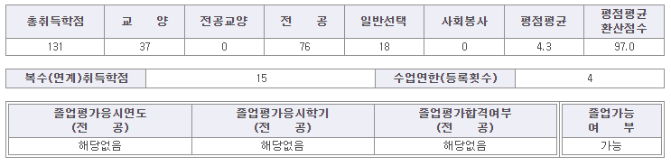
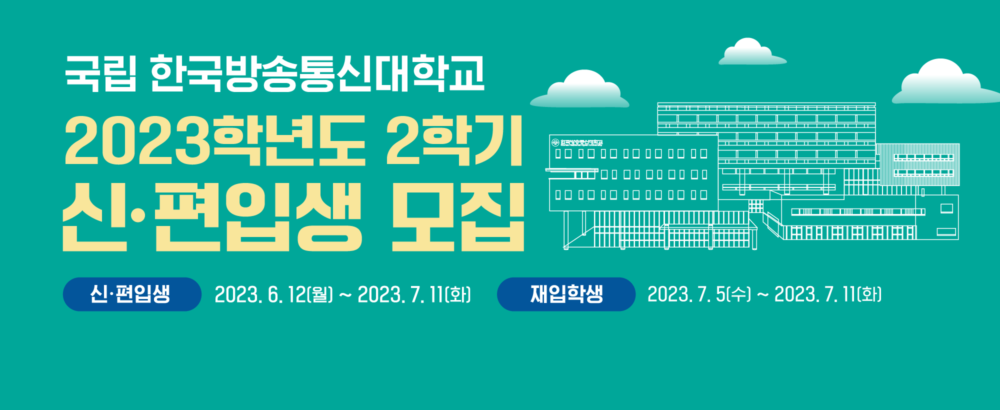
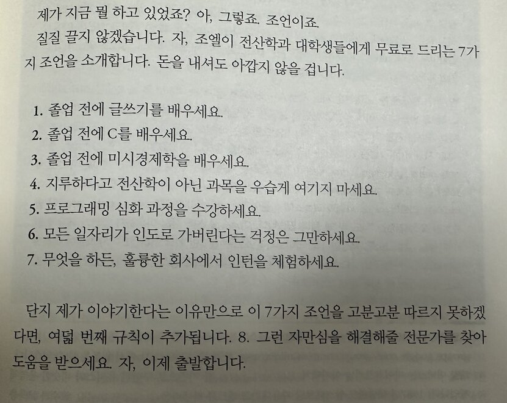
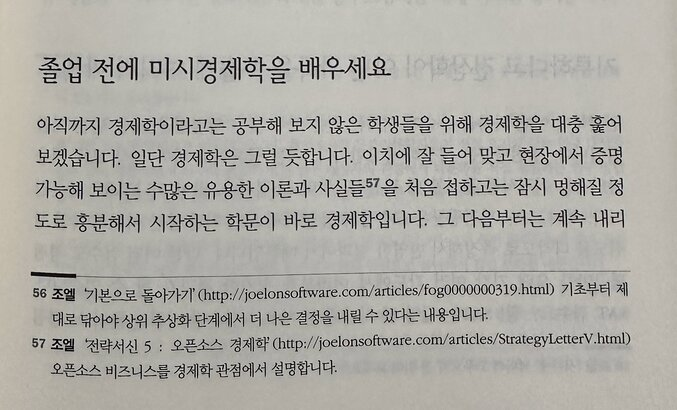
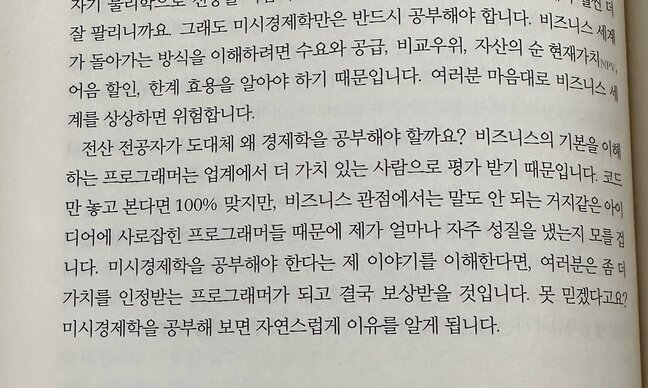

## 경제학과 졸업 가능

2021년 1학기에 한국방송통신대학교 경제학과로 3학년 편입했다.
그리고 2023년 7월 7일, 드디어 졸업가능 여부가 **가능**이 되었다.
졸업할 수 있게 되면 2.5년(4학기 + 1학기 휴학)동안 어떤 일이 있었고 어떤 생각을 하고 살았나 정리하려고 했다.
여기까지 왔으면 졸업장 받는건 시간 문제니까 미뤄놨던 글쓰기를 해보자.



글을 쓰는 목적이 하나 더 있다.
내가 졸업할 수 있게 된 시점이 신입생 편입생 모집 기간보다 앞에 있더라.
내가 겪은 고통을 다른 사람들도 겪으면 좋겠다.
방통대라는 고통의 길로 몇 명 보냈는데 고통받는 사람이 많으면 많을수록 좋겠다.



## 원래는 대학원을 가려고 했었다


취업같은 목적으로 특정 학과의 4년제 학위가 필요한 상황이면 방통대는 의미있다.
학위 자체가 목적일때 방통대보다 싸고 확실한 방법은 없을거다.

나는 2015년 8월에 연세대학교 컴퓨터과학과 학사학위를 받았다.
졸업 이전부터, 이후까지 프로그래머로 먹고 살고 있다.
원하는 전공의 학사 학위를 이미 갖고있으니까 대학원 진학을 생각하는게 일반적일거다.
뭣하러 방통대 가서 학사를 또 해? 할라면 방통대 석사는 해야지.


하지만 현실적으로 대학원의 벽은 높더라. 오랜 직장 생활로 돈맛을 알아버렸다. 대출도 있고.
이제와서 풀타임 석사를 하기에는 음... 이 돈으로 생활을 하라고? 대학원생들의 인생이 어떤지 이미 아는데?
반대로 파트타임 석사를 하기에는 음... 석사 학위 없어도 먹고 사는데 문제 없는데 왜 비싼돈 쓰고 석사를 하지?

대학원생이 되는것에는 거부감이 있었지만 석사 학위를 얻으면 인생에 도움될거라는 생각은 자주했다.
어쩌다보니 회사를 병역지정업체로만 다녔는데 이런데는 이공계 석사 학위를 갖고있는게 도움이 된다.
노예 생활로 석사 학위를 얻으면 새로운 노예를 확보하는 카드로 사용된다. 노예가 노예를 만드는 시스템이다.
[병역지정업체선정](https://www.mma.go.kr/contents.do?mc=mma0000761)

```
구분: 기업 등 부설 연구소
분야별: 기업부설연구기관
추천기준: 자연계분야 석사 이상의 학위를 가진 연구전담요원 5인(중소기업 부설연구기관은 2인) 이상확보
(* 창업기업에 한해 1인)
```

그래서 2020년 이전부터 방통대 대학원 정보과학과에 지원하는걸 생각은 했었다.
(회사 다니면서 내 돈내고 다니기에는 현실적인 선택지가 방통대 대학원뿐이더라)
하지만 매번 지원 시기를 놓쳐서 실행된 적은 없다. 게으르면 아무것도 못하더라.

## 투자, 인수, ...

* [라인게임즈, 게임 개발사 '5민랩'에 전략적 투자…파트너십 구축](https://www.etnews.com/20190910000254)
    * 2019-09-10 15:52
* [라인게임즈, 5민랩과 '스매시 레전드' 퍼블리싱 계약 체결](https://www.etnews.com/20200507000143)
    * 2020-05-07 11:27
* [5민랩, 시리즈 A 60억 원 규모 투자 유치 성공](https://www.thisisgame.com/webzine/news/nboard/4/?page=119&n=112614)
    * 2020-10-26 11:35:27
* [크래프톤, 게임 ‘스매시 레전드’ 만든 5민랩 238억원에 인수](https://biz.chosun.com/it-science/ict/2022/02/11/TJGYRITGARELLFTOS5BCFFQKI4/)
    * 2022.02.11 08:53

5민랩이라는 회사는 2013년 9월 24일에 설립되었다.
내가 5민랩에 입사한건 2014년 12월인가? 2015년 1월인가? 그쯤이다.
창업 시점에 있던 개국공신은 아니지만 나름 초기 멤버로 들어갔다.

5민랩으로 투자가 실행된 다음에 보도자료가 나간건 2019년이 처음이다.
실행되지 않은 투자 이야기는 2019년 이전에 몇건이나 있었을까? 몇년도에 처음 투자 이야기가 나왔을까?
실제로 인수된건 2022년인데 인수가 처음 언급된건 언제였을까?
그건 독자의 상상에 맡긴다.

스타트업 초기에 들어가면 여러가지를 보고 배울 수 있다.
스타트업에서 살아남기 위해서는 코딩 기술? 그런거 이외의 무언가를 더 배워야한다는걸 느꼈다.

## 졸업 전에 미시경제학을 배우세요

> 슈카월드에서 2028년 수능부터 “경제” 과목 퇴출 소개를 한거 보면,
> 경제는 이공계도 공부을 해야 한다고 보고 있음.
> 지금은 절판된 “모어 조엘 온 소프트웨어”를 보면 “졸업 전에 미시경제학을 배우세요”라고 함.
> 전산학은 최근에 생긴 응용 학문이며, 이 학문은 비즈니스가 주도를 하기 때문.
> https://twitter.com/studioego/status/1593894123630579712






옛날 옛적에 [조엘 온 소프트웨어](https://www.yes24.com/Product/Goods/1469763), [모어 조엘 온 소프트웨어](https://www.yes24.com/Product/Goods/3563799)를 읽었던게 생각났다.

미시경제학을 대학교 다닐때 듣지 않았으니까 대학교 한번 더 가서 들으면 되겠네?

## 초기 계획

내가 편입할때는 방통대의 졸업요건이 140학점이었다. 3학년으로 편입하면 70학점이 인정된다.

18학점씩 4학기를 들으면 72학점 채워서 140학점 넘기고 졸업할 수 있다.
회사 다니면서 18학점을 할 자신이 없더라. 한과목이라도 빵꾸나는 순간에 5학기가 확정된다.
그래서 여유있게 5학기 졸업으로 계획을 세웠다. 15학점씩 5학기 들으면 75학점이니까 140학점 넘겨서 졸업할 수 있다.
시간 남는 학기에는 18학점 듣는식으로 학점을 추가로 확보하면 한두과목 망해도 5학기 졸업에는 문제 없다.

사회 과목은 고등학교 1학년 이후로 공부한적 없어서 3학년 편입이지만 1학년 전공부터 순서대로 듣기로 했다.
과목명만 들어도 중요해보이는 기초미시경제론, 기초거시경제론, 고급미시경제론, 고급거시경제론부터 쌓아올라가면서 고학년 과목도 들으려고 했다.

초기 계획은 시작하고 얼마 지나지 않아서 박살났는데 그건 다음에 언젠가 글쓰는거로.
