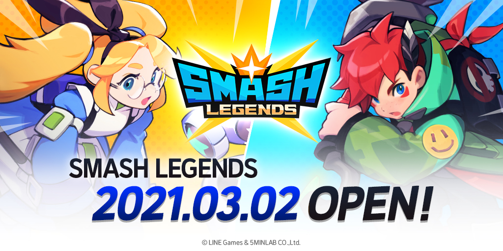
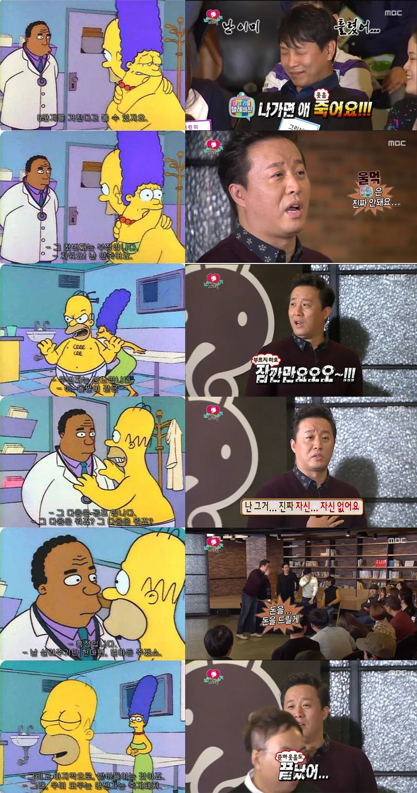
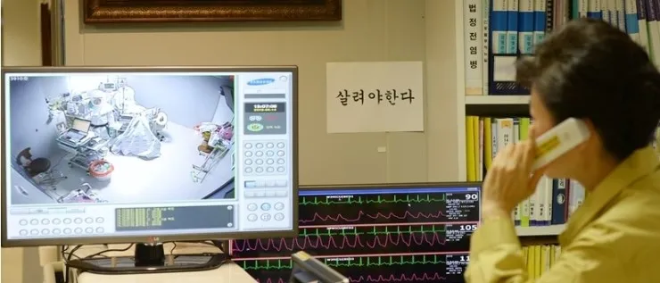
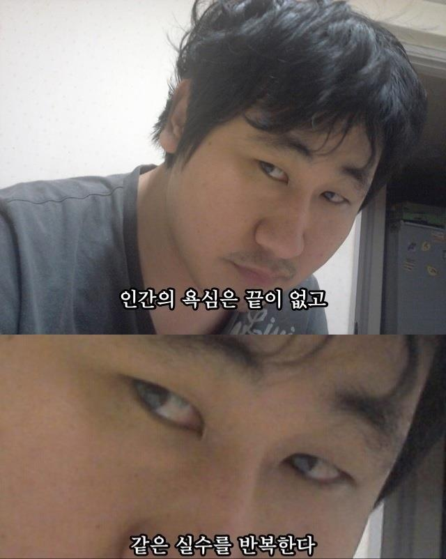

## 개요

오프라인 대학교를 다닐때는 공부만 하니까 복잡한 일이 벌어지지 않았다.
방송대를 다니는 동안에는 회사도 다녀서 많은 일이 있었다.
그리고 회사조차 남들이 웬만해서는 볼 수 없는 패턴으로 돌아갔다.
입학부터 졸업할 때까지 어떤일이 있었는지 타임라인으로 정리해봤다.

쓰다보니까 방송대 이야기보다 스매시 레전드 이야기가 많이 나오는데 그건 어쩔 수 없다.
내 인생의 적어도 2년은 꼬라박았고 사고방식을 비가역적으로 바꾼 프로젝트니까.

## 방송대 지원 이전

* 2007-03-02: (연세대학교) 화공·생명공학부 입학
* 2008-02-29: (연세대학교) 화학공학
* 2009-02-28: (연세대학교) 화학공학에서 컴퓨터과학(으)로 소속변경
* 2015-08-28: (연세대학교) 졸업

옛날 옛적에 화학공학으로 입학했다가 나중에 컴퓨터과학으로 전공을 바꿨다.
당시에는 화학공학의 위상이 컴퓨터과학보다 높았고 입학 점수 역시 높았다.
주변에서 처음부터 컴퓨터로 입학하지 왜 멍청한 선택을 했냐고 놀렸다.
그리고 15년뒤, 전공과 관련된 멍청한 선택을 반복한다.

## 2021년 1학기

* 2020-12-20: (한국방송통신대학교) 편입 신청
* 2021-03-02: (한국방송통신대학교) 3학년 편입
* 2021-03-02: (스매시 레전드) 소프트런칭
* 2021-04-13: (스매시 레전드) 글로벌런칭



[스매시 레전드](https://smashlegends.com/)는 5민랩에서 개발하고 라인게임즈에서 퍼블리싱한 게임이다.
(2022년부터는 모든게 바뀌었는데 그건 나중의 이야기)
나는 여기에서 서버 개발을 주로 맡았다.
(서버라고 해도 게임에 있는 서버가 한두개가 아니다. SL을 해본 사람이 상상하는 서버랑 내가 손댄 서버는 다를 수 있다)

2021년 3월 2일은 스매시 레전드 소프트런칭 하는 날이었다.
데스크탑을 들고 라인게임즈 사무실로 출근했다.
그리고 많은 일이 시작되었다.

인생은 실전이다. 동시 접속 유저수, 서버 부하가 CGT의 수백, 수천배로 늘어났다.
출시 이전부터 광고를 많이 해서 출시하자마자 사람들이 잔뜩 들어오더라.
한번도 보지못한 문제가 연속적으로 터졌다.

스매시 레전드는 글로벌 서비스하는 게임이다. 소프트 런칭한 지역(영국)과 메인 서버가 있는 위치가 달랐다.
으... 빛의 속도가 얼마나 느린지는 글로벌 서비스를 런칭한 사람이면 누구가 알게 된다. 모르고 싶어도 알게 된다.
글로벌 서비스하는 + 원빌드 + 실시간 멀티플레이 게임에서만 볼수 있는 온갖 문제가 소프트런칭부터 터지더라.

수많은 문제를 잡고 앞으로도 수많은 버그를 잡아야한다는걸 생각하면서 사무실로 돌아왔더니 회사 분위기가 참 재밌더라.
서비스의 문제와 관계 없는 사람들은 출시했으니까 축제 분위기, 버그 터진거 때워야하는 당사자들은 초상집 분위기.
그리고 나도 초상집 분위기 ㅋㅋㅋ
3월 2일에 퇴근 못했다. 3월 3일에 새벽에나 퇴근했을걸?

방송대 학사 일정이 공시적으로 시작되는 날부터 내 인생은 SL의 라이브, 버그 수정, 안정화, 피쳐 개발, ... 수많은 폭탄으로 조져지기 시작했다.
그리고 이제 시작했을 뿐이다. 소프트런칭이 3월 2일, 글로벌런칭은 4월 13일이다.
한달로는 소프트런칭에서 발견된 버그를 고칠수 없다.
근데 스매시 레전드 광고가 지하철에서 보이더라??? 진짜로 4월 13일에 글로벌 런칭 (한국 포함) 하는거야?

진짜 글로벌 런칭 했다. 런칭을 한건건지 런칭 당한건지.
게임에는 아직 수많은 버그가 남아있고 퍼블리셔는 광고를 태우기 시작하고 으...
SL이 굴러가는게 우선순위가 높으니까 방송대는 첫학기부터 꼬이기 시작했다.

그래도 어떻게든 라이브에 있는 버그 틀어막으면서 친선전 피쳐 넣고 좀 살만해졌다.
[라인게임즈, ‘스매시 레전드’ 신규 캐릭터 ‘플레어’ 추가… 친선전·데스매치 업데이트](https://www.newscj.com/news/articleView.html?idxno=869723)
(지금 생각하면 라인게임즈는 무슨 생각으로 친선전 기능도 없는 게임을 런칭하려고 했나 모르겠다)

| 이수학과 | 이수학년 | 교과목명 | 교과분류 | 학점 | 점수 | 등급 |
|---|---|---|---|---|---|---|
| 경제학과 | 1 | 경영학원론 | 전공 | 3 | 98 | A+ |
| 경제학과 | 1 | 기초미시경제론 | 전공 | 3 | 93 | A0 |
| 경제학과 | 2 | 서양경제사 | 전공 | 3 | 100 | A+ |
| 경제학과 | 2 | 경제통계의이해 | 전공 | 3 | 97 | A+ |
| 경제학과 | 3 | 원격대학교육의이해 | 교양 | 1 | 80 | P |

입학하는 시점부터 18학점 4학기 졸업을 포기한건 합리적인 선택이었다.
신작 런칭 및 라이브와 18학점은 공존할 수 없다.
재무회계원리를 넣어서 15학점까진 해보려고 했지만 역시 미친 짓이었다. (재무회계원리는 한참 뒤에나 들었다)
그래도 12학점으로 어떻게든 첫학기를 통과했다.


## 2021년 2학기

* 2021-11-02: (한국방송통신대학교) 복수전공신청 (통계·데이터과학과)

모바일 게임은 출시하고 2개월이면 성과부터 미래까지 나온다.
사실 짧으면 2주, 길면 4주 사이에 모든게 결정된다.
나머지 기간은 [이를 받아들이는 과정](https://namu.wiki/w/%EC%A3%BD%EC%9D%8C%EC%9D%98%205%EB%8B%A8%EA%B3%84)이다.



스매시 레전드의 성과도 5월, 6월에 사실상 나왔다.
그리고 몇개월 동안 성과를 받아들이는 과정을 거치고 다음 할일이 결정되었다.

[크래프톤 5민랩, 스매시 레전드 리뉴얼 업데이트](https://zdnet.co.kr/view/?no=20220316101156)
2022년 3월 15일에 대규모 업데이트를 했다.
21년의 22년의 스매시 레전드의 차이를 아는 사람이 얼마나 있을지 모르겠다.
대규모 리뉴얼 업데이트를 준비하는데 얼마나 많은 시간이 들어갔을까?
22년 3월 15일에 들어간 업데이트는 언제 기획되었을까?

[크래프톤, 게임 ‘스매시 레전드’ 만든 5민랩 238억원에 인수](https://biz.chosun.com/it-science/ict/2022/02/11/TJGYRITGARELLFTOS5BCFFQKI4/)
2022년 2월 11일에 회사가 팔리는 뉴스가 나갔다.
22년 2월 11일에 회사 팔리는 뉴스가 나가려면 밑작업은 언제부터 시작되었을까?

21년 2학기에는 외부에서 볼 수 있는 큰 일은 많지 않았지만 내부에서는 정말 많은 일이 있었다.
너무 많이 떠들면 나중에 회사에서 혼날지 모르니까 나머지는 상상의 영역으로 맡긴다.

| 이수학과 | 이수학년 | 교과목명 | 교과분류 | 학점 | 점수 | 등급 |
|---|---|---|---|---|---|---|
| 경제학과 | 1 | 기초거시경제론 | 전공 | 3 | 100 | A+ |
| 경제학과 | 1 | 재테크와금융투자 | 전공 | 3 | 96 | A+ |
| 경제학과 | 2 | 디지털경제의이해 | 전공 | 3 | 100 | A+ |
| 경제학과 | 2 | 경제분석의역사 | 전공 | 3 | 100 | A+ |
| 경제학과 | 3 | 플랫폼경제의이해 | 전공 | 3 | 100 | A+ |
| 경제학과 | 3 | 도시경제학 | 전공 | 3 | 100 | A+ |

게임 자체를 망가뜨리는 버그(예: 로딩이 안되요)는 대부분 고쳐서 21년 2학기에는 어떤 의미로는 평화로웠다.
(유저 수가 적으면 발견되는 버그도 적다. 모르는게 좋은 진실이다)

2학기는 18학점을 들었다. 경제분석의역사 수업을 듣다가 통계없는 경제학은 반쪽짜리라는 생각을 하게 되었다.
그래서 통계·데이터과학과로 복수전공 신청했다.
내가 컴퓨터과학 전공할때는 알파고 나오기 전이라서 인공지능 수업도 안들었다.
알파고 나오고 AI가 떡상하면서 통계학을 배워야겠다는 생각은 했는데 좋은 기회가 생겼다고 판단했다.

회사에서 복수전공한다고 이야기 했더니 컴퓨터/경제학/통계학 들으면 인간성 상실 3종 세트라고 놀리더라.

18학점 듣고 성적도 잘 뽑아서 장학금 받았다.
성적우수 장학생 중 에서 "성적우수 우수"로 선발되면 다음 학기 등록금은 없다.
성적우수 장학금 덕분에 학사 학위 자체가 목표인 경우에는 방송대가 제일 싸다는거다.

## 2022년 1학기

* 2022-03-15: (스매시 레전드) 대규모 업데이트
* 2022-03-25: (한국방송통신대학교) 휴학

런칭을 한번 더 했다. 22년 3월 15일 업데이트는 점검 시간 역시 대규모였다.
3얼 15일은 단순한 점검이 아니었다. 5민랩이 퍼블리싱을 직접 하게 되면서 많은걸 이관받았다. 그리고 없는 것은 새로 채워야 했다.

퍼블리셔들은 자신들의 인증, 결제, 같은 범용적인 기능의 SDK를 개발사에게 제공하고 이를 연동하게 만든다.
자신들의 인증 시스템에 등록되어야 퍼블리셔가 CS를 대응할 수 있다. 결제 역시 퍼블리셔에서 CS를 해야되니까 결제도 퍼블리셔를 거친다.
이런것 외에도 쿠폰, 공지사항 같은 수많은 기능을 퍼블리셔에서 제공한다. 그래야 자신들이 서비스를 운영할 수 있으니까.

5민랩이 자체 퍼블리싱한다는건 이 모든걸 직접 한다는거다.
바닥부터 다시 그나마 낫다. 이전에 되던걸 그대로 가져와야하는게 이전의 구조가 라인게임즈에 종속되어있으면 그대로 가져오는건 불가능하다.
말이 안되는거같은데 저 말도 안되는 일을 했다. 으... 정말 거지같은 일이 많았는데 너무 많이 떠들면 혼나니까 적당히 쓰다가 자른다.
무엇을 상상하든 그 이상을 보게 된다.

> “사람들이 절대 지켜봐서는 안 되는 두 가지가 있다. 바로 소시지 만드는 것과 법률 만드는 것이다.” - 미국 작가 마크 트웨인
>
> https://www.hani.co.kr/arti/politics/polibar/761847.html
>
> “사람들이 절대 지켜봐서는 안 되는 두 가지가 있다. 바로 소시지 만드는 것과 게임 만드는 것이다.” - ???

3월 16일 새벽에 집 갔나? 아니, 집을 가긴 했던가? 16일 03시에 버그 잡던 기억은 있는데.
그리고 15일, 16일로 조용히 끝날리가 없다. 이관 이후로는 문제가 끝없이 터졌다.
하... 이거 하기 싫어서 라인게임즈 퍼블리싱 유지하면 안되겠냐고 징징댔는데 크래프톤에 팔린 회사를 라인게임즈가 관심 가질리도 없고.

이관이 끝난 다음에는 피쳐 추가가 이어졌다.
[크래프톤 5민랩, 스매시레전드 경쟁전 12일 업데이트 예고](https://zdnet.co.kr/view/?no=20220408111722)
스매시 레전드 경쟁전 하다가 혈압 오른 유저들 많을텐데 내가 조금 기여했다. 혈압의 5mmHg 쯤은 내 몫 아닐까?

> 고객을 “유저”라고 부르는 딱 두 개의 산업이 있다. – 마약, IT (Edward Tufte, 데이터 시각화의 선구자)

이번학기는 시작하고 일주일만에 휴학했다. "SL을 살려야한다"



## 2022년 2학기

* 2022-08-31: (한국방송통신대학교) 복학

모바일 게임은 출시하고 2개월이면 성과부터 미래까지 나온다.
사실 짧으면 2주, 길면 4주 사이에 모든게 결정된다.



21년에 했던걸 반복했다.
리뉴얼의 성과는 좋지 않았고 다음 계획이 돌아갔다.
나는 SL에서 짤렸다. SL을 살릴 수 있는 사람을 SL을 열심히 하는 사람들 뿐이다.
브실골은 SL 개발에 참가할수 없다 (뇌피셜)

다른거 하러가서 이전보다 편하게 살았다.
게임 라이브 서비스 하면 인생과 인성이 깎여나간다. 니들은 이런거 하지마라.
흡연자들이 "후... 니들은 이런거 피지마라" 하는거랑 비슷한거 아닐까?

| 이수학과 | 이수학년 | 교과목명 | 교과분류 | 학점 | 점수 | 등급 |
|---|---|---|---|---|---|---|
| 통계·데이터과학과 | 1 | 데이터과학개론 | 일반선택 | 3 | 100 | A+ |
| 경제학과 | 2 | 고급거시경제론 | 전공| 3 | 100 | A+ |
| 통계·데이터과학과 | 2 | 파이썬과 R | 일반선택 | 3 | 97 | A+ |
| 통계·데이터과학과 | 2 | 빅데이터의이해와활용 | 일반선택 | 3 | 94 | A0 |
| 경제학과 | 3 | 화폐금융론 | 전공 | 3 | 98 | A+ |

1년전에 18학점 들으면서 혼이 빠져서 12학점 듣고 있었는데 화폐금융론이 고급거시경제론하고 별 차이 없더라?
그래서 3학점 끼워넣으면서 15학점을 들었다.

통계학과 복수전공이 승인되서 통계학과 과목을 들을수 있게 되었다.
근데 통계학개론, 확률의개념과응용 같이 과목명만 봐도 기초같은건 1학기 과목이더라.
복수전공 학점은 채워야겠고 통계학, 데이터과학이 뭐하는 학문인지 모르겠으니 적당히 입문 과목을 채웠다.

몇년동안 회사에서 일을 너무 쳐맞아서 정신적으로 피곤해지고 쉬운 과목으로 도망친 학기였다.
방송대 다니면서 이렇게 살면 안된다.
고통의 길을 선택했으면 더 고통받아야한다.

지금와서 생각하면 합리적인 선택은 통계학과 과목을 빼고 경제학 과목을 더 많이 넣는거다.
통계학 복수전공은 결국 버렸거든 ㅋㅋㅋㅋ
비슷한 느낌으로 멍청한 선택을 한게 화공으로 입학했다가 컴퓨터과학으로 전과한거다.
분석화학, 물리화학으로 6학점 소모되었는데 저 과목은 내 인생, 사고방식에 앞으로도 아무 영향을 주지 않을거다.
아무 의미 없이 낭비된 6학점

## 2023년 1학기

* 2023-06-05: 졸업학점이 바뀐걸 깨달음
* 2023-06-27: (한국방송통신대학교) 복수전공취소신청
* 2023-07-07: (한국방송통신대학교) 졸업 가능 여부: 가능

| 이수학과 | 이수학년 | 교과목명 | 교과분류 | 학점 | 점수 | 등급 |
|---|---|---|---|---|---|---|
| 경제학과 | 1 | 재무회계원리 | 일반선택 | 3 | 90 | A0 |
| 경제학과 | 2 | 고급미시경제론 | 전공 | 3 | 90 | A0 |
| 통계·데이터과학과 | 2 | 통계학개론 | 일반선택 | 3 | 100 | A+ |
| 통계·데이터과학과 | 2 | 확률의개념과응용 | 일반선택 | 3 | 100 | A+ |
| 경제학과 | 3 | 기업경제학 | 전공 | 3 | 68 | D+ |

통계학과 1학년 과목을 들을수 있게 되었다.
통계학이 뭐하는 물건인지 알아야 더 진행할지 말지 결정할거 같아서 통계학개론, 확률의개념과응용을 넣었다.
고급미시경제론은 조엘 이야기 듣고 듣고싶었던거라 수강신청했다.
서양경제사, 경제통계의이해 같은 수업에서 복식부기를 하도 강조해서 재무회계원리도 넣었다.
(나중에 재무회계원리의 진실을 깨달았지만)
회사가 바뻐질거같은 느낌이 들어서 12학점을 들을 계획이었으나 수강신청은 선형회귀, 기업경제학도 넣어서 18학점 수강신청 했다.

통계학개론 들어봤는데 통계학은 재미없었다. 통계학은 나랑 맞지 않은 학문이었다.
고등학교, 대학교 다닐때도 통계를 배웠는데 하나도 기억나지 않은 이유를 깨달았다.
너무 재미없어서 스스로 기억에서 지워버린거 아닐까?

시험 공부를 하다가 공부하기 싫어서졸업 요건을 눌러보다 모르면 좋았을(?) 정도를 알게 되었다.

3학년 편입생이 졸업하려면 전공을 69학점 이상 들어야한다.
3학년 편입하면 34학점이 인정된다. 35학점 더 들으면 되니까 전공 12과목을 들으면 된다 (3x12)
경제학이 뭔지 아직 잘 모르겠는데 졸업에 필요한 전공과목 학점을 채워버렸더라???
졸업을 위한 길은 이번 학기 이후로 경제학 과목은 하나도 듣지 않고 통계학 과목만 수강해서 학점 채우는거라니!
경제학 수업을 하나도 듣지 않는게 경제적으로 합리적인 선택이라니 ㅋㅋㅋ
복수전공같은 멍청한 선택을 하는게 아니었어.


[졸업소요 이수학점(이하 ‘졸업학점’) 조정 안내](https://www.knou.ac.kr/knou/561/subview.do?enc=Zm5jdDF8QEB8JTJGYmJzJTJGa25vdSUyRjUxJTJGMjY4MTA1JTJGYXJ0Y2xWaWV3LmRvJTNG&epTicket=ST-90262-rJ3XfWnpDBeRxmanEzxILcs20pYEkV9hErb-14)

```
1. 제도 개요
가. 졸업학점 조정 : (기존) 140학점 이상 → (변경) 130학점 이상
나. 시행일자 : 2022년 3월 1일부터
```

졸업 학점이 바뀌었다!!!!!
원래 계획했던대로 12학점 들으면 128학점이 되서 올해 졸업을 못한다.
중간과제물조차 내지 않았던 기업경제학을 D0이라도 받고 복수전공을 포기하면 131학점이 되니까 졸업할 수 있더라.

그래서 벼락치기로 기업경제학 공부해서 D+을 받았다.
한문제도 안틀렸으면 70점 되서 C0 받을수 있었는데 한문제 틀려서 68점으로 D+가 되었다.
그래도 졸업을 할 수 있는게 어디냐.
경제학적으로 봐서 다음학기 한번 더 하고 등록금 또 내는것보다 빨리 졸업하는게 합리적인 선택이다.

## 결론

내가 저지른 멍청한 결정이 몇개 있는데

* 통계학과 복수전공을 하지 말았어야했다.
    * 경제학 수업이나 더 들을걸. 언제 다시 공부할지 모르겠는데
    * 전과같은 느낌의 멍청한 짓을 한번 더 하다니...
* 22년 2학기를 더 힘들게 살았어야했다.
    * 이때 통계학 공부를 더 빡쎄게 했으면 복수전공 취소를 빠르게 결정하고 6학점을 벌었을텐데
    * 화공에서 컴퓨터과학으로 전과하면서 6학점 낭비했는데 이번에는 통계학을 버리면서 15학점 날렸다
    * 15학점 분량의 경제학 수업이 기회비용으로 사라졌다.
* 4학년 과목을 하나도 안 들음
    * 정신차려보니 3학년 과목까지만 듣고 졸업학점이 채워졌더라.
    * 경제학에서 뭐 배웠냐고 물어보면 답하기 부끄럽다.

그래도 멀쩡한 선택을 한것도 많다.

* 기업경제학 D+은 합리적인 선택
    * 방송대 성적표 누가 보겠어? 일단 졸업이니까
* 졸업요건을 챙겨보는건 가능했을까?
    * 졸업요건이 바뀌는건 생각도 안했던 시나리오
    * 게다가 입학년도 기준이 아니라 전체에 적용된건 운이다.
    * 운이 좋아서 이번 학기에 졸업했다.
* 5학기 졸업 계획 자체는 벗어나지 않음
    * 졸업학점이 바뀌지 않았다고해도 5학기 졸업 계획 자체는 틀어지지 않았다.
    * 계획된 범위 안에서 수업을 포기해서 졸업 학점을 맞출 수 있었다.
* 어떻게든 회사일이 돌아감
    * 수업/학점 때문에 회사 일이 터진적은 없다.
    * 회사 일 때문에 학점은 터졌지만. 그래도 졸업한게 어디냐
