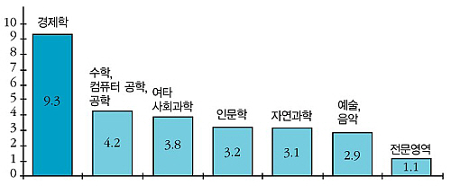
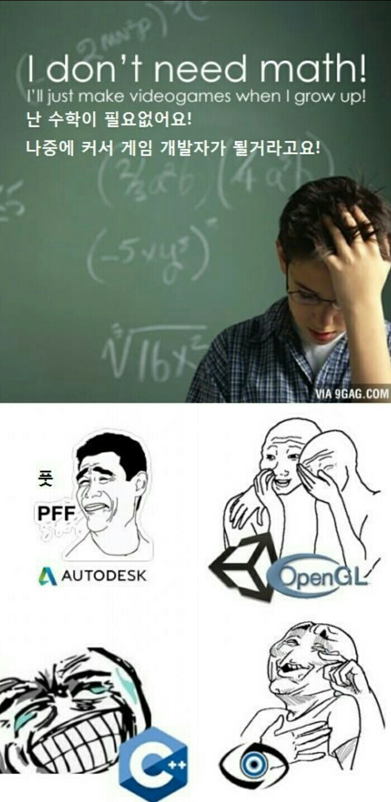
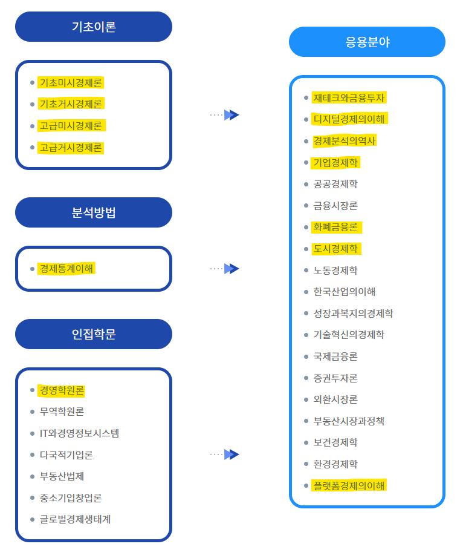
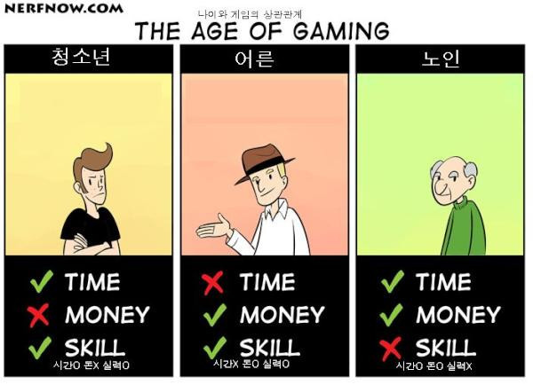

## 주의

이번 글은 주관적인 내용이다.
글쓰기 어려운 주제라서 쓸까 말까 고민했는데 시간차를 두고 학사 두 번 해봐야 보이는 주제같아서 써본다.

내가 하는 말이 틀렸다고 생각하면 뒤로가기를 누르면 된다.
반박 받지 않습니다.

## 전공이란 무엇인가?

나이먹고 경력이 늘어나니까 회사에서 귀찮은 일을 시킨다. 면접관으로 들어가는거다.
신입 프로그래머 면접이 잡히면 이력서와 포트폴리오를 읽어보면서 여려가지 생각을 하게 된다.
전공이 무엇인가? 컴공을 전공했으면 무엇을 배웠을까? 해본 일은 무엇인가? 포트폴리오는 어떻게 생겼나?
주어진 정보를 기반으로 면접의 기대선을 잡는다.
기대선이 있는 상태로 면접에 들어가야 기대보다 잘하는지 못하는지를 판단할 수 있다.
내가 컴공을 졸업한 신입 면접에 들어갈때 무엇을 기대하는가?

"전공자 간판을 달았으면 이 정도는 해야지"

전공 지식을 얼마나 알고 있는지를 기준으로 전공자라고 할 수 없다.
졸업하고 현업에서 일한지 오래되서 학교에서 배운 많은 전공 지식을 잊어버린 사람보다 엊그제 졸업한 사람이 전공 지식을 더 많이 알고 있을것이다.
전공 지식을 기준으로 전공자를 판단한다면 엊그제 졸업한 사람이 더 전공자에 가까워야되지만 세상은 그렇지 않다.
게다가 전공 지식 자체는 검색하면 누구나 찾을 수 있다. 정보만 잘 찾을수 있어도 전공자 취급을 받을 수 있는가?
전공 지식은 만들어진 내용이다. 전공지식 A가 존재하기 전에는 세상에 전공자가 존재하지 않았는가?
전공지식 A가 나오기 전에 전공을 딴 사람은 전공자가 아닌 것인가?

학위를 갖고 있다고 모두 전공자는 아니다.
입학하고 수업 듣고 학점을 채우면 학사 학위는 쉽게 딸 수 있다.
반대로 학위를 갖고있지 않지만 전공자와 비슷한 대우를 받는 사람도 있다.
"전공자" 간판을 달았으면 "전공자"스러운 무언가를 기대하게 된다.

경제분석의역사 수업을 들었는데 패러다임이라는 개념이 나온다.
(패러다임이 무엇인지는 나보다 설명을 잘하는 사람이 많으니까 생략한다)
내 생각에 학과의 패러다임을 익히고 패러다임 위에서 생각하도록 사고방식을 개조하는 과정이 전공이다.
전공자가 되었으면 사고방식 자체가 우리와는 달라야 한다.

컴퓨터공학을 전공했으면 컴퓨터공학 지식을 기반으로 컴퓨터공학 전공자처럼 생각하고 행동하는걸 기대한다.
프로그래머 면접에서도 질문하다가 사고방식 자체가 개조되지 않았다는 느낌이 들면 낮은 평가를 한다.
전공 지식을 많이 알고있더라도 컴퓨터공학의 패러다임과 반대되는 생각을 하면 낮은 평가를 한다.
반대로 비전공자인데도 사고방식 자체가 전공자같으면 높은 평가를 한다.

지금까지 이야기한걸 비틀어서 생각하면 내가 경제학과에서 달성해야 되는 목표가 나온다.
경제학과를 졸업하는 시점에 이 질문에 답할 수 있어야한다.

* 면접에서 경제학과 졸업한 신입에게 무엇을 기대할까? 나는 예상 문제에 답할 수 있을까?
* 경제학자처럼 생각한다는게 무엇인가? 경제학자의 사고방식은 비전공자와 무엇이 다른가?

아무말인데 과학철학 재밌다.
시간 날때 구경하자.
[장하석의 과학, 철학을 만나다 1~13(完)강](https://www.youtube.com/watch?v=fI8w_BYdjtw&list=PLYNMyGjQFswV8lOeX5mHELUxaajsPcFPk)

## 경제학

> “경제학은 인간의 무한한 물질적 욕구를 충족시키기 위해 희소한 자원을 어떻게 활용할 것인가를 연구하는 학문이다.”
> 
> 이 정의의 메시지는 세 가지다.
> 첫째, 인간의 물질적 욕구는 무한하다.
> 둘째, 자원은 유한하다.
> 셋째, ‘유한한 자원’을 가지고 ‘무한한 욕구를 충족’하려면 ‘선택’을 해야 한다.
> 
> https://www.peoplepower21.org/magazine/712987

[경제학과](https://www.knou.ac.kr/knou/182/subview.do?epTicket=LOG)를 설명할때는 배우신 분들이 작성한 글을 읽는게 도움이 된다.

### 경제학 전공자

> 경제학자들은 이 ‘과학적 신념’을 지키기 위해 철학자나 성직자와는 사뭇 다른 인간관을 세웠다. 다름 아닌 합리적 ‘경제인(經濟人, homo economicus)’이다.
> ...
> 첫째, 오로지 자기의 행복만을 생각하는 철저히 이기적인 인간이다.
> 공리주의(utilitarianism, 功利主義) 철학의 원조 제레미 벤담(J. Bentham)이 발견한
> ‘합리적 인간’은 쾌락(행복, 즐거움, 만족 또는 효용)을 추구하고 고통(불행, 괴로움, 고생 또는 비효용)을 회피한다.
> 무엇이 쾌락이고 무엇이 고통인지는 ‘합리적 인간’ 그 자신만 안다.
> 국가권력을 비롯한 그 어떤 외적 존재도 그를 대신해서 판단할 수 없다.
>
> https://www.peoplepower21.org/magazine/712987

* [재앙 속에서 가장 이기적으로 행동하는 직업은?](https://www.pressian.com/pages/articles/66072)
* [경제학 교육이 사람을 이기적으로 만든다?](https://www.jkl123.com/develop/board.php?table=board1&st=view&page=32&id=18327&limit=&keykind=&keyword=&bo_class=)

경제학, 경영학 전공자들의 인성은 놀려도 된다.
이런 학문을 배우다 보면 인성이 좀 망가지고 그럴수도 있는거지.
경제학과 졸업한 이후에 지금보다 이기적, 기회주의적으로 생각할 수 있게 되면 어디가서 경제학과 나왔다고 말할수 있는거지?

### 인간성 상실 3종 세트

[재앙 속에서 가장 이기적으로 행동하는 직업은?](https://www.pressian.com/pages/articles/66072)

▲ 대학 교수들의 자선 기부를 전혀 하지 않는 비율. ⓒ프레시안

원래는 복수전공으로 통계학을 하려고 했다.
통계면 수학에 포함시켜도 되겠지?
컴공/경제/통계 전공하면 인간성 상실 3종 세트라는 소리 들었는데 기사 보니까 맞는거같다.

나는 경제학, 컴퓨터과학만 전공했으니 인간성 상실 1+1 행사 상품이라고 놀리자.

### 경제학과 vs 경영학과

> 경영학과는 조모임 이런게 많아서 나서는거 싫고 혼자 공부하는게 좋다면 경제학과가 더 적절합니다.
> https://pgr21.com/bug/144574#810281

입학할때 경제학과랑 경영학과중에 고민하다 경제학과를 골랐는데 좋은 선택이었다.
경영학이 뭔지 궁금해서 경영학원론 수업을 들었는데 경제학과에 지원해서 다행이다.

경영학과 경제학의 가장 큰 차이를 설명하라고 하면 "독점"이 생각난다.
경영학은 나만 잘먹고 잘살면 되니 독점시장을 추구한다.
경제학은 사회적 후생을 높이기 위해 완전경쟁시장을 추구한다.

경제학과 경영학 중에서 무엇을 골라야할지 고민될때는 독점을 바라보는 자신의 관점이 어느쪽에 가까운지 생각해보자.
취업이 목적이라면 이야기가 다르겠지만.

### 수학

방송대 경제학과 커리큘럼 기준으로는 고등학교 수준의 미분 정도 알면 수학으로 막힐 일은 없을거다.
(모든 과목을 들은건 아니라서 확신은 없다.)
들었던 과목중에서 수식이 제일 많이 나온건 기업경제학이었는데 고등학교 미분으로 충분했다.
경제학에서 그래프는 많이 나온다. 누구나 아는 수요와 공급부터 그래프 아닌가?

학교 다니면서 들은 과목중에서 수학이 얼마나 사용되었는지를 비교해보면 아래와 같다.
(알파고 떡상하기전에 학교를 졸업해서 인공지능을 안들었다. 그때 들을걸...)

1. 컴퓨터그래픽스 (행렬, 벡터, ...)
2. 경제학 (미분, 방정식, ...)
3. CG같이 수학 많이 쓰이는 과목을 제외한 컴퓨터공학 (이산수학)

컴공은 경제학과 앞에서 자기네들 수학 많이 했다고 떠들지 말자.
고등학교 다닐때 하던 익숙한 범위의 수학은 경제학에서 더 많이 쓰는거같더라.

## 좋은 학교, 보통 학교, 나쁜 학교

회사 가면 좋은 학교 나온 사람들이 많다.
학교에서 뭐 배웠나 이야기하다보면 문화충격을 받는다.
과목 이름은 같은데 배우는 내용은 완전히 다르다.
비교할 수 있는 정보를 알고있는건 컴퓨터 과학뿐이니 컴퓨터 과학 기준으로 이야기한다.

좋은 학교 가면 네트워크 시간에 OSI 7 계층 구현하고 보통 학교 가면 소켓 API 배운다.
좋은 학교 가면 DB 시간에 SQL 엔진 만들고 보통 학교 가면 SQL 쿼리 만든다.
좋은 학교 가면 운영체제 시간에 운영체제(PintOS)를 만들어보고 보통 학교에 가면 POSIX API 사용법을 배운다.
나쁜 학교에 가면 과제가 사라진다고 하더라.
(과제없이 이론만 배우고 공대를 졸업한다? 얼마나 배울수 있는지 모르겠다)

학교 수준에 따라서 학생 수준이 달라지니까 배우는 내용도, 과제의 수준도 달라진다.

서울대학교 경제학부에서 배우는 내용과 방송대 경제학과에서 배우는 내용이 같을 수 없다.
오프라인 대학교에서의 3학점이면 일주일에 3시간 수업인데 방송대는 강의 하나가 길어야 1시간 30분이더라.
수업 시간의 절대량부터 차이난다.

과제 역시 서울대와 같은 수준일 수 없다.
시간이 오래 걸리는 과제를 내면 야근으로 바쁜 직장인은 과제를 버리고 도망칠거다.
방송대의 학생수는 오프라인 대학교보다 많으니까 채점이 어려운 과제를 내는 것도 쉽지 않을거다.

서울대 경제학과의 커리큘럼을 그대로 방송대에 적용하면 많은 학생들이 F를 받을 것이다.
방송대의 설립 목적을 생각할때 심화된 내용을 배우기에는 아쉬운 점이 있다.
그래도 전공자를 육성하는 시작점으로는 충분하다.

요새는 공개된 대학교 강의가 많다.
[KOCW](http://www.kocw.net/home/index.do), [K-MOOC](http://www.kmooc.kr/)에서 찾아볼 수 있다.
아무것도 모르는 상태로 OCW를 들으면 이해할 수 없어도 방송대 수업을 들은 다음에 보면 이해할 수 있을거다.

## 과목

[경제학과](https://www.knou.ac.kr/knou/182/subview.do?epTicket=LOG) 설명에서 나온 과목 중에서 내가 들은 과목만 표시했다.
응용분야의 많은 부분을 듣지 않고 졸업하는게 아쉽지만 기초이론의 4과목 모두 들은거로 만족한다.

고급미시경제론을 듣고 기업경제학을 들었는데 어디서 많이 본 이야기가 나오더라.
고급거시경제론을 듣고 화폐금융론을 들었는데 어디서 많이 본 이야기가 나오더라.
미시경제학, 거시경제학을 들은 다음부터는 새로운 모델을 배우면서 지식을 확장하는 느낌이었다.
모든 경제학 과목을 듣진 않았지만 미시경제학, 거시경제학 자체를 부정하는 내용은 없을거같았다.

기초거시경제론에서는 거시경제를 야매로 설명하는 느낌이었다.
고급거시경제론에 들어가니까 미시경제학으로 거시경제를 설명해서 야매로 설명한것과 같은 결론을 유도하더라.
미시경제학, 거시경제학 배우면 나머지도 어떻게든 이해할 수 있겠더라.

그래서 졸업학점만 아슬아슬하게 채워서 졸업했다.
졸업학점을 채울 수 있고 독학할 수 있는 수준에 도달했는데도 한학기 더 등록하는건 경제학적으로 잘못된 선택이니까.
경제학과 졸업할때쯤 되어서야 경제학적으로 생각하는 방법이 뭔지 알겠네.

## 2.5년 + 1,379,700원

입학부터 졸업까지 2.5년, 총비용 1,379,700원.

방송대 경제학과 졸업장이 이정도 자원을 지불할 가치가 있는 물건인가? 나에게는 좋은 소비였다.

경제학 전공 지식은 음... 시험 끝나니까 다 어디갔나 모르겠다.
전공 지식은 사용하지 않으면 기억 속에서 잊혀진다. 컴퓨터과학도 그랬고 경제학도 똑같을거다.
경제학으로 먹고 살거같진 않으니까 전공 지식을 머리속에서 보존하는건 쉽지 않을거다.
그래도 용어는 알고 있고 어떤 과목에서 언급되는지 아니까 마음 먹으면 찾아볼수 있겠지.

다른 전공이라도 해도 비슷한 계열이면 생각하는 방식이 크게 다르지 않다.
컴퓨터공학 전공자와 전자공학 전공자를 놓고 비교하면 공학적 사고방식은 비슷할거다.
공대로 입학해서, 공대 안에서 전과하고, 회사에서 프로그래머로 먹고 살고, ... 공학적 사고방식에서 벗어난 사람을 볼 일이 많지 않았다.
다른 사고방식의 사람하고 이야기할 기회도 많지 않고 이해할 수도 없었다.

이제 합리적 경제인이 무엇인지 알거같다.
합리적 경제인처럼 생각하려면 더 연습을 해야될거같은데 일단 저 인간들이 왜 저렇게 행동하는지 이해할 수 있다.
새로운 사고방식을 배운거로도 돈값을 했다.

두 개의 사고방식을 필요할때마다 골라서 꺼내는거에 익숙해져야하는데 이건 하루아침에 될거같지 않다.
기술힙스터 프로그래머하고 대화할때는 합리적 경제인을 꺼내서 비용 계산도 안하고 기술딸딸이나 친다고 까야지.
코드로 밥벌어 먹고 살때는 평소에 하던대로 공학적 사고 돌리면 되고. 진짜 풀스택에 한걸음 더 가까워졌다.

박쥐가 되자.

## 한번더?

[교내장학](https://www.knou.ac.kr/knou/6513/subview.do?epTicket=ST-147650-AnAD2BltK2ya4ktQrbSDaaWDQsJpPVPPbwA-14)

한국방송통신대 학사과정 졸업 후 신입·편입생으로 다시 지원하면 26,800원 장학금이 있다.
시스템적으로 학교 여러번 다니는걸 권장하는거같다.

[내년 최저임금 9620원 확정 고시…월 환산액 201만580원](https://www.korea.kr/news/policyNewsView.do?newsId=148904421)

2023년 최저임금 기준으로 생각해도 한달 벌면 졸업까지의 등록금, 교재비를 채우고 남는다.
명시적 비용만 생각하면 한번 더 입학하는게 어렵지 않다.

진짜 문제는 시간이다. 어른에게 제일 귀한 자원은 시간이다.

3학년 편입해서 방송대를 졸업하려면 4학기를 들어야한다.
2년의 시간을 확보하는것 자체가 현실적으로 어렵다.
방송대를 한 번 더 한다는 선택지는 몇 년 동안 없을거같다.
좋은 경험이었는데 한번 더 하기에는 자원이 너무 많이 들어가.
