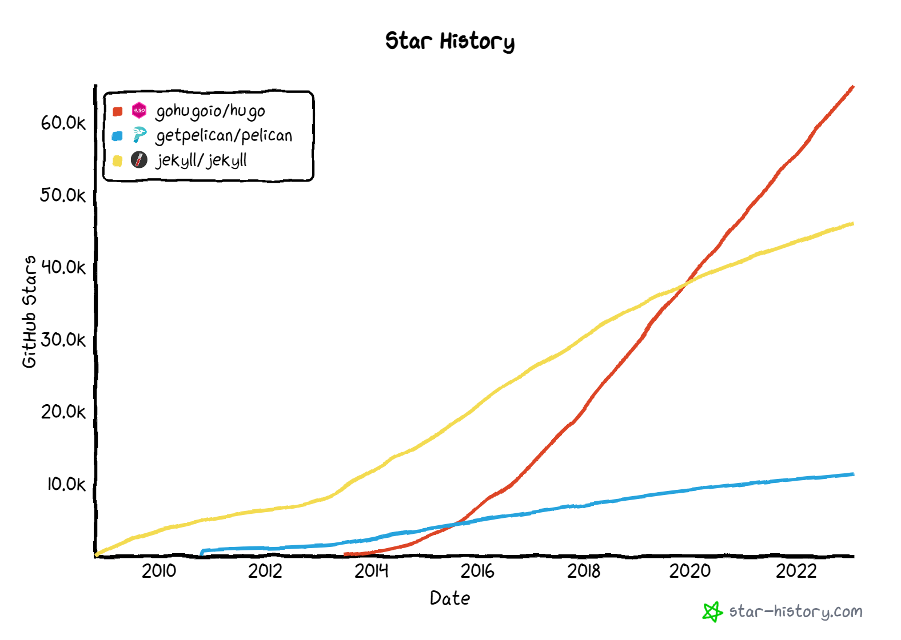

## 계기

몇 개월 전에 구글 애널리스틱에 접속했더니 아래와 같은 경고가 떳다.

> 유니버설 애널리틱스는 2023년 7월 1일부터 표준 속성의 신규 데이터를 더 이상 처리하지 않습니다.
> 지금 Google 애널리틱스 4 속성을 설정하고 이 속성으로 전환하여 준비하세요.

게을러서 미루고 있었는데 이렇게 미루다보면 7월이 올거같더라.
그래서 2023년을 맞이해서 블로그를 손대기로 했다.
구글 애널리스틱 연동된 부분만 고쳐도 되지만 어차피 손대는거 또다른 일도 같이 처리하기로 했다.

### 할일: hugo 테마 교체

2013년[^commit-2013-initial]에 정적 사이트 생성기인 pelican으로 블로그를 만들면서 테마를 만들었다.
2016년에 [pelican을 hugo로 옮기면서]() 테마도 같이 옮겼다.
나한테는 디자인 센스가 없어서 테마가 그렇게 이쁘지 않은 부분도 있었다.
게다가 hugo로 옮길때 기능이 고장난 부분도 있었는데 귀찮아서 고치지 않았다.
갈아탈 hugo 테마를 뒤져보다가 [mini][github-mini]를 발견했다.
전체적인 디자인이 마음에 들어서 mini 테마를 적당히 고쳐서 쓰기로 했다.

### 할일: hugo 표준 규격에 맞게 저장소 고치기

나는 처음부터 hugo를 쓰지 않았다. pelican을 쓰다가 hugo로 바꿨다.
하지만 hugo로는 내가 원하는 모든걸 할 수 없었다.
pelican에서 탈출했듯이 미래에 hugo를 탈출하는 미래도 상상했다. 
그래서 [내 블로그 저장소는 일반적인 hugo 저장소와는 구조 자체가 달랐다.][github-if1live-legacy-v2]

markdown 문서에 소스 파일 자체를 때려박고 싶은데 markdown으로는 이걸 할 수 없다.
그래서 2016년에 [maya][github-maya]라는 markdown 전처리기를 만들었다.
maya가 블로그 빌드 과정에 낑겨들어가면서 일반적인 markdown로는 쓸 수 없는 글을 쓸 수 있게 되었다.

폴더 구조는 hugo와는 다르게 생겼다.
크게 maya로 작성된 글, 이미지, 첨부파일을 넣는 `/content` 와 설정파일, 테마와 같이 hugo 종속적인 `/hugo` 로 구성되었다.

빌드 과정 역시 hugo와는 다르다.

1. `/content/**/article.mkdn`를 maya로 빌드해서 markdown 문서로 만든다.
2. 생성된 markdown을 hugo가 인식할 수 있는 `/hugo/content/` 아래로 복사한다.
3. `/content`에 있는 첨부파일을 hugo가 인식할수 `/hugo/content/` 아래로 복사한다.
4. hugo로 블로그 빌드

GitHub Actions에서 maya로 문서를 빌드하고 첨부파일을 복사하는 과정은 충분히 빨라서 문제가 없었다.
1초면 모든 작업이 끝났다.
하지만 윈도우는 똑같은 명령어를 써도 10~20초 걸리더라.
CI에서도 똑같은 문제가 있었다면 어쩔 수 없이 최적화를 해볼텐데 윈도우에서만 느리니까 문제를 고치고 싶지 않았다.

최적화는 하기 싫고 로컬 환경에서 작성한 글이 hugo에서 어떻게 보이나 확인하는데는 오래 걸리고.
글쓰기도 개발하고 비슷해서 이터레이션 주기가 길어지니까 글을 쓰고싶지 않더라.
환경이 구려서 글을 안쓰는건지 게을러서 글을 안쓰는건지 모르니까 일단 글쓰기 환경을 개선하기로 했다.
순정 hugo를 쓰면 내가 원하는 수준의 글쓰기 환경이 나오더라.
그래서 일반적인 hugo 구조로 갈아엎었다.

## v0.15 -> v0.110.0

[pelican을 버리고 hugo로 이사간 글]()을 꺼내봤다.
내가 처음 hugo를 쓴게 2016년 2월이었다.

* [v0.15](https://github.com/gohugoio/hugo/releases/tag/v0.15): Dec 19, 2015
* [v0.16](https://github.com/gohugoio/hugo/releases/tag/v0.16): Jun 6, 2016
* [v0.110.0](https://github.com/gohugoio/hugo/releases/tag/v0.110.0): Jan 17, 2023

hugo 릴리즈 기록을 뒤져보니 내가 처음 쓴 hugo는 v0.15였다.
그리고 오늘의 최신 버전은 v0.110.0 이다.
와! 자릿수가 하나 늘었잖아? ㅋㅋㅋ

## hugo의 과거와 미래

hugo에 눌러앉으면 다시 나가긴 쉽지 않을 것이다.
2016년에 hugo를 고른 것은 올바른 선택이었는가?
2023년에 hugo를 쓰는 것은 올바른 선택인가?
두가지 질문에서 확신이 생긴 다음에 hugo에 눌러 앉아도 늦지 않는다.

GitHub Star는 지표로 쓸 수 있다.

* [jekyll/jekyll](https://github.com/jekyll/jekyll) 유명한 길
* [gohugoio/hugo](https://github.com/gohugoio/hugo) 내가 선택한 길
* [getpelican/pelican](https://github.com/getpelican/pelican) 내가 포기한 길



[GitHub Star History](https://star-history.com/#gohugoio/hugo&getpelican/pelican&jekyll/jekyll&Date)를 가져왔다.
2016년에 hugo로 갈아탄건 좋은 선택이었다. 2023년에도 hugo는 써도 될거같다.

[A List of Static Site Generators for Jamstack Sites](https://jamstack.org/generators/)를 봐도 답이 보인다.
2023-02-02 기준, 깃헙 스타 정렬로 1등은 Next.js, 2등은 Hugo, 3등은 Gatsby, 4등은 Jekyll이다. 
Next.js, Gatsby는 내가 원하는 정적 사이트 생성기와는 거리가 있으니까 Hugo는 합리적인 선택이다.

## `{{ define "main" }}`

[mini][github-mini] 테마를 뜯으면서 문화충격 받은건 `{{ define "main" }}` 이다.
2016년에 pelican에서 [jinja2][github-jinja]로 작성된 테마를 golang의 [text/template](golang-text-template)로 옮길떄 고통받았다.
golang의 text/template는 jinja2에 비해서 너무 미개했다.

### v0.15

[v0.15의 템플릿 작성 문서](https://github.com/gohugoio/hugoDocs/blob/v0.15/content/templates/content.md)이다.

글 1개에 대응되는 템플릿 파일은 `single.html` 이다.

```html
<!-- single.html -->
{{ partial "head.html" . }}
{{ partial "header.html" . }}
<section id="main">...</section>
{{ partial "footer.html" . }}
```

`single.html`에 등장하는 `head.html`, `footer.html`은 이렇게 생겼다.
```html
<!-- head.html> -->
<head></head>
<body>
```

```html
<!-- footer.html -->
</body>
```

`<body>`와 `</body>`가 다른 파일에 쪼개져 있다!
태그의 시작과 끝이 서로 다른 파일에 들어있고 이걸 `partial`로 이어붙여서 html을 만들어야 한다.
끔찍한 시절이었다. 하지만 아직도 어딘가에서 쓰고 있는 방식이다. 멍청하고 미개하지만 구현은 간단하니까.

### v0.16: Go 1.6 block

[v0.16 릴리즈 뉴스](https://gohugo.io/news/0.16-relnotes/)에 block keyword 추가가 언급된다.
뉴스 작성일은 JUNE 6, 2016 이다.
[Go 1.6](https://go.dev/doc/go1.6)에서 `block` 이 추가되면서 hugo에도 새로운 문법이 추가된 것이다.

> Add support for Go 1.6 block keyword in templates #183

나는 몇개월 차이, 버전 한단계 차이로 좋은 문법을 보지 못하고 미개한 문법으로 템플릿을 작성한 것이다!

[v0.16 blocks](https://github.com/gohugoio/hugoDocs/blob/v0.16/content/templates/blocks.md)를 참고하면 템플릿이 이전보다 깔끔해진다.

```html
<!-- baseof.html -->
<head></head>
<body>
{{ partial "header.html" . }}
{{ block "main" . }}{{ end }}
{{ partial "footer.html" . }}
</body>
```

```html
<!-- single.html -->
{{ define "main" }}
<section id="main">...</section>
{{ end }}
```

`baseof.html` 안에 `<body>`, `</body>`를 넣을 수 있다.

## code block

### 자바스크립트 기반 syntax highlighting

정적 사이트 생성기에 포함되는 syntax highlighting은 자바스크립트를 쓰지 않는 방향으로 구현된다.
알록달록 색깔이 들어간 웹문서인데 자바스크립트를 쓰지 않는다?
HTML을 열어보면 span 태그로 도배된 끔찍한 코드가 들어있다.

```html
<code class="language-html" data-lang="html">
<span style="color:#080">&lt;!doctype html&gt;</span>
&lt;
<span style="color:#008000;font-weight:bold">html</span>
<span style="color:#b44">lang</span>
<span style="color:#666">=</span>
```

HTML에 들어간 코드가 멀쩡한 코드처럼 보이면 좋겠다.
`<`, `>`가 `&lt;`, `&gt;`로 바뀌는건 HTML의 한계라서 어쩔수 없다.
syntax highlighting을 위해서 span으로 도배하는건 원한 결과가 아니다.

그래서 나는 hugo에 내장된 syntax highlighting을 껐다.
syntax highlighting을 끄면 code 태그로 코드가 나온다.

```html
<pre><code class="language-c">...</code></pre>
```

여기에 자바스크립트 기반 syntax highlighting 라이브러리인 [prism][github-prism]를 끼얹었다.
커밋을 뒤져보니
[Mar 12, 2016](
https://github.com/if1live/if1live.github.io/commit/3381dca6a0871cc0a492cdcc9ec3a7bf9a41c5a3#diff-400cb27208ac69d586c0b92695ee090250b357e64f92c5dc5f14d50127491cc7R31) 에 만든 기능이더라.

### mermaid: Diagram as Code

2020년에 terraform을 쓰면서 IaC (Infrastructure as Code)를 처음 만지게 되었다.
이때 주화입마에 빠져서 될 수 있는 한 많은걸 코드로 표현하려고 했다.
시퀀스 다이어그램을 코드로 그릴 방법을 찾다가 [mermaid](https://mermaid.live/)를 접했다.
mermaid가 내가 원한 바로 그거라서 블로그에 집어넣었다.
얼마나 인상적인 물건이었는지 [mermaid로 글]()도 썼네.

커밋 뒤져보니 [Nov 5, 2020](https://github.com/if1live/if1live.github.io/commit/2a581a846bfd8bfb01ab165a4f6a4fb583d2ff41)에 작업했다.
자바스크립트를 적당히 끼워넣어서 `code.language-mermaid`인 DOM element을 찾아서 mermaid 적용하는 방식으로 구현했다.

### code block render hooks

DECEMBER 23, 2019, [v0.62 릴리즈](https://gohugo.io/news/0.62.0-relnotes/)로 markdown render hook이라는 기능이 소개되었다.
[Markdown Render Hooks](https://gohugo.io/templates/render-hooks/)을 사용하면 markdown의 특정 요소를 내가 원하는 방식으로 렌더링 할 수 있다.
처음에는 image와 link에만 render hook를 적용할 수 있었다.

Feb 28, 2022, [v0.93 릴리즈](https://github.com/gohugoio/hugo/releases/tag/v0.93.0)로 code block에도 markdown render hook을 적용할수 있게 되었다.
릴리즈 노트부터 mermaid를 언급하고 있다. 내가 원했던 기능을 hugo로 만들수 있게 되었다.
`render-codeblock.html`을 적당히 짜서 prism으로 syntax highlighting 구현할 수 있다!
mermaid 붙이는 방법은 hugo 공식 문서만 따라해도 된다!

## SCSS

2016년 이전에 pelican 쓰던 시절에는 less로 스타일시트를 작성했다.
[bootstrap](https://getbootstrap.com/)라는 좋은 less 예제가 있어서 less를 썼다.
[bootstrap 4는 less에서 sass로 옮겨갔다.](https://blog.getbootstrap.com/2015/08/19/bootstrap-4-alpha/)
다음에 블로그 테마를 짤떄는 SASS로 갈아타기로 마음 먹었다.

2016년, hugo로 이사가면서 less로 작성된 테마를 scss로 다시 짰다.
정적 사이트 생성기로 golang 기반인 hugo를 쓰니까 scss 컴파일러도 golang 기반을 쓰기로 했다.
[wellington/wellington][github-wellington]의 `wt` CLI 명령으로 SCSS를 컴파일할 수 있다.
그래서 [Mar 12, 2016](https://github.com/if1live/if1live.github.io/commit/3a85c3b49ad8a55d28ebdb2aff11f3e95d4f0979) 에 `wt`로 블로그 테마를 컴파일하도록 했다.

[오늘날 hugo에는 scss가 포함되어있다.](https://gohugo.io/hugo-pipes/scss-sass/)
그렇다면 언제부터 hugo에 scss가 포함되었나?
[v0.43 릴리즈 뉴스](https://gohugo.io/news/0.43-relnotes/)에 scss가 나온다. 
릴리즈 뉴스의 작성일은 JULY 9, 2018 이다.
다행히도 hugo 문서 안 읽고 뻘짓한건 아니었다.
내가 직접 넣은 기능이 hugo보다 2년 앞서 있었다.

블로그 테마를 손대는 김에 scss를 버리고 PostCSS로 갈아타는걸 생각해봤다.
[v0.66.0](https://gohugo.io/news/0.66.0-relnotes/)부터 hugo에 PostCSS가 포함되었다.
릴리즈 뉴스의 작성일은 MARCH 3, 2020 이다.

하지만 [PostCSS를 사용할 경우 node 의존성을 따로 설치야한다.](https://gohugo.io/hugo-pipes/postcss/)
scss는 hugo에 내장되어서 hugo.exe 하나로 사이트를 빌드할 수 있다.
scss에서 기능적으로 모자란게 있는건 아니라서 빌드 과정이 간단한 scss에 남았다.
스타일시트 마이그레이션은 나중에 신경써야지.
그때쯤 되면 PostCSS가 필요없는 웹환경이 되어있을지도 모르니까.

## summary

hugo를 고른건 좋은 선택이었다.
유저수도 꾸준히 늘고있어서 프로젝트가 당분간은 죽지 않을거같다.

자체적으로 기능 구현한건 뻘짓이 아니었다.
내가 필요로 하는 시점에는 hugo에는 없었다.
하지만 최종적으로는 내가 필요로하는 기능이 hugo에 포함되었다.
hugo 새버전 나올때마다 따라가면 공짜 점심이 있다.

나는 디자인 센스가 없다.
테마 같은건 남들이 만든거 갖다써야지.

작업 기간은 2023-01-29 ~ 2023-01-31 로 3일 정도 사용되었다.
3일 작업한거로 7년 써먹어야지. 2030년에도 글을 쓰고 있을진 모르겠지만.

[^commit-2013-initial]: https://github.com/if1live/if1live.github.io/commit/78ec0939965a603596efedcd1a4b916676145365

[github-maya]: https://github.com/if1live/maya
[github-if1live-legacy-v2]: https://github.com/if1live/if1live.github.io/tree/legacy/v2
[github-mini]: https://github.com/nodejh/hugo-theme-mini
[github-jinja]: https://github.com/pallets/jinja
[github-wellington]: https://github.com/wellington/wellington
[github-prism]: https://github.com/PrismJS/prism
[golang-text-template]: https://pkg.go.dev/text/template
