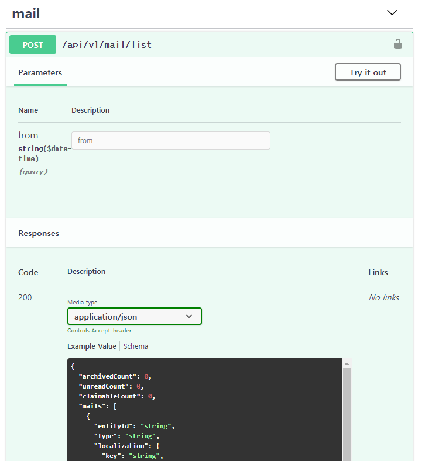

## 개요

2020년 회고를 2020년에 쓰고 싶었지만 강요되지 않는 마감은 지키기 어렵다.
아무것도 안쓰고 넘어가면 재미없으니 회고를 빌미로 뻘글이나 써보자.

## Smash Legends

[5민랩](https://www.thisisgame.com/webzine/news/nboard/4/?n=112614)이라는 회사에서 Smash Legends라는 게임의 백엔드 엔지니어로 일했다.
하지만 백엔드 엔지니어만으로 일한 것은 아니다. 잡다한 일도 많이 했다.

* 백엔드: 인증, 유저 상태 저장, 결제, 친구, 채팅, 파티, ...
* 관리툴: 캐릭터 레벨 수정, 아이템 지급, ...
* DevOps: 라이브 수준 인프라는 필요 없지만 라이브와 동일한 구성의 인프라가 필요하다
* 생산성 도구 개발: 데이터 검증툴, API 생성기, ...

## 프로젝트

2020년에는 오픈소스, 토이 프로젝트를 진행하지 않았다.
모든 자원은 회사 프로젝트인 Smash Legends에 들어갔다.
주말에 시간내서 작업한 결과물도 있는데 회사 저장소에 포함되었다.
비즈니스 로직이 없는 일부 라이브러리, 툴을 오픈소스 프로젝트로 만들 생각은 했지만 CI/CD 설정을 손보는게 귀찮아서 하지 않았다.
비공개 프로젝트로 만들면 다른 저장소에서 쓰는 설정을 그대로 복사해도 돌아가는데 공개 프로젝트로 만들면 그럴수 없잖아?

## 기술/삽질

2020년에 주로 사용한 기술, 새로 만져본 기술이다.
각각의 기술을 어떻게 사용했는지 자세하게 쓰면 따로 글을 쓸 정도 분량은 나올 것이다.
하지만 그런 재밌는 내용은 2021년으로 미룬다.
(다음에 써야지하고 미뤄놨다가 해당 기술이 퇴물이 되서 글은 안쓸지 모른다)

### typescript

2015년에 [typescript 1.4](https://devblogs.microsoft.com/typescript/announcing-typescript-1-4/)를 만져봤다.
그때는 facebook이 만든 flow도 있었다.

당시 자바스크립트 커뮤니티는 typescript보다 flow를 선호하는 분위기가 있었다.
동적 타입 언어인 자바스크립트를 신나게 쓰다가 컴파일러한테 통제당하는 삶을 싫어하는거 같더라?
생태계가 이미 순수 자바스크립트로 구성되어있고 크게 고치고 싶어하지 않더라?
게다가 declaration file을 직접 작성해서 생태계에 끼워넣어야 한다고?
그리고 당시의 마이크로소프트는 오픈소스 친화적인 이미지도 아니었다.
typescript는 망하고 flow가 지배하는 세상이 올거같아서 자바스크립트 세계에서 도망쳤다.

2018년에 react를 하게 되면서 타입스크립트를 다시 하게 되었다.
1.4 시절보다 훨씬 좋은 언어가 되어있고 생태계도 그럴싸하게 굴러가더라.
그래서 타입스크립트에 눌러앉았다.

2020년에도 계속 타입스크립트를 썻다.
이전에는 타입시스템을 어떻게 써야하는지 감이 안잡혀서 최소한으로 사용했다.
남들이 만들어 놓은 기능만 썻다. 요새는 타입시스템을 활용해서 다양한걸 만든다.
언젠가 내가 만든 것들을 자랑할지 모른다.

### serverless framework

serverless를 사용해서 프로덕션 수준의 HTTP API를 구현했다.
아직 출시를 하지 않았지만 스트레스 테스트와 코드 퀄리티를 볼때는 출시해도 심각한 문제가 발생하지 않을거라고 믿는다.
(물론 출시 후에는 믿음이 깨질 것이다)

serverless를 사용해서 어떤걸 해봤는지 몇가지만 써보면

1. [serverless-http](https://www.npmjs.com/package/serverless-http)를 사용해서 express로 구현된 서버를 aws lambda 위에서 돌리기
2. websocket api를 사용해서 채팅, 알림 구현
3. SQS에서 받은 메세지를 사용해서 게임 세션 관리, 게임 결과 기록
4. serverless framework에 플러그인 잔뜩 붙여서 라이브에 쓸 수 있는 물건으로 만들기
5. serverless-offline와 비슷한 계열의 플러그인 사용해서 배포없이 로컬 환경에서 많은 부분을 테스트
6. ...

serverless에 익숙해져서 더이상 ec2 위에 굴러가는 서버 만들고 싶지 않다.
aws lambda가 비싸긴하지만 신뢰할수 있고 확장 가능한 서비스를 만드는 비용보다는 싸니까.

1년 동안 serverless로 작업해서 serverless로 할 수 있는 작업과 할 수 없는 작업이 무엇인지는 조금 알거같다.
serverless를 안써본 사람들은 꼭 써보자. 서비스가 죽지 않을거라고 믿을 수 있으면 많은게 편해진다.

### terraform + terragrunt

IaC (Infrastructure as Code)에 대해서 들어본건 몇 년 전이다.
하지만 라이브 서비스 운영을 직접하지 않으니까 공부의 필요성을 느끼지 못했다.
(개발사와 퍼블리셔가 분리된 게임 서비스의 특징이라고 생각한다)

개발이 진행되면서 라이브 서비스를 하지 않는데도 관리해야되는 서버의 갯수가 늘어났다.

* 저장소에 커밋하면 즉시 반영되는 unstable
* 하루 간격으로 배포되는 nightly
* QA 목적으로 특정 커밋을 지정해서 배포하는 devqa
* 마일스톤 빌드가 올라가는 staging
* ...

프로젝트 초기에는 수동으로 관리했지만 숫자가 늘어나고 복잡도가 늘어났다.
결국 자동화를 할 수 밖에 없는 시점에 도달했고 terraform, terragrunt를 도입했다.
다른 팀원이 terraform 삽질했고 나는 그 위에 terragrunt를 얹었다.
terraform과 serverless를 섞어야해서 삽질을 했지만 목표했던 수준으로 돌아가게 만들었다.

DevOps, IaC 그런거 남의 일이라고 생각했는데 결국 내 일이었다.

### electron

레벨업에 필요한 경험치 테이블, 퀘스트 목록, 캐릭터 목록, ...
게임이 굴러가려면 개발할때 "마스터데이터"을 작성해야 한다.
(업계 표준 용어는 모르겠다. 처음 손댄 게임 프로젝트에서 쓰던 용어가 마스터데이터였다)

프로젝트 초기에는 데이터를 고칠 사람이 몇명 없어서 구글 시트를 사용했다.
구글 시트의 내용을 검증하고 서비스에 동기화하는 웹서비스를 만들어서 사용했다.

규모가 커지니까 데이터를 동시에 수정하는 사람이 늘어났다.
구글 시트를 동시에 편집하니까 반만 수정된게 서버에 들어가서 문제가 생겼다.
(A가 수정 -> B가 수정 -> A가 자신의 결과물만 있는줄 알고 서버에 반영 -> B의 수정이 끌려들어가고 데이터가 꼬임)

동시 편집에 의한 문제를 고치려고 로컬에서 데이터 작업하도록 바꾸기로 했다.
이를 위해서는 로컬에서 실행되는 툴이 필요하다.
데스크탑앱을 만들긴 해야겠는데 새로운 언어, 기술 배우긴 싫으니 electron을 썻다.

기존에 QT, wxWidgets, swing, winform, ... 같은걸 대충 만져봤다.
elelctron + react가 쟤네보다 훨씬 편하더라. 웹에 찌들었나보다.

### monorepo + lerna

monorepo를 사용하면 발생하는 문제를 알고 있어서 쓰지 않으려고 발버둥쳤지만 결국 쓰게 되었다.
프로젝트가 커지고 의존성이 복잡해지니까 monorepo를 사용해서 생기는 단점보다 monorepo의 장점이 필요해지더라.
현재 monorepo를 세개 다루고 있다.

* 운영툴 (유저 조회, 레벨 변경, 아이템 지급, ...)
    - protocols: API 명세
    - backend: express
    - frontend: react
* 마스터데이터 검증툴
    - common: 데이터 검증 로직
    - tools: 데이커 검증하는 CLI 명령. 마스터데이터를 커밋하면 CI에서 데이터를 검증
    - app: electron으로 만들어진 데이터 검증 툴
* 매치메이킹 시스템
    - protocols: API 명세
    - server-lib: 서버의 공용 라이브러리
    - backend: API 서버
    - mmf: 매치메이킹 서버
    - frontend: react

## 바퀴의 재발명

내가 1년동안 한 주요 업무는 게임 서비스의 백엔드 구현이다.
돈내고 GBaaS (Game Backend as a Service) 쓰면 내가 구현한건 사실상 쓸모없다.
[PlayFab](https://playfab.com/)도 있고 [GameSparks](https://www.gamesparks.com/)도 있고.
내가 잘나서 잘짜봤자 대기업 빽이 있는 PlayFab, GameSparks를 뛰어넘을 수 없다.
하지만 사업, 기획, 기술상의 이유로 바퀴의 재발명을 해야될 때가 있다.
이런 계열의 바퀴의 재발명은 자랑할게 없고 재미도 없다.

그래도 멀리서 봤을때 바퀴의 재발명이지만 가까이서 봤을때 내 바퀴에는 특별한거 하나쯤 있으면 자랑할수 있잖아?

### iris: typescript to c#/openapi

서버가 어떻게 동작하는지를 확실하게 설명하는 것은 서버코드이다.
API를 명세를 작성하는 언어와 서버를 구현하는 언어가 달라지면 불일치가 발생할 수 있다.
그래서 서버 코드를 파싱해서 클라이언트 라이브러리와 API 명세를 생성하는 툴을 구현했다.

[ts-morph](https://github.com/dsherret/ts-morph)를 사용하면 typescript compiler API를 쉽게 쓸 수 있다.
ts-morph와 JSDoc을 섞어서 API 명세 생성기를 구현했다.

대충 이런 느낌으로 타입스크립트에서 인터페이스를 정의하면

``` ts
/**
 * @iris_struct AbilityModel
 */
export interface ExtAbilityModel {
    abilityId: number;
    level: number;
}
```

이런 느낌의 C# 클래스가 생성된다.
유니티에서 쓸거니까 C#만 지원해도 된다.

``` cs
[Serializable]
public class AbilityModel
{
    public int abilityId;
    public int level;
}
```

이를 응용하면 무엇이 가능한가?

클라이언트에서 사용할 메세지 핸들러의 stub을 자동으로 생성할 수 있다.
서버는 메세지를 정의하고 클라이언트는 메세지에 맞는 핸들러를 구현하면 된다.
중간에 들어가는 노가다를 사람이 안해도 된다.

이런 느낌으로 서버에서 메세지를 정의하면
``` ts
/**
 * @iris_struct PartyUpdateEvent
 * @iris_channel server
 */
export interface ExtPartyUpdateEvent {
    _ty: 'party_update';
    ts: bigint;
    model: ExtPartyModel;
}
```

클라이언트에서 사용할 메세지 핸들러 stub가 생성된다.
클라이언트를 이를 상속받아서 `HandlePartyUpdateEvent()`를 원하는 형태로 구현한다.

``` cs
public class BaseServerDispatcher
{
    public void Dispatch(string text)
    {
        var obj = JsonConvert.DeserializeObject<TypeHolder>(text);
        switch (obj._ty)
        {
            case "party_update":
            {
                var m = JsonConvert.DeserializeObject<PartyUpdateEvent>(text);
                HandlePartyUpdateEvent(m);
                break;
            }
            ...
        }
    }

    protected virtual void HandlePartyUpdateEvent(PartyUpdateEvent message) { }
}
```

REST API 명세에 맞는 클라이언트 라이브러리를 짜는건 노가다이다.
클라이언트 라이브러리 생성도 자동화했다.
대충 이런 느낌으로 타입스크립트에서 API를 정의하면

``` ts
/**
 * @iris_api MailList
 * @swagger
 * /api/v1/mail/list:
 *   post:
 *     tags: [mail]
 *     security:
 *       - bearerAuth: []
 */
const list: ApiSpecification<ListReq, ExtMailListModel> = {
	method: 'post',
	resource,
	page: '/list',
};
```

C# 코드가 생성된다.
REST API를 추상화하면 요청을 보내고 응답이 오는 비동기 함수일뿐이다.
URL, query string, content-type, ... 전부 중요하지 않은 내용이다.
클라이언트 라이브러리를 손으로 짤때만 이것이 중요한거다.
자동생성이 가능해지면 덜 생각해도 된다.

``` cs
public abstract class AbstractGameClient
{
    public virtual async Task<MailListModel> MailList(MailListReq req) { ... }
}
```

swagger가 있으면 API 테스트할때 편한다.
C# 코드도 생성할 수 있는데 swagger라고 생성 못할 이유가 어디에 있는가?



남들은 요새 gRPC, GraphQL 같은거 쓴다더라. 나는 당분간 REST에 남기로 했다.
서버에서 GraphQL로 신나게 개발하고 클라이언트 개발자한테는 GraphQL playground 던져주는 방법이 있는건 안다.
하지만 내가 짠 API를 써야하는건 웹 프론트엔드 개발자가 아니라 게임 프로그래머이다.
웹으로 먹고 살지 않는 사람한테 떠먹여줄때는 REST API가 더 편하다.

### admin library for react: declarative admin page

[react-admin](https://marmelab.com/react-admin/)을 모를때 관리툴을 손으로 한땀한땀 짰다.
resource의 갯수가 늘어나니까 이게 사람이 할짓이 아니더라.
어떻게 하면 시간을 아낄수 있나 찾다가 react-admin을 알게 되었다.

``` tsx
export const UserList = props => (
    <List {...props}>
        <Datagrid rowClick="edit">
            <TextField source="id" />
            <TextField source="name" />
        </Datagrid>
    </List>
);
```

react-admin이 마음에 들어서 써보려고 했는데 이미 있는거에 끼워넣을라니까 대공사더라?
게다가 요구사항이 달라지는 부분이 있어서 억지로 끼워맞춘다고 이득보는 것도 별로 없었다.
또한 react-admin은 당시 자바스크립트에서만 쓸수 있는 라이브러리였다. 타입스크립트를 제대로 지원하지 않았다.

그래서 react-admin의 컨셉만 따와서 관리툴을 다시 구현했다.
아래같은 느낌으로 사용하고 있다.

``` tsx
<DataGrid<LeaderboardModel> {...props}>
    <TextField<LeaderboardModel> source="rank" />
    <TextField<LeaderboardModel> source="user_uid" />
    <TextField<LeaderboardModel> source="trophy" />
    <SingleField<LeaderboardModel, 'user'>
        source="user"
        render={user => {
            const s = user ? user.name : '<unknown>';
            return <>{s}</>;
        }}
    />
</DataGrid >
```

### 선언적 프로그래밍 기반의 운영툴

나는 django admin을 좋아한다.
ORM 정의하고 admin 대충 구현하면 노력을 적게 들이고 그럴싸한 운영툴이 생긴다.
한가지 문제가 있다면 나는 python을 싫어한다.
mypy가 있다고 하더라도 동적 타입 언어는 못쓰겠더라.
그리고 파이썬, 타입스크립트로 언어가 뒤섞이는걸 보고 싶지 않았다.
타입스크립트로 구현된 django admin이 있으면 언제든지 넘어갈 생각이 있다.
하지만 내가 원하는 수준의 물건은 없더라. 없으면 별수 있나 직접 만들어야지.

[타입스크립트로 API 명세 작성하고 서버/클라 stub 생성하기](/posts/stub-from-typescript-api-specification/)라는 글을 썼다.
read-admin 비슷한 무언가도 만들었다.
둘을 합치니 django admin 비슷한걸 만들 수 있겠는데?

이런 느낌으로 API 명세를 작성한다.
REST API로 제한하면 API 생긴게 뻔하니까 API 명세를 찍어낼 수 있다.

``` ts
const getOne = defineGetOne<PreferenceModel>(resource);
const deleteOne = defineDeleteOne(resource);
const updateField = defineUpdateField<PreferenceModel>(resource);

export const preferenceRestProtocol = {
    getOne,
    deleteOne,
    updateField,
};
```

API 명세에 맞는 백엔드를 구현한다.
REST API로 제한하고 1개의 테이블이 1개의 자원에 맵핑되다고 가정하면 서버도 찍어낼 수 있다.

``` ts
export const preferenceRest: AdminApi<typeof preferenceRestProtocol> = {
    getOne: createGetOne(PreferenceRepository),
    deleteOne: createDeleteOne(PreferenceRepository),
    updateField: createUpdateField(PreferenceRepository),
};

const router = express.Router();
registerRestProtocol(router, preferenceRestProtocol, preferenceRest, 'main');
```

API 명세에 맞는 클라이언트 라이브러리를 구현한다.

``` ts
export class PreferenceClient extends BaseClient
    implements Client<typeof preferenceRestProtocol> {
    public getOne = this.handle(preferenceRestProtocol.getOne);
    public deleteOne = this.handle(preferenceRestProtocol.deleteOne);
    public updateField = this.handle(preferenceRestProtocol.updateField);
}
```

프론트엔드에서 데이터를 그럴싸하게 보여준다.

``` tsx
<AdminEdit clientClass={PreferenceClient} nodeId={nodeId}>
    <SimpleForm<PreferenceModel>>
        <TextField<PreferenceModel> source="type" />
        <TextField<PreferenceModel> source="key" />
        <TextAreaInput<PreferenceModel> source="value" />
        <TextField<PreferenceModel> source="type" />
    </SimpleForm>
</AdminEdit>
```

이걸 사용해서 관리툴 개발 비용, 유지보수 비용을 줄였다.
API 명세를 넣고 컴파일이 될때까지 컴파일 에러를 고치면 기능이 추가된다!

### misc

이런거 외에도 재밌는걸 많이 만들었지만 정리하기 귀찮다.
궁금하면 우리 회사 취직해서 저장소 보던가 나한테 술사주고 이야기 듣던가.


## 게임

날짜는 클리어 기준이다.
이거 말고도 더 한게 있을텐데 까먹고 클리어 날짜를 기록하지 않은것도 있다.

* 12/27: [HARDCORE MECHA](https://store.steampowered.com/app/746580/HARDCORE_MECHA/)
* 12/25: [섀도 오브 더 툼 레이더](https://store.steampowered.com/app/750920/Shadow_of_the_Tomb_Raider_Definitive_Edition/)
* 12/23: [POSTAL Redux](https://store.steampowered.com/app/401680/POSTAL_Redux/)
* 12/14: [라쳇 & 클랭크](https://store.playstation.com/ko-kr/product/HP9000-CUSA02020_00-RCPS400000000000)
* 12/06: [DeathComing](https://store.steampowered.com/app/705120/Death_Coming/)
* 11/28: [hacknet](https://store.steampowered.com/app/365450/Hacknet/)
* 11/26: [>observer_](https://store.steampowered.com/app/514900/)
* 11/15: [하프라이프: 알릭스](https://store.steampowered.com/app/546560/HalfLife_Alyx/)
* 11/07: [VA-11 HALL-A: Cyberpunk Bartender Action](https://store.steampowered.com/app/914210/N1RV_AnnA_Cyberpunk_Bartender_Action/)
* 10/18: [the bunker](https://store.playstation.com/en-us/product/UP4459-CUSA06057_00-THEBUNKERGAMEPS4)
* 10/18: The Sinking City
* 09/12: [State of Mind](https://store.steampowered.com/app/437630/State_of_Mind/)
* 09/11: [A Way Out](https://store.steampowered.com/app/1222700/A_Way_Out/)
* 09/10: [Call of Cthulhu](https://store.steampowered.com/app/399810/Call_of_Cthulhu/)
* 09/09: [헤비 레인](https://store.steampowered.com/app/960910/Heavy_Rain/)
* 09/02: [폴아웃4](https://store.steampowered.com/app/377160/Fallout_4/)
* 08/17: [FAR: lone sails](https://store.steampowered.com/app/609320/FAR_Lone_Sails/)
* 08/17: [타이포맨](https://store.steampowered.com/app/336240/Typoman/)
* 08/15: [라스트 오브 어스 파트 2](https://store.playstation.com/en-us/product/UP9000-CUSA07820_00-THELASTOFUSPART2)
* 07/20: [flower](https://store.playstation.com/en-us/product/UP9000-CUSA00092_00-FLOWERPS4000FULL)
* 05/30: [helltaker](https://store.steampowered.com/app/1289310/Helltaker/)
* 05/24: [엑스컴: 키메라 스쿼드](https://store.steampowered.com/app/882100/XCOM_Chimera_Squad/)
* 05/04: [planet alpha](https://store.steampowered.com/app/485030/PLANET_ALPHA/)
* 05/03: [엑스컴2: 선택된 자의 전쟁](https://store.steampowered.com/app/593380/XCOM_2_War_of_the_Chosen/)
* 04/05: [림월드](https://store.steampowered.com/app/294100/RimWorld/)
* 03/14: [INSIDE](https://store.steampowered.com/app/304430/INSIDE/)
* 02/08: [데이어스 엑스: 맨카인드 디바이디드](https://store.steampowered.com/app/337000/Deus_Ex_Mankind_Divided/)
* 01/26: [V! 용사 주제에 건방지다 R](https://store.playstation.com/ko-kr/product/HP9000-CUSA08093_00-VRPG0000000000AS)
* 01/14: [트로피코 5](https://store.playstation.com/ko-kr/product/EP4365-CUSA01123_00-ASIA000000000006)

정신이 피폐해진 정도를 측정하려고 게임을 꾸준히 한다. 
게임을 못하는건 보통 두가지이다.
야근해서 게임할 시간이 없을때, 그리고 정신력이 고갈되서 게임을 도저히 켤수 없을때.

## 회사 생활

회사에서 어떻게 살았는지를 어떤 생각을 했는지를 자세히 적지 않는다.
이 글은 회고지만 회고가 아니다. 생각하는걸 그대로 쓰는건 어려운 일이다.
머리 속의 내용을 그대로 덤프뜨면 뒷감당을 할 수 없다.

그래도 통제된 범위에서는 말할 수 있다.
1년 동안 극한의 환경에서 선택을 강요받았다. 영화 '쏘우'와 비슷한 느낌이다.
다리 자를래? 죽을래? 의 선택에서 다리를 자르고 손목 자를래? 죽을래? 의 선택에서 손목을 자르고.
프로젝트가 돌아가는데 필요한 선택을 계속 했다. 프로젝트가 죽으면 모든게 끝이다.
출시하면 이력서에 게임 이름이 들어가지만 출시하지 못하면 Proejct A, Project X가 들어간다.
출시후에 게임이 망해도 이름을 검색하면 나온다. Project A, Project X는 검색해도 나오지 않는다.

그 결과 후회는 쌓이고 정신은 죽어간다.
프로젝트를 죽여서라도 다른 가치를 우선시 했어야하나?
뭐가 정답인지 모르겠다.

## 2020년 요약

지금까지 하던대로 full-stack engineer로 일했다.
기존보다 지원되는 기능이 늘어났다.
할 줄 아는게 코딩밖에 없으니 회고에 코딩 이야기밖에 없다.
점점 재미없는 인간이 되어간다.


## 2021년 목표

### [일을 잘 맡긴다는 것](http://www.yes24.com/Product/Goods/90160861)

제목보고 땡겨서 샀지만 읽지 못했다.
일을 하고 나면 책을 읽을 수 있는 수준의 정신력이 남아있지 않다.
그렇다고 책을 읽기에는 쌓여있는 일이 많다.

개발 인력 부족으로 몇달뒤에 프로젝트가 터지는 미래가 보인다.
이를 막으려면 채용을 해야되지만 채용했다고 모든 문제가 해결되지 않더라.
나는 일을 알아서 하는게 인간의 기본 기능인 줄 알았다.
이전에 같이 일했던 사람들은 다들 알아서 일했으니까.
근데 나중에 알고보니 알아서 일을 하는 사람은 극소수더라.
일을 알아서 하는 사람이 아니면 일을 직접 맡겨야하는데 어떻게 일을 맡겨야하는지 아직 모르겠다.
2021년에는 일을 맡기는 방법을 배울 수 있을까?

### 한국방송통신대학교 경제학과 3학년 1학기

한국방송통신대학교 경제학과 3학년에 지원했다.
작년 경쟁률을 볼때 별 문제없으면 합격할거같다.

나는 학부에서 배우는게 "생각하는 방법"이라고 본다.
학부 시절에 배운건 다 까먹었다.
그래도 컴퓨터 과학 기준으로 문제를 바라보는 방법까지 까먹었다고 보진 않는다.
(그것조차 까먹었으면 진작에 코딩 못해서 짤렸겠지)

대학교 다닌 기간부터 생각하면 13년 동안 컴퓨터의 눈높이로 생각하는 방법을 훈련했다.
반대로 생각하면 컴퓨터의 눈높이로 생각하는 방법밖에 모른다.

다른 관점에서 세상을 보는 방법을 배우고 싶어서 방통대에 지원했다.
하지만 졸업할 자신은 없다. 일하면서 다니는게 얼마나 가능할지 모르겠다.
한 학기 다녀보면 각 나오겠지.
