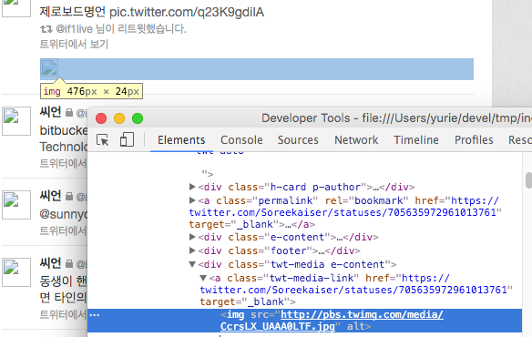
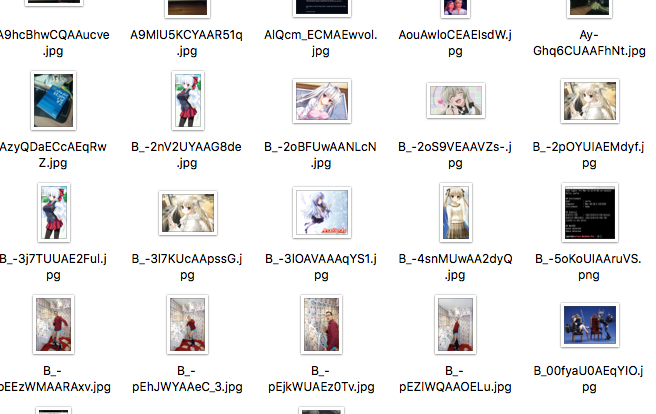

## 개요
트윗을 싹 지우고 싶다는 생각이 들었다.
트위터에는 개소리만 싸질렀지만 그래도 쓸만한 데이터를 얻을수 있지 않을까해서 백업을 하고 트윗을 지우기로 마음먹었다.
우선은 트위터에서 제공하는 아카이브를 받았다.
받은건 좋은데 여기에는 트윗 데이터(내가 쓴 트윗, RT한 트윗)만 남아있더라.
내가 업로드한 이미지나 리트윗한 이미지 자체를 아카이브에 포함되어있지 않고 링크만 있더라.
그래서 아카이브한 트윗 데이터에서 이미지 URL 정보를 전부 뽑아내서 다운받는 것을 만들기로 했다.

* 목표 : 트위터 아카이브의 모든 내용을 오프라인에서 볼수 있어야한다. (주로 이미지)
* 사용한 언어 : NodeJS
* 개발기간
    * 2016/03/04 : 프로젝트 방향 결정
    * 2016/03/05 : 실제 개발

## 어떻게 만들것인가?
트위터 아카이브를 열어보면 트윗 데이터가 `data/js/tweets/2016_03.js` 같은 위치에 저장되어있다.
해당 파일을 열어보면 자바스크립트 객체로 각각의 트윗 정보가 기록되어있다.
쭉 읽어보니까 이미지와 관련된 URL은 `media_url`, `media_url_https`, `profile_image_url_https` 가 있더라.

```json
{
  "source" : "\u003Ca href=\"https:\/\/about.twitter.com\/products\/....",
  "entities" : {
    "user_mentions" : [ { ... } ],
      "media_url" : "http:\/\/pbs.twimg.com\/media\/CcYQxY1UMAA1SZj.jpg",
      "media_url_https" : "https:\/\/pbs.twimg.com\/media\/CcYQxY1UMAA1SZj.jpg",
      ...
    }, {
      "media_url" : "http:\/\/pbs.twimg.com\/media\/CcYQyWkVAAA1EWK.jpg",
      "media_url_https" : "https:\/\/pbs.twimg.com\/media\/CcYQyWkVAAA1EWK.jpg",
      ...
    } ],
    ...
  },
  ...
  "retweeted_status" : {
    "source" : "\u003Ca href=\"http:\/\/twitter.com\/download\/...",
    "entities" : {
      "user_mentions" : [ ],
      "media" : [ {
        "media_url" : "http:\/\/pbs.twimg.com\/media\/CcYQxY1UMAA1SZj.jpg",
        "media_url_https" : "https:\/\/pbs.twimg.com\/media\/CcYQxY1UMAA1SZj.jpg",
        ...
      }, {
        "media_url" : "http:\/\/pbs.twimg.com\/media\/CcYQyWkVAAA1EWK.jpg",
        "media_url_https" : "https:\/\/pbs.twimg.com\/media\/CcYQyWkVAAA1EWK.jpg",
        ...
      } ],
      ...
    },
    ...
    "user" : {
      "screen_name" : "gckbook",
      "profile_image_url_https" : "https:\/\/pbs.twimg.com\/profile_images\/1682141341\/____logo_normal.jpg",
      ...
    }
  },
  "id" : 704292650828984320,
  "created_at" : "2016-02-29 13:10:27 +0000",
  "user" : {
    ...
    "profile_image_url_https" : "https:\/\/pbs.twimg.com\/profile_images\/671688812007809024\/4vIrI5gJ_normal.png",
    ...
  }
}
```

트위터 아카이브에 포함된 뷰어의 경우는 해당 JSON을 읽어서 적절히 보여주는 방식으로 작동하더라.



만약 트윗 데이터 파일을 조작해서
`"media_url" : "https:\/\/pbs.twimg.com\/media\/sample.png"`
대신
`"media_url" : "\/cache\/pbs.twimg.com\/media\/sample.png"`
로 바꿔치고 `https://pbs.twimg.com/media/sample.png`를 다운받아서
`/cache/pbs.twimg.com/media/sample.png`로 저장해두면 기존의 트위터 아카이브 뷰어를 그대로 쓸수 있지 않을까?

## 구조
1. `data/js/tweets/`에서 `YYYY_MM.js`에서 이미지 URL을 전부 추출한다
2. 모든 URL에 대해서 `http://foo.com/media/sample.png`와 같은 링크를 받아서 `/cache/foo.com/media/sample.png`로 저장한다.
3. 트윗 데이터에서 기존 URL을 새로운 URL로 교체한다.
4. 로컬에서 서버를 띄우고 오프라인 상태에서 이미지가 잘 나오는지 확인한다.

목표는 간단하다.
문제는 NodeJS를 오랜만에 쓰다보니 쉽게 끝날거같은 작업이 생각보다 길어지게 되는데...

## 삽질1. TOO MANY REQUEST
자바스크립트의 장점이라면 역시 비동기겠지?
다른 언어로 짰으면 쓰레드라도 갖고 오지 않는 이상 이미지 하나 받는동안 실행이 block걸릴거다.
URL 목록을 뽑아보니까 받아야하는 이미지가 몇만개더라. 동기적으로 이미지를 하나씩 받은건 역시 미친짓같다.
비동기라는 자바스크립트의 장점을 살려서 몇만개의 이미지를 동시에 받으면 작업이 훨씬더 빨리 끝날거다.

라고 생각하고 처음에는 개발을 시작했지만 문제가 생겼다.
테스트 데이터로 이미지 몇십개를 동시에 받을때는 문제가 없었는데 실제 데이터로 작업을 수행하면 문제가 생기더라.
비동기 덕분에 이미지URL 갯수만큼의 HTTP 요청을 동시에 날리는데 URL갯수가 너무 많다보니 실행이 오래걸려서 타임아웃같은 네트워크 문제로 죽는거같더라.

그래서 [async](https://github.com/caolan/async)의 `.eachLimit()`를 이용해서 동시에 N개의 이미지만 받도록 제한했다.

```js
async.eachLimit(links, 5, function(uri, callback) {
  doSomething();
  callback();
}
```

## 삽질2. 비동기 어려워요
프로그램의 구조를 다시 보자.

1. URL 목록 뽑기
2. URL 전부 받기
3. 데이터 파일 갱신

설계 자체가 1단계가 완전히 끝나고 2단계를 시작하고, 2단계가 완전히 끝나고 3단계를 진행하는 방식이다.
즉 구조 자체가 동기적으로 작동한다.
근데 자바스크립트는 비동기잖아?
[Busy waiting](https://en.wikipedia.org/wiki/Busy_waiting)같은 컨셉으로 위에서 비동기 작업을 걸어둔게 끝날때까지 `sleep()` 하고 싶어도 자바스크립트에는 sleep 함수가 없다.
(편법으로 sleep를 흉내내는 방법이 있지만 C처럼 sleep 함수 자체가 있는건 아니다)
비동기로 굴러가는 함수를 동기로 바꾸기 위해서 [deasync](https://github.com/abbr/deasync)를 이용했다.

```js
function SyncFunction(){
  var ret;
  setTimeout(function(){
    ret = "hello";
  },3000);
  while(ret === undefined) {
    require('deasync').sleep(100);
  }
  // returns hello with sleep; undefined without
  return ret;
}
```

## 결과물
[Repo](https://github.com/if1live/twitter-image-archive)


## 개발 소감
백업된 이미지를 보면 평소에 어떤 이미지를 올리고 어떤걸 리트윗하면서 살았나 반성하게 된다.


