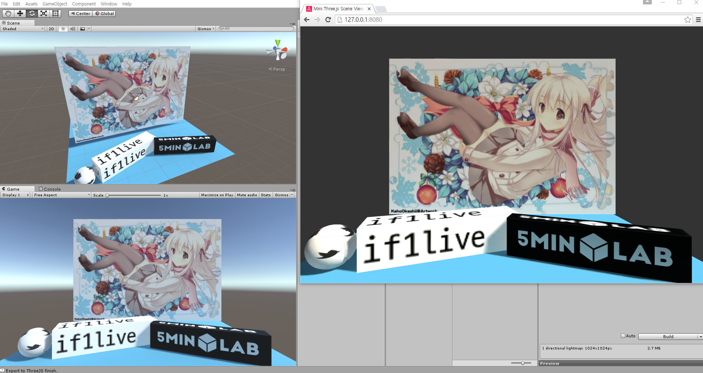
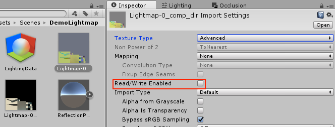

## 개요

* [Unity Scene Web exporter][repo]
* [Live Demo][demo]
* 목적 : 오브젝트 배치를 유니티에서 하고싶다
* 개발 기간 : 2016년 3월 ~ 2016년 8월
* 언어 : 유니티 C#

**Unity3D / Three.js screenshot**



**Live Demo : Three.js**

~~~maya:view
file=embed.html
format=text
~~~


## 왜 시작했는가?

2015년 3월, [WebVR boilerplate][repo_webvr_boilerplate]를 보고 감명받아서 [회사 홈페이지를 VR][vr_5minlab]로 만들었다.
[회사 VR 홈페이지][vr_5minlab]은 WebVR boilerplate를 기반으로 만들었는데 이것은 [three.js][threejs] 기반이다.
그래서 씬을 수정하는 작업(물체를 생성, 배치, 광원을 배치, 크기를 조절,...)을 javascript로 한다.

```javascript
// 회사 로고
var geometry = new THREE.PlaneGeometry(1, 1);
var mesh = new THREE.Mesh(geometry, material);
mesh.position.set(2.8, 4.35, -0.2);
var scale = 0.003;
mesh.scale.set(760*scale, 517*scale, 1);
mesh.rotation.y = -Math.PI/2;
scene.add(mesh);
```
로고 하나를 배치하려고 수치를 바꾸고 새로고침, 어떻게 보이는지 확인하고 다시 수치를 조정하고 새로고침,...
수치 조정과 새로고침을 반복하는게 피곤하더라.
만약 좋은 3D 에디터가 있어서 여기에서 물체를 배치하고 이를 three.js에 그대로 띄울수 있다면 노가다가 줄어들지 않을까?

> 이미 유니티라는 좋은 에디터가 있는데 여기에서 물체를 배치하고 export한 결과물을 three.js에 그대로 띄운다면 삽질이 줄어들지 않을까?
> 유니티에서 배치를 하고 객체에 ID를 지정하는거야. 그리고 몇가지 정보를 객체에 같이 저장해두는거야.
> three.js에서는 ID로 객체에 접근해서 미리 저장해둔 값을 이용해서 로직을 짜는거야.

## 어떤 기능을 만들까?

쓸만한 exporter가 있나 뒤져보다가 [J3D][repo_j3d]와 [Three.js JSON Exporter][unity_threejs_exporter]를 발견했다.
Three.js JSON Exporter 정도면 내가 필요로하는 기능이 전부 들어있지만 오픈소스가 아니라는점이 마음에 걸렸다.
Exporter를 쓰다보면 커스터마이징 하고싶은게 생길텐데 자유도가 없는 라이브러리를 쓰고싶진 않았다.
그래서 오픈소스인 J3D를 개선해서 Three.js JSON exporter에 있는 몇가지 기능을 넣어보기로 했다.

* 기본적인 Scene Export : 모델, 텍스쳐, 라이트, ....
* Lightmap : 라이트맵까지 export하면 그럴싸한 씬을 보여줄수 있을거다
* Script properties : 스크립트 변수를 export하면 로직 작성하는데 이용할수 있을거다.

## Custom JSON Format VS THREE.ObjectLoader

참고할 라이브러리 2개가 생겼으니 각각을 분석하고 한가지 길을 선택하기로 했다.

* J3D
  1. 유니티에서 독자규격 JSON파일로 export한다
  2. 독자규격 JSON을 읽을수 있는 파서를 javascript으로 구현한다.
  3. 새로 만든 파서가 export된 JSON을 읽어서 three.js로 렌더링한다.
* Three.js JSON Exporter
  1. Three.js의 [ObjectLoader][threejs_objectloader]로 읽을수 있는 JSON으로 유니티에서 export한다
  2. export한 JSON을 ObjectLoader로 읽는다

처음에는 J3D의 방식(독자규격 JSON)을 따라가는 방향을 골랐다. 이유는 파일 용량과 로딩시간 때문이다.
ObjectLoader의 경우 메시 데이터와 씬 데이터를 하나의 JSON에 전부 집어넣는다.
그래서 씬이 복잡해지면 몇MB가 넘는 JSON파일이 생긴다. 그리고 이 씬 파일을 전부 받기전까지는 렌더링을 못할거다.
(실제로 Three.js JSON exporter의 데모 중 하나는 씬 JSON 파일의 용량이 십MB를 넘어서 초기 로딩이 매우 느리다.)
반면, J3D는 씬 데이터와 모델 데이터를 분리했다.

```javascript
J3D.Loader.loadJSON("model/filename.json", function(jsmeshes) {
    J3D.Loader.loadJSON("model/filenameScene.json", function(jsscene) {
        J3D.Loader.parseJSONScene(renderer, scene, jsscene, jsmeshes);
    });
});
```
export한 데이터의 대부분은 메시 데이터일 것이다.
만약 씬데이터에는 객체의 위치 정보와 bounding box의 정보만 넣어두고 메시의 실제 정보는 나중에 로딩하게 만들면 반응속도 자체가 짧아지지 않을까?
메시 데이터를 스트리밍하면 커넥션 한번으로 메시 파일을 낱개로 분리해서 서버에서 클라로 내려주는것도 가능하지 않을까?

1. 최소한의 씬 데이터(위치 정보, bounding box,...)를 로딩한다.
   * 파일 크기 : 몇KB
   * 아직 로딩되지 않은 모델은 bounding box로만 보여준다.
   * 몇초안에 씬 로딩 완료, 유저는 화면을 볼수있다.
2. 메시 데이터를 로딩한다
   * 파일 크기 : 몇백KB~몇MB
   * 로딩되면 bounding box를 모델로 교체한다.

실제로 구현해보니까 몇가지 문제가 있었다.

메시 데이터를 서버로부터 받은후 이를 처리할때 순간적으로 끊긴다.
ObjectLoader를 씬을 한번에 로딩하고 이후에는 로딩 과정이 없다. 그래서 처음 한번만 느리다.
J3D같이 씬과 모델 데이터를 분리하면 모델 데이터를 받은 다음에 이를 읽어야한다.
자바스크립트는 싱글쓰레드이기때문에 모델 읽어서 올리는동안 렌더링이 멈춘다.
Web worker를 이용해서 모델 데이터 읽는것을 최적화해봤지만 BufferGeometry를 생성하고 모델데이터를 올리는 동안에 끊김이 발생하더라.

그래도 성능 문제 하나뿐이면 큰 문제가 아니다.
이는 나중에 최적화로 대응하는게 가능하니까.
게다가 최초 로딩속도가 빨라진 것의 trade-off로 생각할수 있으니까.

진짜 문제는 내가 **관리할 코드가 두 세트**라는거다.

유니티에서 독자규격으로 export했다면 독자규격을 처리할수 있는 파서를 javascript로 짜야 three.js가 이를 처리할수 있을거다.
exporter에 새로운 필드를 하나 추가했다면 loader도 이것을 처리할수 있도록 수정해야된다.
직렬화/역직렬화를 각각 수동으로 짜는것만큼 귀찮은일도 없는데 이 작업을 피할수 없더라.

그래서 Three.js가 바로 알아들을수 있는 포맷으로 export하는쪽으로 방향을 바꿨다.

## 2개의 엔진, 2개의 설계

* 유니티는 [Entity Component System](https://en.wikipedia.org/wiki/Entity_component_system) 기반이고 Three.js는 전통적인 [Scene Graph](https://en.wikipedia.org/wiki/Scene_graph) 기반이다.
* 유니티에서는 하나의 객체가 렌더링되는 객체이면서 동시에 광원일수 있지만 Three.js에서는 불가능하다.
* 유니티에서는 라이트맵은 별개의 시스템으로 굴러가지만 Three.js에서는 텍스쳐와 통합되어있다.
* 유니티의 Material과 Three.js의 Material은 1:1로 매칭되지 않는다. 비슷하게 매칭되는게 있을뿐이다.
* 유니티는 DX 좌표계를 사용하지만 Three.js는 GL좌표계를 사용한다.
* 유니티에서의 Plane Mesh는 XZ평면(바닥)처럼 생겼지만 Three.js의 Plane Mesh는 XY평면(벽)처럼 생겼다.
* 유니티의 Box Mesh와 Three.js의 Box Mesh는 UV좌표가 다르다.
* 유니티에서는 Ambient Light는 Scene정보의 일종이지만 Three.js의 광원의 일종이다.
* ...

유니티와 Three.js의 수많은 차이점을 몸으로 배웠다.


## A-Frame

프로젝트는 처음 시작하던 2016년 3월에는 [A-Frame][aframe] 안정버전이 0.1.0, 개발버전이 0.2.0이었다.
버전이 워낙 낮고 기능이 별거 없어서 A-Frame 대신 Three.js로 VR 홈페이지를 만드는 길을 선택했다.
몇달동안 A-Frame을 지켜보니까 생각보다 발전속도가 빠르더라. 게다가 A-Frame 커뮤니티는 살아있다는 느낌이 들었다.
2016년 3월에 WebVR로 삽질할때는 three.js가 r75였지만 내가 몇달동안 신경쓰지 못한 사이에 r80까지 버전이 올라갔더라.
나는 바뻐서 유지보수를 못하고 있었는데 A-Frame은 꾸준히 발전해서 0.2.0 안정버전도 릴리즈하더라.
내가 three.js로 밑바닥부터 만들면 A-Frame보다 더 성능이 빠르게 만들수 있을거같지만 나는 혼자고 A-Frame은 커뮤니티다.
맨먼스(man month)로는 절대 이길수 없다는 생각이 들어서 exporter에 A-Frame도 넣기로 했다.

A-Frame을 export하는 기능은 [UnityAFrameExporter][repo_unity_aframe_exporter]를 참고했다.
UnityAFrameExporter의 코드를 분석하는데 내가 모르는 A-frame기능이 있더라.
잘 뒤져보니까 UnityAFrameExporter가 A-Frame 0.1.0, 나는 A-Frame 0.2.0 기준으로 작업하고 있어서 내용이 다른거였다.
워낙 버전이 낮다보니까 API가 계속 바뀌고 있더라. 현재는 안정버전이 0.3.0까진 나왔으니 또 달라졌을거다.
API가 안정되지 않은 라이브러리를 대상으로 exporter만드니까 유지보수 측면에서 앞으로도 귀찮은 일이 생길거같다.

## Lightmap

J3D에는 라이트맵을 export하는 [코드][j3d_lightmap]가 있다.
하지만 유니티 4.x 시절에 작성된 코드라서 그런지 유니티 5.x에서는 제대로 돌아가지 않았다.
(J3D는 Unity3D 4.5.3f3에서 테스트되었다고 한다)
첫번째 문제는 라이트맵 텍스쳐의 경로를 기존의 방법으로는 얻을수 없다는거다.
두번째 문제는 라이트맵 텍스쳐의 경로를 알아내도 텍스쳐의 내용을 읽을수 없다는거다.

경로 문제는 [포럼](http://answers.unity3d.com/questions/1114251/lightmappingcompleted-callback-occurs-before-light.html)의 도움을 받아서 해결했다.

```csharp
string curScene = UnityEditor.SceneManagement.EditorSceneManager.GetActiveScene().path;
string[] parts = curScene.Split('/', '\\');
string sceneName = parts[parts.Length - 1].Split('.')[0];
string lightmapPath = Path.GetDirectoryName(curScene) + "/" + sceneName + "/";
string filepath = lightmapPath + "Lightmap-" + "0" + "_comp_light.exr";
```

라이트맵에 접근해도 이를 읽을수 없는건 라이트맵 텍스쳐의 Read/Write Enabled 플래그가 꺼져있기 때문이다.



이를 수동으로 바꾸면 라이트맵에 접근할수 있지만 라이트맵을 다시 구우면 속성이 사라진다.
그래서 라이트맵의 Read/Write Enabled를 스크립트상에서 건드렸다.

```csharp
// readable 설정 켜주기
TextureImporter texImporter = (TextureImporter)AssetImporter.GetAtPath(filepath);
if (!texImporter.isReadable) {
    texImporter.isReadable = true;
    texImporter.SaveAndReimport();
}
```

라이트맵 텍스쳐를 export하는 [코드][repo_lightmap]이다.
J3D의 라이트맵 export하는 코드를 고쳐서 쓰고있다.

## 좋았던 점
처음 목표로 잡았던 수준, 아니 그 이상의 기능까지 만들었다.
A-frame export는 처음에는 생각하지 않았다.

만든거로 자랑 한번 해봤다. 게다가 쓰는 사람도 있는거같다.
[A-Frame slack](https://aframevr.slack.com)에 보여줬더니 [A-Frame 트위터][aframe_twitter]에도 뜨고 [A-Frame 블로그][aframe_blog]에도 올라갔다.
어떻게 쓰는지 물어보는 메일 받아봤으니 쓰는 사람이 적어도 한명은 있는거같더라.

## 나빴던 점
개발 기간이 생각보다 늘어졌다.
시간날때 잠깐씩 작업했고 다른일이 생기거나 바뻐지면 존재 자체를 잊어버렸기 때문에 개발기간이 길어진거같다.
개발기간이 길어지니까 어떻게 짯는지 기억이 안나더라. 그래서 하드코딩으로 넘겨버린 부분이 몇군데 생겨버렸다.

export하는 접근법을 잘못 잡아서 삽질을 했다.
J3D같은 방식을 채택한건 잘못된 선택이었다. 자주 당한 문제였으니 조금 더 생각해봤으면 J3D의 문제를 깨달을수 있었을텐데.
처음부터 Three.js ObjectLoader로 갔으면 개발기간이 짧았을거다.

유니티, Three.js의 문서를 자세히 안읽고 작업을 시작해서 삽질이 길어졌다.
조금 더 생각하고 작업했으면 씬그래프 설계를 엎는 횟수를 줄이는게 가능했을텐데.

## 배운거
유니티를 자체를 GUI 프레임웍으로 사용하는게 가능하다는걸 깨달았다.
유니티 자체를 일종의 RAD(Rapid Application Development) 도구로 사용하는게 가능하겠더라.


[vr_5minlab]: http://vr.5minlab.com/
[repo]: https://github.com/if1live/unity-scene-web-exporter/
[demo]: http://libsora.so/unity-scene-web-exporter/
[repo_lightmap]: https://github.com/if1live/unity-scene-web-exporter/blob/8bd26d0e9e5416f4d373f492eff9726213821764/UnityProject/Assets/Kanau/UnityScene/Containers/LightmapContainer.cs#L72-L124

[repo_j3d]: https://github.com/drojdjou/J3D
[j3d_lightmap]: https://github.com/drojdjou/J3D/blob/85ef1c77eca95b8665d457a947b136a0ee4bedf2/unity/Assets/Editor/data/LightmapExportData.cs#L30-L65

[repo_unity_aframe_exporter]: https://github.com/umiyuki/UnityAFrameExporter
[repo_webvr_boilerplate]: https://github.com/borismus/webvr-boilerplate

[unity_threejs_exporter]: https://www.assetstore.unity3d.com/en/#!/content/40550
[threejs_exporter_demo]: http://threejsexporter.nickjanssen.com/

[spec_webvr]: https://w3c.github.io/webvr/

[threejs]: http://threejs.org/
[threejs_objectloader]: http://threejs.org/docs/#Reference/Loaders/ObjectLoader

[aframe]: https://aframe.io/
[aframe_blog]: https://aframe.io/blog/awoa-26/
[aframe_twitter]: https://twitter.com/aframevr/status/769168488095109120
