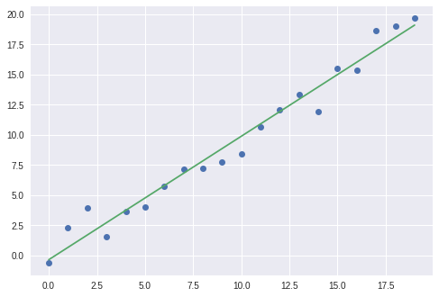

---
title: Jupyter Test Page
subtitle: Simple Jupyter Test
tags: [jupyter, sample-article]
slug: jupyter-test
author: if1live
date: 2010-01-02
url: /posts/jupyter-test

---

 ## Colaboratory에 오신 것을 환영합니다!

Colaboratory는 텍스트, 코드, 코드 출력을 하나의 공동작업 문서로 통합해 주는 데이터 분석 도구입니다.


```
print('Hello, Colaboratory!')
```

    Hello, Colaboratory!


 Colaboratory를 사용하면 클릭 한 번만으로 사용 중인 브라우저에서 텐서플로우 코드를 실행할 수 있습니다. 아래의 예에서는 두 개의 행렬을 추가합니다.

$\begin{bmatrix}
  1. & 1. & 1. \\
  1. & 1. & 1. \\
\end{bmatrix} +
\begin{bmatrix}
  1. & 2. & 3. \\
  4. & 5. & 6. \\
\end{bmatrix} =
\begin{bmatrix}
  2. & 3. & 4. \\
  5. & 6. & 7. \\
\end{bmatrix}$


```
import tensorflow as tf
import numpy as np

with tf.Session():
  input1 = tf.constant(1.0, shape=[2, 3])
  input2 = tf.constant(np.reshape(np.arange(1.0, 7.0, dtype=np.float32), (2, 3)))
  output = tf.add(input1, input2)
  result = output.eval()
  print(result)
```

    [[2. 3. 4.]
     [5. 6. 7.]]


 Colaboratory에는 [matplotlib](https://matplotlib.org/)와 같이 널리 사용되는 라이브러리가 포함되어 시각화를 단순화할 수 있습니다.


```
import matplotlib.pyplot as plt

x = np.arange(20)
y = [x + np.random.randn(1) for x in x]
a, b = np.polyfit(x, y, 1)
plt.plot(x, y, 'o', np.arange(20), a*np.arange(20)+b, '-');
```





 Colaboratory는 Google Cloud BigQuery와 함께 사용할 수 있습니다.

[샘플 BigQuery 노트](/notebooks/bigquery.ipynb).
