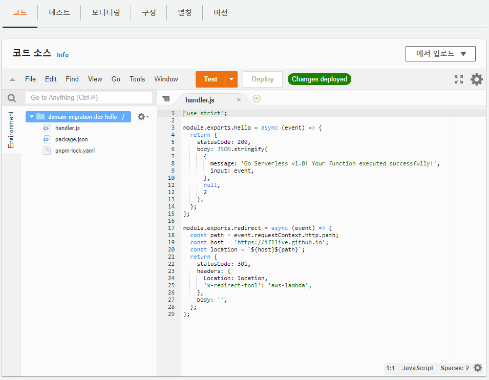

## why serverless-framework?



웹 콘솔을 통해서 AWS Lambda 함수를 만들고 코드를 고칠 수 있다.
SQS로 람다를 트리거해서 SES를 통해 이메일 보내는 기능은 웹콘솔로도 충분히 작성할 수 있을 것이다.
하지만 현실의 애플리케이션은 이정도로 간단하지 않다.
복잡한 애플리케이션을 짜려면 외부 라이브러리가 필요하고 node.js 패키지를 갖다쓰게 된다.
[serverless framework][serverless-framework]를 사용하면 serverless 배포를 간단하게 할 수 있다.

## 예제 프로젝트

간단한 백엔드 프로젝트를 상상하자.
실제 구현은 하지 않고 구현에 필요한 패키지만 포함킨다.

* 타입스크립트 기반
* mysql을 RDB로 사용: [mysql][npm-mysql]
* 생산성을 위해 ORM을 붙임: [typeorm][npm-typeorm]
* 일부 데이터는 DyanmoDB에 저장된다: [dynamo-types][npm-dynamo-types]
* 코딩을 쉽게하는 도구: [lodash][npm-lodash]
* SNS, SQS와 같은 AWS 서비스를 사용: [aws-sdk][npm-aws-sdk]

`serverless create --template aws-nodejs-typescript`를 통해서 AWS Lambda 위해서 돌아가는 타입스크립트 기반의 헬로월드 프로젝트를 만들 수 있다. 이 글에서는 자동 생성된 코드를 그대로 사용하지 않았다. 자바스크립트 기반의 serverless 프로젝트와 비슷한 형태로 작성했다. 앞으로 글에서 다룰 기법은 타입스크립트가 아닐때도 적용할 수 있기 떄문이다.

## serverless-webpack

AWS Lambda에서 타입스크립트 프로젝트는 바로 돌아가지 않는다.
몇가지 과정을 거쳐야 람다에서 실행할수 있는 형태가 된다.

첫번째, 타입스크립트를 자바스크립트로 컴파일해야한다.
람다 런타임으로 node를 쓰면 자바스크립트만 사용할 수 있다.
람다 런타임으로 deno를 쓴다면 타입스크립트를 그대로 쓰는게 가능할지 모르지만 여기에서는 다루지 않는다.

두번째, 런타임에 의존성 걸린 패키지만 걸러내야한다.
`node_modules`를 통째로 압축해서 람다로 올리면 의존성을 신경쓰지 않아도 되니까 편할 것이다.
하지만 람다 패키지 업로드 크기는 50MB로 제한되어 있다.
`devDependencies`의 내용물을 배포에서 빼야 50MB 제한을 맞출 수 있다.

세번째, 람다에서 실행될 코드, 패키지를 압축해서 zip 파일 1개로 만들어야한다.
`node_modules`의 수많은 파일이 낱개로 업로드되는건 말도 안되잖아?

[serverless-webpack][serverless-webpack]를 쓰면 이 과정을 알아서 해준다.

webpack.config.js
```js
const path = require('path');
const slsw = require('serverless-webpack');
const nodeExternals = require('webpack-node-externals');

module.exports = {
  context: __dirname,
  mode: slsw.lib.webpack.isLocal ? 'development' : 'production',
  entry: slsw.lib.entries,
  devtool: slsw.lib.webpack.isLocal ? 'eval-cheap-module-source-map' : 'source-map',
  resolve: {
    extensions: ['.mjs', '.json', '.ts'],
    symlinks: false,
    cacheWithContext: false,
  },
  output: {
    libraryTarget: 'commonjs',
    path: path.join(__dirname, '.webpack'),
    filename: '[name].js',
  },
  target: 'node',
  externals: [nodeExternals()],
  module: {
    rules: [
      // all files with a `.ts` or `.tsx` extension will be handled by `ts-loader`
      {
        test: /\.(tsx?)$/,
        loader: 'ts-loader',
        exclude: [
          [
            path.resolve(__dirname, 'node_modules'),
            path.resolve(__dirname, '.serverless'),
            path.resolve(__dirname, '.webpack'),
          ],
        ],
        options: {
          transpileOnly: true,
          experimentalWatchApi: true,
        },
      },
    ],
  },
  plugins: [],
  optimization: {
    minimize: false
  },
};
```

serverless.yml
```yml
service: webpack-beginning

frameworkVersion: '2'

plugins:
  - serverless-webpack

provider:
  name: aws
  runtime: nodejs14.x
  lambdaHashingVersion: 20201221

  memorySize: 128
  logRetentionInDays: 1
  versionFunctions: false

  region: ap-northeast-1

functions:
  hello:
    handler: src/handler.hello
    events:
      - httpApi: '*'

custom:
  webpack:
    webpackConfig: './webpack.config.js'
    includeModules: true
```

`serverless.yml`은 serverless-webpack 문서를 보고 적당히 수정하면 된다.

```yml
plugins:
  - serverless-webpack

custom:
  webpack:
    webpackConfig: './webpack.config.js'
    includeModules: true
```

## handler

람다 핸들러에는 `import 'xxx'`를 넣어서 webpack에서 코드를 짤라버리지 않도록 했다.

```ts
import {
  APIGatewayProxyHandlerV2,
} from 'aws-lambda';

import 'aws-sdk';
import 'dynamo-types';
import 'lodash';
import 'typeorm';
import 'mysql';

export const hello: APIGatewayProxyHandlerV2 = async (event) => {
  return {
    statusCode: 200,
    body: JSON.stringify({
      message: 'Go Serverless v1.0! Your function executed successfully!',
      input: event,
    }, null, 2),
  };
};
```

## packaging and deploy

`npx sls webpack`을 실행하면 `.webpack` 폴더가 생기고 폴더에는 빌드된 결과물이 들어있다.
`npx sls package`을 실행하면 `.serverless` 폴더가 생기고 폴더에는 배포될 결과물이 들어있다.

`npx sls deploy`를 호출하면 배포한다.
deploy만 하면 패키징은 serverless에서 알아서 수행한다.
webpack, package 명령이 있다는건 나중을 위해서 알아두면 된다.

```
Serverless: Bundling with Webpack...
asset src/handler.js 2.71 KiB [emitted] (name: src/handler) 1 related asset
orphan modules 210 bytes [orphan] 5 modules
runtime modules 670 bytes 3 modules
./src/handler.ts + 5 modules 563 bytes [not cacheable] [built] [code generated]
webpack compiled successfully in 617 ms
Serverless: Package lock found - Using locked versions
Serverless: Packing external modules: aws-sdk@^2.958.0, dynamo-types@^2.10.1, lodash@^4.17.21, typeorm@^0.2.36, mysql@^2.18.1
Serverless: Copying existing artifacts...
Serverless: Packaging service...
Serverless: Uploading CloudFormation file to S3...
Serverless: Uploading artifacts...
Serverless: Uploading service webpack-beginning.zip file to S3 (21.18 MB)...
Serverless: Validating template...
Serverless: Updating Stack...
Serverless: Checking Stack update progress...
.....
Serverless: Stack update finished...
Service Information
service: webpack-beginning
stage: dev
region: ap-northeast-1
stack: webpack-beginning-dev
resources: 10
api keys:
  None
endpoints:
  ANY - https://xxxxxxxxxx.execute-api.ap-northeast-1.amazonaws.com
functions:
  hello: webpack-beginning-dev-hello
layers:
  None
```

## next?

인터넷 뒤지면 serverless framework로 람다 배포하는 글이 많이 있다.
나도 글을 더 잘 쓰는 사람들이 썼다. 여기까지는 내 글보다 다른 사람들의 글이 쓸만할 것이다.

다음 편부터는 아래의 주제를 다룰 것이다. 여기부터는 다른 사람들의 글과 많이 달라질 것이다.

* `Serverless: Uploading service xxx.zip file to S3 (21.18 MB)...` 용량 줄이기
* serverless-webpack의 작동 방식과 위험성
* 패키징/배포 시간 단축

[serverless-framework]: https://www.serverless.com/
[serverless-webpack]: https://github.com/serverless-heaven/serverless-webpack

[npm-mysql]: https://www.npmjs.com/package/mysql
[npm-dynamo-types]: https://www.npmjs.com/package/dynamo-types
[npm-typeorm]: https://www.npmjs.com/package/typeorm
[npm-lodash]: https://www.npmjs.com/package/lodash
[npm-aws-sdk]: https://www.npmjs.com/package/aws-sdk
