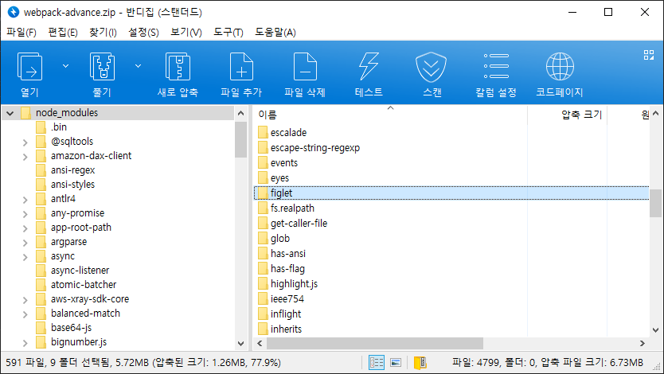

[이전글](/posts/deploying-serverless-1-serverless-webpack-beginning)에서는 serverless-webpack를 사용해서 람다 배포하는걸 다뤘다.
배포 패키지의 크기는 21.18 MB (21,685KB) 였다.
2부에서는 배포 패키지 크기를 줄이는 편법을 다룬다.

## 왜 배포 패키지 크기를 줄이나?

배포 패키지 (.zip 파일 아카이브)는 [50MB][docs-lambda-limit]로 제한되어있고 당분간 늘어나지 않을 것이다.
(최근에 컨테이너 형태로 람다 배포하는 방법이 추가되었다. 배포컨테이너 이미지를 쓰면 10GB까지 배포할 수 있다.)
mysql용 ORM, dynamodb용 ORM, lodash만 넣었을뿐인데 20MB이다.
50MB는 큰거 같으면서도 생각보다 작다. 개발하면서 패키지를 이것저것 추가하다보면 50MB를 넘을 수 있다.

zip에 포함될 파일 수가 줄어들면 zip 생성이 빨라진다.
`npx sls webpack`을 돌려서 `.webpack/`를 생성하자.
생성된 `.webpack/service/` 디렉토리의 내용과 `.webpack/xxx.zip` 내부를 보면 둘은 같다.
`.webpack/service/`의 내용물을 지우면 배포 패키지의 크기를 줄일 수 있다.

배포 패키지의 크기가 작을수록 [cold start 시간이 짧아진다는 이야기][blog-cold-start-1]가 있다.
하지만 배포 패키지의 크기와 [cold start 시간이 관계 없다는 이야기][blog-cold-start-2]도 있다.
적어도 배포 패키지의 크기가 작을때 cold start 시간이 늘어나진 않을 것이다.

배포 패키지 크기를 줄이는 방법은 간단하다.
런타임에 터지지 않는 범위에서 쓸모없는 파일을 배포에서 뺀다.
초기 배포 패키지 크기 21,685KB 부터 줄여나간다.

## @types/xxx

`@types/`에 있는 패키지는 타입스크립트 타입 정의이다.
node 런타임은 자바스크립트를 돌리니까 타입스크립트와 관련된 코드는 필요없다.
https://github.com/serverless-heaven/serverless-webpack#custom-scripts
serverless-webpack 문서를 보면 빌드 과정에 스크립트 끼워넣는 방법이 나온다.
이를 사용해서 `@types`를 통째로 지운다.
OS를 신경쓰지 않고 파일을 지우려고 [rimraf](https://www.npmjs.com/package/rimraf)를 썻다.

```yaml
custom:
  webpack:
    packagerOptions:
      scripts:
        - npx rimraf "node_modules/@types"
```

배포 패키지 크기: 21,303KB (-382KB)

## 런타임에 필요 없는 파일

유닛테스트, 소스맵은 런타임에 없어도 된다. 배포에서 빼자.
https://github.com/serverless-heaven/serverless-webpack#exclude-files-with-regular-expression
serverless-webpack 문서에 정규식으로 패키징에서 제외하는 방법이 나온다. 그대로 적용하자.

```yaml
custom:
  webpack:
    excludeRegex: \.ts|test|\.map
```

배포 패키지 크기: 12,173KB (-9,130KB)

## AWS Lambda 내장 패키지 적용

AWS Lambda에는 node.js만 깔려있는게 아니다. aws-sdk도 깔려있다.
[Lambda 런타임][docs-lambda-runtime]을 보면 21년 8월 1일 기준으로 SDK for JavaScript 2.880.0가 설치되어있다.
2.880.0 이상의 버전이 꼭 필요한게 아니면 배포 패키징에서 aws-sdk를 제거할 수 있다.

https://github.com/serverless-heaven/serverless-webpack#aws-sdk
aws-sdk 제외하는건 많은 사람들이 쓰는 기능이라서 serverless-webpack 문서에서도 다룬다.
그대로 적용하자.

```yaml
custom:
  webpack:
    includeModules:
      forceExclude:
        - aws-sdk
```


배포 패키지 크기: 12,173KB (-0KB)

어??? 용량이 줄지 않았다? zip을 열어보면 aws-sdk가 그대로 남아있다.

## 왜 forceExclude가 작동하지 않는가?

serverless-webpack은 직접 추가한 패키지는 의존성에서 뺄 수 있지만 다른 패키지에 의해서 간접적으로 들어간 패키지는 빼지 않는다.
[Allow force excluding deep dependencies](https://github.com/serverless-heaven/serverless-webpack/issues/306#issuecomment-435888529)

dynamo-types 2.10.1에는 dependencies로 aws-sdk `^2.538.0`가 들어있다.
https://github.com/balmbees/dynamo-types/blob/v2.10.1/package.json#L50
직접 추가한 aws-sdk는 forceExlucde에 의해서 제외되었지만 dynamo-types에 의해서 aws-sdk가 다시 끌려들어간다.

똑똑한 방법으로 문제를 해결할 수 없을땐 무식한 방법을 쓰면 된다.
node_modules에서 직접 지운다.

```yaml
custom:
  webpack:
    packagerOptions:
      scripts:
        - npx rimraf "node_modules/aws-sdk"
```

배포 패키지 크기: 6,901KB (-5,272KB)

## typeorm 최적화

배포 패키지 zip 파일을 직접 뜯어보면 크기를 줄일 수 있는 힌트를 찾을 수 있다.
figlet 라이브러리가 압축된 크기 1.26MB 씩이나 차지하고 있는게 보인다.



figlet 같이 거대한 패키지가 대체 어떻게 끌려들어간건가? 이걸 제거할 방법이 있나?
뜯으면 답이 나온다.
typeorm은 yargonaut를 사용하고 yargonaut가 figlet를 사용한다.
typeorm에서 yargonaut를 런타임에 사용하지 않는다면 figlet를 지워도 런타임에 문제가 생기지 않을 것이다.
다행히도 typeorm의 경우는 [cli 명령](https://github.com/typeorm/typeorm/blob/0.2.36/src/cli.ts#L43)에서만 yargonaut를 사용한다. figlet를 지운다.

```yaml
custom:
  webpack:
    packagerOptions:
      scripts:
        - npx rimraf "node_modules/figlet"
```

배포 패키지 크기: 5,503KB (-1,398KB)

이건 typeorm에만 적용할 수 있는 편법이다.
라이브러리 코드를 직접 열어보고 런타임에 문제가 없다고 확신할때만 할 수 있다.
의존성 걸린 패키지가 figlet 같이 거대한 경우가 아니면 권장하지 않는다.
figlet가 300KB쯤이었으면 나도 안했다.

figlet 때문에 람다 배포 용량이 커지는건 typeorm 에도 올라온 이슈인데 아직 처리되지 않았다. 언제쯤 처리될지...
[Are yargonaut and figlet required at run-time?](https://github.com/typeorm/typeorm/issues/678)

## result

21,685KB -> 5,503KB (-16,182KB)
처음의 25% 수준으로 배포 패키지의 크기를 줄였다.
이 글에서 다룬 기법을 응용하면 50MB를 넉넉하게 쓸 수 있을 것이다.

## next?

`.webpack/` 디렉토리의 내부를 뜯어보고 serverless-webpack로는 고치기 어려운 문제를 알아본다.

[docs-lambda-limit]: https://docs.aws.amazon.com/ko_kr/lambda/latest/dg/gettingstarted-limits.html
[docs-lambda-runtime]: https://docs.aws.amazon.com/ko_kr/lambda/latest/dg/lambda-runtimes.html

[blog-cold-start-1]: https://mikhail.io/serverless/coldstarts/aws/
[blog-cold-start-2]: https://acloudguru.com/blog/engineering/does-coding-language-memory-or-package-size-affect-cold-starts-of-aws-lambda
