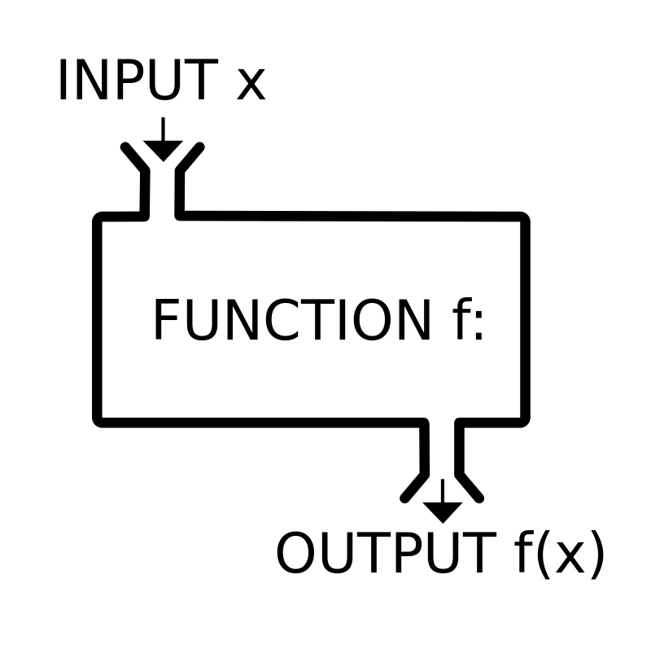
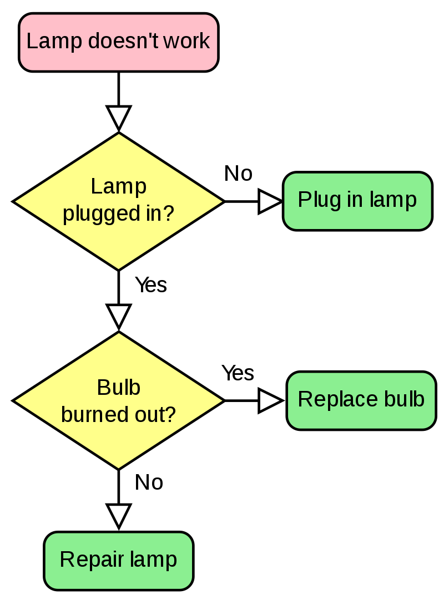
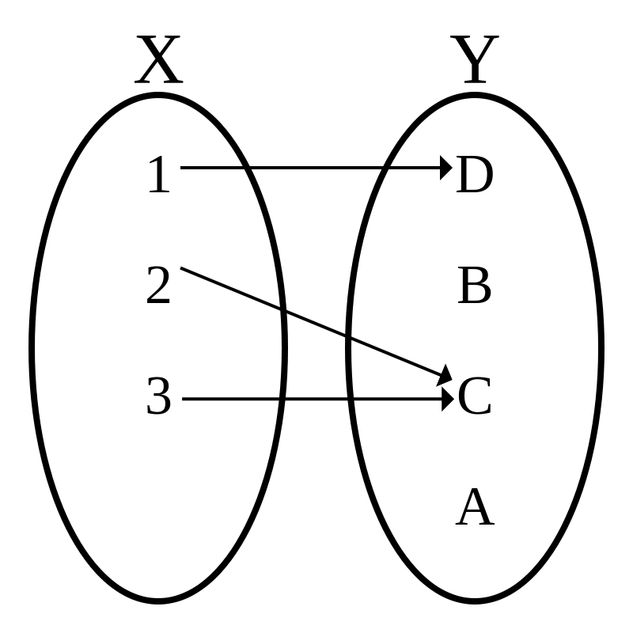
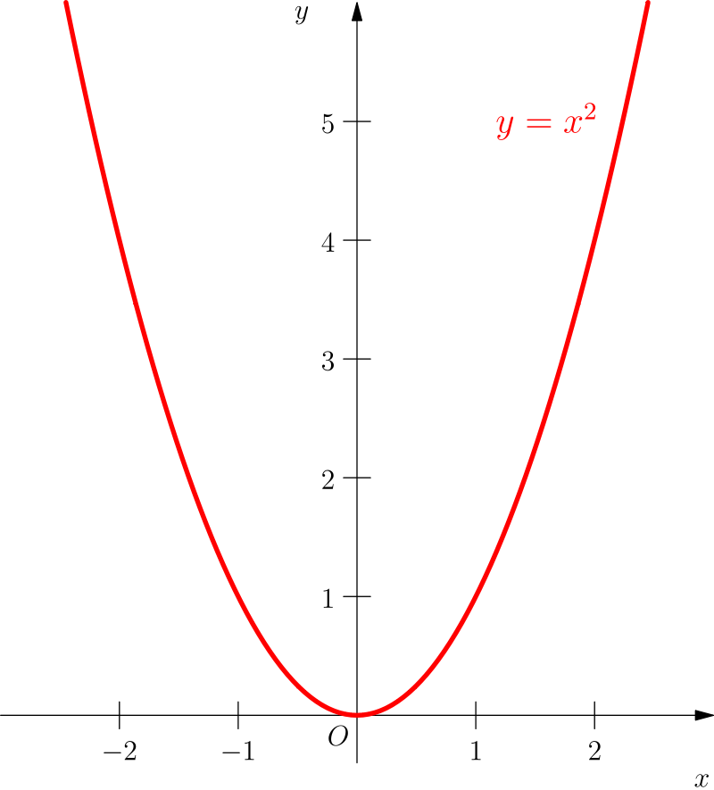

TODO 함수 정의?

TODO 알고리즘 정의




```txt
100 = A
90 = A
89 = B
70 = B
69 = C
40 = C
39 = D
0 = D
```

## 알고리즘



algorithm
https://ideone.com/O5kYsE

```c
#include <stdio.h>

char calc_grade(int score) {
	if(score >= 90) { return 'A'; }
	if(score >= 70) { return 'B'; }
	if(score >= 40) { return 'C'; }
	if(score >= 0)  { return 'D'; }
	return '?';
}

int main(void) {
	int values[] = {100, 90, 89, 70, 69, 40, 39, 0};
	for(int i = 0 ; i < sizeof(values) / sizeof(values[0]) ; i++) {
		int v = values[i];
		printf("%d = %c\n", v, calc_grade(v));
	}
	return 0;
}
```

## 관계
집합론


TODO 수학에서의 함수 정의

pattern matching
https://play.rust-lang.org/?version=stable&mode=debug&edition=2018&gist=b588f7e0b026361c48a92d53ea2b98db

```rust
fn calc_grade(score: i32) -> &'static str {
    match score {
        90...100 => "A",
        70...89 => "B",
        40...69 => "C",
        0...39 => "D",
        _ => "?",
    }
}

fn main() {
    let scores = vec![100, 90, 89, 70, 69, 40, 39, 0];
    for score in scores {
        let grade = calc_grade(score);
        println!("{} = {}", score, grade);
    }
}
```

## 수학 공식
선형회귀



math
https://ideone.com/ArmMQ6

```c
#include <stdio.h>

char calc_grade(int score) {
	int offset = (int)((score * score / 1600.0) + 1) / 2;
	return 'D' - offset;
}

int main(void) {
	int values[] = {100, 90, 89, 70, 69, 40, 39, 0};
	for(int i = 0 ; i < sizeof(values) / sizeof(values[0]) ; i++) {
		int v = values[i];
		printf("%d = %c\n", v, calc_grade(v));
	}
	return 0;
}
```


