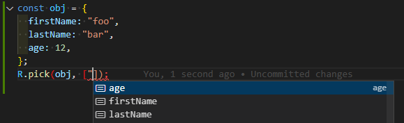

## 개요

이전 글에서 lodash를 탈출하게된 동기를 다뤘다.
이번에는 검토해 본 후보들과 선택되지 않은 이유, 최종 선택을 다룬다.

## 요구사항

### (A) 타입스크립트로 작성된 라이브러리여야한다.
lodash의 경우 자바스크립트로 라이브러리를 작성하고 타입 선언 파일을 배포했다.
lodash의 경우 타입 정의를 손으로 작성했는지 양쪽의 버전이 다르더라.
`lodash` 최신 버전은 2년전 (2021년)에 릴리즈된 4.17.21 이다.
`@types/lodash`의 최신 버전은 2023년에 배포된 4.14.195 이다.
라이브러리와 타입 선언의 버전을 맞추는 가장 확실한 방법은 하나로 배포되는 것이다.
그리고 타입스크립트로 작성된 라이브러리면 하나로 배포된다.

### (B) 타입스크립트의 국룰(?)에서 크게 벗어나면 안된다.
내가 원하는건 함수형 라이브러리이지 함수형 프로그래밍 언어가 아니다.
lodash를 새로운 함수형 라이브러리로 바꿨다고 기존 코드가 전부 박살나는건 원하는게 아니다.
라이브러리 하나 새로 넣었다고 모나드부터 시작해서 수많은걸 새로 배우고 싶진 않다.

### (C) lodash와 너무 다르면 안된다.
신규 프로젝트에 넣을 lodash의 대안을 찾는거면 lodash와 비슷할 필요없다.
하지만 나는 라이브 서비스 중인 코드에서 lodash의 대안을 찾는것이다.
lodash와 너무 많은게 다르면 lodash의 대안이 될 수 없다.

### (D) 파이프 연산자랑 비슷하게 생긴게 있으면 좋겠다.

파이프 연산자를 elixir 쓰다가 처음 접했는데 좋더라.
파이프 연산자를 사용하면 코드를 앞에서부터 읽어서 어떤 일이 벌어날지 알 수 있다.
파이프 연산자가 없다면 함수의 호출 순서는 괄호 안쪽부터 읽어야하니까 잘 안보인다.

```elixir
// pipe operator
iex> "Elixir rocks" |> String.upcase() |> String.split()
["ELIXIR", "ROCKS"]

// no pipe operator
String.split(String.upcase("Elixir rocks"))
```

좋은건 서로 베끼는 세상이니까 자바스크립트에도 파이프 연산자 넣자는 이야기는 있다.
하지만 언제 들어갈까? 타입스크립트에도 적용되는 날은 언제 올까?
[Pipe Operator (|>) for JavaScript](https://github.com/tc39/proposal-pipeline-operator)

lodash에도 pipe가 있긴하다.
lodash의 [FP Guide](https://github.com/lodash/lodash/wiki/FP-Guide)에는 `_.pipe`가 있다.

> _.pipe is an alias of _.flow

`_.flow` 예제는 다음과 같다.

```ts
function square(n) {
  return n * n;
}
 
var addSquare = _.flow([_.add, square]);
addSquare(1, 2);
// => 9
```

파이프 연산자의 형태라면 `pipe(데이터, 함수, 함수)` 같은 형태로 작성되고 데이터가 함수를 거치면서 가공된다.
`_.flow`를 쓰면 `flow(함수, 함수)(데이터)` 같은 형태로 작성된다. `flow`로 합성 함수를 만들고 데이터를 넣는 느낌이다.
수학적으로는 `flow`가 맞을지 몰라도 내가 원하는건 파이프 연산자의 순서로 작성되는 것이다.

### (E) ESM 시대에 맞는 라이브러리여야한다.
dual package로 배포되서 CommonJS를 동시에 지원해도 괜찮다.
아무튼 ESM을 공식적으로 지원해야된다.

### (F) 깃헙 스타수가 적당히 많고 유지보수 되는 느낌의 라이브러리여야 한다.
다 죽어가는 라이브러리로 갈아타면 lodash를 그대로 쓰는것보다 얻는게 없다.

## 후보: [fp-ts][site-fp-ts]

함수형 타입스크립트를 검색하면 순위권에 나오는 라이브러리이다.
공식 사이트에는 [Ecosystem](https://gcanti.github.io/fp-ts/ecosystem/) 문서가 있다.
fp-ts는 함수형 프로그래밍에 너무 심취한 나머지 (B)를 지키지 못했다.
공부하고 만져보면 배울건 많은데 신규 프로젝트가 아닌 곳에서는 쓸 수 없다.

## 후보: [ramda][github-ramda]

함수형으로 유명한 라이브러리인데 (A)를 만족하지 않는다.
`@types/ramda`를 따로 설치하고 싶지 않아.

## 후보: [rambda][github-rambda]

ramda의 호환성을 유지하면서 타입스크립트를 지원하는 라이브러리이다.
깃헙 페이지를 봤을때는 자바스크립트와 타입스크립트가 뒤섞인 물건이다.
하지만 밖에서 보면 별도의 타입 정의가 없으니까 (A)의 기준은 넘겼다.

`uniqBy` 예제를 통해서 (C)를 만족하는지 확인하자

```ts
/* rambda */
const list = [{a:1}, {a:2}, {a:1}]
const result = R.uniqBy(x => x, list)
// => [{a:1}, {a:2}]

/* lodash */
_.uniqBy([2.1, 1.2, 2.3], Math.floor);
// => [2.1, 1.2]
```

rambda와 lodash의 `uniqBy`의 인자 순서는 반대이다.
함수를 인자로 받는 경우, lodash와 rambda의 인자는 전부 반대로 생각해도 된다.
인자 순서로 전부 바꾸는건 미친 짓이니 (C)에서 걸려서 쓸 수 없다.

## 후보: [FxTS][site-fxts]

함수형 라이브러리를 찾다가 도달했는데 README에 한국어 슬랙 링크가 있는게 신선해서 기억한다.
[마플](https://www.marpple.com/)에서 만든 라이브러리이다.
마플에서 만든 티셔츠보다 라이브러리를 먼저 만져볼 줄이야 ㅋ

공식 사이트에도 pipe 예제를 자랑스럽게 걸어놨더라.
이게 내가 원하는 파이프 함수야! (D)를 만족한다.

```ts
pipe(
  [1, 2, 3, 4, 5],
  map(a => a + 10),
  filter(a => a % 2 === 0),
  take(2),
  toArray
); // [12, 14]
```

근데 `uniqBy`의 인자 순서가 lodash와는 반대더라. (C)를 만족하지 않는다.
함수형 프로그래밍 세계에서는 함수 인자를 lodash랑 반대로 쓰는게 일상인가?

```ts
const iter = uniqBy(a => a.age, [{age: 21}, {age: 23}, {age: 21}, {age: 34}]);
iter.next() // {done:false, value: {age: 21}}
iter.next() // {done:false, value: {age: 23}}
iter.next() // {done:false, value: {age: 34}}
iter.next() // {done:true, value: undefined}
```

## 후보: [radash][site-radash]

이름부터 lodash의 짭같은 라이브러리이다.
그런데 생각보다 lodash와의 호환성을 원하진 않았나보다.

lodash의 `difference`는 radash에서는 `diff`이다.
lodash의 `minBy`는 radash에서는 `min`이다.
lodash의 `unique`는 radash에서는 `uniq`이다.

함수가 1:1로 대응되긴 하는데 이름이 많이 바뀌다보니까 음....
(C)를 만족한건가? 만족하지 못하는건가?
대안을 더 찾아보자.

## 후보: [remeda][github-remeda]

> The first "data-first" and "data-last" utility library designed especially for TypeScript.

README 첫줄부터 (A)를 만족한다.

[Mapping for Lodash and Ramda](https://github.com/remeda/remeda/blob/master/mapping.md)
lodash와 remeda의 함수 이름은 비슷하다.
일부 다른게 있지만 radash의 경우를 생각하면 비슷한거나 다름없다.
radash에 비해서 (C)를 만족한다.

remeda에서 마음에 들었던건 README 시작부터 나오는 **What's "data-first" and "data-last"?** 이다.

```ts
// Remeda
R.pick(obj, ['firstName', 'lastName']);
```

ramda의 경우 함수 인자를 먼저 넣고, 다음에 데이터를 넣는다.
앞에서부터 입력하니까 `['firstName', 'lastName']`를 입력할때는 `obj`가 어떤 타입인지 모른다.
`obj`를 모르니까 `firstName` 입력할때 자동 완성을 할 수 없다.

```ts
// Remeda
R.pick(obj, ['firstName', 'lastName']);
// Lodash
_.pick(obj, ['firstName', 'lastName']);
```

lodash, remeda는 데이터를 먼저 넣고, 다음에 함수 인자를 넣는다.
`obj`부터 입력하니까 `R.pick(obj,` 입력된 다음에 `R.pick`가 어떤 타입으로 호출되어야하는지 알 수 있다.
그래서 `['firstName', 'lastName']`를 자동 완성으로 채울 수 있다.



위의 원리는 파이프에서도 똑같이 적용된다.
아래는 remeda README에서 긁은 pipe 함수의 예제이다.
`broken typings in TS :(` 가 왜 발생하는지는 쉽게 이해할 수 있다.

```ts
const users = [
  { name: 'john', age: 20, gender: 'm' },
  { name: 'marry', age: 22, gender: 'f' },
  { name: 'samara', age: 24, gender: 'f' },
  { name: 'paula', age: 24, gender: 'f' },
  { name: 'bill', age: 33, gender: 'm' },
];

// Remeda
R.pipe(
  users,
  R.filter(x => x.gender === 'f'),
  R.groupBy(x => x.age)
);

// Ramda
R.pipe(
  R.filter(x => x.gender === 'f'),
  R.groupBy(x => x.age)
)(users); // broken typings in TS :(

// Lodash
_(users)
  .filter(x => x.gender === 'f')
  .groupBy(x => x.age)
  .value();

// Lodash-fp
_.flow(
  _.filter(x => x.gender === 'f'),
  _.groupBy(x => x.age)
)(users); // broken typings in TS :(
```

이정도 pipe 함수면 (D)도 만족한거다.

## 최종 선택: remeda

remeda가 후보 중에 제일 멀쩡했다.
lodash보다 더 좋아진 점도 있었다.
그래서 바로 갈아탔다.

lodash에서 remeda로 갈아타는 것은 쉬웠다.
`import _ from 'lodash'`는 `import * as R from 'remeda'`로 바꾸면 된다.
`_.uniqBy(`를 `R.uniqBy(`로 바꾸면 된다.
1:1로 맵핑되는 함수는 위와 같은 식으로 바꾸면 된다.

구글에서 한국어 웹으로 검색했을때 remeda가 많이 언급되었다면 글을 쓸 이유가 없었을거다.
remeda는 완성도, 가치에 비해서 알려지지 않은 라이브러리라서 글을 써봤다.

## next?

문자열 치환만 돌려도 lodash에서 remeda로 갈아탈 수 있는것처럼 이야기했지만 사실 뻥이다.
remeda는 lodash를 100% 대체하진 못한다.

remeda에는 `_.shuffle`, `_.random` 같은 함수가 없다.
(내가 remeda 처음 쓸때는 isEmpty, sample도 없었는데 지금은 추가되었더라)

remeda에 `minBy`, `maxBy`, `sumBy`는 있지만 `min`, `max`, `sum`은 없다.
(실제로 다루고 싶은 내용은 `Math.min`, `Math.max`를 안쓴 이유겠지만)

다음 글에서는 구멍난 부분을 어떻게 땜질했는지 다룬다.

[site-fp-ts]: https://gcanti.github.io/fp-ts/
[github-ramda]: https://github.com/ramda/ramda
[github-rambda]: https://github.com/selfrefactor/rambda
[site-fxts]: https://fxts.dev/
[site-radash]: https://radash-docs.vercel.app/docs/getting-started
[github-remeda]: https://github.com/remeda/remeda
