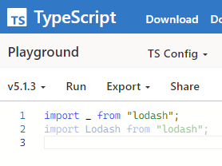

## lodash를 2023년까지 쓰게된 이유

내가 웹개발로 처음 먹고 살기 시작한건 2010년이다.
IE 6,7,8을 전부 지원해야되는 시절이었다.
그때 그 시절 자바스크립트는 미개했고 인터넷 익스플로러는 더 미개했다.

간단한 예를 보자. 자바스크립트 내장 배열에는 함수가 몇개 없었다.

* [Array.filter](https://caniuse.com/mdn-javascript_builtins_array_filter): IE 6-8 사용 불가
* [Array.map](https://caniuse.com/mdn-javascript_builtins_array_map): IE 6-8 사용 불가
* [Array.flat](https://caniuse.com/mdn-javascript_builtins_array_flat): 2018년 이전까지 사용 불가
* [Array.find](https://caniuse.com/array-find): 아무튼 옛날에는 못씀
* [Array.includes](https://caniuse.com/array-includes): 아무튼 옛날에는 못씀

지금이야 bable같은 트랜스파일러 쓰면 된다고 하지만 2010년에? 그런게 있을리가?
babel의 첫커밋은 2014년 9월 28일인데 나는 2010년에 살고 있었고.
https://github.com/babel/babel/commit/c97696c224d718d96848df9e1577f337b45464be

2010년에 자주 사용되는 방법은 `Array.prototype`에 `map`, `filter` 같은 함수를 직접 추가하는거였다.
(과거에 출판된 자바스크립트 책을 보면 부록으로 이런 내용 들어간게 많았다 ㅋㅋㅋ)

표준 라이브러리에는 `filter`, `map`, `includes`같은 뻔한 함수조차 없고
`Array.prototype`, `Object.prototype` 같은걸 직접 건드리는건 오답같고
트랜스파일러라는 혁신적인 개념이 나와서 대중화되기에는 아직 멀었고
`intersection`, `union`, `flatten`, ... 같은걸 전부 직접 구현하는건 미친거같고
라이브러리를 쓰는게 무난한 선택지이었다.

그래서 2010년쯤에는 [underscore.js][site-underscore]를 사용한거로 기억한다.
(이땐 lodash가 없었다. npm 기준 lodash 0.1.0은 2012년 4월 24일)

`underscore.js`로 몇 년 잘 쓰다가 `lodash`를 알게 되었다.
underscore.js와 API가 비슷하게 생겨서 마이그레이션이 쉬워보였다.
lodash쪽이 기능이 더 많고 문서도 충실해서 lodash로 갈아타게 되었다.

그리고 2019년까지 자바스크립트를 쓸 일이 있으면 lodash를 넣게 되었다.
경로의존성 무섭더라. lodash로 직접 통수를 맞지 않으니까 lodash의 문제는 잘 모르겠고.
lodash로 부족함을 못느끼니까 다른 라이브러리 갈아탈 이유도 없고.

그렇게 2019년, 회사에서 작성한 신규 프로젝트의 서버 코드에 lodash가 들어가게 되었다.
2021년에 서비스를 런칭, 라이브 서비스 돌아가는 서버의 라이브러리를 갈아끼운다? 그거 말고도 할게 많은데?
그리고 2023년이 되었다.

## 단점

### 자바스크립트로 작성된 라이브러리

[lodash 저장소][github-lodash]에 가면 사용중인 언어가 나온다.  **JavaScript 100.0%**

나는 타입스크립트를 사용해서 npm 패키지 2개를 깔아야 lodash를 멀쩡하게 쓸 수 있다.
하나는 lodash, 또 하나는 lodash 타입 선언이다.

```json
"dependencies": {
  "lodash": "^4.17.21"
},
"devDependencies": {
  "@types/lodash": "^4.14.195"
}
```

lodash가 타입스크립트로 작성되었다면 선언 파일도 같이 패키지 하나로 타입까지 배포되었을 것이다.
lodash 대안을 찾을때는 타입스크립트 기반으로 작성된걸 찾아봐야지.

### 관대한 타입 선언

자바스크립트로 작성되서 그런지 타입 정의가 관대하다.
너무 관대해서 컴파일이 터질거같은데 컴파일이 잘 되고 잘 돌아간다.

`number[]`에 `maxBy`를 적용한다면 기준으로 비교할지 없어도 된다. 언어에 정의된 숫자 비교 규칙을 쓰겠지?
하지만 객체로 구성된 배열에 `maxBy`를 적용하면 어떻게 비교할지 함수가 필요할 것이다.
함수를 인자로 넣지 않을때 컴파일이 터지면 실수를 컴파일타임에 잡을 수 있을것이다.

```ts
type Entry = { name: string };
const list: Entry[] = [
  { name: "B" },
  { name: "A" },
  { name: "D" },
  { name: "C" },
];

// Not correct
console.log('maxBy: Not correct', _.maxBy(list));

// Correct
console.log('maxBy: Correct', _.maxBy(list, x => x.name));
```

```ts
maxBy: Not correct { name: 'B' }
maxBy: Correct { name: 'D' }
```

예제를 실행하면 위의 결과가 나온다.
함수 없이 `maxBy`를 호출해도 잘 돌아가는데 이런 결과를 원하진 않았을거다.
lodash를 쓰다보면 터져야할거같은데 안터지고 잘(?) 돌아가다가 런타임에 함정을 밟게 된다.
lodash 보다 타입 정의가 빡빡해서 잘못쓰면 컴파일 타임에 터지는 라이브러리를 쓰고 싶다.

### ESM 시대

2019년에는 [Node.js v12](https://nodejs.org/en/blog/release/v12.13.0)가 LTS였다.
Node.js v12부터 ES Module이 stable로 들어갔다.
이제부터 ESM을 쓰면 되겠네? 는 순진한 생각이고 현실은 한참 멀었다.

2019년의 타입스크립트 버전을 보면
* 3.6.3: 2019년 9월 11일
* 3.7.2은 2019년 11월 6일

[타입스크립트 4.7](https://www.typescriptlang.org/docs/handbook/release-notes/typescript-4-7.html) 쯤 와서야 "ECMAScript Module Support in Node.js" 같은 소리가 나온다.
타입스크립트가 이런 소리 하면 다른 라이브러리들 수준은 안봐도 뻔하다.
그래서 ESM은 머리에서 지우고 살았다.

2022년, 2023년이 되기 전까지는.

과거에는 cjs, esm 동시에 지원하는 dual package 구조로 나오는게 많았는데
시간이 지날수록 Pure ESM Package가 많이 보이기 시작하더라.
으... 결국 ESM으로 넘어가야하나...

하고 lodash는 ESM 준비를 어떻게 해놨나 봤는데 처음보는 구조더라.
듀얼 패키지로 배포하지 않았더라. 2개의 패키지로 배포했더라.

* lodash: cjs
* lodash-es: esm

lodash에 말뚝 박고 계속 써도 되나? 그래도 시간 지나면 개선하겠지?
만약 lodash 탈출한다면 CommonJS, ESM 멀쩡하게 지원하는거 써야지.

### 유지보수

* lodash: 4.17.21 (2년 전)
* lodash-es: 4.17.21 (2년 전)

lodash가 너무 완벽해서 2년동안 손댈 이유가 없었을지 모른다.
자바스크립트 생태계가 deno, bun, ESM, ... 같은 식으로 바뀌고 있는데 혼자 2년전에 멈춰있으면 음...
진짜로 계속 써도 되나? 도망쳐야 되는거 아닌가?

### unused import

이건 단점이라고 하긴 그렇고 타입스크립트의 함정에 가까운 느낌이다.

```ts
import _ from "lodash";
import Lodash from "lodash";
```



똑같이 unused import인데 명확한 이름이 있을때와 이름이 `_` 일때 다르게 보인다.
lodash 쓰는데 `_`가 아닌 `import L from "lodash"` 로 쓰는건 익숙하지 않은데...
ramda 같은거 보니까 `import * as R from "ramda"` 로 사용해서 unused import는 잘 보이겠다.

## next

다음 글에서는 lodash의 대안으로 어떤걸 알아봣는지에 대해서 다룬다.
언제 쓸지는 모르겠지만.

## 연결
* [lodash 탈출기 - 왜 lodash에서 벗어나는가?]()
* [lodash 탈출기 - lodash의 대안과 결정]()
* [lodash 탈출기 - remeda의 틈을 막아라]()

[site-underscore]: https://underscorejs.org/
[github-lodash]: https://github.com/lodash/lodash
[npm-lodash]: https://www.npmjs.com/package/lodash
