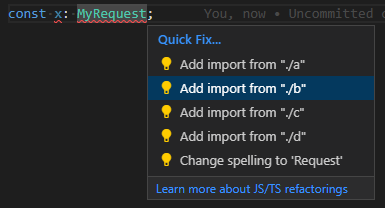
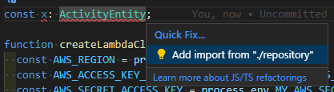

## 요구 사항

### 인터페이스에 정적 함수를 넣고 싶다.

```ts
interface A {
  x: number;

  // compile error
  static add(data: A, input: number) {
    return data.x + input;
  }
}
```

[Add support Interfaces to define static methods #13462](https://github.com/microsoft/TypeScript/issues/13462)

타입스크립트 interface에 정적 함수를 넣고 싶다는 요구 사항은 옛날부터 있었지만 구현되지 않은거로 알고있다.
(내가 타입스크립트를 그렇게 잘 하는게 아니라서 확신을 못하겠다.)

인터페이스를 다루는 정적 함수, 정적 변수, 상수 같은것을 인터페이스에 묶어서 들고 다니고 싶다.
클래스에서는 정적 함수 같은것을 유용하고 쓰는데 인터페이스에서는 똑같은 방식으로 코딩할 수 없는게 불편하더라.

```ts
interface A {
  x: number;
  y: number;
}

export const A = {
  add(data: A) {
    return data.x + data.y;
  }
}

const data: A = { x: 1, y: 2 };
const result = A.add(data);
```

인터페이스에 정적함수 같은거 방법이 아예 없는건 아니다.
위와 같은 형태로 코딩하면 내가 원하는걸 할 수 있다.

### C++ typedef

```cpp
#include <cstdio>

struct A {
    typedef float input_t;
    typedef float output_t;
    
    int x;
    
    static output_t add(A &self, input_t input) {
        return (float)(self.x + input);
    }
};

int main()
{
    A foo { 1 };
    A::input_t input = 2.3;
    A::output_t result = A::add(foo, input);
    printf("%f", result);
    return 0;
}
```

C++에서는 typedef로 특정 struct, class 범위에서 사용할수 있는 새로운 타입을 지정할 수 있다.
비슷한 이름의 타입이 전역 범위에 넘쳐나면 IDE 자동완성, 힌트가 개판이 된다.
이름 충돌을 피하겠다고 타입 이름을 길게 쓰면 타자치기 귀찮다.
Input, Request, Context 같은 짧은 이름을 쓰고 싶다.
typedef 같은 느낌으로 작동하는게 필요하다.


타입이 사용되는 범위를 제한해서 이런식으로 전역 범위의 자동완성이 망가지지 않게 만들고 싶다.

```ts
interface A {
  x: number;
}

type Input = number;
type Output = string;

export const A = {
  add(data: A, input: Input): Output {
    return (data.x + input).toString();
  },
  Input,
  Output,
}

const foo: A = { x: 1 };
const input: A.Input = 2.3;
const result: A.Output = A.add(foo, input);
```

불행히도 자바스크립트 객체는 타입스크립트 타입을 알아먹지 못한다.
위의 코드는 컴파일되지 않는다.

대신 namespace를 쓰면 C++ typedef 같은 느낌으로 짤 수 있다.

```ts
interface A {
  x: number;
}

namespace A {
  export type In = number;
}

const a: A.In = 1;
```

### 함수 호출할때 클래스 이름을 입력하고 싶지 않다.

```ts
class VeryVeryLongClassName {
    static invoke_s() { return 1; }
    invoke_m() { return VeryVeryLongClassName.invoke_s(); } // <--
}
console.log(VeryVeryLongClassName.invoke_s());
console.log(new VeryVeryLongClassName().invoke_m());
```

클래스의 멤버 함수에서 정적 함수를 호출하려면 클래스 이름을 붙여야한다.
파이썬의 `cls` 같이 짧은 이름으로 자기 자신의 클래스를 가리킬수 있으면 좋을텐데 어떻게 하는지 모르겠다.
"`cls`는 없고, 클래스 이름 `VeryVeryVeryVeryVeryVeryLongClassName` 전부 치기 귀찮고, 정적 함수로 만드는거 포기하고 `this`를 쓸까?" 같은 생각을 하게 되더라.
정적 함수로 짜는게 맞는 선택인걸 알고 있음에도 타자치기 귀찮다고 정적 함수로 안짜는건 잘못된 길이다.
정적 함수를 쓸때의 귀찮음을 줄이고 싶다.

정적 함수를 다시 생각하면 클래스라는 이름공간에 종속되는 일반 함수 아닐까?
namespace에 그냥 함수 만들어서 쓰면 클래스 정적 함수보다 타자 덜쳐도 될거같은데?

## 해결책: Declaration Merging, 선언 병합

타입스크립트에는 [Declaration Merging][docs-declaration-merging] 라는 기능이 있다.
또는 [선언 병합][docs-declaration-merging]으로 찾을 수 있다.
이를 응용해서 프로덕션 환경에서도 유용하게 쓰고있다.

```ts
interface A {
  x: number;
}

namespace A {
  export type In = number;
  export type Out = string;

  export function add(data: A, input: In): Out {
    return `${data.x} + ${input}`;
  }
}

const data: A = { x: 1 };
const input: A.In = 2.3;
const output: A.Out = A.add(data, input);
```

namespace에는 넣고싶은거 다 넣어도 잘 돌아간다.
내 경우는 인터페이스와 관련있는 상수도 namespace에서 넣는다.

클래스에서도 declaration merging은 잘 돌아간다.
자주 쓰는 패턴은 아니지만 아래와 같은 식으로 정적 함수를 일반 함수로 구현해서 연결 할 수 있다.
원한게 private static method인 경우에는 namespace도 떼버리고 일반 함수로 짜도 대충 돌아간다.

```ts
// 정적 함수는 일반 함수와 다른게 없다
function invoke_s_priv() { return 1; }

class VeryVeryLongClassName {
  invoke_m() { return invoke_s_priv(); } 
}
namespace VeryVeryLongClassName {
  // export 할때 이름 충돌을 적절히 피해야한다.
  export const invoke_s = invoke_s_priv;
}

console.log(VeryVeryLongClassName.invoke_s());
console.log(new VeryVeryLongClassName().invoke_m());
```

## 약점

### rename

declaration merging을 했더라도 `interface A`와 `namespace A`는 서로 다른 범위이다.
`interface A`를 `interface B`로 이름을 바꿔도 알아서 `namespace B`로 바뀌지 않는다.
`namespace A`를 `namespace B`로 바꾸는 작업을 또 해야된다.
이름 변경을 두번해야되는게 귀찮지만 어차피 고생은 IDE가 하는거지 내가 하는게 아니니까.

### namespace는 자바스크립트에 없는 문법

자바스크립트에 namespace는 존재하지 않는다.

```ts
namespace A {
  export function a() { return 1; }
}
```

tsc를 돌리면 타입스크립트 namespace가 자바스크립트 object로 컴파일된다.

```js
// target: ESNext
// module: CommonJS
"use strict";
Object.defineProperty(exports, "__esModule", { value: true });
var A;
(function (A) {
    function a() { return 1; }
    A.a = a;
})(A || (A = {}));
```

```js
// target: ESNext
// module: NodeNext
var A;
(function (A) {
    function a() { return 1; }
    A.a = a;
})(A || (A = {}));
export {};
```

타입스크립트만의 문법이라서 자바스크립트 생태계의 발전에 의한 공짜 점심이 없다.
tree-shaking 같은걸 기준으로 들이대면 타입스크립트 네임스페이스와 얼마나 잘 작동하는지 모르겠다.

### ESM과 namespace

> It is also worth noting that, for Node.js applications,
> modules are the default and we recommended modules over namespaces in modern code.
>
> Starting with ECMAScript 2015, modules are native part of the language,
> and should be supported by all compliant engine implementations.
> Thus, for new projects modules would be the recommended code organization mechanism.
>
> [TypeScript Handbook: Namespaces and Modules][docs-namespaces-and-modules]

namespace는 요새는 권장되는 코드가 아니다.
자바스크립트가 미개하던 시절에 타입스크립트가 몸비틀어 만들어낸 결과물에 가깝다.
타입스크립트 공식 문서에서 추천하는 문법이 아니니까 얼마나 미래가 있을지 모르겠다.

## declaration merging, namespace 는 미래에도 살아남을까?

```ts
import * as shapes from "./shapes";
let t = new shapes.Triangle();
```

[Namespaces and Modules][docs-namespaces-and-modules]를 보면 네임스페이스 같은거 쓰지말고 파일 자체를 모듈로 import 한다.

```ts
import { shapes } from "./shapes";
let t = new shapes.Triangle();
```

근데 나는 `import * as mod from` 문법이 싫다.
모듈이 어떤 이름으로 import 될지 모듈의 구현에서 결정하게 만들고 싶다.
IDE 에서 알아서 import 할때 내가 원하는 이름으로 import 되도록 만들고 싶다.



ESM 시대가 열리면서 선언 병합을 통해서 interface와 namespace를 섞어쓰는 기법의 대안이 있는지 찾아보았지만 내가 원하는 수준의 결과물은 없었다.
타입스크립트 잘 하는 사람이 내 요구사항에 딱 맞는 기법을 보여주면 좋을텐데 그런건 없을거같다.

나는 앞으로도 몇 년은 declaration merging을 사용할거다.

[docs-declaration-merging]: https://www.typescriptlang.org/docs/handbook/declaration-merging.html
[docs-namespaces-and-modules]: https://www.typescriptlang.org/docs/handbook/namespaces-and-modules.html
