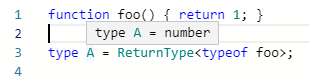
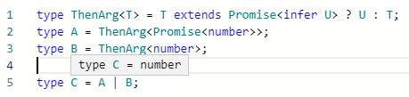

## 개요

```typescript
import express from 'express';

const app = express();

app.get('/sum', (req, res) => {
  const a = parseInt(req.query.a, 10);
  const b = parseInt(req.query.b, 10);
  if (isNaN(a)) { throw new Error('not a number'); }
  if (isNaN(b)) { throw new Error('not a number'); }

  const result = a + b;
  res.json({ result });
});

const port = 5000;
app.listen(port, () => console.log(`running 127.0.0.1:${port}`));
```

위의 코드는 express, 타입스크립트를 사용해서 만든 간단한 서버이다.
서버는 간단하고 대응되는 클라를 짜는것도 간단한 일이다.
하지만 클라, 서버를 유지보수하는 일은 쉽지 않다.

클라이언트는 쿼리 문자열에 a, b를 넣어서 서버로 요청해야한다.
서버를 리팩토링하면서 a, b를 x, y로 바꾸면 클라이언트가 터진다.

서버는 쿼리 문자열로 들어온 값을 검증, 캐스팅해야 한다.
`1+2`는 `3`이지만 `'1'+'2'`는 `'12'`이기 때문이다.

클라이언트는 응답받은 json에서 result를 뽑아야한다.
서버를 리팩토링하면서 result를 다른 이름으로 바꾸면 클라이언트가 터진다.

이런 문제를 막는 쉬운 방법은 타입 검사이다.
서버의 API 타입 정보를 클라이언트가 컴파일 시간에 쓰도록 바꾸자.
그러면 런타임 중에 클라이언트가 터지는 일이 사라진다.
API 타입 정보를 서버에서 검증용으로 사용하면 노다가 코드도 줄일 수 있다.

글은 아래의 조건을 갖춘 사람에게만 쓸만할거다.

* express 앱을 개발
* 클라, 서버 모두 타입스크립트 기반
* 클라, 서버는 코드를 공유
* RESTful API 서버

## 개선

### 입력 걸러내기

```ts
const a: number = req.query.a;
const b: number = req.query.b;
```

이런식으로 짜면 쿼리 문자열로부터 number타입으로 얻을 수 있다.

라고 생각하면 안된다!
타입스크립트는 컴파일 타임에만 개입할 뿐이다.
런타임은 자바스크립트로 돌아간다.

`const a: number = req.query.a`를 컴파일하면 `var a = req.query.a`가 된다.
쿼리 문자열이라서 `req.query.a`의 실제 타입은 문자열 또는 undefined가 된다.
숫자의 덧셈을 구현하고 싶었으나 문자열 합치는 동작으로 돌아간다.

```ts
const a = parseInt(req.query.a, 10);
const b = parseInt(req.query.b, 10);
if (isNaN(a)) { throw new Error('not a number'); }
if (isNaN(b)) { throw new Error('not a number'); }
```

`parseInt()`같은 함수를 통해 쿼리 문자열을 숫자로 바꿔야한다.
하지만 이는 너무 귀찮은 작업이다.
나는 [yup][github-yup]를 사용해서 귀찮은 짓을 줄였다.
[yup로 입력 검증을 덜 귀찮게 처리하자]()

```ts
export interface Req {
  a: number;
  b: number;
}

const schema = yup.object().shape<Req>({
  a: yup.number().required(),
  b: yup.number().required(),
});

const ctx = await schema.validate(req.query);
```

### 응답 타입 빼내기

```ts
app.get('/sum', (req, res) => res.json(...));
```

express 예제는 보통 이런식으로 코드를 짜더라.
자바스크립트에서는 괜찮은 코드겠지만 타입스크립트에서도 괜찮은 코드라고 할 순 없다.
현재 상태로는 타입 정보를 빼낼수 없다.
핸들러 함수 안에서 `res.json()`으로 직접 응답을 보낸다.
응답 타입은 `res.json()`으로 들어가는 객체의 타입일텐데 함수 안쪽이라서 뽑을 수 없다.
핸들러 함수와 express app에 등록하는 과정을 분리하자.

```ts
interface Resp { ... }

const handleSum = (req: express.Request): Resp => {
  return { ... };
};

app.get('/sum', (req, res) => res.json(handleSum(req)))
```

핸들러 함수마다 리턴 타입을 명시하는 방법도 있지만 유지보수하기 귀찮다.
새로운 필드가 추가될때마다 함수도 고쳐야하고 타입도 고쳐야 한다.
다행히도 타입스크립트에는 함수의 리턴타입을 알아내는 방법이 있다.
[typescript 2.8][ts-28]에 추가된 `ReturnType`을 쓰면 된다.

```ts
function foo() { return 1; }

type A = ReturnType<typeof foo>;
```



### async/await


```ts
const handleSum = async (req: express.Request) => { ... };
```

`handleSum()`이 `Resp`을 리턴하면 `ReturnType`만으로 충분하다.
하지만 `handleSum()`이 `Promise<Resp>`를 리턴하면 `ReturnType`만으로는 부족하다.
내가 필요한건 `Resp`이지 `Promise<Resp>`가 아니다.
[typescript 2.8][ts-28]에 있는 기능을 잘 이용하면 `Promise`가 들고있는 타입을 얻을 수 있다.
`Promise<U>`일때는 U를 얻고 아닐때는 타입을 그대로 쓰면 된다.

```ts
type ThenArg<T> = T extends Promise<infer U> ? U : T;
type A = ThenArg<Promise<number>>;
type B = ThenArg<number>;

type C = A | B;
```



```ts
export type Resp = ThenArg<ReturnType<typeof handleSum>>;
```

둘을 합치면 sum API의 응답 타입을 올바르게 가져올 수 있다.

## typesafe express app

지금까지 다룬 내용을 종합하면 아래와 같은 서버를 구현할 수 있다.

```typescript
import express from 'express';
import * as yup from 'yup';

const app = express();

export interface Req {
  a: number;
  b: number;
}

const schema = yup.object().shape<Req>({
  a: yup.number().required(),
  b: yup.number().required(),
});

type YupArg<T> = T extends yup.ObjectSchema<yup.Shape<any, infer Y>> ? Y : never;
type ReqGenereated = YupArg<typeof schema>;

const handleSum = async (req: express.Request) => {
  const ctx = await schema.validate(req.query);
  const { a, b } = ctx;
  const result = a + b;
  return { result };
}

app.get('/sum', async (req, res) => {
  const resp = await handleSum(req);
  res.json(resp);
});

type ThenArg<T> = T extends Promise<infer U> ? U : T;

export type Resp = ThenArg<ReturnType<typeof handleSum>>;

const port = 5000;
app.listen(port, () => console.log(`running 127.0.0.1:${port}`));
```

서버에서 Req, Resp를 export하면 타입스크립트 기반 클라에서 사용할 수 있다.
적당히 응용하면 자신의 프로젝트에도 적용할 수 있을 것이다.
자동완성, 타입검사의 혜택을 누리면서 클라이언트를 짜자.

```typescript
import fetch from 'node-fetch';
import { Req, Resp } from './server-typesafe';
import qs from 'qs';

async function request() {
  const req: Req = { a: 1, b: 2 };
  const url = `http://127.0.0.1:5000/sum?${qs.stringify(req)}`;
  const resp = await fetch(url);
  const json: Resp = await resp.json();
  console.log(`output = ${json.result}`);
}

request();
```

## 도전과제: yup schema에서 타입 뽑아내기

머리를 잘 굴리면 yup로 생성된 schema에서 타입을 뽑아낼 수 있을지 모른다.
Req를 선언하지 않고 schema만 짜면되니 유지보수하기 쉬워질 것이다.
나는 멍청해서 yup schema에서 타입 뽑아내는 기능이 모든 상황에서 잘 돌아가도록 만들 자신이 없었다.
아래의 코드는 schema가 간단할때는 잘 돌아간다.
이번에 사용된 Req는 number만 있는 간단한 타입이라서 잘 돌아갔다.
하지만 yup로 만든 schema가 복잡해지면 잘 돌아가지 않을 수 있다.(예: enum, 중첩 구조)
타입스크립트 잘 아는 사람이라면 도전해보자.

```ts
type YupArg<T> = T extends yup.ObjectSchema<yup.Shape<any, infer Y>> ? Y : never;
type ReqGenereated = YupArg<typeof schema>;
```


[ts-28]: https://www.typescriptlang.org/docs/handbook/release-notes/typescript-2-8.html
[github-yup]: https://github.com/jquense/yup
