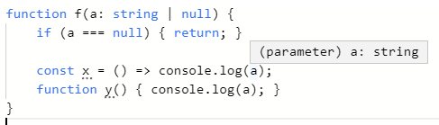
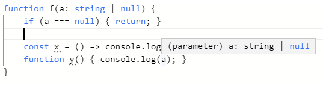
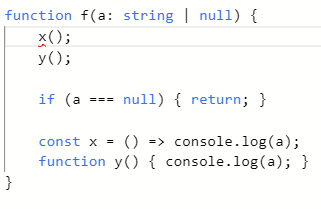

타입스크립트에는 union type이 있다.
타입스크립트는 매우 좋은 언어라서 분기를 적절히 처리해주면 union type의 특정 타입으로 한정할 수 있다.
아래의 [코드][playground]는 `string | null` 타입이 들어왔지만 `null`을 분기로 빼냈다.
그래서 분기 아래에서는 a가 string인게 보장된다.

```ts
function f(a: string | null) {
  if (a === null) { return; }

  const x = () => console.log(a);
  function y() { console.log(a); }
}
```

덕분에 arrow function `x`는 a를 `string`으로 추론할 수 있다.
역시 타입스크립트는 좋은 언어.



근데 arrow function이 아니라 그냥 function을 사용하면 `string | null`로 타입이 추론된다.

???



이유를 잠깐 고민했었는데 내가 멍청해서 그런 거였다.
`var`를 하도 안쓰다보니까 hoisting의 존재를 잊고있었다.
[function declaration][mdn-function]




[mdn-function]: https://developer.mozilla.org/en-US/docs/Web/JavaScript/Reference/Statements/function
[playground]: http://www.typescriptlang.org/play/index.html?ssl=1&ssc=1&pln=7&pc=1#code/GYVwdgxgLglg9mABMAFAQwFyIM5QE4xgDmiAPomCADZUCUiA3gFCKuIzCLqIC8fF1Oo0R4AplBB4wAbkQBfFm0WsICXIgAevLvR4A+RKrDY4VUQDoqcIulrTlycNHhIAninoNDa0xas20O3kmBSA
