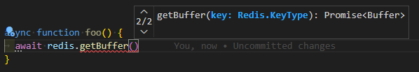
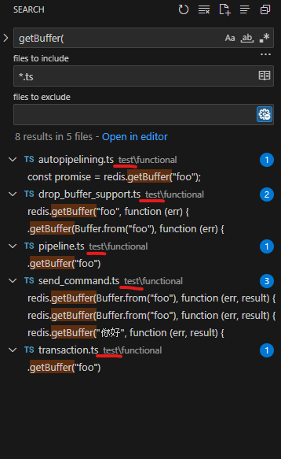

## ioredis

작성일 기준으로 [ioredis][github-ioredis]는 2개의 메이저 버전이 살아있다.

* ioredis v4
  * v4 마지막 버전: [v4.28.5](https://github.com/redis/ioredis/releases/tag/v4.28.5)
    * 2022-02-06
* ioredis v5
  * v5 작성일 기준 최신 버전: [v5.3.2](https://github.com/redis/ioredis/releases/tag/v5.3.2)
    * 2023-04-15
  * v5 첫번째 안정 릴리즈: [v5.0.0](https://github.com/redis/ioredis/releases/tag/v5.0.0)
    * 2022-03-26

여러 가지 이유로 ioredis v4를 사용중인 프로젝트는 많을거다.
ioredis v5 나오기 전에 출시한 프로젝트라서 라이브러리 버전을 올릴 동기가 없을 수 있다.
[갖다 쓴 외부 라이브러리가 ioredis v4만 지원할 수도 있다.](https://github.com/mike-marcacci/node-redlock/blob/v4.2.0/package.json#L31C5-L31C5)

## 문제: redis.getBuffer + ioredis v4

최근에 ioredis v4에서 `await redis.getBuffer(...)`를 호출할 일이 생겼다.

redis의 `GET`은 키가 없으면 null을 리턴한다.
그렇다면 ioredis의 `get`, `getBuffer`도 키가 없다면 null을 반환할 것이다.

직접 코드를 짜서 돌려보면 키가 없을때 `getBuffer`는 null을 반환한다.
하지만 타입스크립트에서 자동 완성은 `Buffer | null` 이 아니라 `Buffer` 로 되더라.



## 원인: 타입 정의

ioredis v4를 사용한다면 [@types/ioredis](https://www.npmjs.com/package/@types/ioredis/v/4.28.10)를 설치해야 한다.
해당 패키지의 `index.d.ts` 열어보면 `get`, `getBuffer`의 정의를 찾을 수 있다.

```ts
get(key: KeyType, callback: Callback<string | null>): void;
get(key: KeyType): Promise<string | null>;
...
getBuffer(key: KeyType, callback: Callback<Buffer>): void;
getBuffer(key: KeyType): Promise<Buffer>;
```

`get()`은 리턴 타입이 `Promise<string | null>`로 올바르게 정의되어 있다.
`getBuffer()`은 리턴 타입이 `Promise<Buffer>`로 잘못 정의되어 있다.

ioredis v5부터는 `@types/ioredis`를 설치하지 않는다. `ioredis`만 있어도 된다.
ioredis의 `built/utils/RedisCommander.d.ts` 열어보면 `get`, `getBuffer`의 정의를 찾을 수 있다.

```ts
/**
 * Get the value of a key
 * - _group_: string
 * - _complexity_: O(1)
 * - _since_: 1.0.0
 */
get(key: RedisKey, callback?: Callback<string | null>): Result<string | null, Context>;
getBuffer(key: RedisKey, callback?: Callback<Buffer | null>): Result<Buffer | null, Context>;
```

`get`, `getBuffer` 의 리턴 타입이 올바르게 정의되어 있다.

ioredis v4를 v5로 업그레이드하면 `getBuffer`의 리턴 타입이 잘못 나오는 문제는 고쳐진다.
문제를 고치기전에 궁금증이 생겼다.

1. ioredis v4에서 `getBuffer`를 어떻게 구현했길래 문제가 생긴걸까?
2. ioredis v4도 타입스크립트 기반인데 v5와 달리 `@types/ioredis`를 따로 설치해야되는 이유는 무엇인가?

이럴땐 코드를 뜯어보면 된다.

## 코드: ioredis v4

ioredis v4.28.5 소스를 받아서 압축을 풀고 `getBuffer(` 로 문자열 검색해보자.
함수가 정의되어있다면 검색에서 잡힐 것이다.
그런데 `getBuffer(` 를 검색하면 없다!
검색 결과는 있지만 전부 테스트 코드이다.
ioredis 구현에서 `getBuffer()` 함수가 없다?
코드가 대체 어떻게 돌아가는거지?



`getBuffer(` 로 검색하는 대신 `Buffer"`로 검색한다.
그러면 `getBuffer()`의 구현을 찾을 수 있다.

https://github.com/redis/ioredis/blob/v4.28.5/lib/commander.ts#L37

```ts
const commands = require("redis-commands").list.filter(function (command) {
  return command !== "monitor";
});
commands.push("sentinel");

...

commands.forEach(function (commandName) {
  Commander.prototype[commandName] = generateFunction(
    commandName,
    commandName,
    "utf8"
  );
  Commander.prototype[commandName + "Buffer"] = generateFunction(
    commandName + "Buffer",
    commandName,
    null
  );
});
```

`redis-commands` 패키지는 무엇인가?
패키지를 열어보면 `getBuffer`가 돌아가는 방식을 알 수 있다.
```
> require('redis-commands').list
[
  'acl',               'append',               'asking',
  'auth',              'bgrewriteaof',         'bgsave',
  'bitcount',          'bitfield',             'bitfield_ro',
  'bitop',             'bitpos',               'blmove',
...
```

세상에!
`Commander.prototype[commandName] = generateFunction(...)` 라니!
동적으로 함수를 만들어서 prototype에 끼워넣는다니!

2015년 ES6에서 class 문법이 추가되었다.
ES6 이후로는 prototype으로 객체지향하는 코드는 잊혀진줄 알았는데 아직도 살아있을 줄이야!

ioredis v4의 동작을 요약하면 다음과 같다.

1. redis 명령어를 하나씩 손으로 입력하기 귀찮으니 redis-commands 패키지에서 가져온다.
2. `Commander.prototype[commandName] = ...` 로 `get()`, `hget()`, ... 를 찍어낸다.
3. `commander.prototype[commandName + "Buffer"] = ...` 로 `getBuffer()`, `hgetBuffer()`, ... 를 찍어낸다.
4. `@types/ioredis`에 손으로 타입 정의를 추가한다.
5. 손으로 타입 정의를 만들다가 `getBuffer()`의 타입 정의에서 실수했다.

## 코드: ioredis v5

> 100% written in TypeScript and official declarations are provided

ioredis v5는 README에서 타입스크립트로 작성했다고 강조하더라.
ioredis v5에서는 위의 코드가 어떻게 바뀌었나 뒤져보자.

`hget()`, `getBuffer()` 같은 redis 함수는 RedisCommander.ts에서 인터페이스로 정의한다.
타입스크립트 인터페이스를 도입해서 손으로 타입 정의 작성하다 실수하는 문제는 사라진다.

https://github.com/redis/ioredis/blob/v5.3.2/lib/utils/RedisCommander.ts#L3669
```ts
interface RedisCommander<Context extends ClientContext = { type: "default" }> {
  ...
  get(
    key: RedisKey,
    callback?: Callback<string | null>
  ): Result<string | null, Context>;
  getBuffer(
    key: RedisKey,
    callback?: Callback<Buffer | null>
  ): Result<Buffer | null, Context>;
  ...
}
```

ioredis 클라이언트를 생성할때는 `const redis = new Redis(...)`를 쓴다.
`redis.getBuffer()`를 호출하려면 `Redis`의 부모 어딘가서 `RedisCommander`를 구현했을 것이다.

https://github.com/redis/ioredis/blob/v5.3.2/lib/Redis.ts#L64
```ts
class Redis extends Commander implements DataHandledable {
```

https://github.com/redis/ioredis/blob/v5.3.2/lib/utils/Commander.ts#L17
```ts
class Commander<Context extends ClientContext = { type: "default" }> {
```

https://github.com/redis/ioredis/blob/v5.3.2/lib/utils/Commander.ts#L95
```ts
interface Commander<Context> extends RedisCommander<Context> {}
```

`interface Commander` 아래까지 읽어보면 익숙한 코드가 나온다.

```ts
interface Commander<Context> extends RedisCommander<Context> {}

const commands = list.filter((command) => command !== "monitor");
commands.push("sentinel");

commands.forEach(function (commandName) {
  Commander.prototype[commandName] = generateFunction(
    commandName,
    commandName,
    "utf8"
  );
  Commander.prototype[commandName + "Buffer"] = generateFunction(
    commandName + "Buffer",
    commandName,
    null
  );
});
```

으악!
타입스크립트에서 prototype 직접 건드리는 방식으로 객체지향을 하다니!
이런건 "100% written in TypeScript" 가 아니야!

기능 측면에서는 문제가 없지만 몰랐으면 좋았을 내용을 알아버렸다.

[github-ioredis]: https://github.com/redis/ioredis
