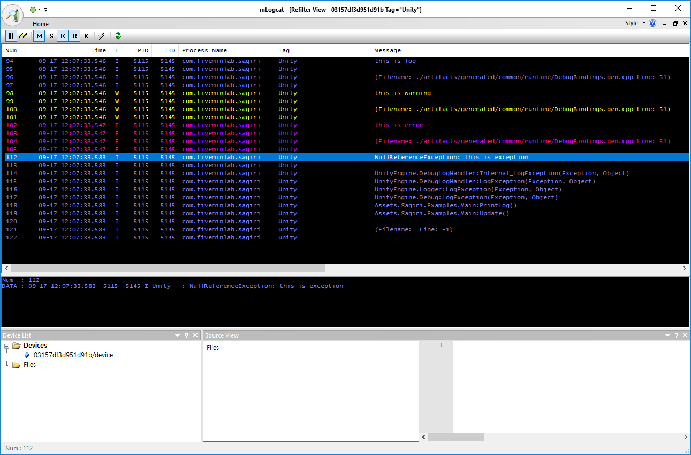
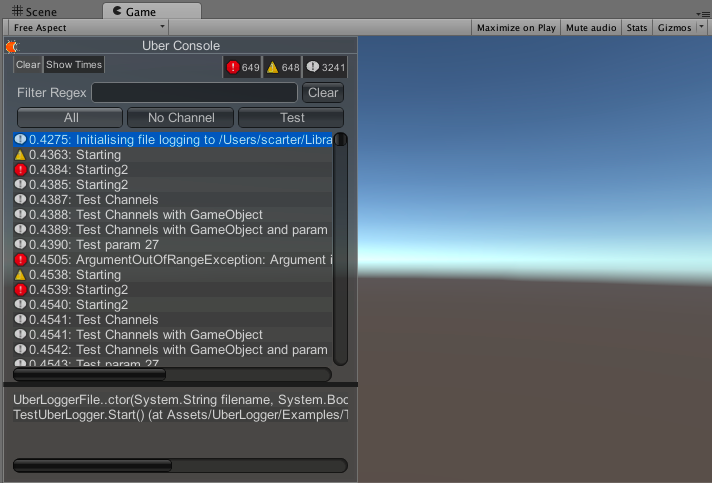
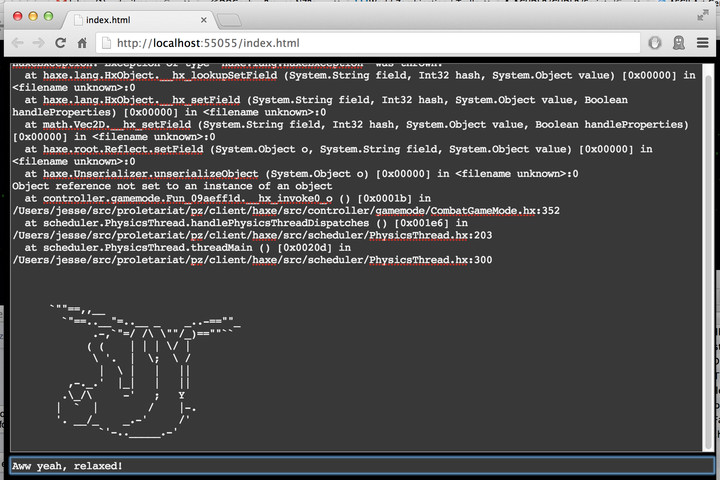
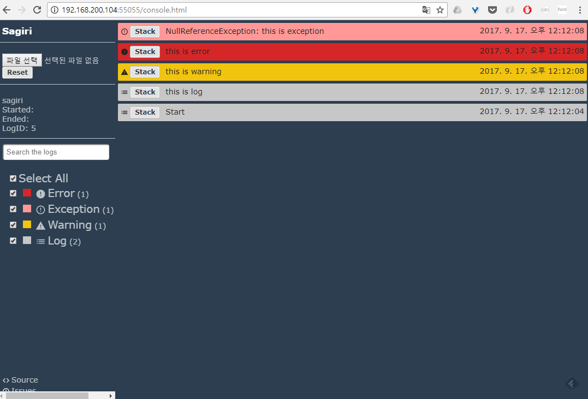
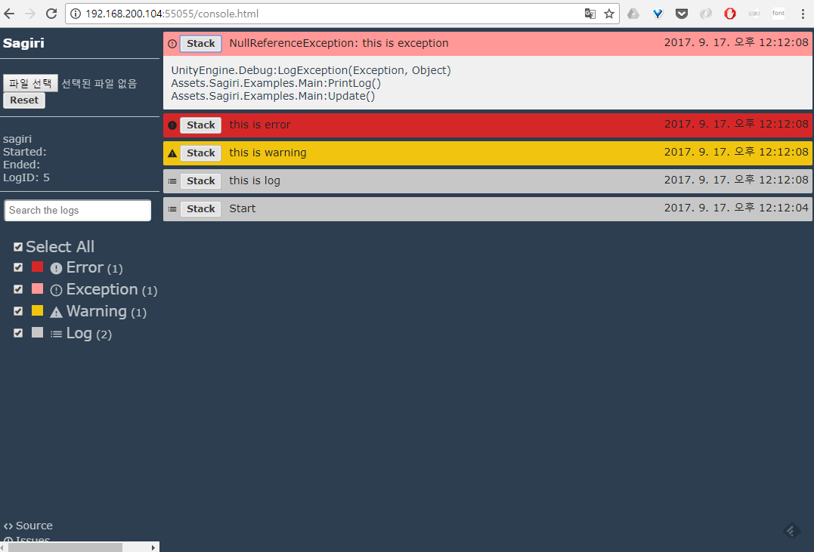
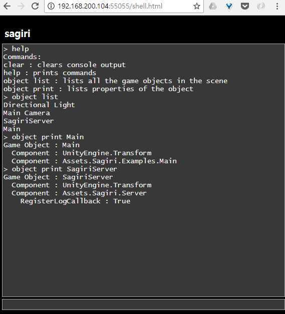

## 개요

게임 개발하다보면 로그를 계속 보게 된다.
유니티의 경우 에디터 환경에서는 console창을 이용해서 로그를 볼수있다.
하지만 윈도우, 안드로이드, iOS 환경으로 빌드한 이후에는 로그를 보는게 쉽지 않다.
그래도 에디터에서는 정상적으로 돌아가지만 실제 기기에서는 문제가 생기는 경우가 있기때문에 로그를 보는 기능은 빌드에서도 필요하다.

[sagiri][repo-sagiri]는 유니티 로그를 웹브라우저에서 보기 위해서 개발된 라이브러리이다.
[CUDLR][repo-cudlr]과 [Unity-File-Debug][repo-unity-file-debug]를 섞어서 만들었다.
개발이 대강 끝났으니 [sagiri][repo-sagiri]를 개발하게 된 과정을 정리해보기로 했다.

## 왜 로그 뷰어를 새로 짰는가?

### 로그를 찍자

빌드된 게임에서 로그를 찍으면 플랫폼에 따라서 적절히 처리된다.
윈도우 빌드의 경우는 게임 폴더 안의 텍스트 파일에 저장된다.
안드로이드의 경우는 adb logcat을 통해 로그를 볼 수 있다.


내 경우는 안드로이드 로그를 볼때 [mLogcat][site-mlogcat]을 쓰는데 이런 식으로 보인다.

### logcat 없이 로그를 보고 싶다
안드로이드에서는 logcat을 통해서 로그를 볼수있다고 했다.
하지만 몇가지 단점이 있다.

첫번째 단점은 adb로 기기와 컴퓨터가 연결되어야 한다는 점이다.
유선으로 연결하거나 wifi로 연결해야한다.
유선 연결은 모든 상황에서 쓸수있는게 아니다.
내 경우 기어VR 플랫폼으로 개발했는데 기어VR에 폰을 꽂을때 마이크로USB을 쓴다.
남는 USB가 없으니 유선으로는 연결할수 없다.
wifi로 연결해야되는데 wifi로 adb 연결하는건 설정이 귀찮다.

두번째 문제는 콜스택이 그대로 출력되서 로그를 읽기 어렵다는 점이다.
나는 로그 한줄을 찍었을뿐인데 logcat에서는 콜스택까지 같이 출력된다.
덕분에 로그가 한눈에 보이지 않는다.

```log
I Unity   : this is log: com.fiveminlab.sagiri
I Unity   :  : com.fiveminlab.sagiri
I Unity   : (Filename: ./artifacts/generated/common/runtime/DebugBindings.gen.cpp Line: 51): com.fiveminlab.sagiri
I Unity   : : com.fiveminlab.sagiri
W Unity   : this is warning: com.fiveminlab.sagiri
W Unity   :  : com.fiveminlab.sagiri
W Unity   : (Filename: ./artifacts/generated/common/runtime/DebugBindings.gen.cpp Line: 51): com.fiveminlab.sagiri
W Unity   : : com.fiveminlab.sagiri
E Unity   : this is error: com.fiveminlab.sagiri
E Unity   :  : com.fiveminlab.sagiri
E Unity   : (Filename: ./artifacts/generated/common/runtime/DebugBindings.gen.cpp Line: 51): com.fiveminlab.sagiri
E Unity   : : com.fiveminlab.sagiri
I Unity   : NullReferenceException: this is exception: com.fiveminlab.sagiri
I Unity   : : com.fiveminlab.sagiri
I Unity   : UnityEngine.DebugLogHandler:Internal_LogException(Exception, Object): com.fiveminlab.sagiri
I Unity   : UnityEngine.DebugLogHandler:LogException(Exception, Object): com.fiveminlab.sagiri
I Unity   : UnityEngine.Logger:LogException(Exception, Object): com.fiveminlab.sagiri
I Unity   : UnityEngine.Debug:LogException(Exception, Object): com.fiveminlab.sagiri
I Unity   : Assets.Sagiri.Examples.Main:PrintLog(): com.fiveminlab.sagiri
I Unity   : Assets.Sagiri.Examples.Main:Update(): com.fiveminlab.sagiri
I Unity   :  : com.fiveminlab.sagiri
I Unity   : (Filename:  Line: -1): com.fiveminlab.sagiri
I Unity   : : com.fiveminlab.sagiri
```

위의 로그의 경우 내가 찍고자한건 4줄 뿐이다.

* `this is log`
* `this is warning`
* `this is error`
* `NullReferenceException: this is exception`

나머지 로그는 친절한 유니티 로그 함수가 추가 정보를 찍은 것이다.
너무 친절한 나머지 나한테 필요없는 정보까지 보여준다.

### 게임 화면에서 로그를 보여주면 어떨까?



[UberLogger][repo-uber-logger]를 이용하면 유니티 로그를 게임 화면에서 볼 수 있다.
이걸 이용하면 logcat 없이 로그를 볼 수 있다.
또한 로그를 한줄만 보여준다. 로그 콜스택은 해당 로그를 선택해야만 볼수있다.

편할거 같아서 넣었는데 함정이 있었다.
스마트폰의 화면은 너무 좁아서 로그를 읽기도 어렵고 조작하기도 어렵다.
로그를 눌러서 콜스택 보는것도 어렵고 스크롤바를 선택하는 것도 어렵더라.
빌드 타겟이 PC였다면 문제가 없지만 나한테는 안드로이드에서도 잘 보이는게 필요했다.

### 웹브라우저를 로그 뷰어로 쓸수있지 않을까?

게임 안에 유니티 로그를 보여줄수 있는 웹서버를 때려박는다.
그리고 웹브라우저로 게임에 접속했을때 로그를 보여주면 어떨까?

뒤져보니까 [CUDLR][repo-cudlr]이라는 라이브러리가 이미 있더라.
이걸 써보기로 했다.



웹브라우저를 이용해서 로그를 보니까 화면 문제는 사라졌다.
빌드에서 웹서버를 굴리니까 불필요하게 성능을 쓰지만 어차피 디버그 빌드에서만 쓸거니 문제가 없다.
하지만 남이 짠 라이브러리가 항상 그렇듯이 100% 내가 원하는 수준이 구현되어있지 않았다.
CUDLR은 로그를 이쁘게 보여주지 않는다.
콜스택까지 그대로 출력한다.
mLogcat에서는 로그 레벨에 따라서 다른 색으로 보여줬는데 CUDLR은 로그가 전부 같은색이라서 중요한 로그와 중요하지 않은 로그를 구분하기 어렵다.

그래서 CUDLR과 로그를 이쁘게 보여주는 무언가를 섞으면 되지 않을까? 같은 생각을 했다.

### 이쁜 유니티 로그 뷰어

이제 추가 기능은 관심없고 로그만 이쁘게 보여주는 라이브러리만 있으면 된다.
뒤지다보니 [Unity-File-Debug][repo-unity-file-debug]라는게 있더라.
유니티 로그를 json으로 export해두면 export된 json을 이쁘게 보여주더라.
내가 원하는 수준의 디자인이더라. (이거보다 잘 만들기에는 자신이 없었다)
json을 읽는 부분만 CUDLR에서 데이터를 읽는식으로 바꾸면 되겠더라

### Sagiri

CUDLR을 로그 서버로, Unity-File-Debug를 뷰어로 쓰는 Sagiri가 완성되었다.
접힌 로그를 펴면 콜스택을 볼 수 있다.
log, error, warning, exception 같은 레벨별로 모아서 로그를 볼수있다.





## shell



```csharp
[CUDLR.Command("object list", "lists all the game objects in the scene")]
public static void ListGameObjects() {
    ...    
}
```

CUDLR에는 재미있는 기능이 내장되어 있다.
함수를 CUDLR Command로 등록해두면 브라우저에서 해당 함수를 호출할수 있다.
디버깅 또는 개발용으로 쓸 수 있을거 같아서 해당 기능을 지우진 않았다.
치트키같은걸 게임에 UI 넣어서 구현하기 귀찮을때 쓸 수 있을것이다.

## 문제점

sagiri가 있다고 기본 로그가 쓸모없는건 아니다.
sagiri가 초기화되기 전에 발생하는 로그는 sagiri로 볼 수 없다.
유니티 엔진을 거치지 않는 로그도 sagiri로 볼 수 없다.
(예: 유니티 엔진 초기화 로그. 서드파티 플러그인에서 직접 찍는 시스템 로그)

유니티 에디터 환경에서는 Project settings 수정 없이 sagiri를 쓸 수 없다.
`Run in background` 이 꺼져있으면 유니티가 실행되어 있는 컴퓨터의 브라우저로는 로그를 볼 수 없다.
에디터에서 게임을 실행시키고 웹브라우저를 띄우면 에디터가 백그라운드로 넘어간거로 인식해서 sagiri가 꺼진다.
Project settings의 `Run in background` 옵션을 켜주면 된다.

UWP 환경에서는 사용할 수 없다.
CUDLR은 `System.Net.HttpListener`을 이용해서 구현되었다.
근데 HttpListener은 .Net Core에는 내장되어 있지 않다.
[HttpListener를 .Net Core로 포팅한 라이브러리][repo-http-listener]를 붙이든지 해야 되는데 나는 그런거 하기 귀찮다.
UWP 환경에서는 컴파일만 되도록 했다. 

[repo-sagiri]: https://github.com/5minlab/sagiri
[repo-cudlr]: https://github.com/proletariatgames/CUDLR
[repo-unity-file-debug]: https://github.com/Sacred-Seed-Studio/Unity-File-Debug
[repo-uber-logger]: https://github.com/bbbscarter/UberLogger
[site-mlogcat]: http://mlogcat.tistory.com/
[repo-http-listener]: https://github.com/robertsundstrom/HttpListener
