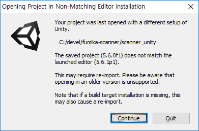
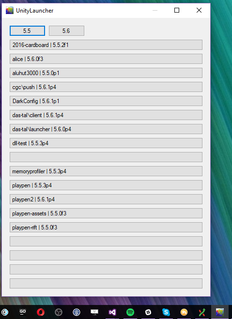

유니티 프로젝트를 진행하다보면 여러 버전의 유니티와 여러개의 프로젝트 폴더가 필요한 일이 생기게 된다. 간단한 예시를 만들어보자. 과거의 특정 시점에서 브렌치를 따서 트레일러용 빌드를 개발한다고 가정해보자. (이를 trailer 브렌치라고 부르자)

trailer 브렌치는 오래된 코드다보니 master 브렌치와 필요한 유니티 버전이 다를 수 있다.
하나의 프로젝트 폴더를 버전이 다른 유니티로 열다보면 asset import가 오래 걸리니 저장소를 하나 더 클론받게 될것이다. 다음과 같은 식으로 구성될수있다.

* master branch, c:/devel/game-master, unity 5.6.2p3
* trailer branch, c:/devel/game-trailer, unity 5.6.0f3

master branch에서 작업해야 할때는 unity 5.6.2p3을 실행 후 `game-master` 프로젝트를 열어야한다. 
trailer branch에서 작업해야 할때는 unity 5.6.0f3를 실행 후 `game-trailer` 프로젝트를 열어야한다.
만약 unity 5.6.2p3을 실행 후 `game-trailer` 프로젝트를 연다면?

팝업이 뜨고 실수로 continue를 눌렀을때 asset import를 다시 할지 모른다.
프로젝트에 에셋이 많이 들어있는 경우 수십분이 걸려서 낮잠을 자고와도 될수있다.

이런 문제를 피하고자 간단한 유니티 런처를 구상해보았다.
유니티 프로젝트에는 어떤 버전의 유니티를 쓰는지가 기록되어있다.
`ProjectSettings/ProjectVesion.txt`를 열어보면 `m_EditorVersion: 5.5.1p1` 와 같은 식으로 유니티 버전이 적혀있다.
만약 다음의 기능을 제공하는 런처가 있다면 여러개의 유니티 프로젝트와 여러 버전의 유니티가 있어도 작업하는데 불편함이 없을거거다.

1. 런처에 다양한 버전의 유니티를 등록한다.
2. 런처에 유니티 프로젝트 경로를 등록한다.
3. `proj_path/ProjectSettings/ProjectVersion.txt` 를 열어서 버전 확인후 적절한 유니티로 프로젝트를 연다.

그리고 직접 만들기전에 github를 찾아보면 남이 만들어둔게 있을것이다.
[unity-launcher][repo]는 내가 원하는 기능이 구현된 프로그램이다.

몇가지 사소한 부분을 고친후 써봤는데 편하더라.
(내가 수정한 부분은 이미 master에 포함되어있다)

[repo]: https://github.com/hagish/unity-launcher
