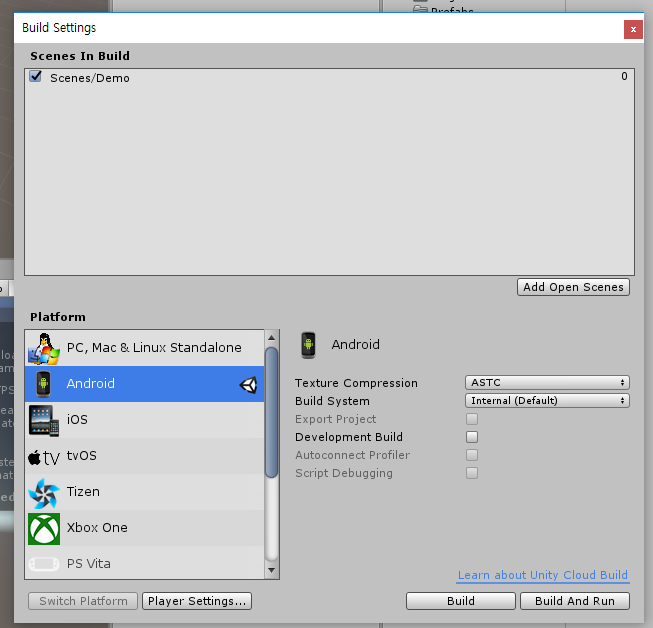
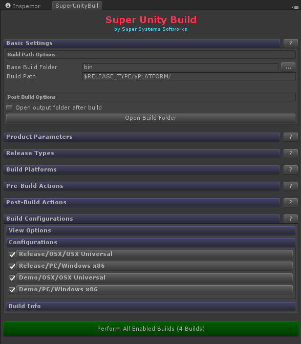

## 개요
내가 만든 Toy Clash는 [Samsung GearVR][toyclash-gearvr], [Google Daydream][toyclash-daydream], [SteamVR][toyclash-steamvr], [iOS][toyclashar-ios]를 지원한다.
이걸로 끝이 아니라 조만간 Windows Store도 추가될 예정이다.

내가 개발해보니까 이정도 갯수의 플랫폼을 지원하기 위해서는 빌드 시스템 수준에서도 크로스 플랫폼을 고려해야 하더라.
게임을 개발하면서 빌드시스템이 어떻게 변화되어서 최종 형태를 갖추었는지 정리해봤다.

## 수동 빌드

초기에는 빌드시스템이고 뭐고 없었다.
빌드를 뽑아서 보여줄 사람이 없는데 뭣하러 빌드에 공을 들이나?
유니티에서 직접 빌드했다.



## 간단한 빌드 스크립트

유니티에는 커맨드 라인을 통해 스크립트의 특정 함수를 호출하는 기능이 있다.
[Command line arguments][unity-command-line-arguments]
빌드를 뽑는 함수를 만들고 이를 커맨드 라인에서 호출한다.
그러면 빌드가 짠!

```csharp
public class BuildScript {
    public static void BuildGame() {
        var scenes = new string[] { "Assets/main.unity" };
        var flags = BuildOptions.Development;
        BuildPipeline.BuildPlayer(scenes, "sample.apk", BuildTarget.Android, flags);
    }
}
```

```batch
C:\program files\Unity\Editor\Unity.exe -quit -batchmode -executeMethod BuildScript.BuildGame
```

## buildbot

스크립트를 통해 유니티 빌드하는게 가능해졌으니 지속적 통합(continuous integration, CI)을 도입했다.
[buildbot][buildbot]을 이용했다. CI는 좋은 것이니 다들 도입하자.

(CI에 대해서 설명한 글은 많으니 여기에서는 다루지 않는다.)

## 복잡해지는 빌드 스크립트

커맨드라인을 통해서 호출할수 있는 유니티 함수는 한번에 한개 뿐이다.
toy clash는 기어VR, 구글 데이드림, 스팀VR을 동시에 지원했다.
각각의 플랫폼마다 디버그용 빌드와 릴리즈용 빌드를 뽑을 필요가 있었다.
플랫폼과 빌드 옵션의 조합마다 빌드용 함수를 만드니 빌드 스크립트가 점점 복잡해졌다.

```csharp
public class BuildScript {
    public static void BuildGearVR_Dev() {
        SetManifest_GearVR();
        SetXRDevice_GearVR();
        var scenes = GetScenes_GearVR();
        var flags = BuildOptions.Development;
        BuildPipeline.BuildPlayer(scenes, "sample_dev.apk", BuildTarget.Android, flags);
    }

    public static void BuildAndroid_Release() {
        SetManifest_GearVR();
        SetXRDevice_GearVR();
        var scenes = GetScenes_GearVR();
        var flags = BuildOptions.None;
        BuildPipeline.BuildPlayer(scenes, "sample_release.apk", BuildTarget.Android, flags);
    }

    public static void BuildStandalone_Dev() { ... }
    public static void BuildStandalone_Release() { ... }

    public static void BuildGoogleDaydream_Dev() { ... }
    public static void BuildGoogleDaydream_Release() { ... }
}
```

## 빌드 후처리

생성된 빌드를 그냥 쓸수도 있겠지만 몇가지 후처리를 하면 재밌는걸 할 수 있다.
다음은 내가 적용한 몇가지 사례이다.

오큘러스에서는 생성된 APK를 기어VR로 출시하는데 문제없는지 확인하는 툴을 제공한다.
빌드를 생성한후 알아서 검증툴에 집어넣는다.

윈도우 빌드를 뽑으면 여러개의 파일로 구성된 빌드가 나온다. 
이를 zip으로 압축한다.
그러면 뽑은 빌드를 다른 사람에게 배포할때 편하다.

Universal Windows Platform 빌드를 뽑으면 visual studio 프로젝트가 생성된다.
다국어 지원 설정을 하려면 visual studio 프로젝트를 연후 몇가지 설정을 수정해야한다.
근데 visual stdio 프로젝트는 텍스트 파일이잖아? 수정 전후에 어떤 내용이 바뀌었는지 볼수있잖아?
그렇다면 빌드한 다음에 visual studio 프로젝트를 열어서 고치는 것까지 자동화시킬 수 있다.

## SuperUnityBuild

플랫폼과 빌드설정의 가짓수가 늘어나다보니 이를 유지보수하는게 귀찮더라.
더 좋은 방법이 뭐가 있나 찾아보니 [SuperUnityBuild][repo-super-unity-build] 라는게 있더라.



하지만 나는 SuperUnityBuild를 사용하지 않았다.
두가지 부분이 마음에 들지 않았다.

첫번째, 내가 필요로하는 기능이 모두 있는게 아니었다.
VR게임을 빌드하려면 VR관련 몇가지 설정을 바꿔줘야한다. 하지만 SuperUnityBuild는 VR게임을 위해서 만들어지지 않았다.
구글 데이드림과 기어VR은 서로 다른 AndroidManifest.xml을 사용해야한다. 하지만 SuperUnityBuild에는 그런 기능이 보이지 않았다.
이런 기능들 때문에 SuperUnityBuild를 고쳐써야 하는데 고치기 귀찮았다.

두번째, 레거시 빌드 시스템을 갖다 버리기 싫었다.
기존 빌드 시스템은 플랫폼, 빌드 설정에 따라서 함수가 늘어나는게 문제이다.
하지만 각각의 빌드 함수는 문제없이 작동한다.
멀쩡하게 작동하는 함수를 갖다버리고 SuperUnityBuild에 다시 끼워맞출라니 귀찮더라.


## Minamo, 설정 파일 기반 빌드 시스템

레거시 빌드 시스템을 그대로 유지하면서 그것의 복잡도만 줄이는걸 목표로 잡았다.
그리고 생각해낸 개념은 설정 파일 기반의 빌드 시스템이다.
[Minamo][repo-minamo]는 위의 개념으로 구현되었다.
minamo는 다음과 같은 방식으로 작동한다.

빌드를 어떻게할지 설정 파일로 서술한다.
설정 파일에는 다음과 같은 정보가 들어간다.

* 유니티가 있는 경로 
* 프로젝트의 경로
* 빌드의 출력물이 나오는 경로
* 빌드에 사용할 스크립트
* 타겟 플랫폼
* 빌드 옵션
* 전처리기 매크로
* 안드로이드 패키지 이름, 버전명
* 유니티 player settings에 보이는 여러가지 설정값
* ...

```json
{
  "unityPath": "/Applications/Unity/Unity.app",
  "projectPath": "./UnityProject_Minamo",

  "buildBasePath": "./output",
  "buildPath": "{{.ConfigName}}-{{.Year}}-{{.Month}}-{{.Day}}-{{.Platform}}/{{.ShortRevision}}.exe",

  "method": "BuildScript.WindowsMR",

  "build": {
    "targetGroup": "standalone",
    "target": "windows",

    "options": {
      "development": true,
      "allowDebugging": true
    }
  },

  "defines": [
    "HELLO_WORLD",
    "PLATFORM_WIN32_STEAMVR"
  ],
  
  "resolutionAndPresentation": {
    "runInBackground": true
  },

  "xr": {
    "enabled": true,
    "devices": [
      "OpenVR"
    ],
	"stereoRenderingPath": "multi-pass"
  }
}
```

Minamo를 실행할때 설정파일을 꽂아준다.
Minamo는 설정파일이 올바른지 검사한후 유니티를 실행켜서 설정파일에 명시한 함수를 호출한다.

```bash
./minamo -cmd=dump -config=./configs/standalone_win_dev.json
```

빌드용 함수에서는 `BuildPipeline.BuildPlayer()` 대신 `Assets.Minamo.Editor.EntryPoint.Build()`를 사용한다.
Minamo가 설정 파일대로 프로젝트의 설정을 바꾼후 빌드를 대신 해준다.

```csharp
public class BuildScript {
    static void WindowsMR() {
        PreBuild_WindowsMR();
        Assets.Minamo.Editor.EntryPoint.Build();
    }
}
```

빌드시스템의 패러다임을 바꾸면서 얻은 이득이다.

* 빌드용 함수의 복잡도를 설정파일과 minamo가 나눠가지게 되면서 빌드용 함수는 간단해졌다.
    * 릴리즈, 디버그 빌드는 설정파일로 때울수 있으니 빌드용 함수가 반으로 줄었다.
    * 프로젝트 설정을 건드리는 함수(VR기기 설정, keystore 설정, ...)를 minamo로 떠넘겨서 빌드용 함수가 간단해졌다.
* 안드로이드 빌드시의 패키지 이름, 버전 이름을 설정파일로 관리할 수 있게 되었다.
    * 안드로이드 빌드의 버전 관리가 편하다.
    * 버전만 올려서 빌드를 다시할때의 버전관리? 설정파일에서 버전 고친 커밋을 하면 되잖아
* 전처리기 매크로를 설정파일로 관리할수 있게 되었다.
    * 시연용 빌드를 뽑을때 편리하다.
* ...

유니티가 지원하는 플랫폼 중에서 Android, Standalone, UWP에서는 작동을 보장한다.
지금 시점에 내가 대응하는 플랫폼이다.

## summary

현재 Toy clash는 다음의 요소로 빌드 시스템이 구축되었다.

* [Minamo][repo-minamo]
* 플랫폼별 빌드용 함수
* 수많은 빌드용 설정 파일
* [Buildbot][buildbot]
* 빌드 후처리 스크립트

오늘은 글쓰기 귀찮아진 관계로 Minamo의 개발 방향과 설계에 대해서는 나중에 다루도록 한다.


[buildbot]: https://buildbot.net/
[repo-super-unity-build]: https://github.com/Chaser324/unity-build
[repo-minamo]: https://github.com/5minlab/minamo
[unity-command-line-arguments]: https://docs.unity3d.com/Manual/CommandLineArguments.html

[toyclash-gearvr]: //www.oculus.com/experiences/gear-vr/1407846952568081/
[toyclash-daydream]: //play.google.com/store/apps/details?id=com.fiveminlab.toyclash.daydream
[toyclash-steamvr]: //store.steampowered.com/app/620360/Toy_Clash/
[toyclashar-ios]: //itunes.apple.com/app/toy-clash-ar/id1274066398

