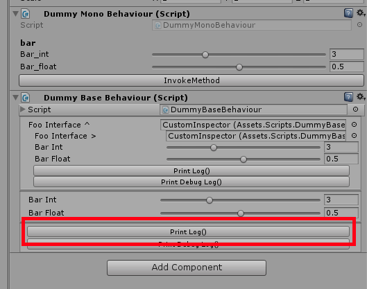
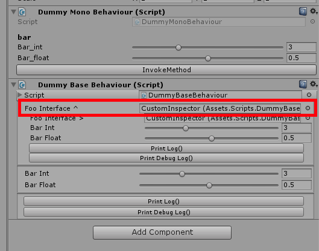

유니티로 개발하던 [게임][toy-clash]을 얼마전에 출시했다. 덕분에 몇달만에 여유가 생겼다.
그동안 바뻐서 블로그를 방치했었는데 다시 운영해볼까한다.
재밌는 떡밥이 뭐가 있을까 생각해봤는데 몇달동안 한게 유니티라서 유니티밖에 생각나는게 없더라.
당분간은 유니티 만지면서 건진걸 정리할 생각이다.

## VFW

> VFW is an editor extension that offers much more advance editor extensibility features than what comes out of the box with Unity.
> A better drawing API, a faster GUI layout system for editor drawing, tons of attributes/drawers, helper types and more.

게임을 만들면서 유용하게 사용한 라이브러리중 하나는 [VFW][repo_vfw]이다.
VFW에는 MonoBehaviour를 상속받아서 만든 BaseBehaviour라는 클래스가 있다.
MonoBehaviour를 상속받을 자리에 BaseBehaviour를 넣음으로써 큰 수정없이 인스펙터를 개선할수 있는 라이브러리이다.

## 장점

VFW에는 많은 기능이 포함되어있지만 내가 그 기능을 전부 써본건 아니다.
그래서 사용해본 기능 중에서 특별히 유용한 기능만 적었다.

### 인스펙터에 버튼 넣을때 별도의 Editor 스크립트가 필요없다

유니티 인스펙터를 확장하려면 `UnityEditor.Editor`를 상속받는 클래스가 필요하다.
(이를 앞으로 `에디터 클래스`라고 부른다)
개발하다보면 특정 함수를 직접 호출하고 싶을때가 있다.
일반적인 경우 아래의 방식으로 구현한다.

1. 에디터 클래스용 소스 파일을 새로 만든다.
2. 에디터 클래스를 정의한다.
3. `OnInspectorGUI()`를 오버라이드 해서 버튼을 정의하고 버튼에 함수를 연결한다.

```csharp
class DummyMonoBehaviour : MonoBehaviour {
    ...
}
```

```csharp
[CustomEditor(typeof(DummyMonoBehaviour))]
class DummyMonoBehaviourEditor : UnityEditor.Editor {
    public override void OnInspectorGUI() {
        ...
   }
}
```

인스펙터에 버튼 하나 추가하겠다고 새로운 파일 하나 더 만드는건 귀찮더라.
이런 경우 ifdef를 쓰면 소스파일 하나에 에디터 클래스까지 구현하는게 가능하다.

```csharp
#if UNITY_EDITOR
using UnityEditor;
#endif

#if UNITY_EDITOR
[CustomEditor(typeof(DummyMonoBehaviour))]
class DummyMonoBehaviourEditor : UnityEditor.Editor {
    ...
}
#endif
```

하지만 귀찮은 문제가 남아있다.

`UnityEditor`와 관련된 부분을 `#if UNITY_EDITOR ~ #endif`로 감싸지 않으면 빌드가 되지 않는다.
에디터 환경에서는 문제없이 굴러가지만 `UnityEditor`는 빌드에서 제외되기 때문에 빌드할떄 컴파일 에러가 뜬다.
그리고 수동으로 `#if UNITY_EDITOR`를 쓰다보면 실수로 빼먹는일이 생기니 귀찮은 빌드 에러를 자주 보게된다.

또다른 문제는 유지보수이다. 아래의 시나리오를 보자.

1. `Foo`라는 스크립트 클래스가 있다.
2. `Foo`에 대응되는 에디터 클래스를 `FooEditor`라는 이름으로 만들었다. 이렇게 지으면 나중에 검색하기 쉬울거다다.
3. `Foo` 클래스의 이름이 `Bar`로 바뀌었다.
4. 1개월 경과
5. `Bar`의 에디터 클래스 이름은 `BarEditor`일텐데 이거 어디있어?
6. 클래스 이름으로 찾지 못해서 `[CustomEditor(typeof(Bar))]`로 검색해서 에디터 클래스를 찾음.

에디터 클래스 역시 유지보수의 대상이라는게 문제의 원인이다.
스크립트 클래스 이름이 바뀌면 그것에 맞춰서 에디터 클래스의 이름도 바꿔줘야 찾기 쉽다.
만약 버튼 이름과 함수 이름을 일치시켜서 사용하고 있다면 함수가 바뀌었을때 버튼이름도 바꿔줘야한다.
이런 작업은 매우 귀찮다. 유지보수할 코드 자체가 줄어들면 덜 귀찮을거다.

VFW의 BaseBehaviour를 사용하면 이런 작업이 매우 간단해진다.
함수에 `[Show]`만 붙여주면 된다. 그러면 인스펙터에 함수를 호출할수 있는 버튼이 생긴다.
(내가 VFW를 쓰게된 가장 큰 이유는 이거다)

```csharp
class DummyBaseBehaviour : BaseBehaviour {
    [Show]
    void PrintLog() {
        Debug.Log("method invoked - base behaviour");
    }
    ...
}
```




### 디버그 로그 On/Off

새로운 기능을 개발하다보면 `Debug.Log()`를 이용해서 콘솔 출력을 쓰게된다.
그런데 기능 개발이 끝나면 디버그용 로그는 어떻게 되는가?

쓸데없는 로그 출력은 성능상 필요없다. 또한 다른 로그와 뒤섞여서 개발에 방해되기 때문에 지울것이다.
보통은 주석으로 지울텐데 주석으로 지우면 코드를 건드리잖아? 그러면 스크립트 컴파일을 다시해야되니 유니티가 멈추잖아?
VFW에서 제공하는 `dLog()`, `dLogFormat()`를 이용하면 스크립트 컴파일 없이 로그를 없앨수있다.

```csharp
[Show]
void PrintDebugLog() {
    dLog("debug log");
    dLogFormat("{0} {1} {2}", "debug", "log", "+ format");
}
```

기능 자체는 간단하다.
디버그 플래그에 따라서 로그를 출력하는 함수가 BaseBehaviour에 구현되어있다.
플래그를 켜고 끄는것만으로 해당 컴포넌트의 로그를 끌수있다.

```csharp
protected void dLogFormat(string msg, params object[] args)
{
    if (dbg) LogFormat(msg, args);
}

protected void dLog(object obj)
{
    if (dbg) Log(obj);
}
```


### Interface도 보인다

```csharp
public IDummyContainer foo_interface = null;
```

스크립트 안에 인터페이스가 멤버변수로 있는 경우 유니티 기본 인스펙터에서는 보이지 않는다.
하지만 BaseBehaviour에서는 보인다.



## 단점

### 새로 배워야한다

```csharp
[Header("bar")]
[Range(0, 10)]
public int bar_int = 3;
[Range(0, 1.0f)]
public float bar_float = 0.5f;
```

`HeaderAttribute`, `RangeAttribute` 등은 유니티에 내장되어있는 속성이다.
BaseBehaviour는 인스펙터 자체를 갈아치우기때문에 유니티에 내장된 것은 못쓴다.
비슷한 기능의 다른 코드를 사용해야한다.

```csharp
[DefineCategory("bar", Pattern = "^bar_")]
class DummyBaseBehaviour : BaseBehaviour {
    [iSlider(0, 10)]
    public int bar_int = 3;
    [fSlider(0, 1.0f)]
    public float bar_float = 0.5f;
}
```

예를 들어 `DefineCategoryAttribute`를 사용해서 `HeaderAttribute`와 비슷한 역할을 수행할수 있다.
`RangeAttribute`의 경우는 int, float에 따라서 `iSliderAttribute`, `fSliderAttribute`를 사용하면 된다.

### Prefab이 복잡해진다

MonoBehaviour를 상속받아서 새로운 컴포넌트를 만들자.
그리고 이를 prefab에 넣고 프리팹을 열어보면 다음과 같은걸 볼수있다.

```yaml
MonoBehaviour:
  m_ObjectHideFlags: 1
  m_PrefabParentObject: {fileID: 0}
  m_PrefabInternal: {fileID: 100100000}
  m_GameObject: {fileID: 1350078673533328}
  m_Enabled: 1
  m_EditorHideFlags: 0
  m_Script: {fileID: 11500000, guid: 4e519f1a92e34594a850cc775bebbc0e, type: 3}
  m_Name:
  m_EditorClassIdentifier:
  ...
```

MonoBehaviour 대신 BaseBehaviour를 이용해서 똑같은 작업을 하면 다음과 같은것을 볼수있다.

```yaml
MonoBehaviour:
  m_ObjectHideFlags: 1
  m_PrefabParentObject: {fileID: 0}
  m_PrefabInternal: {fileID: 100100000}
  m_GameObject: {fileID: 1350078673533328}
  m_Enabled: 1
  m_EditorHideFlags: 0
  m_Script: {fileID: 11500000, guid: eb705ca949c27744ab75a723e53b7f6d, type: 3}
  m_Name:
  m_EditorClassIdentifier:
  _id: -998
  dbg: 0
  Prefs:
    _Buckets: ffffffffffffffffffffffffffffffffffffffff0200000003000000
    _HashCodes: 18fcdc49b9dfa4633aab1008c297e549000000000000000000000000
    _Next: ffffffffffffffff0000000001000000000000000000000000000000
    _Count: 4
    _Version: 1133
    _FreeList: -1
    _FreeCount: 0
    _Keys: 18fcdcc9b9dfa4633aab1088c297e5c9000000000000000000000000
    _Values:
    - ValueString:
      ValueFloat: 0
      Type: 2
    - ValueString:
      ValueFloat: 4
      Type: 0
    - ValueString:
      ValueFloat: 10
      Type: 0
    - ValueString:
      ValueFloat: 0
      Type: 2
    - ValueString:
      ValueFloat: 0
      Type: 0
    - ValueString:
      ValueFloat: 0
      Type: 0
    - ValueString:
      ValueFloat: 0
      Type: 0
  ...
```

BaseBehaviour를 프리팹에 넣는 경우 MonoBehaviour를 추가했을때보다 많은 내용이 추가된다.
또한 프리팹을 갱신할때마다 `_Version` 값이 바뀐다. (어떤 수정이 없더라도 Apply 누르면 바뀐다)
그래서 머지할때 귀찮다.

### 다중 객체 편집을 지원하지 않는다

`No multi-object editing support yet`. VFW 문서에서도 있는 내용이다.
누군가 고쳐주지 않을까 싶은데 아직 고쳐지지 않았다 (나는 유니티 몰라서 안고칠거야 깔깔깔)

## 나는 어떻게 사용했는가?

세가지 경우로 나눠서 생각하자.

첫번쨰는 BaseBehaviour를 쓰고싶어도 못쓰는 경우이다.
서드파티 라이브러리에서 MonoBehaviour를 상속받아서 BaseBehaviour로 바꿔서 얻는게 별로 없다.
라이브러리 코드를 내가 건드리면 라이브러리의 새로운 버전이 나왔을때 덮어쓰는것만으로는 대응할수 없다.
그래서 서드파티 라이브러리는 기존의 MonoBehaviour를 유지했다.

두번째는 BaseBehaviour를 쓸 필요 없는 경우이다. 즉, MonoBehaviour의 기능으로 충분한 경우이다.
이런 경우는 BaseBehaviour를 쓰면 여러 객체를 동시에 수정하는것도 안되고 쓸데없이 프리팹이 복잡해져서 머지할일이 생기면 귀찮다.
그래서 MonoBehaviour를 그냥 상속받았다.
(나중에 BaseBehaviour의 기능이 필요해진 경우 상속만 BaseBehaviour로 고쳐서 썻다)

그리고 나머지 경우에는 BaseBehavior를 그냥 썼다.
여러 객체를 동시에 수정하지 못하는건 아쉽지만 그런 경우 노가다로 때웠다.
프리팹이 복잡해져서 머지할때 귀찮긴했지만 프로그래머가 2명이라서 할만했다.

## Sample source
작동되는 전체 소스는 [unity-utility][repo_my]에 올려놨다.

* `Prefabs/CustomInspector.prefab`
* `Scripts/DummyBaseBehaviour.cs`
* `Scripts/DummyMonoBehaviour.cs`

[toy-clash]: //www.oculus.com/experiences/gear-vr/1407846952568081/
[repo_vfw]: //github.com/vexe/VFW
[repo_my]: //github.com/if1live/unity-utility
