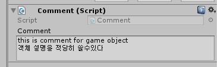

코딩을 하다보면 코드에 여러가지 설명을 넣고 싶을때가 있다.
어떤 알고리즘을 사용했는지, 어떤 웹페이지에서 긁어온 소스인지, 어떤 인자를 함수에 넣어야하는지....
이런 설명을 넣고싶을때는 주석을 이용한다.

마찬가지로 게임객체, 프리팹에 설명을 넣고 싶을때가 있다.
이 프리팹은 어떤 목적으로 만들어졌는지, 객체에 붙어있는 여러개의 컴포넌트가 서로 어떻게 엮여서 굴러가는지,
멤버 변수 이름을 바꾸다 AudioClip과의 연결이 끊어졌을때 어떤 파일과 연결해야되는지....
보통은 코드에 주석으로 넣거나 인스펙터를 개조해서 게임 객체에 설명을 집어넣을수 있다.

하지만 같은 스크립트를 쓰는 여러가지 객체마다 설명이 다르게 붙어야하는 경우에는 코드 수정으로 대응할수 없다.
또는 스크립트에 설명 몇 줄 추가했다고 스크립트가 다시 컴파일되는걸 피하고 싶을수도 있다.

유니티 게임 객체, 프리팹에는 주석이라는 기능이 없다.
그래서 편법을 써야한다. 간단한 방법은 `README.txt` 파일을 프리팹과 같은 폴더에 두는 것이다.
하지만 프리팹 파일과 설명 파일이 분리되어 있으면 유지보수하기 귀찮다.
프리팹을 다른 폴더로 이동시킬때 설명 파일도 같이 옮기지 않으면 설명이 쓸모없어진다.

내 경우 프리팹과 설명을 하나로 합쳐서 관리하려고 간단한 스크립트를 짰다.

```csharp
public class Comment : MonoBehaviour {
    [SerializeField]
    [TextArea(2, 5)]
    string comment = "";
}
```



## 단점

프리팹에 스크립트가 붙어있으면 `Export Package...` 에서 `Include dependencies` 가 활성화되어있으면 모든 스크립트가 익스포트 대상으로 선택된다.
스크립트간의 의존성은 유니티가 제대로 인식하지 못하는게 원인같다.
export 할거같은 프리팹에서는 위의 방식으로 주석을 안붙이는게 좋다.
