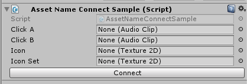
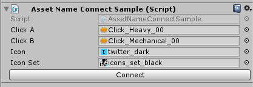

## 문제 : 오디오 파일과 함수를 어떻게 연결할것인가?

게임에서 사용할 수십, 수백개의 오디오 파일이 있다.
그리고 어떤 상황(또는 함수)에서 어떤 사운드 파일을 재생해야되는지를 알고있다.
이것을 구현하는게 목적이다. 
간단한 방법은 사운드 에셋을 컴포넌트에 직접 연결하는것이다.

```csharp
public class AudioPlayer : MonoBehaviour {
    public AudioClip clickA;

    public void Play() { ... }
}
```

`AudioClip`을 멤버변수로 갖는 스크립트를 만든후 이것을 게임 객체에 붙인다. 
그리고 오디오 클립을 연결킨다. 이후 `Play()`에서 적절히 재생하면 된다.
이 방법은 간단하지만 동시에 무식하다.
오디오 클립이 몇개 안되면 직접 연결할수 있지만 수십, 수백개가 되면 사람이 할 짓이 아니다.
에셋의 양이 늘어나면 이것보다는 좋은 방법이 필요하다.

## 간단한 방법 : CustomEditor + AssetDatabase
`AssetDatabase`를 이용해서 에셋을 검색하는 함수를 만들고 이를 `CustomEditor`로 연결시켜준다.
그러면 버튼 클릭으로 에셋을 연결시킬수 있다.

```csharp
public class AssetNameConnectSample : MonoBehaviour {
    public AudioClip clickA;
}

[CustomEditor(typeof(AssetNameConnectSample))]
public class AssetNameConnectorEditor : UnityEditor.Editor {
    public override void OnInspectorGUI() {
        base.OnInspectorGUI();
        var script = (AssetNameConnectSample)target;
        if(GUILayout.Button("Connect")) {
            // AssetDatabase를 이용해서 적절히 구현한거
            clickA = CustomAssetDatabase.Find("Click_Heavy_00.mp3")
        }
    }
}
```

하지만 이 방법도 마음에 들지 않았다.
`public AudioClip clickA`에 연결될 에셋 이름은 `Click_Heavy_00.mp3`인데 둘이 멀이 떨어져있어서 한눈에 읽기 어렵더라.

## 편법 2. Attrubute

```csharp
public class AssetNameConnectSample : MonoBehaviour {
    [AssetName("Click_Heavy_00.mp3")]
    public AudioClip clickA;
    ...
}
```

멤버변수와 여기에 연결될 에셋 이름을 한눈에 볼수있도록 만들고 싶었다.
그래서 새로운 Attribute를 만들어서 멤버변수에 에셋 이름을 연결시키고 이를 처리할수 있는 코드를 Reflection으로 짰다.


에셋을 연결할 멤버변수에 `AssetNameAttribute`를 붙여준다.

```csharp
public class AssetNameConnectSample : MonoBehaviour {
    [AssetName("Click_Heavy_00.mp3")]
    public AudioClip clickA;

    [AssetName("Click_Mechanical_00.mp3")]
    public AudioClip clickB;

    [AssetName("twitter_dark.png")]
    public Texture2D icon;

    [AssetName("icons_set_black.png")]
    public Texture2D iconSet;
}
```

에셋 연결 기능을 사용할 게임 객체를 `AssetNameAttribute.ConnectMemberAssets(object)`에 넣어서 호출한다.
내부에서 리플렉션을 이용해서 AssetNameAttribute를 찾아낸후 적절한 에셋을 검색해서 연결해준다.

```csharp
[CustomEditor(typeof(AssetNameConnectSample))]
public class AssetNameConnectorEditor : UnityEditor.Editor {
    public override void OnInspectorGUI() {
        base.OnInspectorGUI();

        var script = (AssetNameConnectSample)target;
        if(GUILayout.Button("Connect")) {
            AssetNameAttribute.ConnectMemberAssets(script);
        }
    }
}
```

이제 적절한 곳에서 쓰면 된다.





## Source code
* [Repository](https://github.com/if1live/unity-utility/)
* [AssetNameAttribute.cs](https://github.com/if1live/unity-utility/blob/3d772543628023c2ee922f52ab867cefe8a1cc9b/Assets/Chiho/AssetNameAttribute.cs)
* [AssetNameConnectSample.cs](https://github.com/if1live/unity-utility/blob/3d772543628023c2ee922f52ab867cefe8a1cc9b/Assets/Scripts/AssetNameConnectSample.cs)
