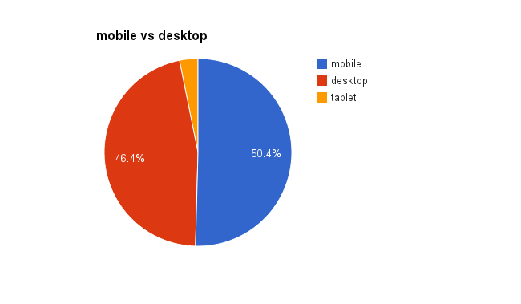
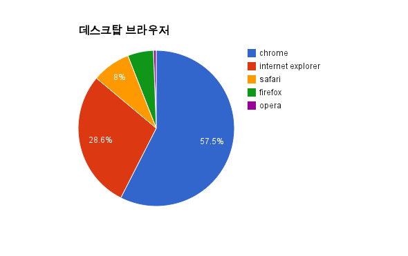
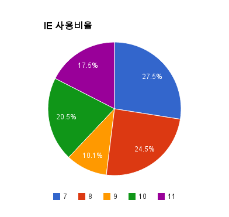
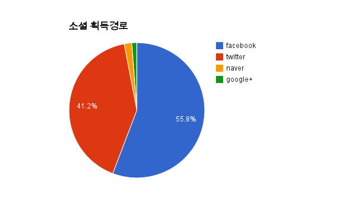

"Trade My Info No.1 온라인 개인정보거래소"
[trade-my-info](http://trademyinfo.libsora.so/) 를 만들때 그냥 GA를
달아놨었다. 그런데 생각보다 사이트가 흥해서 쓸만한 통계가 모였길래
정리해봤다.

## 예상 사용자

SNS를 하는 사람일 것이다. 최초로 공개한 루트는 트위터다. 그리고 모든
유입경로를 통틀어 가장 규모가 큰 것이 페이스북이더라. SNS를 통해서
유입된 비율은 전체의 50%라는게 근거다.

적어도 하나의 커뮤니티에서는 눈팅이라도 할것이다. 뽐뿌, PGR21, 오유,
battlepage 등을 통해서 유입된 인원이 30%라는것을 기반으로 예상했다.

평소에 인터넷을 계속 접속하는 사람일 것이다. SNS를 하거나 커뮤니티를
보고 있다는건 인터넷에 익숙한 사람일 것이다. 주 계층은 30대 이하일
것으로 예상했다. 40대 이상도 없지는 않겟지만 30대 이하보다 숫자가
적을것이다.

개인정보 유출사태와 몸으로 와닿는 사람일것이다. 카드 관련 문제라든가
스팸이라든가 하는 것에 대해서 민감할 것이다. 그렇지 않으면 이 사이트를
볼 일도 없겟지? 10대의 경우는 실제 경제활동을 하는 20대 이상보다 관심이
적을것이다.

남여 비율은 동일할 것이다. 성별에 따라서 받아들이는 내용이 달라지는
컨텐츠가 아니다.

레퍼러를 보면 별별 사이트가 다 나온다. 뽐뿌, PGR21, 오유, battlepage,
커그, 엔하, 알지롱, 일워, 타입문, 고파스, 마비노기 타임즈, 인벤,
디씨.... 레퍼러로 잡힌 사이트만 약 150가지이다. 이 정도면 특정
계층(개발자라든가 게임덕후라든가)의 사람이 아니라 평균적인 사람이
접속했다고 가정할 수 있을것이다.

위의 가정을 기반으로 사이트 **주요 접속자는 일반적인 20~30대 남녀**
라고 가정했다. 실제 사용자에서 크게 어긋나진 않을것이라고 생각한다.

## 모바일 vs 데스크탑

모바일의 등장 이후부터 모바일이 데스크탑 환경보다 더 중요해진다는 소리는
많이 들었는데 실제로 얼마나 중요해졌는지 통계로 확인해 보고 싶었다.

|  환경   | N     |
|---------|-------|
| Mobile  | 20405 |
| Desktop | 18783 |
| Tablet  | 1283  |

모바일의 숫자가 데탑보다 더 많다. 타블렛은 아직 5%정도 수준이다.
모바일을 모바일+타블렛으로 취급하면 모바일:데스크탑은 55:45 정도이다.
이미 모바일이 더 중요한 시대가 왔다.

## 데스크탑 브라우저 사용 비율

크롬이 얼마나 잘 나가는지, IE 사용률은 얼마나 되는지를 확인해보자.

|브라우저| N     |
|--------|-------|
|Chrome  | 11490 |
|IE      | 5719  |
|Safari  | 1593  |
|Firefox | 1069  |
|Opera   | 116   |

크롬이 생각이상으로 잘 나간다. 크롬이 너무 높아서 모바일 크롬과 데스크탑
크롬이 섞여 나오는거같은 기분이 들지만 저거 맞다. (크롬 전체 사용자는
15761이고 그중에서 데스크탑이 11490, 모바일이 4271이다.)

IE의 사용 비율은 약 30%이다. 역시 IE는 쉽게 쓰러지지 않는다.

## IE 사용 비율

버전별 파편화가 제일 막장인건 역시 IE다. IE 버전별 현황이 어떻게
되는지도 확인했다.

| IE |  사용자수 | desk top 비율 |
|----|-----------|----------|
| 7  | 1570      | 8.36 |
| 8  | 1397      | 7.44 |
| 9  | 576       | 3.07 |
| 10 | 1168      | 6.22 |
| 11 | 999       | 5.32 |

IE7, 8의 사용자가 제일 많다. 분명히 마소에서 IE7 강제업데이트를
시켰음에도 IE7의 비율이 제일 높다. 내 예상에는 윈도우즈 자동 업데이트가
꺼져있는 불법복제XP를 사용하는 유저가 아닐까 싶다.

IE 7+8을 하면 시대에 뒤떨어진 사람의 비율을 얻을 수 있다. 이들의 숫자는
데스크탑 유저중에서 15%이다. 이들이 시대에 뒤떨어진 이유는 HTML5를
제대로 지원하지 못하는 브라우저를 사용하기 때문이다. IE 7,8의 경우는
trade my info에 접속했을때 페이지가 깨지는데 저 15%의 사람들은 페이지가
깨진줄도 모르고 사용했을테니 할말이 없다. 그래도 trade my info는
고급기술을 사용하진 않아서 깨져도 내용을 보는데는 문제없었지만
angular.js라든가 하는 고급기술을 적용하게되면 국내에서는 15%의 유저를
버려야한다. 암담하다.

IE7 이상부터는 강제업데이트가 없어서 그런지 대충 비슷한 비율로 나왔다.

## 소셜 획득 경로

100로 나온 항목은 이하는 버렸다.

| 분류     | N |
|----------|-------|
| Facebook | 11187 |
| Twitter  | 8271 |
| Naver    | 361 |
| Google+  | 243 |

페이스북의 사용자가 제일 많다. 역시 Facebook! Twitter를 통한 유입도 꽤
많다. 최초 유포경로가 트위터인게 한몫했겠지만 그래도 트위터 유저수는
많은거 같다. Google+의 경우는 네이버한테도 졌다. 진짜 답이 안나온다.

## 결론

20~30대 남녀는 다음 환경에서 인터넷을 하고 있을 것이다.

* 데스크탑보다 모바일을 더 자주 이용한다
* 데스크탑 환경에서 가장 많이 쓰는 브라우저는 크롬이다.
아마도 속도빠르다고 영업한 사람들이 많아서 그런거겠지.
이 세상에는 희망이 보인다.
* 데스크탑 유저중 8%는 IE 7를 사용하고 7%의 유저는 IE 8을 사용한다.
IE 7,8을 지원하지 않는 서비스를 만든다는건 15%의 유저를 버리겠다는 소리다.
세상은 절망적이다.
* SNS는 Facebook을 제일 많이 사용한다. 다음은 Twitter다. Google+ 따위는 안쓴다.
* HTML5라든가 CSS3라든가 최신 웹기술 공부하지 마라. 어차피 국내에서는 IE 7,8 때문에 배워봐야 써먹을수가 없다.

통계의 수치는 신규 방문자수 기준이다. 측정 기간은 2014.01.22(사이트 런칭) ~ 2013.02.01 이다.
글과 동일한 자료는 google spreadsheet에도 있다.
[raw-data](https://docs.google.com/spreadsheet/ccc?key=0AhRfWUmEuMJxdHZKX2JUOTdQX0poc3BJa1VpdDdaZkE&usp=sharing)
에서 볼 수 있다.
